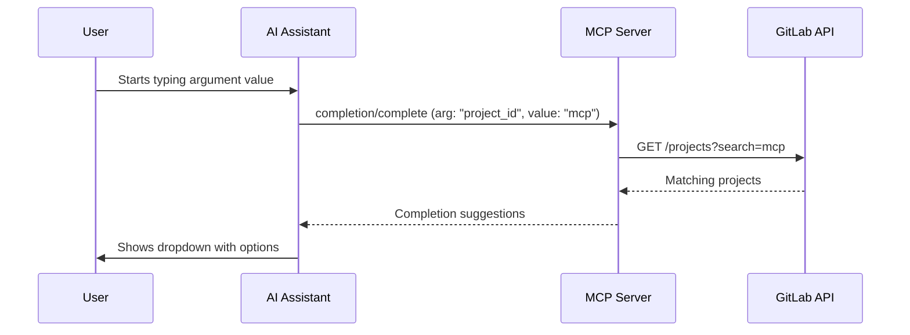

Completions provide real-time autocomplete suggestions for tool parameters. Instead of memorizing project IDs, branch names, or user logins, you type a few characters and the server queries GitLab for matches.

## The Problem

```
Without completions:
  User: "Create issue in project..." → What's the ID? → Must call list_projects first

With completions:
  User types: "mcp" → Server suggests: "gitlab-mcp-server (1835)", "redmine-mcp-server (1869)"
```

This transforms a multi-step lookup into a **single, interactive selection**.

## How It Works



## Supported Argument Types

The server supports **17 completion argument types** organized into global and per-project completers:

### Global Completers

These work without a project context:

| Argument | Completes | Example |
|---|---|---|
| `project` | Project names/paths | `my-group/my-project` |
| `group` | Group names/paths | `engineering` |
| `user` | User names/logins | `john.doe` |
| `namespace` | Namespaces (groups + users) | `my-group` |

### Per-Project Completers

These require a project context and search within that project:

| Argument | Completes | Example |
|---|---|---|
| `branch` | Branch names | `feature/login` |
| `tag` | Tag names | `v1.2.0` |
| `milestone` | Milestone titles | `Sprint 14` |
| `label` | Label names | `priority::high` |
| `merge_request` | MR titles/IIDs | `!42 Fix login` |
| `issue` | Issue titles/IIDs | `#100 Bug report` |
| `pipeline` | Pipeline IDs | `12345` |
| `environment` | Environment names | `production` |
| `release` | Release tag names | `v2.0.0` |
| `wiki_slug` | Wiki page slugs | `getting-started` |
| `version` | Version/milestone IDs | `v1.0` |
| `runner` | Runner descriptions | `shared-runner-1` |
| `board` | Board names | `Development` |

## How Completions Improve AI Accuracy

Completions reduce errors in several ways:

1. **Eliminates typos** — Users select from validated suggestions instead of typing exact values
2. **Reduces round-trips** — No need to call `list_projects` before `create_issue`
3. **Provides context** — Suggestions include IDs alongside names, ensuring correct values
4. **Real-time search** — Results update as the user types, powered by GitLab's search API

:::tip
Completions work best when the MCP client supports the `completion/complete` protocol method. If your client does not support completions, you can still discover values using the `list` action on any meta-tool.
:::
