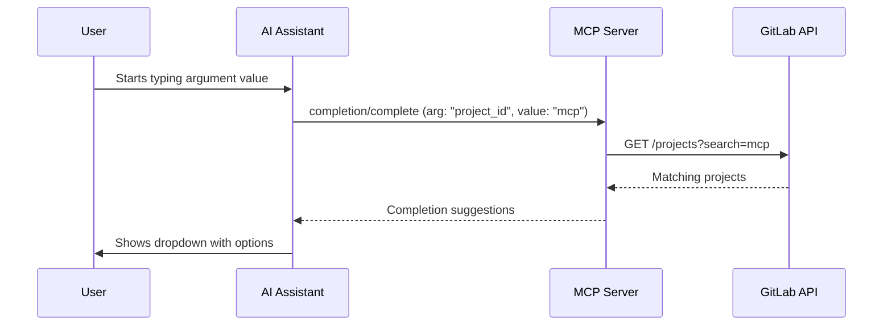

import FAQ from "../../../components/FAQ.astro";

Completions provide **real-time autocomplete suggestions for tool parameters**. Instead of memorizing project IDs, branch names, or user logins, you type a few characters and GitLab MCP Server queries GitLab for matching values, returning them through the MCP `completion/complete` protocol method. This transforms a multi-step lookup into a single, interactive selection.

GitLab MCP Server completes **18 argument names** (the prompt arguments and resource URI parameters the `completion/complete` handler recognizes), organized into global completers that work anywhere and per-project completers that search within a chosen project. Every suggestion is fetched live, with at most one GitLab call per request and up to 10 values returned, so results always reflect the current state of the connected GitLab instance.

## What problem do completions solve?

Without completions, supplying an identifier means looking it up first — and that often costs an extra tool call. With completions, the assistant resolves the value inline as the user types, so a separate discovery step is no longer required.

```text
Without completions:
  User: "Create issue in project..." → What's the ID? → Must run project.list first

With completions:
  User types: "mcp" → Server suggests: "group/gitlab-mcp-server", "group/redmine-mcp-server"
```

This collapses a multi-step lookup into a **single, interactive selection**.

## How do completions work?

When the user starts typing an argument value, the MCP client sends a `completion/complete` request to the server. The server queries the matching GitLab endpoint, then returns the matches as suggestions the client renders in a dropdown. The whole round-trip happens as the user types.


```mermaid
sequenceDiagram
    participant U as User
    participant AI as AI Assistant
    participant S as MCP Server
    participant GL as GitLab API

    U->>AI: Starts typing argument value
    AI->>S: completion/complete (arg: "project_id", value: "mcp")
    S->>GL: GET /projects?search=mcp
    GL-->>S: Matching projects
    S-->>AI: Completion suggestions
    AI->>U: Shows dropdown with options
```

## Which argument types support completion?

GitLab MCP Server completes **18 argument names**, organized into global and per-project completers. Global completers resolve values that exist instance-wide, while per-project completers take the `project_id` already resolved in the same request and search only within that project. Prompt arguments (`ref/prompt`) get the full set; resource URI templates (`ref/resource`) complete `project_id`, `group_id`, `merge_request_iid` and `issue_iid`.

### Global completers

These work without a project context:

| Argument     | Completes                      | Example               |
| ------------ | ------------------------------ | --------------------- |
| `project_id` | Project paths, by path or name | `my-group/my-project` |
| `group_id`   | Group paths, by name           | `engineering`         |
| `username`   | GitLab usernames               | `john.doe`            |

### Per-project completers

These require a `project_id` in the same request and search within that project:

| Argument                                   | Completes                                   | Example                   |
| ------------------------------------------ | ------------------------------------------- | ------------------------- |
| `branch`, `source_branch`, `target_branch` | Branch names                                | `feature/login`           |
| `from`, `to`, `ref`                        | Branch and tag names                        | `v1.2.0`, `feature/login` |
| `tag`                                      | Tag names                                   | `v1.2.0`                  |
| `merge_request_iid`                        | Open MR IIDs                                | `42`                      |
| `issue_iid`                                | Open issue IIDs                             | `100`                     |
| `pipeline_id`                              | Recent pipeline IDs                         | `12345`                   |
| `sha`                                      | Recent commit SHAs                          | `ddcc2f13`                |
| `label`                                    | Label names                                 | `priority::high`          |
| `milestone_id`                             | Milestone IDs                               | `7`                       |
| `milestone`                                | Milestone titles (falls back to `group_id`) | `Sprint 14`               |
| `job_id`                                   | Job IDs in a pipeline (needs `pipeline_id`) | `501`                     |

## How do completions improve AI accuracy?

Completions reduce errors in AI tool calls in several concrete ways. Together they cut the number of failed calls caused by invalid identifiers:

1. **Eliminates typos** — The assistant selects from validated suggestions instead of typing exact values.
2. **Reduces round-trips** — No need to run `project.list` before `issue.create`.
3. **Returns bare values** — Suggestions are the literal strings a call takes (paths, IIDs, refs), never decorated labels, so a pick can be passed straight through.
4. **Real-time search** — Results update as the user types, with no caching, so a deleted branch is never suggested.

:::tip
Completions work best when the MCP client supports the `completion/complete` protocol method. If your client does not support completions, you can still discover values by running the domain's list action: `project.list`, `branch.list` or `project.label_list` through `gitlab_execute_action` on the default surface, or the `list` action of the matching meta-tool with `GITLAB_MCP_TOOL_SURFACE=meta`.
:::

<FAQ />

## Source reference

:::note[Developer Documentation]
This page is the user-facing overview. For the full completion reference, see [docs/reference/capabilities/completions](https://github.com/jmrplens/gitlab-mcp-server/blob/main/docs/reference/capabilities/completions.md).
:::
