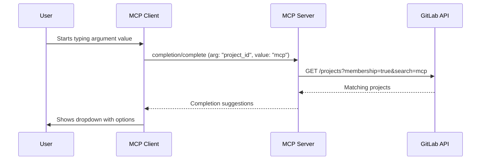

import FAQ from "../../../components/FAQ.astro";

Completions provide **real-time autocomplete suggestions for the arguments of prompts and resource templates**. Instead of memorizing project paths, branch names, or user logins, you type a few characters and GitLab MCP Server queries GitLab for matching values, returning them through the MCP `completion/complete` protocol method. This transforms a multi-step lookup into a single, interactive selection.

MCP completes two things: the arguments of a prompt (a `ref/prompt` reference) and the parameters of a resource URI template (a `ref/resource` reference). The parameters of a tool are not part of the protocol's completion, so a tool call is never autocompleted; the assistant fills those in itself.

GitLab MCP Server completes **18 argument names** (the prompt arguments and resource URI parameters the `completion/complete` handler recognizes), organized into global completers that work anywhere and per-project completers that search within a chosen project. Every suggestion is fetched live and up to 10 values are returned, so results always reflect the current state of the connected GitLab instance. A request reaches GitLab at most once per listing it needs: once for most arguments, and twice for `from`, `to` and `ref`, which merge the branch and tag listings.

## What problem do completions solve?

Without completions, supplying an identifier to a prompt means looking it up first, and that often costs an extra tool call. With completions, the client resolves the value inline as the user types, so a separate discovery step is no longer required.

```text
Without completions:
  Prompt review_mr asks for project_id → What's the path? → Must run project.list first

With completions:
  User types "mcp" into project_id → Server suggests: "group/gitlab-mcp-server", "group/redmine-mcp-server"
```

This collapses a multi-step lookup into a **single, interactive selection**.

## How do completions work?

When the user starts typing the value of a prompt argument or a resource URI parameter, the MCP client sends a `completion/complete` request to the server. The server queries the matching GitLab endpoint, then returns the matches as suggestions the client renders in a dropdown. The whole round-trip happens as the user types.


```mermaid
sequenceDiagram
    participant U as User
    participant C as MCP Client
    participant S as MCP Server
    participant GL as GitLab API

    U->>C: Starts typing argument value
    C->>S: completion/complete (arg: "project_id", value: "mcp")
    S->>GL: GET /projects?membership=true&search=mcp
    GL-->>S: Matching projects
    S-->>C: Completion suggestions
    C->>U: Shows dropdown with options
```

Each request is answered in five steps:

1. The client sends `completion/complete` with a reference (`ref/prompt` with a prompt name, or `ref/resource` with a URI), the argument's name and the partial value typed so far, and, optionally, `context.arguments` with the values already chosen for the other arguments.
2. A `ref/prompt` naming a prompt this server does not serve is refused with `-32602`, the code the specification names for an invalid prompt name.
3. An argument whose data comes only from actions the operator removed with `--exclude-tools` answers an empty list without reaching GitLab.
4. The argument's name picks the completer. A per-project completer reads `project_id` from `context.arguments` and answers an empty list without one.
5. The completer queries GitLab with the partial value and returns up to 10 matching values.

## Which argument types support completion?

GitLab MCP Server completes **18 argument names**, organized into global and per-project completers. Global completers resolve values that exist instance-wide, while per-project completers take the `project_id` the client sends in `context.arguments` and search only within that project. Prompt arguments (`ref/prompt`) get the full set; resource URI templates (`ref/resource`) complete `project_id`, `group_id`, `merge_request_iid` and `issue_iid`.

Two ways of matching are used. Arguments backed by a GitLab search (projects, groups, users, branches, tags, labels and milestones) pass what you typed to GitLab's own `search` filter for that list, which decides what matches and is not limited to the start of a name. Arguments that are numbers or hashes (merge request and issue IIDs, pipeline and job IDs, commit SHAs) read one page of 20 recent items and keep those whose identifier starts with what you typed.

### Global completers

These work without a project context:

| Argument     | Completes                      | How it is matched                                         | Example               |
| ------------ | ------------------------------ | --------------------------------------------------------- | --------------------- |
| `project_id` | Project paths, by path or name | GitLab project search, among projects you are a member of | `my-group/my-project` |
| `group_id`   | Group paths, by name           | GitLab group search                                       | `engineering`         |
| `username`   | GitLab usernames               | GitLab user search, active users only                     | `john.doe`            |

### Per-project completers

These require a `project_id` in `context.arguments` and search within that project:

| Argument                                   | Completes                                   | How it is matched                                                    | Example                   |
| ------------------------------------------ | ------------------------------------------- | -------------------------------------------------------------------- | ------------------------- |
| `branch`, `source_branch`, `target_branch` | Branch names                                | GitLab branch search                                                 | `feature/login`           |
| `from`, `to`, `ref`                        | Branch and tag names                        | Branch search and tag search, merged with branches first             | `v1.2.0`, `feature/login` |
| `tag`                                      | Tag names                                   | GitLab tag search                                                    | `v1.2.0`                  |
| `merge_request_iid`                        | Open MR IIDs                                | The 20 newest open merge requests, by IID prefix                     | `42`                      |
| `issue_iid`                                | Open issue IIDs                             | The 20 newest open issues, by IID prefix                             | `100`                     |
| `pipeline_id`                              | Recent pipeline IDs                         | The 20 newest pipelines, by ID prefix                                | `12345`                   |
| `sha`                                      | Recent commit SHAs                          | The 20 newest commits of the default branch, by SHA prefix, any case | `ddcc2f13`                |
| `label`                                    | Label names                                 | GitLab label search                                                  | `priority::high`          |
| `milestone_id`                             | Milestone IDs                               | GitLab milestone search, active milestones only                      | `7`                       |
| `milestone`                                | Milestone titles (falls back to `group_id`) | GitLab milestone search, active milestones only                      | `Sprint 14`               |
| `job_id`                                   | Job IDs in a pipeline (needs `pipeline_id`) | One page of 20 jobs of the pipeline, by ID prefix                    | `501`                     |

Two completers take a different context. `milestone` resolves against `project_id` when one is present and against `group_id` otherwise, so the group milestone prompts complete too. `job_id` needs both `project_id` and `pipeline_id` in `context.arguments`. A `sha` prefix is matched against the full commit hash, so pasting a whole SHA still matches, and the value returned is the short SHA.

## What does a completion return?

| Field     | Value                                                                                                                                                                                                                      |
| --------- | -------------------------------------------------------------------------------------------------------------------------------------------------------------------------------------------------------------------------- |
| `values`  | At most 10 bare values, always an array (empty rather than absent). Each is the literal string that replaces what you typed: a project path, an IID, a ref, never a label such as `15: Fix login`                          |
| `total`   | The number of matches GitLab reports in its `X-Total` header, for the arguments backed by a GitLab search; left out when GitLab does not send it, and for the IID, ID and SHA arguments, which are filtered after the read |
| `hasMore` | `true` when more matches exist than the values returned; left out otherwise                                                                                                                                                |

The server reads up to 20 items from GitLab so it can tell when more than 10 match. Results are never cached. On protocol 2026-07-28 the result also carries `"resultType": "complete"`.

## When is the answer empty?

An empty list is the normal answer whenever there is nothing useful to suggest, and it never blocks the client:

- **GitLab fails.** Any error from the GitLab call answers an empty list rather than an error. The cause is logged at debug level and never shown to the client.
- **Context is missing.** A per-project argument without `project_id` in `context.arguments`, `job_id` without `pipeline_id`, and `milestone` with neither `project_id` nor `group_id` all answer an empty list.
- **The argument is not one of the 18,** or a resource-template argument is not one of the four.
- **The operator removed the data.** Completion is narrowed by `--exclude-tools` (`GITLAB_MCP_EXCLUDE_TOOLS`) like the tool, resource, subscription and prompt surfaces. An operator who removes `issue.list` removes it here too, so the completion for `issue_iid` answers an empty list without reaching GitLab. An argument served by more than one action keeps the half that was left: removing only `tag.list` still completes `from`, `to` and `ref` with branches. For `milestone`, the scope decides: with a `project_id`, an excluded `project.milestone_list` answers empty rather than falling through to the group's milestones.
- **The server is at capacity.** A completion refused by the rate limit, or in HTTP mode by the process's ceiling on calls held open at once, is answered with an empty list too.

**One failure is an error instead.** A `ref/prompt` naming a prompt this server does not serve is refused with `-32602`, the same code `prompts/get` answers for that name, because it is something the caller sent and has to change. On `GITLAB_MCP_CAPABILITY_SURFACE=minimal`, where no prompt is served, every prompt reference is refused this way rather than answered with live GitLab data for a prompt `prompts/list` and `prompts/get` have already denied. A prompt an operator's exclusions removed is refused the same way.

**A resource URI is not checked.** The URI of a `ref/resource` is not compared with the templates the server holds, and the specification does not ask for it: a client may send a concrete URI where the server holds only a template. The argument's name alone decides the answer, so an unrecognized URI is never refused.

## Security

- **Errors never reach the client.** A GitLab failure answers an empty list, with no GitLab detail. The one refusal, an unserved prompt name, names the prompt the caller asked for and nothing else.
- **Your own credential, your own view.** Each completion runs under the caller's own GitLab credential, so it returns only what that token can see, and `project_id` searches only the projects you are a member of. In HTTP mode a completion the server cannot attribute to a credential is answered with an empty list and a warning in the server log, never under another caller's token.
- **Bounded cost.** A request makes at most one GitLab call per listing it needs (two for `from`, `to` and `ref`), and reads at most 20 items from each.
- **Rate limited.** When the rate limit is on (`GITLAB_MCP_RATE_LIMIT_RPS` or `--rate-limit-rps`, on by default in HTTP mode), completions draw on a bucket of their own, ten times the rate and burst of the tool-call bucket, because an editor sends one per keystroke. A completion the bucket refuses answers an empty list.
- **Exclusions hold.** An action removed with `--exclude-tools` cannot be read back through completion.

## Examples

The examples show a whole JSON-RPC exchange, as a client on protocol 2025-11-25 sees it.

**A project path for a prompt.** The user types `mcp` into the `project_id` argument of the `review_mr` prompt:

```json
{
  "jsonrpc": "2.0",
  "id": 7,
  "method": "completion/complete",
  "params": {
    "ref": { "type": "ref/prompt", "name": "review_mr" },
    "argument": { "name": "project_id", "value": "mcp" }
  }
}
```

```json
{
  "jsonrpc": "2.0",
  "id": 7,
  "result": {
    "completion": {
      "values": ["group/gitlab-mcp-server", "group/redmine-mcp-server"],
      "total": 2
    }
  }
}
```

**A ref for comparison.** The `compare_branches` prompt already has its project; the user types `v1.1` into `from`, and branches come before tags:

```json
{
  "jsonrpc": "2.0",
  "id": 8,
  "method": "completion/complete",
  "params": {
    "ref": { "type": "ref/prompt", "name": "compare_branches" },
    "argument": { "name": "from", "value": "v1.1" },
    "context": { "arguments": { "project_id": "group/gitlab-mcp-server" } }
  }
}
```

```json
{
  "jsonrpc": "2.0",
  "id": 8,
  "result": {
    "completion": {
      "values": ["release/v1.1", "v1.1.5", "v1.1.6", "v1.1.7"],
      "total": 4
    }
  }
}
```

**A merge request IID in a resource URI.** The user fills in `gitlab://project/{project_id}/mr/{merge_request_iid}` and types `1`. IIDs are filtered after the read, so no `total` comes back:

```json
{
  "jsonrpc": "2.0",
  "id": 9,
  "method": "completion/complete",
  "params": {
    "ref": { "type": "ref/resource", "uri": "gitlab://project/{project_id}/mr/{merge_request_iid}" },
    "argument": { "name": "merge_request_iid", "value": "1" },
    "context": { "arguments": { "project_id": "group/gitlab-mcp-server" } }
  }
}
```

```json
{
  "jsonrpc": "2.0",
  "id": 9,
  "result": {
    "completion": {
      "values": ["15", "14", "12"]
    }
  }
}
```

The values are bare IIDs. A client that wants to show titles in its dropdown reads them separately, for example from the merge request resource.

**A prompt the server does not serve:**

```json
{
  "jsonrpc": "2.0",
  "id": 10,
  "error": { "code": -32602, "message": "unknown prompt \"no_such_prompt\"" }
}
```

## How do completions help?

Completions do not change how the assistant calls tools. What they change is the input it starts from: the values a user picks for a prompt or a resource URI come from GitLab, so the prompt the assistant receives names things that exist.

| Without completions                                        | With completions                                    |
| ---------------------------------------------------------- | --------------------------------------------------- |
| A prompt's `branch` is typed from memory and may not exist | It is picked from the branches GitLab returns       |
| A merge request IID is recalled from memory                | It is picked from the project's open merge requests |
| A tag name is guessed                                      | It is picked from the project's real tags           |

In practice:

1. **Eliminates typos.** The user selects from validated suggestions instead of typing exact values.
2. **Reduces round-trips.** There is no need to run `project.list` to find a path before filling in a prompt.
3. **Returns bare values.** Suggestions are the literal strings an argument takes (paths, IIDs, refs), never decorated labels, so a pick can be passed straight through.
4. **Real-time search.** Results update as the user types, with no caching, so a deleted branch is never suggested.

This is most valuable for **per-project values** such as branch names, labels and milestones, which vary across projects and cannot be guessed reliably.

:::tip
Completions work best when the MCP client supports the `completion/complete` protocol method. If your client does not support completions, you can still discover values by running the domain's list action: `project.list`, `branch.list` or `project.label_list` through `gitlab_execute_action` on the default surface, or the `list` action of the matching meta-tool with `GITLAB_MCP_TOOL_SURFACE=meta`.
:::

<FAQ />
