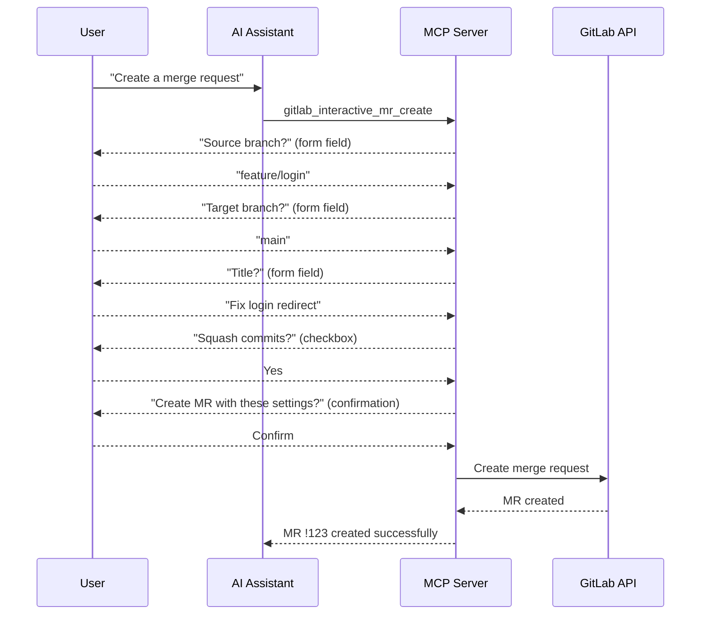

Elicitation allows the server to ask the user for input through structured forms, enabling wizard-style creation flows for complex resources like issues, merge requests, and releases.

## The Problem

Standard MCP tools require the AI to provide **all parameters upfront** in a single tool call. For complex resources — where fields depend on earlier choices and missing data leads to errors — the AI must either guess values or ask multiple chat questions before calling the tool.

## How It Works

With elicitation, the server can pause execution and **ask the user directly** for input through the MCP client's UI:

Each step can validate input and adapt the next question based on the previous answer.

## Interactive Wizards

The server provides wizard-style creation tools:

| Tool                                | Description                                                                |
| ----------------------------------- | -------------------------------------------------------------------------- |
| `gitlab_interactive_issue_create`   | Step-by-step issue creation with project selection, labels, and assignment |
| `gitlab_interactive_mr_create`      | Guided merge request creation with branch selection and options            |
| `gitlab_interactive_release_create` | Release creation wizard with tag and milestone selection                   |
| `gitlab_interactive_project_create` | Project creation with namespace selection and configuration                |

### Wizard Benefits

- **Progressive disclosure** — Only ask for required fields first, then optional ones
- **Validation at each step** — Catch errors before the final API call
- **Dependent fields** — Later fields can depend on earlier choices (e.g., branches depend on the selected project)
- **User confirmation** — Always confirm before creating the resource

## Confirmation for Destructive Actions

Elicitation is also used for **confirmation prompts** before destructive operations. When a user requests a delete or other irreversible action, the server can ask for explicit confirmation through the MCP client's UI.

## Requirements

Elicitation requires MCP client support:

- **Supported**: Claude Desktop, Claude Code
- **Not yet supported**: VS Code Copilot, Cursor

### Graceful Degradation

When elicitation is not available, the server falls back to standard parameterized tools. The AI assistant provides all parameters directly, without the interactive wizard flow. Functionality is preserved — only the interactive experience is reduced.

:::tip
Even without elicitation support, you can use the standard creation tools (e.g., `gitlab_issue` with `action: create`) by providing all parameters in a single call.
:::
