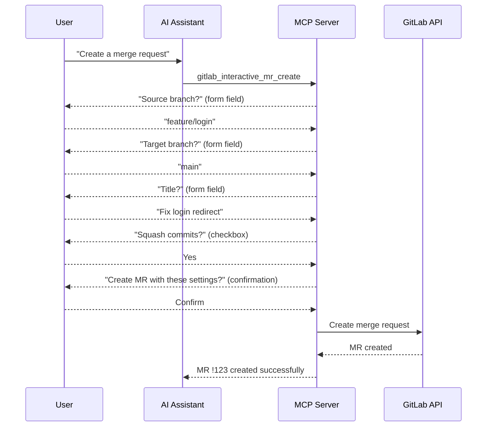

:::note[Developer Documentation]
This page is the user-facing overview. For the full elicitation reference, see [docs/reference/capabilities/elicitation](https://github.com/jmrplens/gitlab-mcp-server/blob/main/docs/reference/capabilities/elicitation.md).
:::

Elicitation lets GitLab MCP Server **ask the user for input through structured forms**, enabling wizard-style creation flows for complex resources such as issues, merge requests, releases, and projects. Instead of requiring the AI to supply every parameter upfront, the server collects fields one step at a time, validates each answer, and confirms before creating the resource.

This capability is server-to-client and **client-dependent**: the MCP client must declare support during the initialization handshake. When a client does not support elicitation, GitLab MCP Server falls back to standard parameterized tools, so resource creation still works without the interactive flow.

## What problem does elicitation solve?

Standard MCP tools require the AI to provide **all parameters upfront** in a single tool call. For complex resources — where fields depend on earlier choices and missing data leads to errors — the AI must either guess values or ask multiple chat questions before calling the tool. Elicitation removes that guesswork by letting the server gather and validate each field interactively.

## How does elicitation work?

With elicitation, the server pauses execution and **asks the user directly** for input through the MCP client's UI. Each step can validate the answer and adapt the next question based on what the user just entered, and the flow ends with an explicit confirmation before any GitLab API call.

```mermaid
sequenceDiagram
    participant U as User
    participant AI as AI Assistant
    participant S as MCP Server
    participant GL as GitLab API

    U->>AI: "Create a merge request"
    AI->>S: gitlab_interactive_mr_create
    S-->>U: "Source branch?" (form field)
    U-->>S: "feature/login"
    S-->>U: "Target branch?" (form field)
    U-->>S: "main"
    S-->>U: "Title?" (form field)
    U-->>S: "Fix login redirect"
    S-->>U: "Squash commits?" (checkbox)
    U-->>S: Yes
    S-->>U: "Create MR with these settings?" (confirmation)
    U-->>S: Confirm
    S->>GL: Create merge request
    GL-->>S: MR created
    S-->>AI: MR !123 created successfully
```

## Which interactive wizards are available?

GitLab MCP Server provides four wizard-style creation tools. Each guides the user through the fields a resource needs and confirms before performing the final API call.

| Tool                                | Description                                                                |
| ----------------------------------- | -------------------------------------------------------------------------- |
| `gitlab_interactive_issue_create`   | Step-by-step issue creation with project selection, labels, and assignment |
| `gitlab_interactive_mr_create`      | Guided merge request creation with branch selection and options            |
| `gitlab_interactive_release_create` | Release creation wizard with tag and milestone selection                   |
| `gitlab_interactive_project_create` | Project creation with namespace selection and configuration                |

### Why use a wizard instead of a single tool call?

Wizards add safeguards that a single upfront call cannot, which is what makes them valuable for complex resources:

- **Progressive disclosure** — Only ask for required fields first, then optional ones.
- **Validation at each step** — Catch errors before the final API call.
- **Dependent fields** — Later fields can depend on earlier choices (for example, branches depend on the selected project).
- **User confirmation** — Always confirm before creating the resource.

## How does elicitation guard destructive actions?

Elicitation is also used for **confirmation prompts** before destructive operations. When a user requests a delete or another irreversible action, the server can ask for explicit confirmation through the MCP client's UI before proceeding, reducing the risk of accidental data loss.

## What does elicitation require?

Elicitation requires the MCP client to declare support for the capability:

- **Supported**: Claude Desktop, Claude Code
- **Not yet supported**: VS Code Copilot, Cursor

### What happens without elicitation support?

When elicitation is not available, the server falls back to standard parameterized tools. The AI assistant provides all parameters directly, without the interactive wizard flow. Functionality is preserved — only the interactive experience is reduced.

:::tip
Even without elicitation support, you can use the standard creation tools (e.g., `gitlab_issue` with `action: create`) by providing all parameters in a single call.
:::

## Frequently asked questions

### What is MCP elicitation?

Elicitation is an MCP capability that lets GitLab MCP Server **pause and ask the user for input through structured forms** rendered by the client. It powers wizard-style creation of complex resources such as issues, merge requests, releases, and projects. Rather than requiring all parameters upfront, the server collects fields one step at a time, validates each answer, adapts later questions to earlier ones, and confirms before creating the resource.

### Which interactive wizard tools are available?

GitLab MCP Server provides four elicitation wizards: `gitlab_interactive_issue_create` (project selection, labels, assignment), `gitlab_interactive_mr_create` (branch selection and options), `gitlab_interactive_release_create` (tag and milestone selection), and `gitlab_interactive_project_create` (namespace selection and configuration). Each confirms with the user before performing the final GitLab API call.

### What happens when a client does not support elicitation?

GitLab MCP Server gracefully degrades to standard parameterized tools. The assistant supplies all parameters directly in a single call instead of using the wizard flow. Functionality is fully preserved — only the step-by-step experience is lost. For example, calling `gitlab_issue` with `action: create` and passing every field at once produces the same result without elicitation support.

### Which MCP clients support elicitation?

Elicitation is supported by **Claude Desktop** and **Claude Code**. **VS Code Copilot** and **Cursor** do not yet support it, so on those clients GitLab MCP Server falls back to standard parameterized creation tools. Because client capability support changes frequently, confirm the current state against the specific client's documentation.
