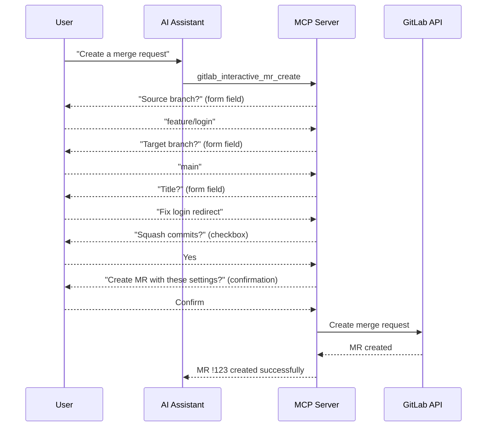

import FAQ from "../../../components/FAQ.astro";

Elicitation lets GitLab MCP Server **ask the user for input through structured forms**, enabling wizard-style creation flows for complex resources such as issues, merge requests, releases, and projects. Instead of requiring the AI to supply every parameter upfront, the server collects fields one step at a time, validates each answer, and confirms before creating the resource.

This capability is server-to-client and **client-dependent**: the MCP client must declare support: in `initialize` on protocol `2025-11-25` and earlier, and on each request from `2026-07-28`. When a client does not support elicitation, GitLab MCP Server falls back to standard parameterized tools, so resource creation still works without the interactive flow.

## What problem does elicitation solve?

Standard MCP tools require the AI to provide **all parameters upfront** in a single tool call. For complex resources — where fields depend on earlier choices and missing data leads to errors — the AI must either guess values or ask multiple chat questions before calling the tool. Elicitation removes that guesswork by letting the server gather and validate each field interactively.

## How does elicitation work?

With elicitation, the server pauses execution and **asks the user directly** for input through the MCP client's UI. Each answer is checked against the question before the next one is asked, and the flow ends with an explicit confirmation before any GitLab API call.


```mermaid
sequenceDiagram
    participant U as User
    participant AI as AI Assistant
    participant S as MCP Server
    participant GL as GitLab API

    U->>AI: "Create a merge request"
    AI->>S: gitlab_interactive_mr_create
    S-->>U: "Source branch?" (form field)
    U-->>S: "feature/login"
    S-->>U: "Target branch?" (form field)
    U-->>S: "main"
    S-->>U: "Title?" (form field)
    U-->>S: "Fix login redirect"
    S-->>U: "Squash commits?" (checkbox)
    U-->>S: Yes
    S-->>U: "Create MR with these settings?" (confirmation)
    U-->>S: Confirm
    S->>GL: Create merge request
    GL-->>S: MR created
    S-->>AI: MR !123 created successfully
```

Each step is its own request to the client: one `elicitation/create` per question, carrying the question and a JSON Schema for the answer (a text field, a choice from a list, or a yes/no), so the client can draw the right control. The user answers each one with accept, decline or cancel.

### What are the four phases of a flow?

1. **Capability check**: before asking anything, the wizard checks that the client declared elicitation. If it did not, the wizard stops and names the action that does the same work (see [What happens without elicitation support?](#what-happens-without-elicitation-support)).
2. **Gathering**: the questions follow one another. An optional one can be declined or left empty, and the flow carries on without that field.
3. **Confirmation**: the wizard shows a summary of everything it collected and asks for a final yes or no.
4. **Execution**: only after that yes does it call GitLab, and it returns the object GitLab created.

Cancelling at any step, or answering no at the confirmation, ends the flow with nothing sent to GitLab.

### Which wire form does a client get?

The flow is the same for every client; how the questions travel depends on the MCP protocol version the client speaks:

| Client protocol          | Mechanism                                  | On the wire                                                                                                                                                                                                            |
| ------------------------ | ------------------------------------------ | ---------------------------------------------------------------------------------------------------------------------------------------------------------------------------------------------------------------------- |
| `2025-11-25` and earlier | Synchronous server-initiated requests      | While the tool call runs, the server sends one `elicitation/create` request per question and waits for the answer: an `action` (`accept`, `decline` or `cancel`) and, on accept, the `content`                         |
| `2026-07-28`             | Multi-round-trip requests (MRTR, SEP-2322) | The tool result carries an `inputRequests` map keyed by question and an opaque `requestState`; the client asks the user, then repeats the same call with the answers in `inputResponses` and the `requestState` echoed |

On the multi-round-trip path one round carries one question. An abridged first round of the issue wizard looks like this:

```json
{
  "resultType": "input_required",
  "inputRequests": {
    "title": {
      "method": "elicitation/create",
      "params": {
        "message": "Enter the issue title",
        "requestedSchema": {
          "type": "object",
          "properties": {
            "title": { "type": "string", "title": "title", "description": "Enter the issue title" }
          },
          "required": ["title"]
        }
      }
    }
  },
  "requestState": "<opaque, signed by the server>"
}
```

The wizard runs again from the start on every round, replaying the answers carried in `requestState` instead of asking them again, so the user sees the same questions in the same order on both paths.

### Which protocol version decides?

The version that decides is the one the client **declared**, not the one its session negotiated, and on the legacy handshake those two can differ. `initialize` is deprecated in `2026-07-28`, so the Go SDK this server is built on (v1.8.0) answers an `initialize` asking for `2026-07-28` with `2025-11-25`, while keeping the version the client asked for. The server reads the version the request states, which a `2026-07-28` client sends with every request and an older client stated once in `initialize`. A client that asks for `2026-07-28` in `initialize` is therefore served multi-round-trip input requests although its session negotiated `2025-11-25`.

The SDK decides the same way, and its own client answers `inputRequests` whatever version it negotiated, so a client built on it is unaffected. A client that claimed `2026-07-28` in `initialize` and cannot handle `inputRequests` would receive a result it cannot act on. The negotiated version should drive both sides, which is the SDK's to change; the defect is [recorded upstream](https://github.com/jmrplens/gitlab-mcp-server/blob/main/docs/development/upstream-bugs.md#the-declared-protocol-version-not-the-negotiated-one-selects-mrtr).

### What is `resultType`?

On a `2026-07-28` session every tool result carries `resultType`: `input_required` on a result that asks for input, `complete` on any other. It follows the declared version too, so a client that asked for `2026-07-28` in `initialize` gets `resultType: "complete"` on ordinary calls that elicit nothing. Results on a legacy session carry no `resultType`.

### Which transports carry it?

HTTP mode is [stateless by default](/gitlab-mcp-server/operations/http-server/#stateless-mode), and that decides which of the two forms is available:

| Transport                          | Client protocol          | Elicitation                                                                                                                                      |
| ---------------------------------- | ------------------------ | ------------------------------------------------------------------------------------------------------------------------------------------------ |
| stdio, or HTTP `--stateless=false` | `2025-11-25` and earlier | Available: synchronous `elicitation/create` requests                                                                                             |
| stdio                              | `2026-07-28`             | Available: multi-round-trip input requests                                                                                                       |
| HTTP stateless (default)           | `2026-07-28`             | Available: the input requests travel inside the tool result, so no session or server-initiated channel is needed                                 |
| HTTP stateless (default)           | `2025-11-25` and earlier | Unavailable: no channel outlives the request, so the wizards answer with their alternative action and a destructive action needs `confirm: true` |
| HTTP `--stateless=false`           | `2026-07-28`             | Unavailable: the deployment does not serve this revision and answers `400`                                                                       |

A `--stateless=false` deployment does not offer `2026-07-28` at all, because the SDK's streamable transport serves that revision only without sessions. A request naming it is answered `400` with a JSON-RPC `-32022` error whose `data.supported` lists the revisions the deployment does negotiate, so the client can retry on one of them and use the synchronous form ([Protocol revisions this server negotiates](/gitlab-mcp-server/operations/http-server/#protocol-revisions-this-server-negotiates)).

## Which interactive wizards are available?

GitLab MCP Server provides four wizard-style creation tools. Each guides the user through the fields a resource needs and confirms before performing the final API call.

| Tool                                | Description                                                                                                         |
| ----------------------------------- | ------------------------------------------------------------------------------------------------------------------- |
| `gitlab_interactive_issue_create`   | Step-by-step issue creation: title, description, labels, confidentiality, confirmation                              |
| `gitlab_interactive_mr_create`      | Guided merge request creation: branches, title, description, labels, remove-source and squash options, confirmation |
| `gitlab_interactive_release_create` | Release creation wizard: tag name, release name, description, confirmation                                          |
| `gitlab_interactive_project_create` | Project creation: name, description, visibility, README initialization, default branch, confirmation                |

The issue, merge request and release wizards take the target `project_id` as a tool parameter; the prompts collect the remaining fields. These four tools are registered by name on the meta and individual surfaces; on the default dynamic surface they are reached through `gitlab_execute_action` with the catalog IDs `interactive.issue_create`, `interactive.mr_create`, `interactive.release_create` and `interactive.project_create`, which `gitlab_find_action` returns.

### What does each wizard ask?

The questions come in the order below. Declining an optional question continues without that field; declining a required one, or cancelling at any question, ends the flow. Every yes/no question starts on no. In the final summary a long description shows its first 100 characters.

#### Issue

| Step | Question                    | Answer | Required |
| ---: | --------------------------- | ------ | :------: |
|    1 | Title                       | Text   |   Yes    |
|    2 | Description (Markdown)      | Text   |    No    |
|    3 | Labels, comma-separated     | Text   |    No    |
|    4 | Should it be confidential?  | Yes/no |    No    |
|    5 | Create the issue? (summary) | Yes/no |   Yes    |

#### Merge request

| Step | Question                              | Answer | Required |
| ---: | ------------------------------------- | ------ | :------: |
|    1 | Source branch                         | Text   |   Yes    |
|    2 | Target branch                         | Text   |   Yes    |
|    3 | Title                                 | Text   |   Yes    |
|    4 | Description (Markdown)                | Text   |    No    |
|    5 | Labels, comma-separated               | Text   |    No    |
|    6 | Remove the source branch after merge? | Yes/no |    No    |
|    7 | Squash commits on merge?              | Yes/no |    No    |
|    8 | Create the merge request? (summary)   | Yes/no |   Yes    |

#### Release

| Step | Question                                          | Answer | Required |
| ---: | ------------------------------------------------- | ------ | :------: |
|    1 | Tag name (the tag must already exist)             | Text   |   Yes    |
|    2 | Release name (empty lets GitLab use the tag name) | Text   |   Yes    |
|    3 | Description, the release notes                    | Text   |    No    |
|    4 | Create the release? (summary)                     | Yes/no |   Yes    |

#### Project

| Step | Question                                    | Answer | Required |
| ---: | ------------------------------------------- | ------ | :------: |
|    1 | Project name                                | Text   |   Yes    |
|    2 | Description                                 | Text   |    No    |
|    3 | Visibility: private, internal or public     | Choice |   Yes    |
|    4 | Initialize the repository with a README?    | Yes/no |    No    |
|    5 | Default branch (empty for GitLab's default) | Text   |    No    |
|    6 | Create the project? (summary)               | Yes/no |   Yes    |

The release name has to be answered, though the answer may be empty. A declined README question means no README.

### Why use a wizard instead of a single tool call?

Wizards add safeguards that a single upfront call cannot, which is what makes them valuable for complex resources:

- **One field at a time**: each form asks for a single value, so nothing has to be supplied all at once.
- **Validation at each step**: an answer that does not fit its question is caught before the final API call.
- **Direct input**: the user types each value into a form instead of the AI relaying it from chat.
- **User confirmation**: the resource is created only after the user approves a summary.

Both kinds of action exist side by side:

| Aspect                | Standard action                         | Wizard                                           |
| --------------------- | --------------------------------------- | ------------------------------------------------ |
| **Input**             | The AI provides every parameter at once | The server asks the user, one question at a time |
| **User interaction**  | Indirect, through the AI chat           | Direct, through structured forms                 |
| **Validation**        | When the call runs                      | At each answer, before going on                  |
| **Cancellation**      | Not possible once called                | At any question                                  |
| **Best for**          | Automation, scripting, batch operations | Interactive creation, first-time users           |
| **AI context needed** | Every parameter, upfront                | Only which wizard to call                        |

## What happens when you cancel?

Cancelling at any question, declining a required one, or answering no at the final review ends the flow before anything is sent to GitLab. The tool answers with a short message, such as `Issue creation cancelled by user.`, and marks the result as an error (`isError: true`): the call produced none of the output its schema describes, and the message tells the model the user decided rather than that something failed.

An answer that does not fit the question asked (a missing field, a choice that was not offered) is a client fault rather than a decision: it is reported as an error, never as a cancellation, and the value is never used.

## How does elicitation guard destructive actions?

Elicitation is also used for **confirmation prompts** before destructive operations on the meta and individual surfaces. There a destructive call proceeds on the first of these that holds:

1. `GITLAB_MCP_YOLO_MODE` is truthy, or, when it is unset, `AUTOPILOT` is.
2. The call carries `"confirm": true`.
3. The client supports elicitation, and the user approves the question.

A client that cannot elicit is refused with a message asking it to send the call again with `confirm: true` only after the user approves, and nothing reaches GitLab. On a `2026-07-28` session the question travels as one multi-round-trip input request.

The default dynamic surface never asks: `gitlab_execute_action` refuses an action classified destructive unless the call carries `confirm: true`, and neither `GITLAB_MCP_YOLO_MODE` nor `AUTOPILOT` skips that. Only the two guards that depend on the arguments elicit there too. [Destructive actions](/gitlab-mcp-server/operations/security/#destructive-actions) lists which actions count as destructive and describes both guards.

## How is the input kept safe?

- **Every answer is checked against its question** before the wizard uses it: a choice must be one of the options offered, a number must be a real number within its bounds, and a structured answer is validated against the JSON Schema it was asked with. An answer that fails is refused and never handed on.
- **The summary cannot be impersonated.** Each value shown in the confirmation is escaped: line breaks collapse, link schemes are defanged (`https[:]//`), and Markdown inside the value is shown rather than rendered, so text that came from the model cannot pass itself off as the server's own question.
- **Yes/no questions default to no**, so a client that pre-fills defaults opens them on no.
- **The answers are bound to the call.** On the multi-round-trip path the answers travel in `requestState`, which the server signs, ties to the tool and the exact arguments of the call, and accepts for 10 minutes. State that has expired, or was issued for another call, is ignored and the questions are asked again; state the server did not sign is refused. The signing key is created fresh in each process, so state issued before a restart, or by another replica behind a balancer, is refused rather than continued.
- **The user always has the last word.** Every wizard confirms before it writes anything to GitLab, and the user can cancel at any point without side effects.

## What does elicitation require?

The MCP client must declare the `elicitation` capability as it connects, with form mode or with no mode named (which the protocol reads as form). The server reads that declaration on every call, so nothing needs configuring on this side, and the same server serves clients with and without it.

Which clients declare it changes from release to release. Today the documentation of [VS Code](https://code.visualstudio.com/updates/v1_102) (from release 1.102), [Cursor](https://cursor.com/docs/context/mcp) and [Claude Code](https://code.claude.com/docs/en/mcp) lists elicitation as supported. For any other client, check its own documentation.

### What happens without elicitation support?

The wizard does not run. Its answer is an error result saying that the client does not support elicitation and naming the one action that does the same work with every field passed in the call. Each wizard names its own, by its catalog ID, and its description promises the same one:

| Wizard                              | Alternative it names   |
| ----------------------------------- | ---------------------- |
| `gitlab_interactive_issue_create`   | `issue.create`         |
| `gitlab_interactive_mr_create`      | `merge_request.create` |
| `gitlab_interactive_project_create` | `project.create`       |
| `gitlab_interactive_release_create` | `release.create`       |

The tool that runs the alternative depends on the surface: on the default dynamic surface it is `gitlab_execute_action` with the ID as `action` (`{"action": "issue.create", "params": {...}}`), on the meta surface the domain tool with `action` set to `create` (`gitlab_issue`, `gitlab_merge_request`, `gitlab_project`, `gitlab_release`), and on the individual surface a tool of its own (`gitlab_issue_create`, `gitlab_mr_create`, `gitlab_project_create`, `gitlab_release_create`). Functionality is preserved; only the interactive experience is lost.

:::tip
Even without elicitation support, you can use the standard creation actions (`issue.create` through `gitlab_execute_action` on the default surface, or `gitlab_issue` with `action: create` when `GITLAB_MCP_TOOL_SURFACE=meta`) by providing all parameters in a single call.
:::

<FAQ />

## Source reference

:::note[Developer Documentation]
This page is the user-facing overview. For the full elicitation reference, see [docs/reference/capabilities/elicitation](https://github.com/jmrplens/gitlab-mcp-server/blob/main/docs/reference/capabilities/elicitation.md).
:::
