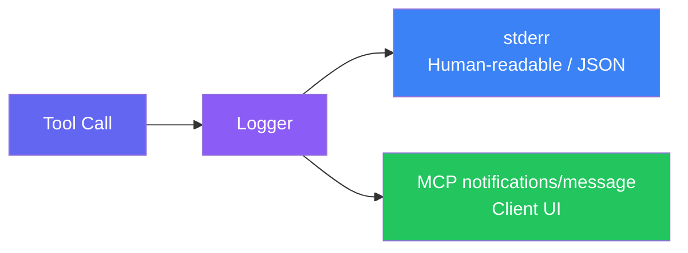

import { Badge } from "@astrojs/starlight/components";

GitLab MCP Server uses **dual logging** — log messages are sent both to stderr (for terminal/file capture) and to the MCP client via the protocol's logging capability.

## Dual output



| Destination      | Format                      | Purpose                                                       |
| ---------------- | --------------------------- | ------------------------------------------------------------- |
| **stderr**       | Human-readable text or JSON | Terminal output, file redirection, debugging                  |
| **MCP protocol** | `notifications/message`     | Displayed in the MCP client's UI (e.g., VS Code Output panel) |

This ensures logs are always visible regardless of the client's logging support.

## Log levels

### Stderr levels (`LOG_LEVEL`)

The `LOG_LEVEL` environment variable accepts four values:

| Level                                   | When Used                                                                                                     |
| --------------------------------------- | ------------------------------------------------------------------------------------------------------------- |
| <Badge text="debug" variant="note" />   | Detailed diagnostic information — tool call parameters, API request/response details, session pool operations |
| <Badge text="info" variant="success" /> | Normal operational events — server startup, tool registration, update checks                                  |
| <Badge text="warn" variant="caution" /> | Non-fatal issues — network timeouts, missing optional configuration, deprecated usage                         |
| <Badge text="error" variant="danger" /> | Failures — authentication errors, API failures, unrecoverable tool errors                                     |

### MCP protocol levels (RFC 5424)

The MCP `notifications/message` supports all eight RFC 5424 severity levels. Clients can filter via `logging/setLevel`:

| Level                                       | Severity | When Used                                         |
| ------------------------------------------- | -------- | ------------------------------------------------- |
| <Badge text="debug" variant="note" />       | Lowest   | Diagnostic details (tool parameters, API traces)  |
| <Badge text="info" variant="success" />     |          | Normal events (startup, registration)             |
| <Badge text="notice" variant="note" />      |          | Significant but normal conditions                 |
| <Badge text="warning" variant="caution" />  |          | Potential issues (timeouts, deprecation)          |
| <Badge text="error" variant="danger" />     |          | Operation failures (API errors, auth failures)    |
| <Badge text="critical" variant="danger" />  |          | Critical conditions requiring immediate attention |
| <Badge text="alert" variant="danger" />     |          | Action must be taken immediately                  |
| <Badge text="emergency" variant="danger" /> | Highest  | System is unusable                                |

## Configuration

Set the log level via environment variable:

```bash
# Stdio mode
LOG_LEVEL=debug ./gitlab-mcp-server

# HTTP mode
LOG_LEVEL=info ./gitlab-mcp-server --http --gitlab-url=https://gitlab.example.com
```

The default level is `info`.

## MCP log messages

When the MCP client supports logging, the server sends structured log notifications:

```json
{
	"jsonrpc": "2.0",
	"method": "notifications/message",
	"params": {
		"level": "info",
		"logger": "gitlab-mcp-server",
		"data": {
			"message": "starting MCP server",
			"transport": "stdio",
			"version": "2.1.0",
			"tools": 40,
			"resources": 44,
			"prompts": 38
		}
	}
}
```

### Security rules

Log messages follow strict security rules:

- **No tokens** — GitLab tokens are never included in log messages
- **Masked identifiers** — In HTTP mode, tokens are shown as `...a1b2` (last 4 characters only)
- **No PII** — User-submitted data is not logged at `info` level or above
- **Debug only** — Detailed request/response data is only logged at `debug` level

:::tip
In VS Code, view MCP server logs via `Ctrl+Shift+P` → **MCP: List Servers** → select the server → **Show Output**.
:::
