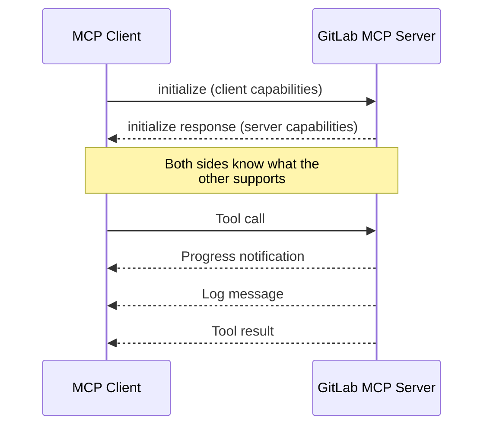

GitLab MCP Server implements 7 MCP protocol capabilities that enhance how AI assistants interact with GitLab. These capabilities go beyond basic tool calling to provide richer, more intelligent interactions.

## Capabilities overview

| Capability                                  | Direction       | What It Enables                                                             |
| ------------------------------------------- | --------------- | --------------------------------------------------------------------------- |
| [Logging](/en/capabilities/logging)         | Server → Client | Structured log messages sent to the MCP client for visibility               |
| [Progress](/en/capabilities/progress)       | Server → Client | Real-time progress updates for long-running operations                      |
| [Roots](/en/capabilities/roots)             | Client → Server | Workspace context — auto-detect GitLab project from local git repo          |
| [Sampling](/en/capabilities/sampling)       | Server → Client | AI-powered analysis — server sends GitLab data to client's LLM for analysis |
| [Elicitation](/en/capabilities/elicitation) | Server → Client | Interactive wizards — step-by-step forms for creating complex resources     |
| [Completions](/en/capabilities/completions) | Client → Server | Argument autocompletion for project names, branches, users, and more        |
| [Icons](/en/capabilities/icons)             | Server → Client | SVG icons for every tool, resource, and prompt                              |

## How capabilities work

Capabilities are negotiated during the MCP initialization handshake between the client and server:

**Server-declared capabilities** (Logging, Completions) are always available. **Client-dependent capabilities** (Roots, Sampling, Elicitation) require the MCP client to declare support — the server checks for their presence before using them and gracefully degrades when they are unavailable.

## Client support

Not all MCP clients support every capability. The server adapts automatically:

| Capability  | Claude Desktop | VS Code Copilot | Cursor | Claude Code |
| ----------- | -------------- | --------------- | ------ | ----------- |
| Logging     | ✅             | ✅              | ✅     | ✅          |
| Progress    | ✅             | ✅              | ✅     | ✅          |
| Completions | ✅             | ✅              | ❓     | ✅          |
| Roots       | ✅             | ✅              | ❓     | ✅          |
| Sampling    | ✅             | ❌              | ❌     | ✅          |
| Elicitation | ✅             | ❌              | ❌     | ✅          |
| Icons       | ✅             | ✅              | ✅     | ✅          |

:::note
Client support evolves rapidly. Check your MCP client's documentation for the latest capability support.
:::
