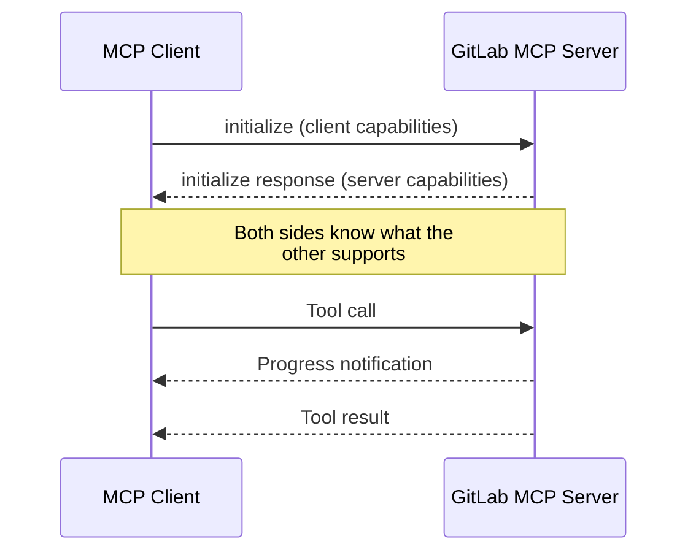

GitLab MCP Server implements **3 MCP protocol capabilities** that enhance how AI assistants interact with GitLab, plus **icon metadata** on every tool, resource, and prompt. These go beyond basic tool calling to provide richer, more intelligent interactions.

## Capabilities overview

| Capability                                                   | Direction       | What It Enables                                                             |
| ------------------------------------------------------------ | --------------- | --------------------------------------------------------------------------- |
| [Progress](/gitlab-mcp-server/capabilities/progress/)        | Server → Client | Real-time progress updates for long-running operations                      |
| [Elicitation](/gitlab-mcp-server/capabilities/elicitation/)  | Server → Client | Interactive wizards — step-by-step forms for creating complex resources     |
| [Completions](/gitlab-mcp-server/capabilities/completions/)  | Client → Server | Argument autocompletion for project names, branches, users, and more        |
| [Icons](/gitlab-mcp-server/capabilities/icons/) _(metadata)_ | Server → Client | SVG icons for every tool, resource, and prompt                              |

## How capabilities work

Capabilities are negotiated during the MCP initialization handshake between the client and server:

```mermaid
sequenceDiagram
    participant C as MCP Client
    participant S as GitLab MCP Server

    C->>S: initialize (client capabilities)
    S-->>C: initialize response (server capabilities)
    Note over C,S: Both sides know what the<br/>other supports

    C->>S: Tool call
    S-->>C: Progress notification
    S-->>C: Tool result
```

**Server-declared capabilities** (Completions) are always available. **Client-dependent capabilities** (Elicitation) require the MCP client to declare support — the server checks for their presence before using them and gracefully degrades when they are unavailable.

## Client support

Not all MCP clients support every capability. The server adapts automatically:

| Capability  | Claude Desktop | VS Code Copilot | Cursor | Claude Code |
| ----------- | -------------- | --------------- | ------ | ----------- |
| Progress    | ✅             | ✅              | ✅     | ✅          |
| Completions | ✅             | ✅              | ❓     | ✅          |
| Elicitation | ✅             | ❌              | ❌     | ✅          |
| Icons       | ✅             | ✅              | ✅     | ✅          |

:::note
Client support evolves rapidly. Check your MCP client's documentation for the latest capability support.
:::
