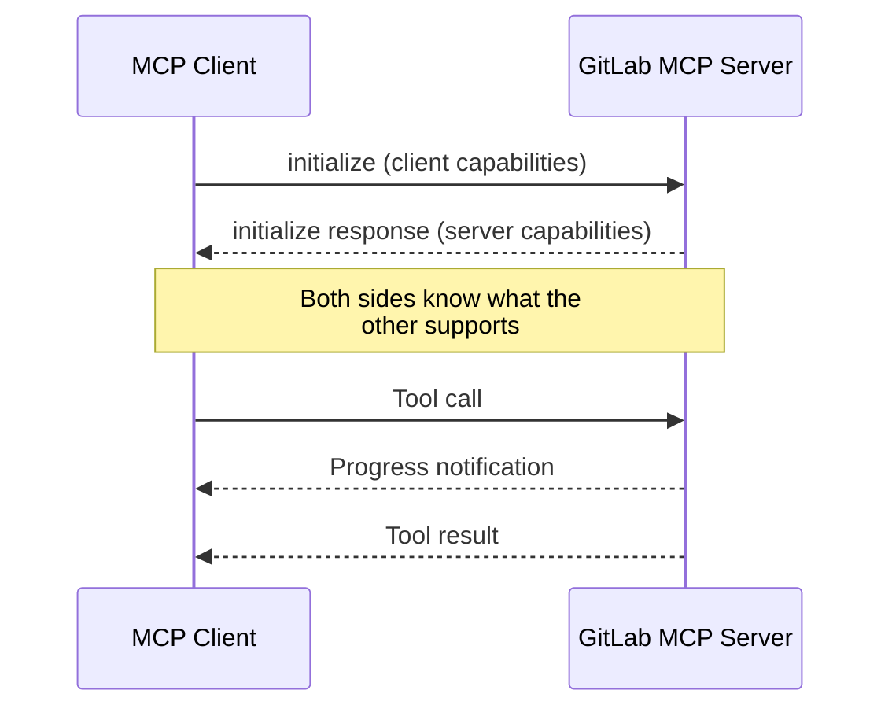

:::note[Developer Documentation]
This page is the user-facing overview. For the full capability reference, see [docs/reference/capabilities](https://github.com/jmrplens/gitlab-mcp-server/blob/main/docs/reference/capabilities/README.md).
:::

GitLab MCP Server implements **three MCP protocol capabilities** — progress, elicitation, and completions — that go beyond basic tool calling to make AI assistants more accurate and interactive when working with GitLab. It also attaches **icon metadata** to every tool, resource, and prompt. Together these features let assistants report progress, ask the user for input through structured forms, autocomplete argument values, and present recognizable per-domain icons.

The three capabilities are negotiated during the MCP initialization handshake, while icons are presentation metadata that clients render or ignore. None of them is required for core tool calls to work: when a client lacks support, the server degrades gracefully and the underlying GitLab operation still completes.

## What capabilities does GitLab MCP Server provide?

GitLab MCP Server provides four distinct features, summarized below. Progress and elicitation push information from the server to the client, completions pull suggestions from the server on demand, and icons are static metadata attached to every surface.

| Capability                                                   | Direction       | What It Enables                                                         |
| ------------------------------------------------------------ | --------------- | ----------------------------------------------------------------------- |
| [Progress](/gitlab-mcp-server/capabilities/progress/)        | Server → Client | Real-time progress updates for long-running operations                  |
| [Elicitation](/gitlab-mcp-server/capabilities/elicitation/)  | Server → Client | Interactive wizards — step-by-step forms for creating complex resources |
| [Completions](/gitlab-mcp-server/capabilities/completions/)  | Client → Server | Argument autocompletion for project names, branches, users, and more    |
| [Icons](/gitlab-mcp-server/capabilities/icons/) _(metadata)_ | Server → Client | SVG icons for every tool, resource, and prompt                          |

## How are MCP capabilities negotiated?

Capabilities are negotiated once, during the MCP initialization handshake between the client and server. Each side advertises what it supports, so neither attempts to use a feature the other cannot handle. After the handshake, the server can send progress notifications and elicitation requests, and the client can request completions.

```mermaid
sequenceDiagram
    participant C as MCP Client
    participant S as GitLab MCP Server

    C->>S: initialize (client capabilities)
    S-->>C: initialize response (server capabilities)
    Note over C,S: Both sides know what the<br/>other supports

    C->>S: Tool call
    S-->>C: Progress notification
    S-->>C: Tool result
```

**Server-declared capabilities** (completions) are always available because GitLab MCP Server advertises them unconditionally. **Client-dependent capabilities** (elicitation) require the MCP client to declare support — the server checks for it before using the capability and gracefully degrades when it is unavailable, falling back to standard parameterized tools so no functionality is lost.

## Which MCP clients support each capability?

Capability support varies by MCP client, and GitLab MCP Server adapts automatically to whatever the connected client advertises. The table below reflects common clients at the time of writing; because client support evolves quickly, confirm the current state against each client's own documentation.

| Capability  | Claude Desktop | VS Code Copilot | Cursor | Claude Code |
| ----------- | -------------- | --------------- | ------ | ----------- |
| Progress    | ✅             | ✅              | ✅     | ✅          |
| Completions | ✅             | ✅              | ❓     | ✅          |
| Elicitation | ✅             | ❌              | ❌     | ✅          |
| Icons       | ✅             | ✅              | ✅     | ✅          |

:::note
Client support evolves rapidly. Check your MCP client's documentation for the latest capability support.
:::

## Frequently asked questions

### What MCP capabilities does GitLab MCP Server implement?

GitLab MCP Server implements **three MCP protocol capabilities** — progress, elicitation, and completions — plus **icon metadata** on every tool, resource, and prompt. Progress sends real-time updates during long-running operations, elicitation lets the server ask the user for input through structured forms, and completions autocomplete argument values such as project names, branches, users, and labels. Icons are presentation metadata, not a negotiated protocol capability. The three capabilities are negotiated during the MCP initialization handshake.

### What is the difference between server-declared and client-dependent capabilities?

Server-declared capabilities, such as **completions**, are advertised unconditionally by GitLab MCP Server and available to any client that calls them. Client-dependent capabilities, such as **elicitation**, require the MCP client to declare support during initialization. The server checks for that support before using the capability and degrades gracefully when it is missing — for elicitation, it falls back to standard parameterized tools, so functionality is preserved and only the interactive experience is reduced.

### What happens if my MCP client does not support a capability?

GitLab MCP Server adapts automatically. **Progress** notifications are best-effort and silently ignored when unsupported, so tools still complete. **Elicitation** falls back to standard parameterized tools where the assistant supplies all parameters in one call. **Completions** are simply not offered, and values remain discoverable through the `list` action on any meta-tool. **Icons** are optional metadata that non-rendering clients ignore. No capability is required for core tool functionality.

### Which MCP clients support elicitation?

Elicitation is supported by **Claude Desktop** and **Claude Code**. **VS Code Copilot** and **Cursor** do not yet support it, so on those clients GitLab MCP Server falls back to standard parameterized creation tools. Because client capability support changes frequently, confirm the current state against the specific client's documentation.
