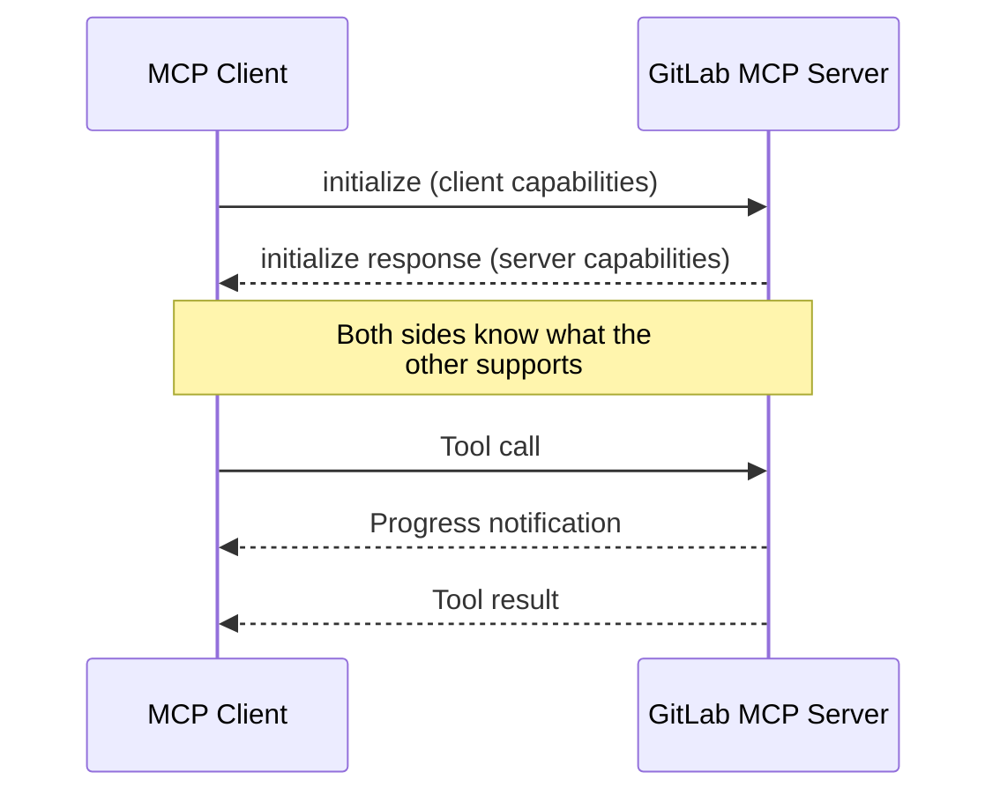

import stats from "../../../data/stats.json";
import FAQ from "../../../components/FAQ.astro";

GitLab MCP Server implements the **4 MCP capabilities** described in this section: progress, elicitation, completions, and resource subscriptions. They go beyond basic tool calling to make AI assistants more accurate and interactive when working with GitLab. It also attaches **icon metadata** to every tool, resource, and prompt. Together these features let assistants report progress, ask the user for input through structured forms, autocomplete the arguments of prompts and resource templates, watch GitLab resources for change, and present recognizable per-domain icons.

None of the {stats.capabilities} capabilities is required for core tool calls to work: when a client lacks support, the server degrades gracefully and the underlying GitLab operation still completes. Icons are presentation metadata that clients render or ignore, not a capability either side declares.

## What capabilities does GitLab MCP Server provide?

GitLab MCP Server provides five distinct features, summarized below. Progress is a notification the server sends while it works on a call; elicitation is a request the server sends to the client, which answers with what the user entered; completions are requests the client sends when it wants suggestions; subscriptions notify the client when a watched resource changes; and icons are static metadata attached to every surface.

| Capability                                                      | Direction                                                     | What It Enables                                                                                                                                                                             |
| --------------------------------------------------------------- | ------------------------------------------------------------- | ------------------------------------------------------------------------------------------------------------------------------------------------------------------------------------------- |
| [Progress](/gitlab-mcp-server/capabilities/progress/)           | Server → Client (notification, for a call with a token)       | Real-time progress updates for long-running operations                                                                                                                                      |
| [Elicitation](/gitlab-mcp-server/capabilities/elicitation/)     | Server → Client (request; the client answers)                 | Four interactive wizards (issue, merge request, release, project): step-by-step forms for creating complex resources                                                                        |
| [Completions](/gitlab-mcp-server/capabilities/completions/)     | Client → Server (request)                                     | Autocompletion of prompt and resource-template arguments: project paths, branches, users, and more                                                                                          |
| [Subscriptions](/gitlab-mcp-server/capabilities/subscriptions/) | Client → Server (request; updates Server → Client)            | Live change notifications for 26 GitLab resource kinds, honored by polling (`GITLAB_MCP_CAPABILITY_SURFACE=full` only)                                                                      |
| [Icons](/gitlab-mcp-server/capabilities/icons/) _(metadata)_    | Server → Client (in every listing and in the server identity) | 51 icons: 50 for tools, resources, and prompts, plus the brand mark that identifies the server itself. Each is an SVG entry plus light and dark WebP fallbacks, carried as base64 data URIs |

## How are MCP capabilities negotiated?

Capabilities are declared when a session starts. On protocol 2025-11-25 and earlier, both sides state them in the `initialize` handshake. On protocol 2026-07-28 the server publishes the same declaration in its answer to `server/discover`, and the client states its own capabilities on each request. Each side advertises what it supports, so neither attempts to use a feature the other cannot handle. Progress is not part of either declaration: the client asks for it per call, by attaching a progress token to the request. The [MCP specification](https://modelcontextprotocol.io/specification/) defines each capability and the way it is declared.

```mermaid
sequenceDiagram
    participant C as MCP Client
    participant S as GitLab MCP Server

    C->>S: initialize (client capabilities)
    S-->>C: initialize response (server capabilities)
    Note over C,S: Both sides know what the<br/>other supports

    C->>S: Tool call
    S-->>C: Progress notification
    S-->>C: Tool result
```

**Server-declared capabilities** are the ones GitLab MCP Server states itself: completions on every capability surface, and resource subscriptions only with `GITLAB_MCP_CAPABILITY_SURFACE=full` (the table below has the whole declaration). **Client-dependent capabilities** (elicitation) require the MCP client to declare support: the server checks for it before using the capability and degrades gracefully when it is unavailable, pointing to the standard parameterized action so no functionality is lost. **Progress** depends on neither declaration, only on the progress token a call carries.

## What does the server declare?

What the server declares depends on the capability surface (`GITLAB_MCP_CAPABILITY_SURFACE`, or `--capability-surface` in HTTP mode), and on nothing else: the tool surface, the tier and the token never change it.

| Declaration                          | `full` | `minimal` | Notes                                                                                                   |
| ------------------------------------ | :----: | :-------: | ------------------------------------------------------------------------------------------------------- |
| `tools` with `listChanged: true`     |   ✅    |     ✅     | Tool execution works on both surfaces                                                                   |
| `resources` with `listChanged: true` |   ✅    |     ✅     | Minimal registers only `gitlab://tools` and `gitlab://tools/{id}`, the exact call shape of every action |
| `resources.subscribe`                |   ✅    |     ❌     | Stated explicitly by the server, see below                                                              |
| `prompts` with `listChanged: true`   |   ✅    |     ❌     | Full also registers the whole prompt and resource catalog                                               |
| `completions`                        |   ✅    |     ✅     | Declared because the completion handler is always installed                                             |
| `logging`                            |   ❌    |     ❌     | Never declared                                                                                          |

Methods the declaration leaves out are refused with `-32601` (method not found) rather than answered: `logging/setLevel` on every surface, and `prompts/list`, `prompts/get` and `resources/subscribe` on minimal. Progress handling stays available on both surfaces, since it needs no declaration.

**Why `resources.subscribe` is set explicitly.** The MCP SDK the server is built on would set the bit by itself, but only once a resource has been registered, and the server answers the handshake while its catalog is still being registered. A client told at that moment that resources cannot be subscribed to does not ask again, so on the full surface the server states the bit itself. On minimal there is nothing to subscribe to, and the bit stays off.

**How client capabilities are checked.** Elicitation is not declared by the server; the client declares it, and the server reads that declaration on each call, at the moment a wizard needs it: from the request's own metadata on protocol 2026-07-28, and from what the client sent in `initialize` on earlier revisions. A wizard that finds no elicitation support answers with a message naming the standard action that takes every field in one call (`issue.create`, `merge_request.create`, `project.create` or `release.create`).

## What does the server guarantee?

These hold for every capability, on every surface and transport:

- **A missing capability is a no-op, never an error of its own.** A call without a progress token runs exactly as it would with one, minus the notifications, and a progress notification that fails to send never fails the call. Nothing has to be switched on, and nothing breaks when a client supports less.
- **Answers are checked before they are used.** Every answer a client returns to an elicitation is validated before the server acts on it: a text answer must be text, a choice must be one of the options offered, a number must fall within its bounds, a confirmation must be a yes or a no, and a form built from an arbitrary schema is validated against that schema. An answer that does not fit is refused as one the server could not read; it is never taken for the user declining or cancelling.
- **Graceful degradation.** A client that lacks a capability loses only that capability: tools, resources and prompts keep working, and the server never stops because a client supports less than it could.

## Which MCP clients support each capability?

Capability support varies by MCP client, and GitLab MCP Server adapts automatically to whatever the connected client advertises. The table below reflects common clients at the time of writing; because client support evolves quickly, confirm the current state against each client's own documentation.

| Capability     | Claude Desktop | VS Code Copilot | Cursor | Claude Code |
| -------------- | -------------- | --------------- | ------ | ----------- |
| Progress       | ✅              | ✅               | ✅      | ✅           |
| Completions    | ✅              | ✅               | ❓      | ✅           |
| Elicitation    | ❓              | ✅               | ✅      | ✅           |
| Subscriptions² | ❓              | ✅               | ❓      | ❓           |
| Icons¹         | ❌              | ✅               | ❓      | ❌           |

² VS Code subscribes automatically to every resource it reads and routes
`resources/updated` into its file-change pipeline. Cursor sends
`resources/subscribe` requests (even to servers that do not advertise the
capability), but whether it surfaces the resulting notifications is
unverified — as is subscription handling in Claude Desktop and Claude Code.
Clients that never subscribe lose nothing: resources remain readable on
demand.

The elicitation row follows each client's own documentation, linked from
[What does elicitation require?](/gitlab-mcp-server/capabilities/elicitation/#what-does-elicitation-require).

¹ Icons are not a negotiated capability: the server always attaches them and a
client that cannot render any of them simply ignores them, losing nothing
functional. The column records whether a client renders at least one of the
three entries gitlab-mcp-server attaches to every icon — a scalable SVG plus
light/dark WebP fallbacks — not whether it supports every format. VS Code
Copilot, for example, rejects the SVG entry (`image/svg+xml` is not in its
MIME allowlist) but renders the theme-matched WebP fallback instead. See
[Icons](/gitlab-mcp-server/capabilities/icons/) for the full client matrix.

:::note
Client support evolves rapidly. Check your MCP client's documentation for the latest capability support.
:::

<FAQ />

## Source reference

:::note[Developer Documentation]
This page is the user-facing overview. For the full capability reference, see [docs/reference/capabilities](https://github.com/jmrplens/gitlab-mcp-server/blob/main/docs/reference/capabilities/README.md).
:::
