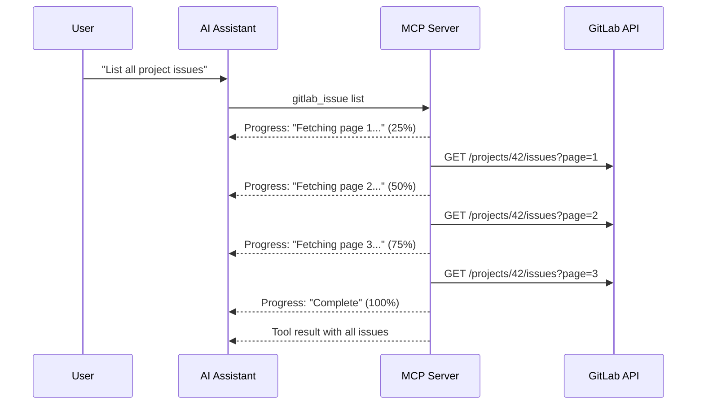

GitLab MCP Server sends real-time progress notifications during long-running operations, allowing MCP clients to display progress indicators to the user.

## How it works

When a tool performs multiple steps or processes large datasets, the server sends `notifications/progress` messages to the client:



## Use cases

Progress reporting is used for operations that may take several seconds:

| Operation                    | Progress Detail                             |
| ---------------------------- | ------------------------------------------- |
| **Paginated list retrieval** | Page-by-page fetch progress                 |
| **Bulk operations**          | Per-item progress (e.g., bulk issue update) |
| **Sampling analysis**        | Data collection → LLM analysis phases       |
| **CSV import**               | Per-row import progress                     |
| **Auto-update**              | Download and apply steps                    |

## Client display

How progress is displayed depends on the MCP client:

- **VS Code / Copilot** — Progress indicator in the status bar or output panel
- **Claude Desktop** — Progress text shown during tool execution
- **Claude Code** — Real-time terminal progress updates

## Progress message format

Progress notifications follow the MCP protocol format:

```json
{
	"jsonrpc": "2.0",
	"method": "notifications/progress",
	"params": {
		"progressToken": "tool-call-123",
		"progress": 50,
		"total": 100,
		"message": "Fetching page 2 of 4..."
	}
}
```

| Field           | Description                                               |
| --------------- | --------------------------------------------------------- |
| `progressToken` | Correlation ID linking progress to the original tool call |
| `progress`      | Current step number                                       |
| `total`         | Total number of steps (when known)                        |
| `message`       | Human-readable description of the current step            |

:::note
Progress notifications are best-effort. If the MCP client does not support progress display, notifications are silently ignored and the tool still completes normally.
:::
