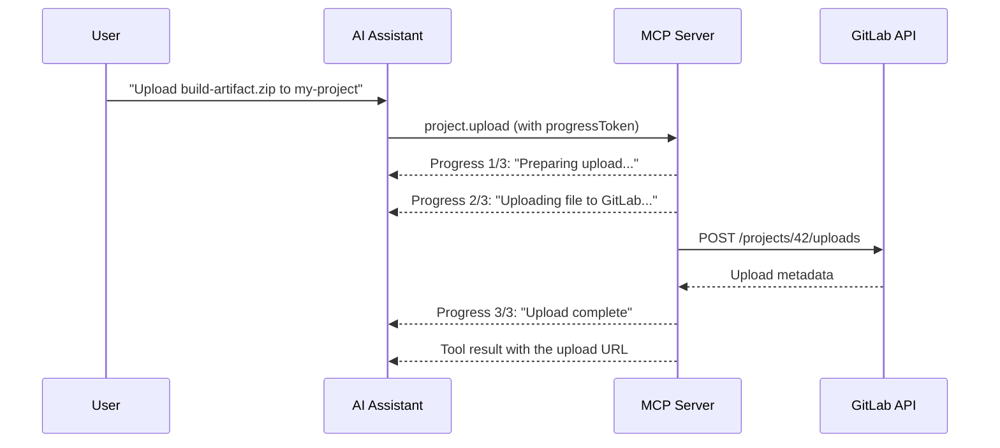

import FAQ from "../../../components/FAQ.astro";

GitLab MCP Server sends **real-time progress notifications during long-running operations**, so MCP clients can display progress indicators to the user instead of an opaque wait. When a tool spans multiple steps, streams a large payload or polls GitLab, the server emits `notifications/progress` messages that report how far along the work is.

Progress is **best-effort**: it enhances the user experience but is never required for correctness. Clients that cannot display progress silently ignore the notifications, and the tool still returns its full result normally.

## How does progress reporting work?

When a tool performs multiple steps, streams a large payload or polls GitLab, the server sends `notifications/progress` messages to the client as the work advances. The client supplies a progress token with the tool call; each message carries that token, so the client can attach the update to the right request and render a progress indicator while the final result is still being assembled. A call without a token gets no notifications and behaves identically otherwise.


```mermaid
sequenceDiagram
    participant U as User
    participant AI as AI Assistant
    participant S as MCP Server
    participant GL as GitLab API

    U->>AI: "Upload build-artifact.zip to my-project"
    AI->>S: project.upload (with progressToken)
    S-->>AI: Progress 1/3: "Preparing upload..."
    S-->>AI: Progress 2/3: "Uploading file to GitLab..."
    S->>GL: POST /projects/42/uploads
    GL-->>S: Upload metadata
    S-->>AI: Progress 3/3: "Upload complete"
    S-->>AI: Tool result with the upload URL
```

## When does the server send progress updates?

Progress reporting is used for operations that may take several seconds. In each case the notification describes what the server is currently doing, so the user sees motion rather than a stalled call. Simple single-request tools such as `branch.list` complete too quickly to report anything.

| Operation               | Progress Detail                                                                 |
| ----------------------- | ------------------------------------------------------------------------------- |
| **File upload**         | Three steps for `project.upload`: prepare, stream to GitLab, complete           |
| **Package publishing**  | Byte-counted while the package file streams to the registry                     |
| **Wait actions**        | Each poll of `pipeline.wait` and `job.wait` until the pipeline or job settles   |
| **Interactive wizards** | One step per prompt in the four `gitlab_interactive_*` flows, then the creation |

## How do clients display progress?

How progress is displayed depends on the MCP client; the server emits the same notifications regardless, and each client renders them in its own UI:

- **VS Code / Copilot** — Progress indicator in the status bar or output panel
- **Claude Desktop** — Progress text shown during tool execution
- **Claude Code** — Real-time terminal progress updates

## What does a progress notification contain?

Progress notifications follow the MCP protocol's JSON-RPC format. The `params` object carries four fields that together let a client render a progress bar or status line.

```json
{
  "jsonrpc": "2.0",
  "method": "notifications/progress",
  "params": {
    "progressToken": "tool-call-123",
    "progress": 1,
    "total": 3,
    "message": "Uploading file to GitLab..."
  }
}
```

| Field           | Description                                                                                               |
| --------------- | --------------------------------------------------------------------------------------------------------- |
| `progressToken` | Correlation ID linking progress to the original tool call, supplied by the client                         |
| `progress`      | Progress so far; step-based tools count from 0 (step 1 of 3 sends `0`), and the value only ever increases |
| `total`         | Total amount of work (when known)                                                                         |
| `message`       | Human-readable description of the current step                                                            |

:::note
Progress notifications are best-effort. If the MCP client does not support progress display, notifications are silently ignored and the tool still completes normally.
:::

<FAQ />

## Source reference

:::note[Developer Documentation]
This page is the user-facing overview. For the full progress reference, see [docs/reference/capabilities/progress](https://github.com/jmrplens/gitlab-mcp-server/blob/main/docs/reference/capabilities/progress.md).
:::
