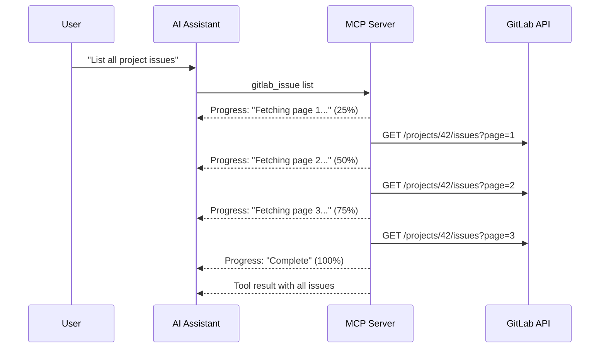

:::note[Developer Documentation]
This page is the user-facing overview. For the full progress reference, see [docs/reference/capabilities/progress](https://github.com/jmrplens/gitlab-mcp-server/blob/main/docs/reference/capabilities/progress.md).
:::

GitLab MCP Server sends **real-time progress notifications during long-running operations**, so MCP clients can display progress indicators to the user instead of an opaque wait. When a tool spans multiple steps or processes large datasets, the server emits `notifications/progress` messages that report how far along the work is.

Progress is **best-effort**: it enhances the user experience but is never required for correctness. Clients that cannot display progress silently ignore the notifications, and the tool still returns its full result normally.

## How does progress reporting work?

When a tool performs multiple steps or processes large datasets, the server sends `notifications/progress` messages to the client as the work advances. Each message is correlated to the original tool call, so the client can attach the update to the right request and render a progress indicator while the final result is still being assembled.


```mermaid
sequenceDiagram
    participant U as User
    participant AI as AI Assistant
    participant S as MCP Server
    participant GL as GitLab API

    U->>AI: "List all project issues"
    AI->>S: gitlab_issue list
    S-->>AI: Progress: "Fetching page 1..." (25%)
    S->>GL: GET /projects/42/issues?page=1
    S-->>AI: Progress: "Fetching page 2..." (50%)
    S->>GL: GET /projects/42/issues?page=2
    S-->>AI: Progress: "Fetching page 3..." (75%)
    S->>GL: GET /projects/42/issues?page=3
    S-->>AI: Progress: "Complete" (100%)
    S-->>AI: Tool result with all issues
```

## When does the server send progress updates?

Progress reporting is used for operations that may take several seconds. In each case the notification describes what the server is currently doing, so the user sees motion rather than a stalled call.

| Operation                    | Progress Detail                             |
| ---------------------------- | ------------------------------------------- |
| **Paginated list retrieval** | Page-by-page fetch progress                 |
| **Bulk operations**          | Per-item progress (e.g., bulk issue update) |
| **CSV import**               | Per-row import progress                     |
| **Auto-update**              | Download and apply steps                    |

## How do clients display progress?

How progress is displayed depends on the MCP client; the server emits the same notifications regardless, and each client renders them in its own UI:

- **VS Code / Copilot** — Progress indicator in the status bar or output panel
- **Claude Desktop** — Progress text shown during tool execution
- **Claude Code** — Real-time terminal progress updates

## What does a progress notification contain?

Progress notifications follow the MCP protocol's JSON-RPC format. The `params` object carries four fields that together let a client render a progress bar or status line.

```json
{
	"jsonrpc": "2.0",
	"method": "notifications/progress",
	"params": {
		"progressToken": "tool-call-123",
		"progress": 50,
		"total": 100,
		"message": "Fetching page 2 of 4..."
	}
}
```

| Field           | Description                                               |
| --------------- | --------------------------------------------------------- |
| `progressToken` | Correlation ID linking progress to the original tool call |
| `progress`      | Current step number                                       |
| `total`         | Total number of steps (when known)                        |
| `message`       | Human-readable description of the current step            |

:::note
Progress notifications are best-effort. If the MCP client does not support progress display, notifications are silently ignored and the tool still completes normally.
:::

## Frequently asked questions

### What are MCP progress notifications?

Progress notifications are **real-time status messages** that GitLab MCP Server sends during long-running operations so MCP clients can show progress to the user. When a tool runs multiple steps or processes large datasets — paginated retrieval, bulk operations, CSV imports, or auto-update — the server emits `notifications/progress` messages reporting the current step, the total when known, and a human-readable description. Progress is best-effort, so clients that cannot display it ignore the messages and the tool still completes.

### When does GitLab MCP Server send progress updates?

GitLab MCP Server sends progress updates for operations that may take several seconds: **paginated list retrieval** (page-by-page fetch progress), **bulk operations** (per-item progress, such as a bulk issue update), **CSV imports** (per-row progress), and **auto-update** (download and apply steps). Each notification carries a `progressToken` correlating it to the original tool call.

### What does a progress notification contain?

A progress notification follows the JSON-RPC `notifications/progress` format and carries four fields in its `params`: `progressToken` (a correlation ID linking the update to the original tool call), `progress` (the current step number), `total` (the total number of steps, when known), and `message` (a human-readable description such as `"Fetching page 2 of 4..."`). Clients use these to render progress bars or status text.

### What happens if my client does not support progress notifications?

Progress notifications are best-effort. If the MCP client does not support progress display, the notifications are silently ignored and the tool still completes normally with its full result. No configuration is needed and no functionality is lost — progress is purely a user-experience enhancement on top of the normal tool response.
