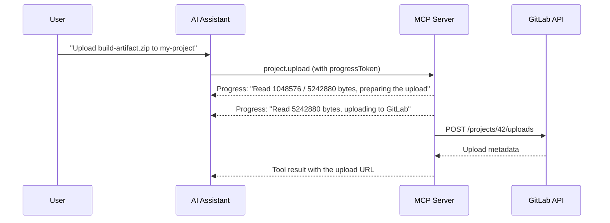

import FAQ from "../../../components/FAQ.astro";

GitLab MCP Server sends **real-time progress notifications during long-running operations**, so MCP clients can display progress indicators to the user instead of an opaque wait. When a tool spans multiple steps, streams a large payload or polls GitLab, the server emits `notifications/progress` messages that report how far along the work is.

Progress is **best-effort**: it enhances the user experience but is never required for correctness. Clients that cannot display progress silently ignore the notifications, and the tool still returns its full result normally.

## How does progress reporting work?

When a tool performs multiple steps, streams a large payload or polls GitLab, the server sends `notifications/progress` messages to the client as the work advances. The client supplies a progress token with the tool call; each message carries that token, so the client can attach the update to the right request and render a progress indicator while the final result is still being assembled. A call without a token gets no notifications and behaves identically otherwise.


```mermaid
sequenceDiagram
    participant U as User
    participant AI as AI Assistant
    participant S as MCP Server
    participant GL as GitLab API

    U->>AI: "Upload build-artifact.zip to my-project"
    AI->>S: project.upload (with progressToken)
    S-->>AI: Progress: "Read 1048576 / 5242880 bytes, preparing the upload"
    S-->>AI: Progress: "Read 5242880 bytes, uploading to GitLab"
    S->>GL: POST /projects/42/uploads
    GL-->>S: Upload metadata
    S-->>AI: Tool result with the upload URL
```

The byte counts measure the read, not the transfer. The GitLab client assembles the whole request body in memory before it sends anything, so every frame has already fired by the time the first byte reaches the network, and the transfer itself reports nothing until it returns.

## When does the server send progress updates?

Progress reporting is used for operations that may take several seconds. In each case the notification describes what the server is currently doing, so the user sees motion rather than a stalled call. Simple single-request tools such as `branch.list` complete too quickly to report anything.

| Operation               | Progress Detail                                                                                                                                       |
| ----------------------- | ----------------------------------------------------------------------------------------------------------------------------------------------------- |
| **File upload**         | Byte-counted while `project.upload` reads the content and prepares the request                                                                        |
| **Package publishing**  | Byte-counted while `package.publish` and `package.publish_and_link` read the file; `package.publish_directory` counts across every file in one series |
| **Package download**    | Byte-counted while `package.download` writes the file to disk; the total is unknown, so it is left out                                                |
| **Wait actions**        | Each poll of `pipeline.wait` and `job.wait` until the pipeline or job settles                                                                         |
| **Transfers**           | Each read back of `project.transfer` and `group.transfer` until the move lands                                                                        |
| **Interactive wizards** | One frame per phase of the four interactive creation flows (four or five phases), then a final frame once the object exists                           |

Only tool calls report progress, on every tool surface: the action runs the same code whether it is called through `gitlab_execute_action`, a meta-tool or an individual tool. For the wait actions and the transfers the total is unknown, so `total` is left out and `progress` counts the attempts.

## Which steps do the wizards report?

Each interactive wizard reports one frame as it enters each phase, and a final frame once GitLab has created the object, so the bar reaches 100% rather than stopping one step short. A phase can hold several questions: the issue wizard asks for the title and the description during its first phase. The wizards are the actions `interactive.issue_create`, `interactive.mr_create`, `interactive.release_create` and `interactive.project_create`, registered as the `gitlab_interactive_*` tools on the meta and individual surfaces.

| Wizard                       | Phases | Messages, in order                                                                                                                                                                      |
| ---------------------------- | :----: | --------------------------------------------------------------------------------------------------------------------------------------------------------------------------------------- |
| `interactive.issue_create`   |   4    | `Collecting issue details...`, `Collecting optional fields...`, `Confirming issue creation...`, `Creating issue...`, then `Issue created`                                               |
| `interactive.mr_create`      |   5    | `Collecting branch information...`, `Collecting MR details...`, `Collecting optional fields...`, `Confirming MR creation...`, `Creating merge request...`, then `Merge request created` |
| `interactive.release_create` |   4    | `Collecting release details...`, `Collecting release description...`, `Confirming release creation...`, `Creating release...`, then `Release created`                                   |
| `interactive.project_create` |   4    | `Collecting project details...`, `Collecting project settings...`, `Confirming project creation...`, `Creating project...`, then `Project created`                                      |

A phase reports `progress` one below its number (the first phase of four sends `0` with `total` 4), and the final frame sends `progress` equal to `total`. A wizard the user cancels, or one that fails, stops where it is and sends no final frame.

## How is progress configured?

There is no setting that turns progress on. It is active for any tool call that carries a progress token (`_meta.progressToken` in the `tools/call` request), and inactive for one that does not, where every progress update is skipped at no cost. Within one call the `progress` value only ever increases: an update that would not increase it is dropped. A call that is cancelled stops reporting at once.

Where the frames travel depends on the transport:

| Transport                                            | Where progress travels                                                                                          |
| ---------------------------------------------------- | --------------------------------------------------------------------------------------------------------------- |
| stdio                                                | On the same pipe, while the call runs                                                                           |
| HTTP, SSE responses (the default)                    | In the `text/event-stream` response of the POST that carries the call, stateless or not                         |
| HTTP with `--json-response`, stateless (the default) | Nowhere: progress is dropped. Tools still work and return their results; they report nothing while they run     |
| HTTP with `--json-response` and `--stateless=false`  | Only to a client holding its standalone `GET` stream open, out of band on that stream rather than with its call |

**`--json-response` turns progress off in a stateless deployment**, and in a stateful one for any client that holds no stream open. A JSON response body carries one response and no other frames, so a notification raised while a call is running has nowhere to travel in it: it goes to the standalone SSE stream, which a stateless deployment never opens because it answers `GET` with `405`. The server warns once at startup when the flag is set. See [Stateless mode](/gitlab-mcp-server/operations/http-server/#stateless-mode) for the transport itself.

## Security

- **Opaque tokens.** A progress token is a value the client chooses. The server sends it back as it came, never logs it above debug level, and never includes it in an error message.
- **No impact on the call.** A progress notification that fails to send is logged at debug level and ignored: the tool continues and returns its result regardless.
- **Inactive means silent.** A call without a token, or without a session to send on, makes every progress update a no-op, so no code path depends on progress being delivered.
- **Nothing new in the messages.** A message describes the work in what the call was already given or already read: byte counts, a file name, a pipeline or job ID with its attempt number, the namespace a project is moving to. It never carries a credential or file contents.

## How do clients display progress?

How progress is displayed depends on the MCP client; the server emits the same notifications regardless, and each client renders them in its own UI:

- **VS Code / Copilot** — Progress indicator in the status bar or output panel
- **Claude Desktop** — Progress text shown during tool execution
- **Claude Code** — Real-time terminal progress updates

## What does a progress notification contain?

Progress notifications follow the MCP protocol's JSON-RPC format. The `params` object carries four fields that together let a client render a progress bar or status line.

```json
{
  "jsonrpc": "2.0",
  "method": "notifications/progress",
  "params": {
    "progressToken": "tool-call-123",
    "progress": 1048576,
    "total": 5242880,
    "message": "Read 1048576 / 5242880 bytes, preparing the upload"
  }
}
```

| Field           | Description                                                                                               |
| --------------- | --------------------------------------------------------------------------------------------------------- |
| `progressToken` | Correlation ID linking progress to the original tool call, supplied by the client                         |
| `progress`      | Progress so far; step-based tools count from 0 (step 1 of 3 sends `0`), and the value only ever increases |
| `total`         | Total amount of work (when known)                                                                         |
| `message`       | Human-readable description of the current step                                                            |

### Example frames

The issue wizard, called with the progress token `wiz-1`, sends these five frames in order:

| Frame | `progress` | `total` | `message`                       |
| :---: | :--------: | :-----: | ------------------------------- |
|   1   |     0      |    4    | `Collecting issue details...`   |
|   2   |     1      |    4    | `Collecting optional fields...` |
|   3   |     2      |    4    | `Confirming issue creation...`  |
|   4   |     3      |    4    | `Creating issue...`             |
|   5   |     4      |    4    | `Issue created`                 |

A wait action knows no total, so `total` is left out and `progress` counts the polls. The third poll of `pipeline.wait` on pipeline 41557 sends:

```json
{
  "jsonrpc": "2.0",
  "method": "notifications/progress",
  "params": {
    "progressToken": "call-42",
    "progress": 3,
    "message": "Polling pipeline #41557 (attempt 3, status check)..."
  }
}
```

`job.wait` writes `Polling job #<id> (attempt <n>, status check)...` the same way. A transfer repeats one message on every read back, `Waiting for GitLab to move the project to <namespace>` or `Waiting for GitLab to move the group`, with `progress` counting the reads. An upload ends its byte count with `Read <n> bytes, uploading to GitLab`, the moment the request is handed to GitLab, and a package download reports `Downloaded <n> bytes`.

:::note
Progress notifications are best-effort. If the MCP client does not support progress display, notifications are silently ignored and the tool still completes normally.
:::

<FAQ />

## Source reference

:::note[Developer Documentation]
This page is the user-facing overview. For the full progress reference, see [docs/reference/capabilities/progress](https://github.com/jmrplens/gitlab-mcp-server/blob/main/docs/reference/capabilities/progress.md).
:::
