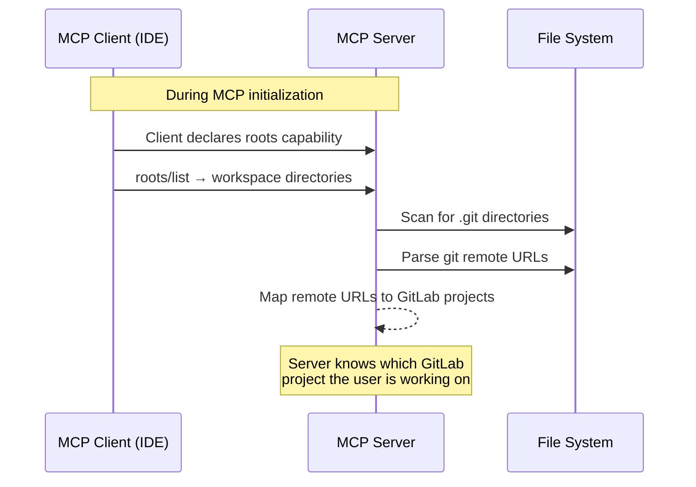

Roots allow the MCP client to share its workspace directories with the server, enabling automatic detection of the GitLab project you are working on.

## The problem

Without workspace context, every tool call requires an explicit project identifier:

```text
User: "List branches"
→ Error: project_id required
User: "List branches in project my-group/my-project"
→ Returns branches
```

With roots, the server can figure out the project automatically from your local git repository.

## How it works



### Project resolution

The server resolves GitLab projects from workspace roots through these steps:

1. **Receive roots** — The client sends its workspace directory paths
2. **Git detection** — The server looks for `.git` directories in the workspace
3. **Remote parsing** — Git remote URLs are parsed (supports HTTPS and SSH formats)
4. **GitLab matching** — Remote URLs are matched against the configured `GITLAB_URL` to identify the project

Supported remote URL formats:

| Format | Example                                        |
| ------ | ---------------------------------------------- |
| HTTPS  | `https://gitlab.example.com/group/project.git` |
| SSH    | `git@gitlab.example.com:group/project.git`     |

### Project discovery tool

The `gitlab_resolve_project_from_remote` tool exposes this resolution capability explicitly. It takes a git remote URL and returns the corresponding GitLab project details, enabling the AI assistant to resolve project context on demand.

## Automatic context enrichment

When roots are available, the server provides workspace context through the `gitlab://workspace/roots` resource. This allows AI assistants to understand the user's current project context and make more informed tool calls.

## Requirements

Roots require the MCP client to declare the `roots` capability during initialization. Most modern MCP clients support this:

- **VS Code / Copilot** — sends workspace folder paths
- **Claude Desktop** — sends configured project directories
- **Claude Code** — sends current working directory
