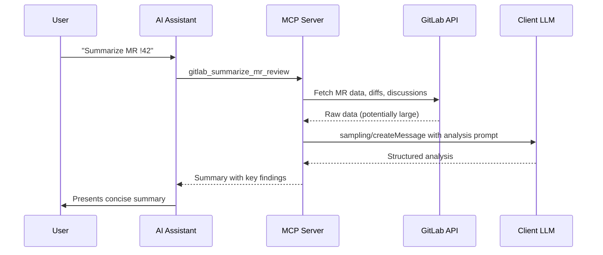

Sampling allows the server to ask the MCP client's LLM to analyze GitLab data — like getting a summary of a 50-comment merge request or diagnosing why a pipeline failed, without reading through hundreds of log lines.

## How it works

Instead of returning raw data for the AI to process, the server collects GitLab data, sends it to the client's LLM via the `sampling/createMessage` protocol method, and returns the analysis result.

### The four phases

1. **Data collection** — Server fetches relevant data from GitLab APIs
2. **Prompt construction** — Data is formatted with a task-specific analysis prompt
3. **LLM analysis** — The prompt is sent to the client's LLM via sampling
4. **Result delivery** — The analysis is returned as the tool result

## Analysis tools

11 sampling-powered tools are available:

### Code review

| Tool                         | Description                                                            |
| ---------------------------- | ---------------------------------------------------------------------- |
| `gitlab_analyze_mr_changes`  | Analyze merge request code changes for quality, bugs, and improvements |
| `gitlab_review_mr_security`  | Security-focused review of merge request changes                       |
| `gitlab_summarize_mr_review` | Summarize merge request discussions and review feedback                |

### Issue analysis

| Tool                         | Description                                                  |
| ---------------------------- | ------------------------------------------------------------ |
| `gitlab_summarize_issue`     | Concise summary of an issue with full context and discussion |
| `gitlab_analyze_issue_scope` | Estimate complexity and scope of an issue                    |

### CI/CD analysis

| Tool                                | Description                                             |
| ----------------------------------- | ------------------------------------------------------- |
| `gitlab_analyze_pipeline_failure`   | Diagnose why a pipeline failed with root cause analysis |
| `gitlab_analyze_ci_configuration`   | Review `.gitlab-ci.yml` for best practices and issues   |
| `gitlab_analyze_deployment_history` | Analyze deployment patterns and reliability             |

### Project health

| Tool                               | Description                                       |
| ---------------------------------- | ------------------------------------------------- |
| `gitlab_generate_release_notes`    | Auto-generate release notes from milestone issues |
| `gitlab_generate_milestone_report` | Sprint/milestone progress report with metrics     |
| `gitlab_find_technical_debt`       | Identify technical debt indicators in the project |

## Security: Credential stripping

Before sending any data to the LLM, the server strips sensitive credentials using regex pattern matching:

| Pattern         | Examples                                        |
| --------------- | ----------------------------------------------- |
| GitLab tokens   | `glpat-*`, `gloas-*`, `gldt-*`                  |
| AWS credentials | `AKIA*`, AWS secret keys                        |
| Slack tokens    | `xoxb-*`, `xoxp-*`                              |
| JWTs            | `eyJ*` (JSON Web Tokens)                        |
| Generic secrets | Private keys, API keys matching common patterns |

All matched patterns are replaced with `[REDACTED]` before the data reaches the LLM.

### Additional security layers

| Layer                           | Protection                                               |
| ------------------------------- | -------------------------------------------------------- |
| **Credential stripping**        | Regex-based removal of tokens, keys, and secrets         |
| **Prompt injection prevention** | System prompt instructs LLM to ignore injection attempts |
| **Size limiting**               | Input data is truncated to prevent context overflow      |
| **Hardened system prompt**      | Analysis-focused instructions that resist misuse         |

## Requirements

Sampling requires the MCP client to support the `sampling` capability. During initialization, the server checks for client support:

- **Supported**: Claude Desktop, Claude Code
- **Not yet supported**: VS Code Copilot, Cursor

When sampling is not available, the server returns a helpful message explaining that the tool requires a client with sampling support, and suggests using the underlying data-fetching tools directly.
