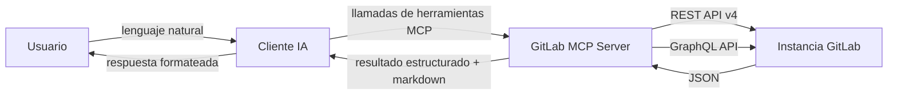
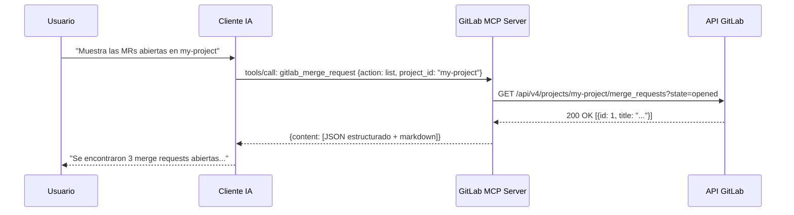
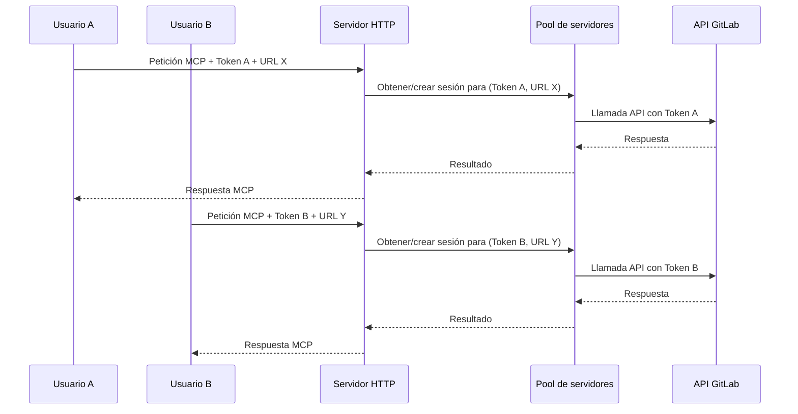
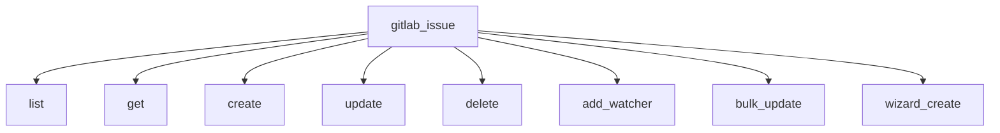

:::note[Documentación para desarrolladores]
Para la referencia técnica completa, consulta [`docs/architecture.md`](https://github.com/jmrplens/gitlab-mcp-server/blob/main/docs/architecture.md) en el repositorio.
:::

GitLab MCP Server se sitúa entre tu cliente de IA y tu instancia de GitLab, traduciendo solicitudes en lenguaje natural a llamadas a la API de GitLab mediante el [Model Context Protocol](https://modelcontextprotocol.io/).

## Visión general



El servidor es un binario estático único que:

1. **Recibe** llamadas de herramientas MCP desde el cliente de IA (p. ej., "listar merge requests abiertas")
2. **Traduce** las llamadas en peticiones a la API REST v4 o GraphQL de GitLab con la autenticación adecuada
3. **Ejecuta** las llamadas a la API contra tu instancia de GitLab
4. **Devuelve** los resultados en formato dual: JSON estructurado para que la IA razone sobre ellos, y Markdown formateado para mostrárselo al usuario

## Modos de transporte

El servidor admite dos modos de transporte según tus necesidades de despliegue.

### Modo stdio (predeterminado)

El modo estándar para configuraciones de un solo usuario. El cliente de IA inicia el servidor como proceso hijo y se comunica a través de stdin/stdout usando JSON-RPC.



**Características:**

- Un proceso de servidor por sesión de cliente IA
- Token configurado mediante variable de entorno
- Máxima seguridad — el token nunca sale de la máquina local
- Sin exposición de red

### Modo HTTP (multiusuario)

Para despliegues en equipo donde una única instancia del servidor atiende a múltiples usuarios. Cada usuario se autentica con su propio token de GitLab.



**Características:**

- Un único proceso de servidor atiende a múltiples usuarios
- Aislamiento de sesión por token+URL mediante pool LRU
- Límites de sesión y tiempos de espera configurables
- Adecuado para despliegues de equipo/organización

Inicia el modo HTTP con:

```bash
./gitlab-mcp-server --http --http-addr=0.0.0.0:8080 --gitlab-url=https://gitlab.example.com
# O sin --gitlab-url (los clientes envían la cabecera GITLAB-URL por solicitud)
./gitlab-mcp-server --http --http-addr=0.0.0.0:8080
```

Consulta [Modo servidor HTTP](/gitlab-mcp-server/operations/http-server/) para la configuración detallada.

## Arquitectura de herramientas

### Modo meta-herramientas (predeterminado)

Con `META_TOOLS=true` (predeterminado), el servidor expone **32 meta-herramientas por dominio** (47 con enterprise) en lugar de más de 1000 herramientas individuales. Cada meta-herramienta agrupa operaciones relacionadas:



La IA envía un parámetro `action` para seleccionar la operación:

```json
{
	"tool": "gitlab_issue",
	"arguments": {
		"action": "create",
		"project_id": "my-org/backend",
		"title": "Fix N+1 query in /users",
		"labels": "bug,performance"
	}
}
```

Esto reduce el uso de tokens y mejora la precisión de selección de herramientas por la IA en comparación con exponer cada operación como una herramienta separada.

### Modo de herramientas individuales

Con `META_TOOLS=false`, se exponen todas las más de 1000 herramientas individuales (p. ej., `gitlab_list_issues`, `gitlab_create_issue`). Esto puede ser útil para pruebas pero no se recomienda para producción.

## Componentes opcionales

El servidor incluye varias capacidades opcionales que pueden habilitarse o deshabilitarse:

### Herramientas de análisis (MCP sampling)

11 herramientas de análisis basadas en IA que usan MCP sampling para invocar el modelo de IA del cliente para razonamiento:

- **Diagnóstico de fallos en pipelines** — analiza los jobs fallidos y sugiere correcciones
- **Revisión de seguridad de MRs** — comprueba los cambios de las merge requests en busca de problemas de seguridad
- **Detección de deuda técnica** — identifica preocupaciones de calidad de código
- **Informes de milestones** — genera resúmenes de progreso
- **Análisis del historial de despliegues** — revisa patrones de despliegue

Estas requieren que el cliente de IA soporte la capacidad de MCP sampling.

### Elicitación (asistentes interactivos)

Flujos de creación interactivos que recopilan la entrada del usuario paso a paso:

- **Asistente de creación de proyectos** — configuración guiada de proyectos
- **Asistente de creación de issues** — creación estructurada de issues
- **Asistente de merge requests** — creación asistida de MRs

Requiere que el cliente de IA soporte la capacidad de MCP elicitation.

### Recursos

44 recursos MCP de solo lectura que proporcionan datos contextuales:

- Configuración y versión del servidor
- Perfil del usuario actual
- Plantillas de información de proyectos
- Capacidades de la instancia de GitLab

### Prompts

38 plantillas de prompts predefinidas para flujos de trabajo comunes:

- Informes de salud del proyecto
- Análisis entre proyectos
- Resúmenes de actividad del equipo
- Generación de notas de release
- Informes de auditoría y cumplimiento

## Formato de salida de las herramientas

Cada herramienta devuelve una respuesta en formato dual:

```json
{
	"structuredContent": {
		"type": "gitlab_issue",
		"data": { "id": 42, "title": "Fix N+1 query", "state": "opened" },
		"next_steps": [
			"Ver detalles del issue",
			"Añadir etiquetas",
			"Asignar a usuario"
		]
	},
	"content": [
		{
			"type": "text",
			"text": "## Issue #42: Fix N+1 query\n\n**Estado:** abierto\n**Autor:** @alice\n..."
		}
	]
}
```

- **`structuredContent`** — JSON tipado para que la IA lo analice y razone sobre él, incluye sugerencias de `next_steps`
- **`content`** — Markdown formateado para la visualización humana

Este formato dual asegura que la IA pueda tomar decisiones de seguimiento mientras presenta una salida limpia al usuario.

## Modelo de seguridad

- **Sin almacenamiento de tokens en el servidor** — En modo stdio, el token existe solo en el entorno del proceso
- **Aislamiento por sesión** — En modo HTTP, la sesión de cada usuario está aislada en el pool del servidor
- **Modo solo lectura** — Desactiva todas las escrituras con `GITLAB_READ_ONLY=true`
- **TLS por defecto** — Todas las llamadas a la API de GitLab usan HTTPS (con opción de omitir para certificados autofirmados)
- **Sin persistencia de datos** — El servidor no tiene estado; no se almacenan datos entre peticiones
