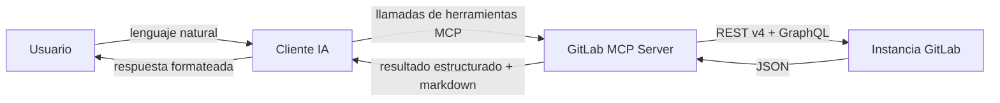
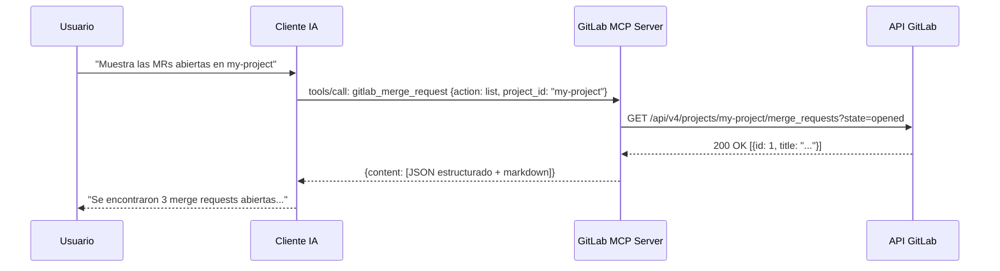
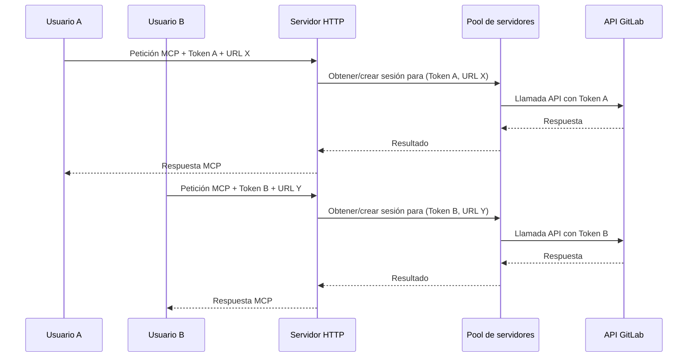
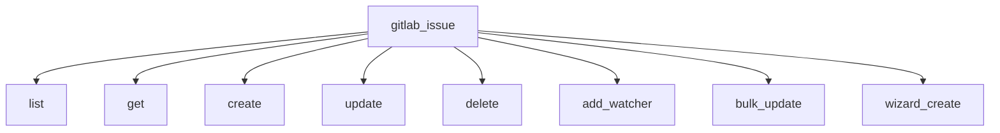
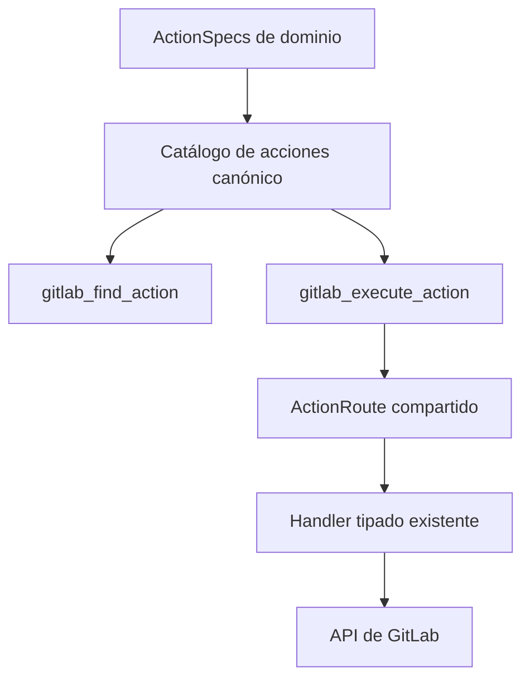

import stats from "../../../data/stats.json";

:::note[Documentación para desarrolladores]
Para la referencia técnica completa, consulta [`docs/architecture.md`](https://github.com/jmrplens/gitlab-mcp-server/blob/main/docs/concepts/architecture.md) en el repositorio.
:::

GitLab MCP Server se sitúa entre tu cliente de IA y tu instancia de GitLab, traduciendo solicitudes en lenguaje natural a llamadas a la API de GitLab mediante el [Model Context Protocol](https://modelcontextprotocol.io/).

## Visión general


```mermaid
graph LR
    U[Usuario] -->|lenguaje natural| AI[Cliente IA]
    AI -->|llamadas de herramientas MCP| S[GitLab MCP Server]
    S -->|REST v4 + GraphQL| G[Instancia GitLab]
    G -->|JSON| S
    S -->|resultado estructurado + markdown| AI
    AI -->|respuesta formateada| U
```

El servidor es un binario estático único que:

1. **Recibe** llamadas de herramientas MCP desde el cliente de IA (p. ej., "listar merge requests abiertas")
2. **Traduce** las llamadas en peticiones a la API REST v4 o GraphQL de GitLab con la autenticación adecuada
3. **Ejecuta** las llamadas a la API contra tu instancia de GitLab
4. **Devuelve** los resultados en formato dual: JSON estructurado para que la IA razone sobre ellos, y Markdown formateado para mostrárselo al usuario

## Modos de transporte

GitLab MCP Server admite dos modos de transporte — stdio y HTTP — y eliges entre ellos según si un solo usuario o varios comparten el servidor. stdio es el predeterminado para un único usuario en una máquina local; HTTP atiende a todo un equipo desde un único proceso con aislamiento de sesión por usuario.

### Modo stdio (predeterminado)

El modo estándar para configuraciones de un solo usuario. El cliente de IA inicia el servidor como proceso hijo y se comunica a través de stdin/stdout usando JSON-RPC.


```mermaid
sequenceDiagram
    participant Usuario
    participant IA as Cliente IA
    participant MCP as GitLab MCP Server
    participant GL as API GitLab

    Usuario->>IA: "Muestra las MRs abiertas en my-project"
    IA->>MCP: tools/call: gitlab_merge_request {action: list, project_id: "my-project"}
    MCP->>GL: GET /api/v4/projects/my-project/merge_requests?state=opened
    GL-->>MCP: 200 OK [{id: 1, title: "..."}]
    MCP-->>IA: {content: [JSON estructurado + markdown]}
    IA-->>Usuario: "Se encontraron 3 merge requests abiertas..."
```

**Características:**

- Un proceso de servidor por sesión de cliente IA
- Token configurado mediante variable de entorno
- Máxima seguridad — el token nunca sale de la máquina local
- Sin exposición de red

### Modo HTTP (multiusuario)

Para despliegues en equipo donde una única instancia del servidor atiende a múltiples usuarios. Cada usuario se autentica con su propio token de GitLab.


```mermaid
sequenceDiagram
    participant U1 as Usuario A
    participant U2 as Usuario B
    participant S as Servidor HTTP
    participant P as Pool de servidores
    participant GL as API GitLab

    U1->>S: Petición MCP + Token A + URL X
    S->>P: Obtener/crear sesión para (Token A, URL X)
    P->>GL: Llamada API con Token A
    GL-->>P: Respuesta
    P-->>S: Resultado
    S-->>U1: Respuesta MCP

    U2->>S: Petición MCP + Token B + URL Y
    S->>P: Obtener/crear sesión para (Token B, URL Y)
    P->>GL: Llamada API con Token B
    GL-->>P: Respuesta
    P-->>S: Resultado
    S-->>U2: Respuesta MCP
```

**Características:**

- Un único proceso de servidor atiende a múltiples usuarios
- Aislamiento de sesión por token+URL mediante pool LRU
- Límites de sesión y tiempos de espera configurables
- Adecuado para despliegues de equipo/organización

Inicia el modo HTTP con:

```bash
./gitlab-mcp-server --http --http-addr=0.0.0.0:8080 --gitlab-url=https://gitlab.com
# O sin --gitlab-url (los clientes envían la cabecera GITLAB-URL por solicitud)
./gitlab-mcp-server --http --http-addr=0.0.0.0:8080
```

Consulta [Modo servidor HTTP](/gitlab-mcp-server/es/operations/http-server/) para la configuración detallada.

## Arquitectura de herramientas

GitLab MCP Server define cada operación de GitLab una sola vez y la presenta a través de tres superficies de herramientas intercambiables. Un único catálogo canónico de acciones es la fuente de verdad, y las meta-herramientas, las herramientas individuales y las herramientas dinámicas de búsqueda y ejecución son todas proyecciones de él — de modo que el comportamiento y la seguridad permanecen idénticos sin importar qué superficie use un cliente.

### Catálogo de acciones canónico

Cada operación ordinaria de GitLab se define una sola vez en el catálogo de acciones canónico. Las superficies visibles de herramientas son proyecciones de ese catálogo:

- **Meta-herramientas** agrupan acciones relacionadas detrás de herramientas de dominio como `gitlab_issue`.
- **Herramientas individuales** proyectan una herramienta MCP visible por acción para compatibilidad y pruebas.
- **Herramientas dinámicas** buscan y ejecutan las mismas entradas del catálogo con una lista visible mucho más pequeña.

Como todas las superficies comparten la misma entrada del catálogo, los schemas, el filtrado de solo lectura, las confirmaciones de acciones destructivas, las previsualizaciones de safe mode, el filtrado por scopes, el formato Markdown y la salida JSON se mantienen consistentes entre modos.

### Modo meta-herramientas

Con `TOOL_SURFACE=meta`, el servidor expone una base de **{stats.meta.base} meta-herramientas por dominio** en lugar del catálogo individual. Los entornos Enterprise/Premium autoalojados añaden herramientas Enterprise/Premium para un total de {stats.meta.self_managed_enterprise}, y GitLab.com Enterprise/Premium con Orbit (la funcionalidad Knowledge Graph de GitLab.com) añade una herramienta más para un total de {stats.meta.gitlab_com}. Cada meta-herramienta agrupa operaciones relacionadas:


```mermaid
graph TD
    A[gitlab_issue] --> B[list]
    A --> C[get]
    A --> D[create]
    A --> E[update]
    A --> F[delete]
    A --> G[add_watcher]
    A --> H[bulk_update]
    A --> I[wizard_create]
```

La IA envía un parámetro `action` para seleccionar la operación:

```json
{
	"tool": "gitlab_issue",
	"arguments": {
		"action": "create",
		"project_id": "my-org/backend",
		"title": "Fix N+1 query in /users",
		"labels": "bug,performance"
	}
}
```

Esto reduce el uso de tokens y mejora la precisión de selección de herramientas por la IA en comparación con exponer cada operación como una herramienta separada.

### Modo de herramientas individuales

Con `TOOL_SURFACE=individual`, se exponen todas las herramientas individuales (p. ej., `gitlab_list_issues`, `gitlab_create_issue`): {stats.tools.ultimate_self_managed} en Enterprise/Premium autoalojado, o {stats.tools.gitlab_com} en GitLab.com Enterprise/Premium con Orbit. Esto puede ser útil para pruebas pero no se recomienda para producción.

### Conjunto de herramientas dinámico

Con `TOOL_SURFACE=dynamic`, el servidor expone solo `gitlab_find_action` y `gitlab_execute_action`. El mismo catálogo de acciones canónico sigue disponible y se comparte con las meta-herramientas, así que el modo dinámico cambia el descubrimiento, no el comportamiento de GitLab.


```mermaid
flowchart TD
    specs[ActionSpecs de dominio] --> catalog[Catálogo de acciones canónico]
    catalog --> find[gitlab_find_action]
    catalog --> execute[gitlab_execute_action]
    execute --> route[ActionRoute compartido]
    route --> handler[Handler tipado existente]
    handler --> gitlab[API de GitLab]
```

El modo dinámico es la superficie predeterminada de bajo consumo de tokens y está documentado en [Conjunto de herramientas dinámico](/gitlab-mcp-server/es/tools/dynamic-tools/). Las meta-herramientas siguen disponibles con `TOOL_SURFACE=meta`.

## Componentes opcionales

El servidor incluye varias capacidades opcionales que pueden habilitarse o deshabilitarse:

### Elicitación (asistentes interactivos)

Flujos de creación interactivos que recopilan la entrada del usuario paso a paso:

- **Asistente de creación de proyectos** — configuración guiada de proyectos
- **Asistente de creación de issues** — creación estructurada de issues
- **Asistente de merge requests** — creación asistida de MRs

Requiere que el cliente de IA soporte la capacidad de MCP elicitation.

### Recursos

{stats.resources} recursos MCP de solo lectura que proporcionan datos contextuales:

- Configuración y versión del servidor
- Perfil del usuario actual
- Plantillas de información de proyectos
- Capacidades de la instancia de GitLab

### Prompts

{stats.prompts} plantillas de prompts predefinidas para flujos de trabajo comunes:

- Informes de salud del proyecto
- Análisis entre proyectos
- Resúmenes de actividad del equipo
- Generación de notas de release
- Comprobaciones de calidad del flujo Git
- Informes de auditoría y cumplimiento

## Formato de salida de las herramientas

Las llamadas exitosas a herramientas devuelven una respuesta en formato dual:

```json
{
	"structuredContent": {
		"type": "gitlab_issue",
		"data": { "id": 42, "title": "Fix N+1 query", "state": "opened" },
		"next_steps": [
			"Ver detalles del issue",
			"Añadir etiquetas",
			"Asignar a usuario"
		]
	},
	"content": [
		{
			"type": "text",
			"text": "## Issue #42: Fix N+1 query\n\n**Estado:** abierto\n**Autor:** @alice\n..."
		}
	]
}
```

- **`structuredContent`** — JSON tipado para que la IA lo analice y razone sobre él, incluye sugerencias de `next_steps` y cumple el schema de salida declarado cuando existe
- **`content`** — Markdown formateado para la visualización humana

Este formato dual asegura que la IA pueda tomar decisiones de seguimiento mientras presenta una salida limpia al usuario. Los errores de ejecución usan `isError: true` y pueden devolver solo Markdown para que los clientes no interpreten el error como un resultado estructurado exitoso.

## Modelo de seguridad

- **Sin almacenamiento de tokens en el servidor** — En modo stdio, el token existe solo en el entorno del proceso
- **Aislamiento por sesión** — En modo HTTP, la sesión de cada usuario está aislada en el pool del servidor
- **Modo solo lectura** — Desactiva todas las escrituras con `GITLAB_READ_ONLY=true`
- **TLS por defecto** — Todas las llamadas a la API de GitLab usan HTTPS (con opción de omitir para certificados autofirmados)
- **Sin persistencia de datos** — El servidor no tiene estado; no se almacenan datos entre peticiones

## Preguntas frecuentes

### ¿Qué hace GitLab MCP Server?

GitLab MCP Server es un binario estático único que se sitúa entre un cliente de IA y una instancia de GitLab. Recibe llamadas de herramientas MCP, las traduce en peticiones autenticadas a la API REST v4 o GraphQL de GitLab, las ejecuta y devuelve una respuesta en formato dual: JSON estructurado para que la IA razone y Markdown formateado para el usuario. El servidor no añade funcionalidades propias de GitLab — expone las operaciones de GitLab existentes como herramientas MCP a través del [Model Context Protocol](https://modelcontextprotocol.io/).

### ¿Cuál es la diferencia entre los modos de transporte stdio y HTTP?

El modo stdio es el predeterminado para configuraciones de un solo usuario: el cliente de IA inicia el servidor como proceso hijo y se comunica por stdin/stdout usando JSON-RPC, con el token suministrado como variable de entorno que nunca sale de la máquina local. El modo HTTP atiende a múltiples usuarios desde un único proceso, aislando la sesión de cada usuario por token y URL en un pool LRU con límites de sesión y tiempos de espera configurables. Ambos modos exponen las mismas herramientas y llaman a las mismas APIs de GitLab; solo se diferencian en cómo se conecta el cliente de IA.

### ¿Qué es el catálogo de acciones canónico?

El catálogo de acciones canónico es la única definición interna de cada operación ordinaria de GitLab. Las tres superficies visibles de herramientas — meta-herramientas, herramientas individuales y las herramientas dinámicas de búsqueda y ejecución — son proyecciones de este catálogo, por lo que comparten los mismos esquemas, filtrado de solo lectura, confirmaciones de acciones destructivas, vistas previas de modo seguro, filtrado por scopes y formato Markdown. Las entradas del catálogo son conscientes del tier: cada acción se etiqueta con la edición de GitLab más baja (`free`, `premium` o `ultimate`) que la expone, y las acciones solo de premium o ultimate se podan cuando el tier resuelto es inferior.

### ¿Cómo mantiene GitLab MCP Server seguro mi token de GitLab?

GitLab MCP Server nunca almacena tokens en el servidor. En modo stdio el token existe solo en el entorno del proceso y nunca sale de la máquina local. En modo HTTP la sesión de cada usuario está aislada en el pool del servidor por token y URL. Todas las llamadas a la API de GitLab usan HTTPS por defecto, con la opción de omitirlo para certificados autofirmados, y el servidor no tiene estado — no se almacenan datos entre peticiones. El modo solo lectura (`GITLAB_READ_ONLY=true`) desactiva toda operación de escritura.
