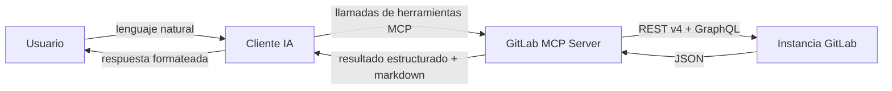
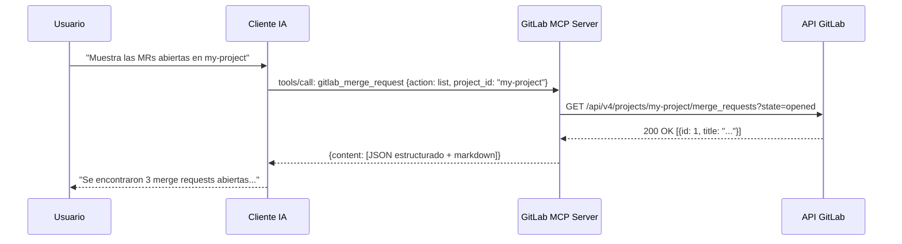
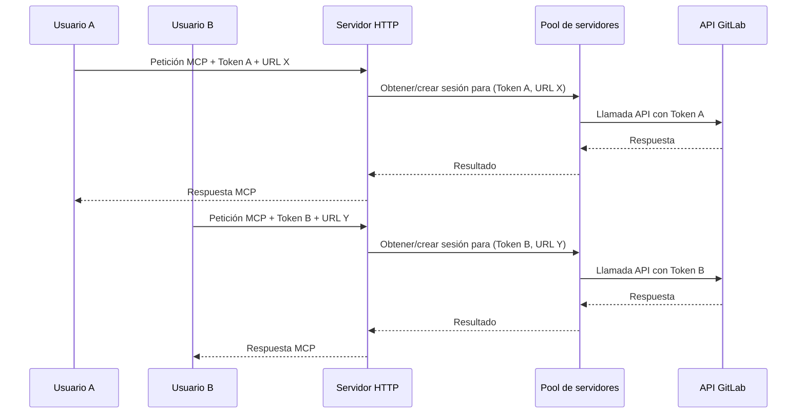
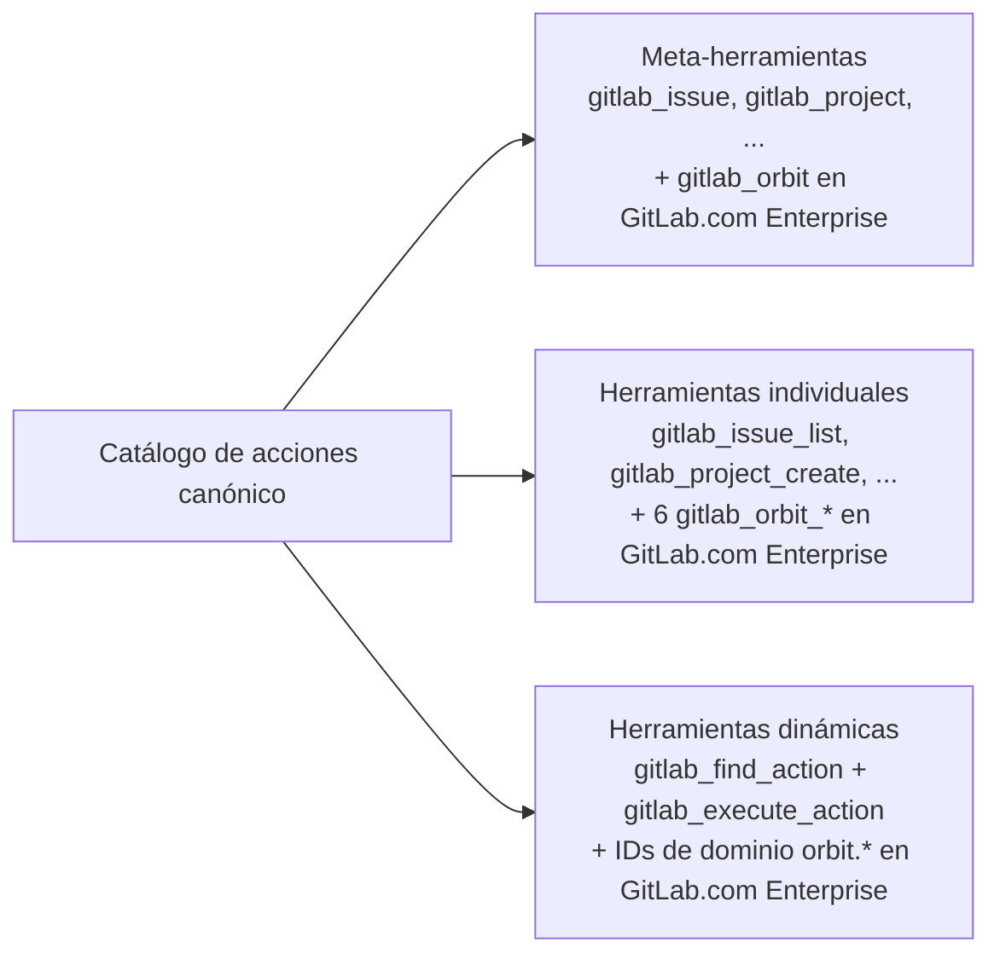
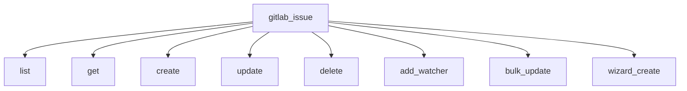
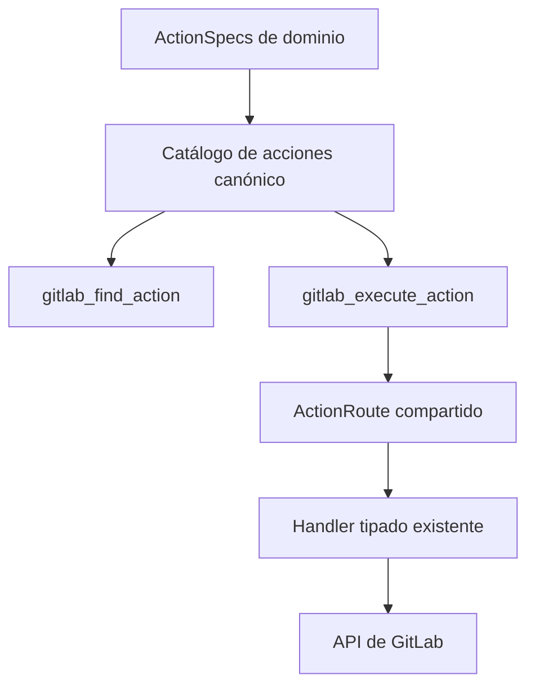

import stats from "../../../data/stats.json";
import FAQ from "../../../components/FAQ.astro";
import footprint from "../../../data/token-footprint.json";

GitLab MCP Server se sitúa entre tu cliente de IA y tu instancia de GitLab, traduciendo solicitudes en lenguaje natural a llamadas a la API de GitLab mediante el [Model Context Protocol](https://modelcontextprotocol.io/).

## Visión general


```mermaid
graph LR
    U[Usuario] -->|lenguaje natural| AI[Cliente IA]
    AI -->|llamadas de herramientas MCP| S[GitLab MCP Server]
    S -->|REST v4 + GraphQL| G[Instancia GitLab]
    G -->|JSON| S
    S -->|resultado estructurado + markdown| AI
    AI -->|respuesta formateada| U
```

El servidor es un binario estático único que:

1. **Recibe** llamadas de herramientas MCP desde el cliente de IA (p. ej., "listar merge requests abiertas")
2. **Traduce** las llamadas en peticiones a la API REST v4 o GraphQL de GitLab con la autenticación adecuada
3. **Ejecuta** las llamadas a la API contra tu instancia de GitLab
4. **Devuelve** los resultados en formato dual: JSON estructurado para que la IA razone sobre ellos, y Markdown formateado para mostrárselo al usuario

## Modos de transporte

GitLab MCP Server admite dos modos de transporte — stdio y HTTP — y eliges entre ellos según si un solo usuario o varios comparten el servidor. stdio es el predeterminado para un único usuario en una máquina local; HTTP atiende a todo un equipo desde un único proceso con aislamiento de sesión por usuario.

### Modo stdio (predeterminado)

El modo estándar para configuraciones de un solo usuario. El cliente de IA inicia el servidor como proceso hijo y se comunica a través de stdin/stdout usando JSON-RPC.


```mermaid
sequenceDiagram
    participant Usuario
    participant IA as Cliente IA
    participant MCP as GitLab MCP Server
    participant GL as API GitLab

    Usuario->>IA: "Muestra las MRs abiertas en my-project"
    IA->>MCP: tools/call: gitlab_merge_request {action: list, project_id: "my-project"}
    MCP->>GL: GET /api/v4/projects/my-project/merge_requests?state=opened
    GL-->>MCP: 200 OK [{id: 1, title: "..."}]
    MCP-->>IA: {content: [JSON estructurado + markdown]}
    IA-->>Usuario: "Se encontraron 3 merge requests abiertas..."
```

**Características:**

- Un proceso de servidor por sesión de cliente IA
- Token configurado mediante variable de entorno
- Máxima seguridad — el token nunca sale de la máquina local
- Sin exposición de red

### Modo HTTP (multiusuario)

Para despliegues en equipo donde una única instancia del servidor atiende a múltiples usuarios. Cada usuario se autentica con su propio token de GitLab.


```mermaid
sequenceDiagram
    participant U1 as Usuario A
    participant U2 as Usuario B
    participant S as Servidor HTTP
    participant P as Pool de servidores
    participant GL as API GitLab

    U1->>S: Petición MCP + Token A + URL X
    S->>P: Obtener/crear sesión para (Token A, URL X)
    P->>GL: Llamada API con Token A
    GL-->>P: Respuesta
    P-->>S: Resultado
    S-->>U1: Respuesta MCP

    U2->>S: Petición MCP + Token B + URL Y
    S->>P: Obtener/crear sesión para (Token B, URL Y)
    P->>GL: Llamada API con Token B
    GL-->>P: Respuesta
    P-->>S: Resultado
    S-->>U2: Respuesta MCP
```

**Características:**

- Un único proceso de servidor atiende a múltiples usuarios
- Aislamiento de sesión por token+URL mediante pool LRU
- Límites de sesión y tiempos de espera configurables
- Adecuado para despliegues de equipo/organización

Inicia el modo HTTP con:

```bash
./gitlab-mcp-server --http --http-addr=0.0.0.0:8080 --gitlab-url=https://gitlab.com
# O sin --gitlab-url (los clientes envían la cabecera GITLAB-URL por solicitud)
./gitlab-mcp-server --http --http-addr=0.0.0.0:8080
```

Consulta [Modo servidor HTTP](/gitlab-mcp-server/es/operations/http-server/) para la configuración detallada.

## Arquitectura de herramientas

GitLab MCP Server define cada operación de GitLab una sola vez y la presenta a través de tres superficies de herramientas intercambiables. Un único catálogo canónico de acciones es la fuente de verdad, y las meta-herramientas, las herramientas individuales y las herramientas dinámicas de búsqueda y ejecución son todas proyecciones de él — de modo que el comportamiento y la seguridad permanecen idénticos sin importar qué superficie use un cliente.

### Catálogo de acciones canónico

Cada operación ordinaria de GitLab se define una sola vez en el catálogo de acciones canónico. Las superficies visibles de herramientas son proyecciones de ese catálogo:

- **Meta-herramientas** agrupan acciones relacionadas detrás de herramientas de dominio como `gitlab_issue`.
- **Herramientas individuales** proyectan una herramienta MCP visible por acción para compatibilidad y pruebas.
- **Herramientas dinámicas** buscan y ejecutan las mismas entradas del catálogo con una lista visible mucho más pequeña.

Como todas las superficies comparten la misma entrada del catálogo, los schemas, el filtrado de solo lectura, las confirmaciones de acciones destructivas, las previsualizaciones de safe mode, el filtrado por scopes, el formato Markdown y la salida JSON se mantienen consistentes entre modos.

### Gating por nivel (tier)

Las entradas del catálogo también son conscientes del nivel: cada acción y cada schema de entrada/salida se etiqueta con la edición de GitLab más baja (`free`, `premium` o `ultimate`) que la expone. Al arrancar, el servidor resuelve el nivel activo (`GITLAB_TIER` / `--tier`, o autodetección vía `GET /license`) y llama a `pruneSchemaFieldsByTier` (en `internal/tools/action_catalog.go`) para descartar las acciones exclusivas de premium/ultimate y podar las entradas de schema por campo que estén restringidas por edición. Esto mantiene coherentes las meta-herramientas, las herramientas individuales y la superficie dinámica: una acción exclusiva de Premium se oculta en todas partes en cuanto el nivel se resuelve a `free`.


```mermaid
graph LR
    catalog[Catálogo de acciones canónico] --> meta["Meta-herramientas<br/>gitlab_issue, gitlab_project, ...<br/>+ gitlab_orbit en GitLab.com Enterprise"]
    catalog --> individual["Herramientas individuales<br/>gitlab_issue_list, gitlab_project_create, ...<br/>+ 6 gitlab_orbit_* en GitLab.com Enterprise"]
    catalog --> dynamic["Herramientas dinámicas<br/>gitlab_find_action + gitlab_execute_action<br/>+ IDs de dominio orbit.* en GitLab.com Enterprise"]
```

Orbit se proyecta a través del mismo catálogo que cualquier otro dominio: en modo meta aparece como la meta-herramienta `gitlab_orbit` con seis acciones; en modo individual aparece como seis herramientas `gitlab_orbit_*`; en modo dinámico sus acciones se descubren como `orbit.status`, `orbit.schema`, `orbit.tools`, `orbit.dsl`, `orbit.query` y `orbit.graph_status` mediante `gitlab_find_action`/`gitlab_execute_action`.

### Modo meta-herramientas

Con `TOOL_SURFACE=meta`, el servidor expone una base de **{stats.meta.base} meta-herramientas por dominio** en lugar del catálogo individual. Los entornos Enterprise/Premium autoalojados añaden herramientas Enterprise/Premium para un total de {stats.meta.self_managed_enterprise}, y GitLab.com Enterprise/Premium con Orbit (la funcionalidad Knowledge Graph de GitLab.com) añade una herramienta más para un total de {stats.meta.gitlab_com}. Cada meta-herramienta agrupa operaciones relacionadas:


```mermaid
graph TD
    A[gitlab_issue] --> B[list]
    A --> C[get]
    A --> D[create]
    A --> E[update]
    A --> F[delete]
    A --> G[add_watcher]
    A --> H[bulk_update]
    A --> I[wizard_create]
```

La IA envía un parámetro `action` para seleccionar la operación:

```json
{
  "tool": "gitlab_issue",
  "arguments": {
    "action": "create",
    "project_id": "my-org/backend",
    "title": "Fix N+1 query in /users",
    "labels": "bug,performance"
  }
}
```

Esto reduce el uso de tokens y mejora la precisión de selección de herramientas por la IA en comparación con exponer cada operación como una herramienta separada.

### Modo de herramientas individuales

Con `TOOL_SURFACE=individual`, se exponen todas las herramientas individuales (p. ej., `gitlab_issue_list`, `gitlab_issue_create`): {stats.tools.ultimate_self_managed} en Enterprise/Premium autoalojado, o {stats.tools.gitlab_com} en GitLab.com Enterprise/Premium con Orbit. Esto puede ser útil para pruebas pero no se recomienda para producción.

### Conjunto de herramientas dinámico

Con `TOOL_SURFACE=dynamic`, el servidor expone solo `gitlab_find_action` y `gitlab_execute_action`. El mismo catálogo de acciones canónico sigue disponible y se comparte con las meta-herramientas, así que el modo dinámico cambia el descubrimiento, no el comportamiento de GitLab.


```mermaid
flowchart TD
    specs[ActionSpecs de dominio] --> catalog[Catálogo de acciones canónico]
    catalog --> find[gitlab_find_action]
    catalog --> execute[gitlab_execute_action]
    execute --> route[ActionRoute compartido]
    route --> handler[Handler tipado existente]
    handler --> gitlab[API de GitLab]
```

El modo dinámico es la superficie predeterminada de bajo consumo de tokens y está documentado en [Conjunto de herramientas dinámico](/gitlab-mcp-server/es/tools/dynamic-tools/). Las meta-herramientas siguen disponibles con `TOOL_SURFACE=meta`.

## Componentes opcionales

El servidor incluye varias capacidades opcionales que pueden habilitarse o deshabilitarse:

### Elicitación (asistentes interactivos)

Flujos de creación interactivos que recopilan la entrada del usuario paso a paso:

- **Asistente de creación de proyectos** — configuración guiada de proyectos
- **Asistente de creación de issues** — creación estructurada de issues
- **Asistente de merge requests** — creación asistida de MRs

Requiere que el cliente de IA soporte la capacidad de MCP elicitation.

### Recursos

{stats.resources} recursos MCP de solo lectura que proporcionan datos contextuales:

- Configuración y versión del servidor
- Perfil del usuario actual
- Plantillas de información de proyectos
- Capacidades de la instancia de GitLab

### Prompts

{stats.prompts} plantillas de prompts predefinidas para flujos de trabajo comunes:

- Informes de salud del proyecto
- Análisis entre proyectos
- Resúmenes de actividad del equipo
- Generación de notas de release
- Comprobaciones de calidad del flujo Git
- Informes de auditoría y cumplimiento

## Formato de salida de las herramientas

Las llamadas exitosas a herramientas devuelven una respuesta en formato dual:

```json
{
  "structuredContent": {
    "type": "gitlab_issue",
    "data": { "id": 42, "title": "Fix N+1 query", "state": "opened" },
    "next_steps": [
      "Ver detalles del issue",
      "Añadir etiquetas",
      "Asignar a usuario"
    ]
  },
  "content": [
    {
      "type": "text",
      "text": "## Issue #42: Fix N+1 query\n\n**Estado:** abierto\n**Autor:** @alice\n..."
    }
  ]
}
```

- **`structuredContent`** — JSON tipado para que la IA lo analice y razone sobre él, incluye sugerencias de `next_steps` y cumple el schema de salida declarado cuando existe
- **`content`** — Markdown formateado para la visualización humana

Este formato dual asegura que la IA pueda tomar decisiones de seguimiento mientras presenta una salida limpia al usuario. Los errores de ejecución usan `isError: true` y pueden devolver solo Markdown para que los clientes no interpreten el error como un resultado estructurado exitoso.

## Modelo de seguridad

- **Sin almacenamiento de tokens en el servidor** — En modo stdio, el token existe solo en el entorno del proceso
- **Aislamiento por sesión** — En modo HTTP, la sesión de cada usuario está aislada en el pool del servidor
- **Modo solo lectura** — Desactiva todas las escrituras con `GITLAB_READ_ONLY=true`
- **TLS por defecto** — Todas las llamadas a la API de GitLab usan HTTPS (con opción de omitir para certificados autofirmados)
- **Sin persistencia de datos** — El servidor no tiene estado; no se almacenan datos entre peticiones

<FAQ />

## Decisiones de diseño

La arquitectura anterior es el resultado de unas pocas decisiones registradas. Cada Architectural Decision Record expone el problema, las alternativas descartadas y las consecuencias aceptadas a cambio — útil cuando quieres saber _por qué_ el servidor tiene esta forma y no solo cómo funciona.

| Decisión                                                                                                                                                          | Qué resolvió                                                                               | Contrapartida aceptada                                                                                                                          |
| ----------------------------------------------------------------------------------------------------------------------------------------------------------------- | ------------------------------------------------------------------------------------------ | ----------------------------------------------------------------------------------------------------------------------------------------------- |
| [ADR-0004](https://github.com/jmrplens/gitlab-mcp-server/blob/main/docs/development/adr/adr-0004-modular-tools-subpackages.md) — subpaquetes modulares            | Un paquete Go por dominio de GitLab bajo `internal/tools/`, en lugar de un paquete único   | Más paquetes que navegar, a cambio de tests aislados y cero ciclos de importación                                                               |
| [ADR-0005](https://github.com/jmrplens/gitlab-mcp-server/blob/main/docs/development/adr/adr-0005-meta-tool-consolidation.md) — consolidación en meta-herramientas | Agrupar operaciones en despachadores de dominio que enrutan por un parámetro `action`      | Una indirección extra en la llamada, a cambio de una lista de herramientas que los clientes puedan cargar                                       |
| [ADR-0011](https://github.com/jmrplens/gitlab-mcp-server/blob/main/docs/development/adr/adr-0011-low-token-dynamic-toolset.md) — conjunto dinámico                | Hacer de find/execute la superficie predeterminada en vez de listar todas las herramientas | Una llamada de descubrimiento por tarea, a cambio de un contexto de arranque {footprint.individual.ultimate.reduction_factor_vs_dynamic}× menor |
| [ADR-0014](https://github.com/jmrplens/gitlab-mcp-server/blob/main/docs/development/adr/adr-0014-catalog-first-runtime-architecture.md) — runtime catalog-first   | Proyectar las tres superficies desde un único catálogo canónico de acciones                | Un paso de proyección en compilación, a cambio de comportamiento y seguridad idénticos entre superficies                                        |
| [ADR-0007](https://github.com/jmrplens/gitlab-mcp-server/blob/main/docs/development/adr/adr-0007-rich-error-semantics.md) — semántica de errores rica             | Devolver errores clasificados y accionables en vez de fallos crudos de la API              | Más código de manejo de errores por herramienta, a cambio de errores sobre los que un modelo puede actuar                                       |

El [índice completo de ADR](https://github.com/jmrplens/gitlab-mcp-server/blob/main/docs/development/adr/README.md) cubre el resto de decisiones, incluidas la estrategia de migración a GraphQL y el diseño de suscripciones a recursos por sondeo (ADR-0015).

## Referencias externas

- [Especificación del Model Context Protocol](https://modelcontextprotocol.io/) — el protocolo que el servidor habla con los clientes de IA
- [Especificación JSON-RPC 2.0](https://www.jsonrpc.org/specification) — el formato de transporte usado sobre stdio y HTTP
- [API REST v4 de GitLab](https://docs.gitlab.com/api/rest/) y [API GraphQL](https://docs.gitlab.com/api/graphql/) — las superficies de API de GitLab a las que el servidor traduce las llamadas
- [`modelcontextprotocol/go-sdk`](https://pkg.go.dev/github.com/modelcontextprotocol/go-sdk/mcp) — el SDK oficial de MCP en Go, que implementa el registro de herramientas, recursos y prompts y ambos transportes
- [`gitlab-org/api/client-go`](https://pkg.go.dev/gitlab.com/gitlab-org/api/client-go/v2) — el cliente Go oficial de la API de GitLab, usado en cada llamada REST; los dominios que no cubre se emiten como GraphQL en crudo
- [`tiktoken-go/tokenizer`](https://pkg.go.dev/github.com/tiktoken-go/tokenizer) — el tokenizador cl100k_base en Go puro tras las mediciones publicadas de huella de tokens

## Referencia de la fuente

:::note[Documentación para desarrolladores]
Para la referencia técnica completa, consulta [`docs/architecture.md`](https://github.com/jmrplens/gitlab-mcp-server/blob/main/docs/concepts/architecture.md) en el repositorio.
:::
