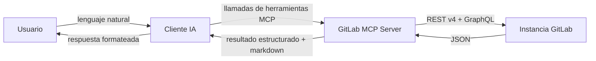
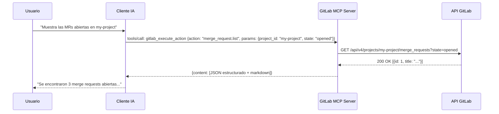
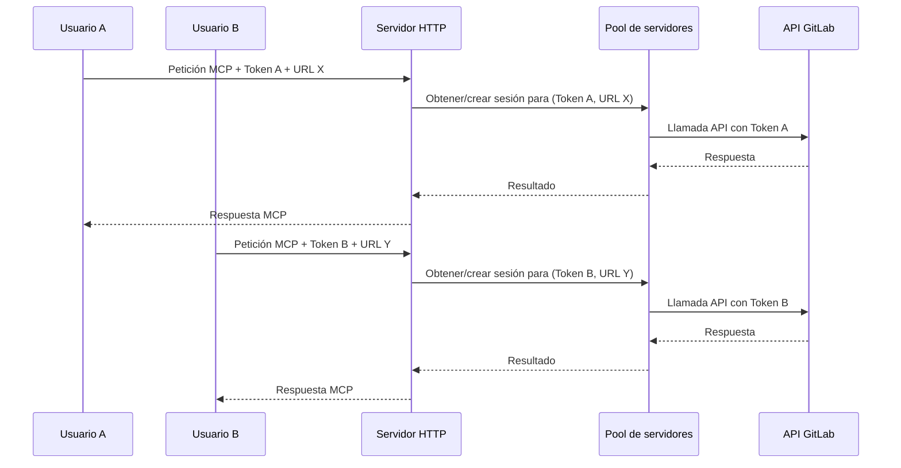
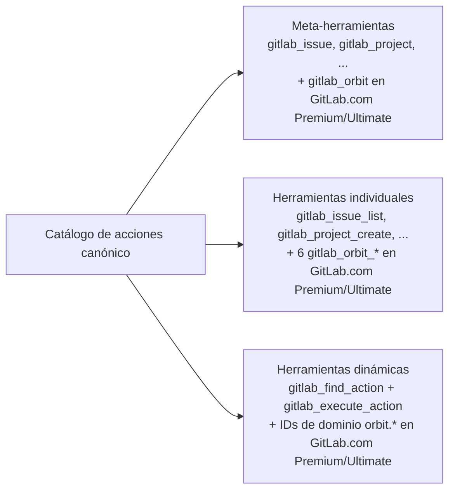
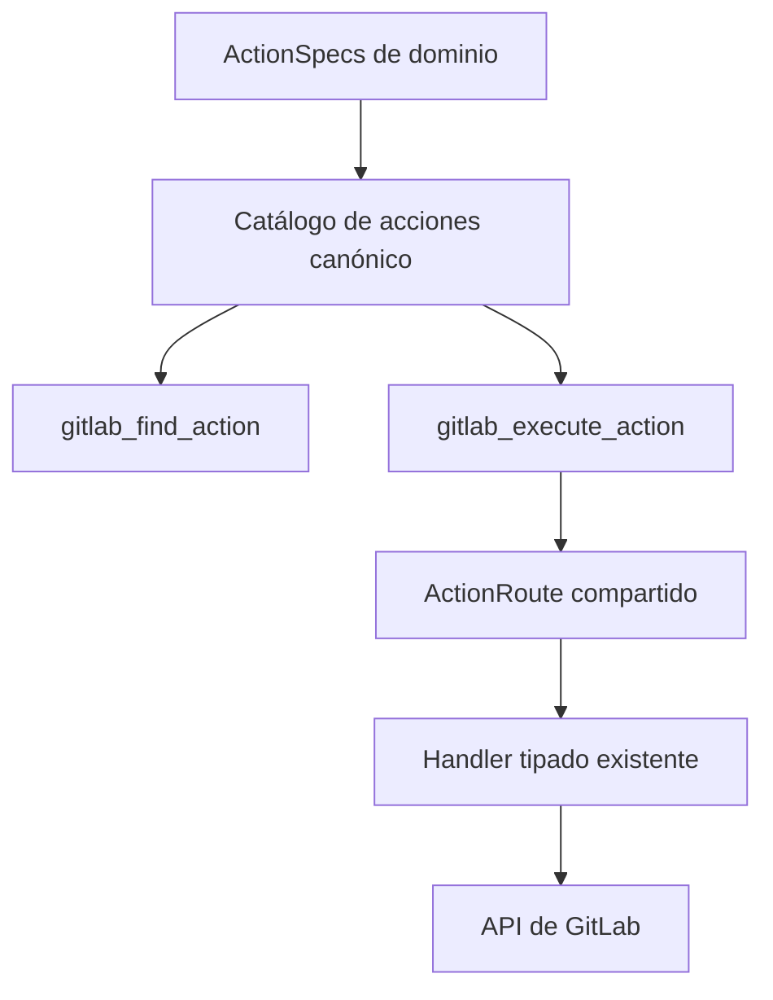
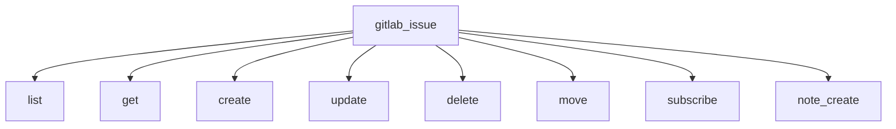

import stats from "../../../data/stats.json";
import FAQ from "../../../components/FAQ.astro";
import footprint from "../../../data/token-footprint.json";

GitLab MCP Server se sitúa entre tu cliente de IA y tu instancia de GitLab, traduciendo solicitudes en lenguaje natural a llamadas a la API de GitLab mediante el [Model Context Protocol](https://modelcontextprotocol.io/).

## Visión general


```mermaid
graph LR
    U[Usuario] -->|lenguaje natural| AI[Cliente IA]
    AI -->|llamadas de herramientas MCP| S[GitLab MCP Server]
    S -->|REST v4 + GraphQL| G[Instancia GitLab]
    G -->|JSON| S
    S -->|resultado estructurado + markdown| AI
    AI -->|respuesta formateada| U
```

El servidor es un único binario autocontenido que:

1. **Recibe** llamadas de herramientas MCP desde el cliente de IA (p. ej., "listar merge requests abiertas")
2. **Traduce** las llamadas en peticiones a la API REST v4 o GraphQL de GitLab con la autenticación adecuada: REST para la mayoría de las acciones, y [GraphQL](#graphql) donde GitLab ha declarado obsoleta la API REST, no ofrece ninguna o solo responde a la pregunta allí
3. **Ejecuta** las llamadas a la API contra tu instancia de GitLab
4. **Devuelve** cada resultado de dos formas: JSON estructurado que se ajusta al schema de salida de la herramienta, y Markdown escrito para que el modelo lo lea y te lo transmita

## Modos de transporte

GitLab MCP Server admite dos modos de transporte, stdio y HTTP, y eliges entre ellos según si un solo usuario o varios comparten el servidor. stdio es el predeterminado para un único usuario en una máquina local; HTTP atiende a todo un equipo desde un único proceso, con cada credencial aislada en su propia entrada del pool. La [referencia de la CLI](/gitlab-mcp-server/es/reference/cli/) indica qué flags lee cada transporte, y la [referencia de variables de entorno](/gitlab-mcp-server/es/reference/environment/) hace lo mismo con las variables.

### Modo stdio (predeterminado)

El modo estándar para configuraciones de un solo usuario. El cliente de IA inicia el servidor como proceso hijo y se comunica a través de stdin/stdout usando JSON-RPC.


```mermaid
sequenceDiagram
    participant Usuario
    participant IA as Cliente IA
    participant MCP as GitLab MCP Server
    participant GL as API GitLab

    Usuario->>IA: "Muestra las MRs abiertas en my-project"
    IA->>MCP: tools/call: gitlab_execute_action {action: "merge_request.list", params: {project_id: "my-project", state: "opened"}}
    MCP->>GL: GET /api/v4/projects/my-project/merge_requests?state=opened
    GL-->>MCP: 200 OK [{id: 1, title: "..."}]
    MCP-->>IA: {content: [JSON estructurado + markdown]}
    IA-->>Usuario: "Se encontraron 3 merge requests abiertas..."
```

La llamada anterior corresponde a la superficie dinámica predeterminada; con `GITLAB_MCP_TOOL_SURFACE=meta` la misma petición es `gitlab_merge_request` con `{action: "list", params: {...}}`.

**Características:**

- Un proceso de servidor por sesión de cliente IA
- Token configurado mediante variable de entorno, con `read_api` como mínimo, o `api` para escribir ([Scopes del token](/gitlab-mcp-server/es/operations/security/#scopes-del-token))
- Máxima seguridad: el token nunca sale de la máquina local
- Sin exposición de red

#### Qué ocurre al arrancar

Un cliente stdio escribe `initialize` en cuanto ha arrancado el proceso, así que el servidor responde primero al saludo y construye su catálogo detrás:

1. Carga su configuración y empieza a leer stdin. `initialize` y `ping` se responden al instante, y las notificaciones pasan directamente.
2. Mientras tanto pregunta a GitLab por su versión, averigua qué es el token (sus scopes, y si es un token de grano fino), resuelve el usuario y el nivel, y registra el catálogo de la superficie activa.
3. Hasta que termina el registro, toda petición que necesita el catálogo (`tools/list`, `tools/call`, los métodos de recursos y de prompts, `completion/complete`) espera detrás de una compuerta de disponibilidad en lugar de responderse desde un catálogo vacío. Una petición que termina mientras espera se responde con el código JSON-RPC `-32000` y un mensaje para que se reintente.

Dos arranques terminan de otra forma. Un token que GitLab acepta pero que no lleva ni `read_api` ni `api` no alcanza ninguna herramienta: el proceso sigue respondiendo al saludo y rechaza toda petición del catálogo con el código JSON-RPC `-40300`, cuyo mensaje indica reiniciar el servidor con un token que tenga `read_api`, o `api` para escribir. Un GitLab al que no se puede llegar al arrancar no detiene el servidor: registra un aviso, arranca en modo degradado y vuelve a conectar cuando una llamada necesita GitLab.

### Modo HTTP (multiusuario)

Para despliegues en equipo donde una única instancia del servidor atiende a múltiples usuarios. Cada usuario se autentica con su propio token de GitLab.


```mermaid
sequenceDiagram
    participant U1 as Usuario A
    participant U2 as Usuario B
    participant S as Servidor HTTP
    participant P as Pool de servidores
    participant GL as API GitLab

    U1->>S: Petición MCP + Token A + URL X
    S->>P: Obtener/crear sesión para (Token A, URL X)
    P->>GL: Llamada API con Token A
    GL-->>P: Respuesta
    P-->>S: Resultado
    S-->>U1: Respuesta MCP

    U2->>S: Petición MCP + Token B + URL Y
    S->>P: Obtener/crear sesión para (Token B, URL Y)
    P->>GL: Llamada API con Token B
    GL-->>P: Respuesta
    P-->>S: Resultado
    S-->>U2: Respuesta MCP
```

**Características:**

- Un único proceso de servidor atiende a múltiples usuarios
- Aislamiento de sesión por token+URL mediante pool LRU
- Límites de sesión y tiempos de espera configurables
- Adecuado para despliegues de equipo/organización
- La primera credencial de cada configuración construye el servidor de esa configuración detrás de la misma compuerta de disponibilidad, así que una petición que llega entretanto espera al catálogo ([Ciclo de vida de la sesión](/gitlab-mcp-server/es/operations/http-server/#ciclo-de-vida-de-la-sesión))

Inicia el modo HTTP con:

```bash
./gitlab-mcp-server --http --http-addr=0.0.0.0:8080 --gitlab-url=https://gitlab.com
# O, solo para un despliegue local de un único usuario, deja que cada petición nombre su
# propia instancia en la cabecera GITLAB-URL (sin ninguno de los dos flags el servidor se niega a arrancar)
./gitlab-mcp-server --http --http-addr=127.0.0.1:8080 --allow-any-gitlab-url
```

`--gitlab-url` es obligatorio en modo HTTP salvo que se pase `--allow-any-gitlab-url`. Puede repetirse para publicar varias instancias, en cuyo caso la cabecera `GITLAB-URL` elige entre ellas y es obligatoria.

Consulta [Modo servidor HTTP](/gitlab-mcp-server/es/operations/http-server/) para la configuración detallada.

## Arquitectura de herramientas

GitLab MCP Server define cada operación de GitLab una sola vez y la presenta a través de tres superficies de herramientas intercambiables. Un único catálogo canónico de acciones es la fuente de verdad, y las meta-herramientas, las herramientas individuales y las herramientas dinámicas de búsqueda y ejecución son todas proyecciones de él — de modo que el comportamiento y la seguridad permanecen idénticos sin importar qué superficie use un cliente.

### Catálogo de acciones canónico

Cada operación ordinaria de GitLab se define una sola vez en el catálogo de acciones canónico. Las superficies visibles de herramientas son proyecciones de ese catálogo:

- **Herramientas dinámicas** (predeterminadas) buscan y ejecutan las entradas del catálogo por ID `domain.action` a través de dos herramientas visibles.
- **Meta-herramientas** (`GITLAB_MCP_TOOL_SURFACE=meta`) agrupan acciones relacionadas detrás de herramientas de dominio como `gitlab_issue`.
- **Herramientas individuales** (`GITLAB_MCP_TOOL_SURFACE=individual`) proyectan una herramienta MCP visible por acción para compatibilidad y pruebas.

Como todas las superficies comparten la misma entrada del catálogo, los schemas, la clasificación destructiva, el filtrado de solo lectura y por scopes, el modo seguro, el formato Markdown y la salida JSON se mantienen consistentes entre modos. Cómo se confirma una llamada destructiva es lo único que difiere, como explica [Acciones destructivas](#acciones-destructivas).

### Gating por nivel (tier)

Las entradas del catálogo también son conscientes del nivel: cada acción y cada schema de entrada/salida se etiqueta con la edición de GitLab más baja (`free`, `premium` o `ultimate`) que la expone. Cuando se construye un servidor (al arrancar en modo stdio, por entrada token+URL del pool en modo HTTP) se resuelve el nivel (`GITLAB_MCP_TIER` / `--tier`, o autodetección a partir de la licencia de la instancia (`GET /license`), después de los planes de los namespaces (`GET /namespaces`) y después, en GitLab.com, de los planes de los grupos de nivel superior de los que el token es miembro, con `free` como valor de respaldo), el filtro del catálogo descarta las acciones exclusivas de premium/ultimate por encima de él, y se retiran los campos de los schemas de entrada que quedan por encima de él, mientras los schemas de salida se podan con tolerancia para que los datos que lleva una respuesta sigan llegando al cliente. Esto mantiene coherentes las meta-herramientas, las herramientas individuales y la superficie dinámica: una acción exclusiva de Premium se oculta en todas partes en cuanto el nivel se resuelve a `free`.


```mermaid
graph LR
    catalog[Catálogo de acciones canónico] --> meta["Meta-herramientas<br/>gitlab_issue, gitlab_project, ...<br/>+ gitlab_orbit en GitLab.com Premium/Ultimate"]
    catalog --> individual["Herramientas individuales<br/>gitlab_issue_list, gitlab_project_create, ...<br/>+ 6 gitlab_orbit_* en GitLab.com Premium/Ultimate"]
    catalog --> dynamic["Herramientas dinámicas<br/>gitlab_find_action + gitlab_execute_action<br/>+ IDs de dominio orbit.* en GitLab.com Premium/Ultimate"]
```

Orbit se proyecta a través del mismo catálogo que cualquier otro dominio, restringido a una conexión con `https://gitlab.com` en el nivel Premium o Ultimate: en modo meta aparece como la meta-herramienta `gitlab_orbit` con seis acciones; en modo individual aparece como seis herramientas `gitlab_orbit_*`; en modo dinámico sus acciones se descubren como `orbit.status`, `orbit.schema`, `orbit.tools`, `orbit.dsl`, `orbit.query` y `orbit.graph_status` mediante `gitlab_find_action`/`gitlab_execute_action`.

### Conjunto de herramientas dinámico (predeterminado)

Por defecto (con `GITLAB_MCP_TOOL_SURFACE` sin definir, o con `GITLAB_MCP_TOOL_SURFACE=dynamic` para hacerlo explícito), el servidor expone solo `gitlab_find_action` y `gitlab_execute_action`. El mismo catálogo de acciones canónico sigue disponible y se comparte con las meta-herramientas, así que el modo dinámico cambia el descubrimiento, no el comportamiento de GitLab.


```mermaid
flowchart TD
    specs[ActionSpecs de dominio] --> catalog[Catálogo de acciones canónico]
    catalog --> find[gitlab_find_action]
    catalog --> execute[gitlab_execute_action]
    execute --> route[ActionRoute compartido]
    route --> handler[Handler tipado existente]
    handler --> gitlab[API de GitLab]
```

Al arrancar, el servidor construye el catálogo y después añade las acciones independientes, que no pertenecen a ningún dominio de GitLab: `discover_project.resolve`, que asocia una URL de remoto git con su proyecto de GitLab, y los cuatro flujos guiados `interactive.issue_create`, `interactive.mr_create`, `interactive.project_create` e `interactive.release_create`. En las superficies meta e individual esas mismas acciones son las herramientas independientes `gitlab_discover_project` y `gitlab_interactive_*`. El modo solo lectura deja fuera los flujos guiados, porque cada uno crea algo.

El modo dinámico es la superficie predeterminada de bajo consumo de tokens y está documentado en [Conjunto de herramientas dinámico](/gitlab-mcp-server/es/tools/dynamic-tools/). Las meta-herramientas siguen disponibles con `GITLAB_MCP_TOOL_SURFACE=meta`.

### Modo meta-herramientas

Con `GITLAB_MCP_TOOL_SURFACE=meta`, el servidor expone una base de **{stats.meta.base} meta-herramientas** en lugar del catálogo individual: 29 respaldadas por el catálogo (28 despachadores de dominio de GitLab más `gitlab_server`), `gitlab_discover_project` y los cuatro flujos interactivos de creación. El nivel Premium añade 6 meta-herramientas para un total de {stats.meta.premium}, Ultimate 11 más para un total de {stats.meta.self_managed_enterprise} en una instancia autoalojada, y GitLab.com añade `gitlab_orbit` (la funcionalidad Knowledge Graph de GitLab.com) tanto en Premium como en Ultimate, para un total de {stats.meta.gitlab_com} en GitLab.com Ultimate. Cada meta-herramienta agrupa operaciones relacionadas:


```mermaid
graph TD
    A[gitlab_issue] --> B[list]
    A --> C[get]
    A --> D[create]
    A --> E[update]
    A --> F[delete]
    A --> G[move]
    A --> H[subscribe]
    A --> I[note_create]
```

La IA envía un parámetro `action` para seleccionar la operación y anida los parámetros propios de la operación en `params` (las meta-herramientas solo aceptan esas dos claves en el nivel superior):

```json
{
  "tool": "gitlab_issue",
  "arguments": {
    "action": "create",
    "params": {
      "project_id": "my-org/backend",
      "title": "Fix N+1 query in /users",
      "labels": ["bug", "performance"]
    }
  }
}
```

Esto reduce el uso de tokens y mejora la precisión de selección de herramientas por la IA en comparación con exponer cada operación como una herramienta separada.

### Modo de herramientas individuales

Con `GITLAB_MCP_TOOL_SURFACE=individual`, se exponen todas las herramientas individuales (p. ej., `gitlab_issue_list`, `gitlab_issue_create`): {stats.tools.ultimate_self_managed} en Ultimate autoalojado, o {stats.tools.gitlab_com} en GitLab.com Ultimate con Orbit. Esto puede ser útil para pruebas pero no se recomienda para producción.

## Comportamiento que comparten todas las superficies

Como todas las superficies despachan a la misma entrada del catálogo, las reglas siguientes valen sea cual sea la superficie que use un cliente, con la única diferencia que señala la primera subsección.

### Acciones destructivas

Cada acción del catálogo se clasifica como destructiva o no, una sola vez, y todas las superficies leen esa clasificación. En todas las superficies, una llamada destructiva se comprueba en este orden:

1. `GITLAB_MCP_YOLO_MODE` tiene un valor verdadero (`1`, `true` o `yes`), o, si no está definida, lo tiene `AUTOPILOT`: la llamada sigue sin preguntar.
2. La llamada lleva `confirm: true` junto a los parámetros de la acción (dentro de `params` en una meta-herramienta, en el nivel superior de los argumentos en `gitlab_execute_action`): la llamada sigue.
3. El cliente admite elicitación: se pregunta al usuario, y la llamada sigue solo si lo aprueba.
4. No se cumple nada de lo anterior: la llamada se rechaza por defecto (fail-closed), nada llega a GitLab, y la respuesta pide volver a enviar la llamada con `confirm: true` solo después de que el usuario lo apruebe.

La superficie dinámica predeterminada se salta el paso 3: `gitlab_execute_action` no pregunta nada, así que una acción clasificada como destructiva se ejecuta ahí por el paso 1 o el paso 2 y, si no, se rechaza. Un usuario que rechaza la pregunta obtiene una respuesta que indica al modelo que no lo reintente y que pregunte qué quiere en su lugar. [Acciones destructivas](/gitlab-mcp-server/es/operations/security/#acciones-destructivas) explica qué acciones son destructivas, y las dos cuyos argumentos deciden, que siguen el orden anterior en todas las superficies.

### Paginación

Una acción de listado acepta `page` (desde 1) y `per_page` (20 por defecto, 100 como máximo), y su respuesta lleva un objeto `pagination`:

| Campo         | Significado                                                                                 |
| ------------- | ------------------------------------------------------------------------------------------- |
| `page`        | La página devuelta                                                                          |
| `per_page`    | Cuántos elementos caben en una página                                                       |
| `total_items` | Cuántos elementos tiene la lista completa, `0` cuando GitLab no envía total                 |
| `total_pages` | Cuántas páginas tiene la lista completa, `0` cuando GitLab no envía total                   |
| `next_page`   | La página que pedir a continuación, `0` en la última                                        |
| `prev_page`   | La página anterior a esta, `0` en la primera                                                |
| `has_more`    | `true` mientras exista una página siguiente, para que un modelo decida sin comparar números |

La búsqueda es la excepción: la API de búsqueda de GitLab no envía totales, así que allí se deducen de la página que llegó y describen lo que ha llegado, no la lista completa ([Formato de salida](/gitlab-mcp-server/es/reference/output-format/#el-json-estructurado)). Una lista que se lee por GraphQL pagina por cursor, cuando pagina ([Paginar una lista GraphQL](#paginar-una-lista-graphql)).

Los recursos de colección funcionan de otra forma, porque MCP no da a `resources/read` ninguna manera de pedir más. Un recurso de colección como `gitlab://groups` devuelve una página de hasta 100 elementos e indica si eso es todo en `_meta`, bajo la clave `io.github.jmrplens/pageInfo`: `returned`, `total` (se omite cuando GitLab no lo envió) y `complete`. Cuando `complete` vale `false`, usa la acción de listado correspondiente, que sí pagina.

### Límites de frecuencia

El modo HTTP limita cada credencial, un par de token y URL de GitLab, a 10 peticiones por segundo con 40 de margen por defecto; stdio deja el límite desactivado salvo que se defina `GITLAB_MCP_RATE_LIMIT_RPS`. Un mismo ajuste alimenta tres buckets por credencial:

- `tools/call`, `resources/read`, `resources/subscribe`, `subscriptions/listen` y `prompts/get` comparten el bucket configurado, porque cada uno es una petición a GitLab.
- `completion/complete` tiene un bucket propio con diez veces el ritmo y la ráfaga, porque un editor pide completados mientras escribes. Un completado rechazado llega vacío en lugar de como un error.
- `tools/list` tiene un bucket propio, que se rellena diez veces más despacio con la misma ráfaga, porque un listado no llega a GitLab pero gasta el procesador que comparten todos los llamantes del proceso. Antes, cada listado se cobra a un bucket que comparte todo el proceso, contado en herramientas listadas: 3000 por segundo y 48000 de margen.

`initialize`, `ping`, `resources/list` y `prompts/list` no tienen límite. [Limitar la frecuencia de invocación de herramientas](/gitlab-mcp-server/es/operations/security/#limitar-la-frecuencia-de-invocación-de-herramientas) describe los rechazos y los valores recomendados.

### Registro

El servidor escribe su registro como líneas JSON en stderr, así que en stdio stdout no lleva nada más que JSON-RPC. `GITLAB_MCP_LOG_LEVEL` (o `--log-level`) fija el nivel: `debug`, `info` (el predeterminado), `warn` o `error`, y un valor que no reconoce equivale a `info`. [Modo de depuración](/gitlab-mcp-server/es/operations/troubleshooting/#modo-de-depuración) enumera lo que añade `debug`, y [Telemetría](/gitlab-mcp-server/es/operations/telemetry/) puede exportar además el registro a un colector de OpenTelemetry. Los dos ajustes están en la [referencia de la CLI](/gitlab-mcp-server/es/reference/cli/) y en la [referencia de variables de entorno](/gitlab-mcp-server/es/reference/environment/).

## GraphQL

La mayoría de las acciones llaman a la API REST v4 de GitLab a través de `client-go`, el cliente Go del propio GitLab. Un grupo de dominios pasa por GraphQL, por una de tres razones: GitLab ha declarado obsoleta la API REST, GitLab no ofrece ninguna API REST, o la pregunta solo puede responderse en GraphQL. [ADR-0006](https://github.com/jmrplens/gitlab-mcp-server/blob/main/docs/development/adr/adr-0006-raw-graphql-for-uncovered-domains.md) y [ADR-0009](https://github.com/jmrplens/gitlab-mcp-server/blob/main/docs/development/adr/adr-0009-progressive-graphql-migration.md) recogen la decisión.

### Qué dominios usan GraphQL

| Dominio                                                   | Acciones                                                                                                                                            | Por qué GraphQL                                                                                                                                                                                                                                                                           |
| --------------------------------------------------------- | --------------------------------------------------------------------------------------------------------------------------------------------------- | ----------------------------------------------------------------------------------------------------------------------------------------------------------------------------------------------------------------------------------------------------------------------------------------- |
| Épicas                                                    | `group.epic_get`, `group.epic_create`, `group.epic_update`, `group.epic_delete`, y las acciones de notas, discusiones e issues de las épicas        | GitLab declaró obsoleta la API REST de épicas en la 17.0 y prevé eliminarla en la v5 de la API, porque las épicas ahora son work items. `group.epic_list` sigue leyendo el endpoint REST y pasa a work items con un filtro que solo ellos aceptan, y `group.epic_get_links` sigue en REST |
| Work items                                                | `issue.work_item_list` y las demás acciones de work items                                                                                           | Pasan por el servicio de work items de client-go, que está construido sobre GraphQL                                                                                                                                                                                                       |
| Vistas guardadas de work items                            | `issue.work_item_saved_view_list` y las demás acciones de vistas guardadas                                                                          | Solo GraphQL, y GitLab marca la API como experimental                                                                                                                                                                                                                                     |
| Logros                                                    | `achievement.list` y las demás acciones de logros                                                                                                   | Solo GraphQL                                                                                                                                                                                                                                                                              |
| Vulnerabilidades                                          | `vulnerability.list`, `vulnerability.get`, `vulnerability.severity_count`, `vulnerability.pipeline_security_summary` y los cuatro cambios de estado | GitLab está retirando la API REST de vulnerabilidades en favor de GraphQL, que además responde los recuentos por severidad y los resúmenes de pipeline para los que REST no tiene ruta                                                                                                    |
| Hallazgos de seguridad                                    | `security_finding.list`                                                                                                                             | GitLab está retirando la API REST de hallazgos de vulnerabilidades, y `Pipeline.securityReportFindings` la sustituye                                                                                                                                                                      |
| Atributos, categorías y perfiles de análisis de seguridad | `security_attribute.create`, `security_category.create`, `security_scan_profile.attach` y sus acciones hermanas                                     | Solo GraphQL                                                                                                                                                                                                                                                                              |
| Catálogo CI/CD                                            | `ci_catalog.list`, `ci_catalog.get`                                                                                                                 | Solo GraphQL: REST puede publicar una versión en el catálogo y no puede leer nada                                                                                                                                                                                                         |
| Reglas de rama                                            | `branch.rule_list`                                                                                                                                  | Solo GraphQL: una vista de la protección, las reglas de aprobación y las comprobaciones de estado externas de cada regla                                                                                                                                                                  |
| Reglas de rama de destino                                 | `project.target_branch_rule_list`, `project.target_branch_rule_create`, `project.target_branch_rule_delete`                                         | Solo GraphQL                                                                                                                                                                                                                                                                              |
| Emoji personalizados                                      | `custom_emoji.list`, `custom_emoji.create`, `custom_emoji.delete`                                                                                   | Solo GraphQL                                                                                                                                                                                                                                                                              |
| Estados de Terraform                                      | `admin.terraform_state_list`, `admin.terraform_state_get`                                                                                           | REST sirve el archivo de un estado, su bloqueo y sus versiones, pero ninguna lista de estados ni los detalles de un estado; las demás acciones de estados de Terraform siguen en REST                                                                                                     |

### Paginar una lista GraphQL

Una lista que se lee por GraphQL pagina por cursor en lugar de por número de página, cuando pagina: `admin.terraform_state_list`, `project.target_branch_rule_list` y `security_scan_profile.list_project_statuses` no aceptan ningún argumento de paginación y responden lo que devuelve una sola petición, que para los estados de Terraform son como mucho 100. Una lista que pagina acepta `first` (20 por defecto, 100 como máximo) y `after`, que es el `end_cursor` de la respuesta anterior. La mayoría de estas listas también recorren hacia atrás con `last` y `before`, siendo `before` el `start_cursor` de la respuesta anterior, y sus respuestas llevan `has_next_page`, `has_previous_page`, `end_cursor` y `start_cursor`. Indicar a la vez `first` y `last` se rechaza, porque GitLab rechaza la pareja.

Tres listas solo avanzan, porque GitLab rechaza `last` y `before` en su conexión: `branch.rule_list`, `group.epic_note_list` y `group.epic_discussion_list`. Solo aceptan `first` y `after`, y sus respuestas solo llevan `has_next_page` y `end_cursor`, para que a un modelo nunca se le ofrezca una página anterior que no tiene forma de pedir.

### Con qué versiones de GitLab encajan los documentos

Los documentos GraphQL que envía este servidor se comprueban contra una copia del schema de GitLab tomada de GitLab.com, que ejecuta la versión previa de la siguiente versión menor, así que esa copia va por delante de cualquier versión autoalojada:

- GitLab rechaza un documento entero que nombra un campo que no tiene, así que una acción cuyo documento lee un campo reciente falla por completo en una instancia más antigua en lugar de responder con menos. La lista, la consulta y los cuatro cambios de estado de vulnerabilidades necesitan GitLab 18.10, `security_finding.list` necesita la 18.5, y las acciones de perfiles de análisis de seguridad necesitan la 18.7.
- Un campo añadido en la versión previa pasaría esa comprobación y lo rechazaría cualquier instancia publicada, así que una tarea semanal comprueba también los documentos contra la última imagen publicada de GitLab Enterprise Edition.
- Un campo que GitLab elimina desaparece primero de GitLab.com, así que un documento puede dejar de pasar la comprobación mientras sigue funcionando en una instancia autoalojada.

### Tokens de grano fino sobre GraphQL

GraphQL juzga cada objeto de una respuesta por separado, así que un token de grano fino recibe respuestas que REST nunca da. Un objeto al que la concesión no llega vuelve como `null`, y una lista quita los elementos a los que no llega, sin error en ningún caso. Cuando GitLab declara no nula la posición denegada, el `null` sube hasta la posición más cercana que puede ser nula, así que desaparece más parte de la respuesta que la que la concesión no cubría. Una escritura a la que la concesión no llega se responde con HTTP `200`, un resultado `null` y una entrada en `errors` que nombra los permisos que necesita, que el servidor transmite como el error de la llamada. [Lo que puede significar una respuesta vacía](/gitlab-mcp-server/es/operations/fine-grained-tokens/#lo-que-puede-significar-una-respuesta-vacía) explica cómo marca el servidor esas respuestas, y [Lo que ningún token de grano fino alcanza](/gitlab-mcp-server/es/operations/fine-grained-tokens/#lo-que-ningún-token-de-grano-fino-alcanza) enumera las acciones que GitLab rechaza o vacía para cualquier token de grano fino.

## Componentes opcionales

El servidor incluye varias capacidades opcionales que pueden habilitarse o deshabilitarse:

### Elicitación (asistentes interactivos)

Flujos de creación interactivos que recopilan la entrada del usuario paso a paso:

- **Asistente de creación de proyectos** — configuración guiada de proyectos
- **Asistente de creación de issues** — creación estructurada de issues
- **Asistente de merge requests** — creación asistida de MRs
- **Asistente de creación de releases**: etiqueta, nombre y notas, y después confirmación

Requiere que el cliente de IA admita la capacidad de elicitación de MCP.

### Recursos

{stats.resources} recursos MCP de solo lectura que proporcionan datos contextuales:

- Perfil del usuario actual y grupos accesibles
- Plantillas de proyecto, grupo, issue, merge request, pipeline y repositorio
- El manifiesto `gitlab://tools`, que se adapta a la superficie activa, y los schemas por acción
- Guías de flujo de trabajo estáticas (flujo Git, higiene de MRs, revisión de código, conventional commits, diagnóstico de pipelines)

### Prompts

{stats.prompts} plantillas de prompts predefinidas para flujos de trabajo comunes:

- Informes de salud del proyecto
- Análisis entre proyectos
- Resúmenes de actividad del equipo
- Generación de notas de release
- Comprobaciones de calidad del flujo Git
- Informes de auditoría y cumplimiento

### Capacidades

Cuatro capacidades MCP acompañan a las herramientas, los recursos y los prompts. Tres se declaran cuando empieza una sesión (el autocompletado y las suscripciones las declara el servidor, y la elicitación el cliente), y el progreso se pide en cada llamada con un token de progreso ([Visión general de las capacidades](/gitlab-mcp-server/es/capabilities/overview/)). Cada una viaja en un sentido:

- **Autocompletado**: una petición que envía el cliente (`completion/complete`) para autocompletar {stats.completions} nombres de argumento, como proyectos, ramas y usuarios, con datos de GitLab en directo.
- **Progreso**: una notificación que cualquiera de las dos partes puede enviar sobre una petición que está respondiendo. Este servidor envía `notifications/progress` mientras responde a una llamada larga a una herramienta, y solo registra en el log las que envía un cliente.
- **Elicitation**: una petición que el servidor envía al cliente (`elicitation/create`) para preguntar algo al usuario, que usan los flujos guiados y las confirmaciones de acciones destructivas. En el protocolo 2026-07-28 la pregunta viaja dentro del resultado de la herramienta, y el cliente la responde enviando de nuevo la llamada.
- **Suscripciones**: el cliente se suscribe a un recurso y el servidor le avisa cuando el recurso cambia, lo que averigua sondeando GitLab (solo con `GITLAB_MCP_CAPABILITY_SURFACE=full`).

## Formato de salida de las herramientas

Una llamada exitosa a una herramienta devuelve su resultado de dos formas:

```json
{
  "structuredContent": {
    "iid": 42,
    "title": "Fix N+1 query",
    "state": "opened",
    "web_url": "https://gitlab.example.com/my-org/backend/-/issues/42",
    "next_steps": [
      "Ver detalles del issue",
      "Añadir etiquetas",
      "Asignar a usuario"
    ]
  },
  "content": [
    {
      "type": "text",
      "text": "## Issue #42: Fix N+1 query\n\n- **Estado**: abierto\n- **Autor**: @alice\n..."
    }
  ]
}
```

- **`structuredContent`**: la salida tipada del handler como JSON (los campos anteriores son un subconjunto de la salida de issue), que cumple el schema de salida de la herramienta cuando declara uno y, allí donde el tipo de salida de la acción las declara, sugerencias de `next_steps` para un cliente que solo lee el JSON.
- **`content`**: Markdown escrito para el modelo, anotado con la audiencia `assistant` y una prioridad. El modelo lo lee y lo transmite con sus propias palabras; no está pensado para mostrárselo al usuario tal cual. Un bloque de imagen es la excepción, anotado para el `user`.

Un resultado sobre **un solo** objeto es una ficha, un encabezado y filas `- **Etiqueta**: valor` como arriba, y una lista es una tabla ([`markdown-card.md`](https://github.com/jmrplens/gitlab-mcp-server/blob/main/docs/development/markdown-card.md)). Una llamada fallida usa `isError: true` y puede llevar solo Markdown, para que un cliente no tome el error por un resultado estructurado. La [referencia del formato de salida](/gitlab-mcp-server/es/reference/output-format/) cubre por completo las formas, las anotaciones y las sugerencias.

## Modelo de seguridad

- **Sin almacenamiento de tokens en el servidor**: en modo stdio, el token existe solo en el entorno del proceso
- **Aislamiento por credencial**: en modo HTTP, el cliente de GitLab, el bucket del límite de tasa y los watchers de cada credencial viven en su propia entrada del pool, mientras que el catálogo lo comparten todas las credenciales de la misma configuración
- **Admisión con el scope mínimo**: un token necesita `read_api` o `api`. A un token con `read_api` se le sirven las acciones que GitLab acepta con `read_api`, juzgadas acción por acción a partir de lo que envía cada una, y un token sin ninguno de los dos se rechaza ([Scopes del token](/gitlab-mcp-server/es/operations/security/#scopes-del-token))
- **Modo solo lectura**: desactiva todas las escrituras con `GITLAB_MCP_READ_ONLY=true`
- **TLS por defecto**: todas las llamadas a la API de GitLab usan HTTPS (con opción de omitir para certificados autofirmados)
- **Sin persistencia de datos**: no se escribe nada en disco; lo que el servidor conserva entre peticiones (las entradas del pool, las identidades OAuth en caché, los watchers) vive en memoria y termina con el proceso

<FAQ />

## Decisiones de diseño

La arquitectura anterior es el resultado de unas pocas decisiones, la mayoría registradas como Architectural Decision Records. Cada registro expone el problema, las alternativas descartadas y las consecuencias aceptadas a cambio: útil cuando quieres saber _por qué_ el servidor tiene esta forma y no solo cómo funciona. Las filas que siguen a los ADR son decisiones con las que te encuentras directamente al configurar un cliente o un despliegue.

| Decisión                                                                                                                                                                            | Qué resolvió                                                                                                                                                                                                                                                                                                                                      | Contrapartida aceptada                                                                                                                                                         |
| ----------------------------------------------------------------------------------------------------------------------------------------------------------------------------------- | ------------------------------------------------------------------------------------------------------------------------------------------------------------------------------------------------------------------------------------------------------------------------------------------------------------------------------------------------- | ------------------------------------------------------------------------------------------------------------------------------------------------------------------------------ |
| [ADR-0004](https://github.com/jmrplens/gitlab-mcp-server/blob/main/docs/development/adr/adr-0004-modular-tools-subpackages.md): subpaquetes modulares                               | Un paquete Go por dominio de GitLab bajo `internal/tools/`, en lugar de un paquete único                                                                                                                                                                                                                                                          | Más paquetes que navegar, a cambio de tests aislados y cero ciclos de importación                                                                                              |
| [ADR-0005](https://github.com/jmrplens/gitlab-mcp-server/blob/main/docs/development/adr/adr-0005-meta-tool-consolidation.md): consolidación en meta-herramientas                    | Agrupar operaciones en despachadores de dominio que enrutan por un parámetro `action`                                                                                                                                                                                                                                                             | Una indirección extra en la llamada, a cambio de una lista de herramientas que los clientes puedan cargar                                                                      |
| [ADR-0011](https://github.com/jmrplens/gitlab-mcp-server/blob/main/docs/development/adr/adr-0011-low-token-dynamic-toolset.md): conjunto dinámico                                   | Hacer de find/execute la superficie predeterminada en vez de listar todas las herramientas                                                                                                                                                                                                                                                        | Una llamada de descubrimiento por tarea, a cambio de un esquema de herramientas {footprint.individual.ultimate.reduction_factor_vs_dynamic}× menor                             |
| [ADR-0014](https://github.com/jmrplens/gitlab-mcp-server/blob/main/docs/development/adr/adr-0014-catalog-first-runtime-architecture.md): runtime catalog-first                      | Proyectar las tres superficies desde un único catálogo canónico de acciones                                                                                                                                                                                                                                                                       | Un paso de proyección en compilación, a cambio de una sola clasificación, un solo conjunto de filtros y un solo formato entre superficies                                      |
| [ADR-0007](https://github.com/jmrplens/gitlab-mcp-server/blob/main/docs/development/adr/adr-0007-rich-error-semantics.md): semántica de errores rica                                | Devolver errores clasificados y accionables en vez de fallos crudos de la API                                                                                                                                                                                                                                                                     | Más código de manejo de errores por herramienta, a cambio de errores sobre los que un modelo puede actuar                                                                      |
| [ADR-0018](https://github.com/jmrplens/gitlab-mcp-server/blob/main/docs/development/adr/adr-0018-authorization-admits-per-action-gating.md): admisión con el scope mínimo           | Admitir un token con `read_api` y servirle lo que alcanza `read_api`, de modo que las escrituras se controlan por acción y no en la entrada ([ADR-0026](https://github.com/jmrplens/gitlab-mcp-server/blob/main/docs/development/adr/adr-0026-read-api-token-served-what-gitlab-accepts.md) lo deriva acción por acción de lo que envía cada una) | Un token cuyos scopes no se pueden leer cuenta como capaz de escribir, así que un scope que falta aparece como el propio `403` de GitLab en la única llamada que lo necesitaba |
| [ADR-0020](https://github.com/jmrplens/gitlab-mcp-server/blob/main/docs/development/adr/adr-0020-one-server-per-configuration-shape.md): un servidor por configuración              | En modo HTTP, un servidor MCP por configuración, con la credencial de cada petición vinculada a él                                                                                                                                                                                                                                                | Una vinculación en cada petición y notificaciones filtradas por propietario, a cambio de una memoria que no crece al añadir credenciales                                       |
| [ADR-0024](https://github.com/jmrplens/gitlab-mcp-server/blob/main/docs/development/adr/adr-0024-fine-grained-token-authority-per-action.md): autoridad de los tokens de grano fino | Juzgar un token de grano fino acción por acción frente a los permisos que declara GitLab                                                                                                                                                                                                                                                          | Veredictos registrados a partir de una sola versión de GitLab, así que una instancia de otra versión se juzga con un comportamiento de respaldo                                |
| Anotaciones de las herramientas                                                                                                                                                     | Cada herramienta lleva `readOnlyHint` y `destructiveHint`, para que un cliente pueda aprobar las lecturas sin preguntar                                                                                                                                                                                                                           | Una meta-herramienta lleva las indicaciones más prudentes de sus acciones, así que una que contiene un borrado se marca entera como destructiva                                |
| `next_steps` en el JSON                                                                                                                                                             | Las sugerencias de siguientes pasos van en `structuredContent` además de en el Markdown, para los clientes que solo leen el JSON                                                                                                                                                                                                                  | Las mismas sugerencias viajan dos veces, a cambio de que todos los clientes las vean                                                                                           |
| Omitir la confirmación en la automatización                                                                                                                                         | `GITLAB_MCP_YOLO_MODE` (o `AUTOPILOT`) omite la confirmación de las acciones destructivas en todas las superficies, para ejecuciones desatendidas                                                                                                                                                                                                 | Todo lo que el token puede borrar se borra sin preguntar                                                                                                                       |

El [índice completo de ADR](https://github.com/jmrplens/gitlab-mcp-server/blob/main/docs/development/adr/README.md) cubre el resto de decisiones, incluidas la estrategia de migración a GraphQL y el diseño de suscripciones a recursos por sondeo (ADR-0015).

## Referencias externas

- [Especificación del Model Context Protocol](https://modelcontextprotocol.io/) — el protocolo que el servidor habla con los clientes de IA
- [Especificación JSON-RPC 2.0](https://www.jsonrpc.org/specification) — el formato de transporte usado sobre stdio y HTTP
- [API REST v4 de GitLab](https://docs.gitlab.com/api/rest/) y [API GraphQL](https://docs.gitlab.com/api/graphql/) — las superficies de API de GitLab a las que el servidor traduce las llamadas
- [`modelcontextprotocol/go-sdk`](https://pkg.go.dev/github.com/modelcontextprotocol/go-sdk/mcp): el SDK oficial de MCP en Go (el servidor se construye sobre la v1.8.0), que implementa el registro de herramientas, recursos y prompts y ambos transportes
- [`gitlab-org/api/client-go`](https://pkg.go.dev/gitlab.com/gitlab-org/api/client-go/v3): el cliente Go oficial de la API de GitLab (v3), usado en cada llamada REST y en las operaciones GraphQL que implementa, como work items y logros; los demás [dominios GraphQL](#graphql) envían sus propios documentos a través de él
- [`tiktoken-go/tokenizer`](https://pkg.go.dev/github.com/tiktoken-go/tokenizer) — el tokenizador cl100k_base en Go puro tras las mediciones publicadas de huella de tokens
