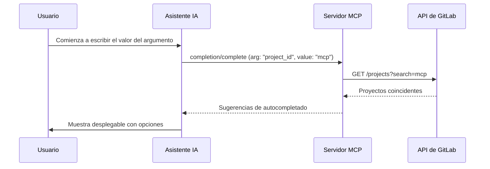

El autocompletado proporciona sugerencias en tiempo real para los parámetros de las herramientas. En lugar de memorizar IDs de proyectos, nombres de ramas o nombres de usuario, escribes unos pocos caracteres y el servidor consulta GitLab para encontrar coincidencias.

## El problema

```
Sin autocompletado:
  Usuario: "Crear issue en el proyecto..." → ¿Cuál es el ID? → Primero hay que llamar a list_projects

Con autocompletado:
  El usuario escribe: "mcp" → El servidor sugiere: "group/gitlab-mcp-server", "group/redmine-mcp-server"
```

Esto transforma una búsqueda de múltiples pasos en una **selección única e interactiva**.

## Cómo funciona



## Tipos de argumentos soportados

El servidor soporta **17 tipos de argumentos de autocompletado** organizados en completadores globales y por proyecto:

### Completadores globales

Funcionan sin contexto de proyecto:

| Argumento   | Completa                       | Ejemplo               |
| ----------- | ------------------------------ | --------------------- |
| `project`   | Nombres/rutas de proyectos     | `my-group/my-project` |
| `group`     | Nombres/rutas de grupos        | `engineering`         |
| `user`      | Nombres/logins de usuarios     | `john.doe`            |
| `namespace` | Namespaces (grupos + usuarios) | `my-group`            |

### Completadores por proyecto

Requieren un contexto de proyecto y buscan dentro de ese proyecto:

| Argumento       | Completa                    | Ejemplo           |
| --------------- | --------------------------- | ----------------- |
| `branch`        | Nombres de ramas            | `feature/login`   |
| `tag`           | Nombres de tags             | `v1.2.0`          |
| `milestone`     | Títulos de milestones       | `Sprint 14`       |
| `label`         | Nombres de etiquetas        | `priority::high`  |
| `merge_request` | Títulos/IIDs de MRs         | `!42 Fix login`   |
| `issue`         | Títulos/IIDs de issues      | `#100 Bug report` |
| `pipeline`      | IDs de pipelines            | `12345`           |
| `environment`   | Nombres de entornos         | `production`      |
| `release`       | Nombres de tags de releases | `v2.0.0`          |
| `wiki_slug`     | Slugs de páginas wiki       | `getting-started` |
| `version`       | IDs de versiones/milestones | `v1.0`            |
| `runner`        | Descripciones de runners    | `shared-runner-1` |
| `board`         | Nombres de tableros         | `Development`     |

## Cómo el autocompletado mejora la precisión de la IA

El autocompletado reduce errores de varias formas:

1. **Elimina errores tipográficos** — Los usuarios seleccionan de sugerencias validadas en lugar de escribir valores exactos
2. **Reduce viajes de ida y vuelta** — No es necesario llamar a `list_projects` antes de `create_issue`
3. **Proporciona contexto** — Las sugerencias incluyen IDs junto con nombres, asegurando valores correctos
4. **Búsqueda en tiempo real** — Los resultados se actualizan mientras el usuario escribe, potenciados por la API de búsqueda de GitLab

:::tip
El autocompletado funciona mejor cuando el cliente MCP soporta el método de protocolo `completion/complete`. Si tu cliente no soporta autocompletado, aún puedes descubrir valores usando la acción `list` en cualquier meta-herramienta.
:::
