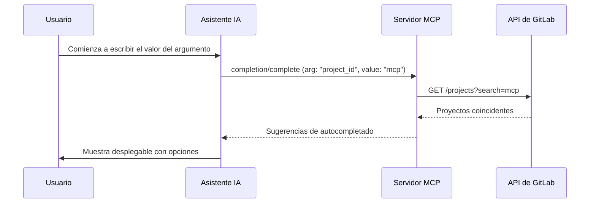

import stats from "../../../../data/stats.json";
import FAQ from "../../../../components/FAQ.astro";

El autocompletado proporciona **sugerencias de relleno en tiempo real para los parámetros de las herramientas**. En lugar de memorizar IDs de proyectos, nombres de ramas o logins de usuario, escribes unos pocos caracteres y GitLab MCP Server consulta GitLab para encontrar valores coincidentes, devolviéndolos a través del método de protocolo MCP `completion/complete`. Esto transforma una búsqueda de varios pasos en una única selección interactiva.

GitLab MCP Server admite **{stats.completions} tipos de argumentos de autocompletado**, organizados en completadores globales que funcionan en cualquier sitio y completadores por proyecto que buscan dentro de un proyecto elegido. Cada sugerencia se obtiene en directo, así que los resultados siempre reflejan el estado actual de la instancia de GitLab conectada.

## ¿Qué problema resuelve el autocompletado?

Sin autocompletado, proporcionar un identificador implica buscarlo primero — y eso suele costar una llamada adicional a una herramienta. Con autocompletado, el asistente resuelve el valor sobre la marcha a medida que el usuario escribe, de modo que ya no hace falta un paso de descubrimiento aparte.

```text
Sin autocompletado:
  Usuario: "Crear issue en el proyecto..." → ¿Cuál es el ID? → Primero hay que llamar a list_projects

Con autocompletado:
  El usuario escribe: "mcp" → El servidor sugiere: "group/gitlab-mcp-server", "group/redmine-mcp-server"
```

Esto reduce una búsqueda de múltiples pasos a una **selección única e interactiva**.

## ¿Cómo funciona el autocompletado?

Cuando el usuario empieza a escribir el valor de un argumento, el cliente MCP envía una solicitud `completion/complete` al servidor. El servidor consulta el endpoint correspondiente de GitLab y devuelve las coincidencias como sugerencias que el cliente muestra en un desplegable. Todo el ciclo ocurre mientras el usuario escribe.


```mermaid
sequenceDiagram
    participant U as Usuario
    participant AI as Asistente IA
    participant S as Servidor MCP
    participant GL as API de GitLab

    U->>AI: Comienza a escribir el valor del argumento
    AI->>S: completion/complete (arg: "project_id", value: "mcp")
    S->>GL: GET /projects?search=mcp
    GL-->>S: Proyectos coincidentes
    S-->>AI: Sugerencias de autocompletado
    AI->>U: Muestra desplegable con opciones
```

## ¿Qué tipos de argumentos admiten autocompletado?

GitLab MCP Server admite **{stats.completions} tipos de argumentos de autocompletado**, organizados en completadores globales y por proyecto. Los completadores globales resuelven valores que existen a nivel de toda la instancia, mientras que los completadores por proyecto requieren un contexto de proyecto y buscan solo dentro de ese proyecto.

### Completadores globales

Funcionan sin contexto de proyecto:

| Argumento   | Completa                       | Ejemplo               |
| ----------- | ------------------------------ | --------------------- |
| `project`   | Nombres/rutas de proyectos     | `my-group/my-project` |
| `group`     | Nombres/rutas de grupos        | `engineering`         |
| `user`      | Nombres/logins de usuarios     | `john.doe`            |
| `namespace` | Namespaces (grupos + usuarios) | `my-group`            |

### Completadores por proyecto

Requieren un contexto de proyecto y buscan dentro de ese proyecto:

| Argumento       | Completa                    | Ejemplo           |
| --------------- | --------------------------- | ----------------- |
| `branch`        | Nombres de ramas            | `feature/login`   |
| `tag`           | Nombres de tags             | `v1.2.0`          |
| `milestone`     | Títulos de milestones       | `Sprint 14`       |
| `label`         | Nombres de etiquetas        | `priority::high`  |
| `merge_request` | IIDs de MRs                 | `42`              |
| `issue`         | IIDs de issues              | `100`             |
| `pipeline`      | IDs de pipelines            | `12345`           |
| `environment`   | Nombres de entornos         | `production`      |
| `release`       | Nombres de tags de releases | `v2.0.0`          |
| `wiki_slug`     | Slugs de páginas wiki       | `getting-started` |
| `version`       | IDs de versiones/milestones | `v1.0`            |
| `runner`        | Descripciones de runners    | `shared-runner-1` |
| `board`         | Nombres de tableros         | `Development`     |

## ¿Cómo mejora el autocompletado la precisión de la IA?

El autocompletado reduce errores en las llamadas a herramientas de la IA de varias formas concretas. En conjunto, recortan el número de llamadas fallidas por identificadores no válidos:

1. **Elimina errores tipográficos** — El asistente selecciona de sugerencias validadas en lugar de escribir valores exactos.
2. **Reduce viajes de ida y vuelta** — No es necesario llamar a `list_projects` antes de `create_issue`.
3. **Proporciona contexto** — Las sugerencias incluyen IDs junto con nombres, asegurando valores correctos.
4. **Búsqueda en tiempo real** — Los resultados se actualizan mientras el usuario escribe, potenciados por la API de búsqueda de GitLab.

:::tip
El autocompletado funciona mejor cuando el cliente MCP soporta el método de protocolo `completion/complete`. Si tu cliente no soporta autocompletado, aún puedes descubrir valores ejecutando la acción de listado del dominio: `project.list`, `branch.list` o `project.label_list` mediante `gitlab_execute_action` en la superficie predeterminada, o la acción `list` de la meta-herramienta correspondiente con `TOOL_SURFACE=meta`.
:::

<FAQ />

## Referencia de la fuente

:::note[Documentación para desarrolladores]
Esta página es la visión general orientada a usuarios. Para la referencia completa de autocompletado, consulta [docs/reference/capabilities/completions](https://github.com/jmrplens/gitlab-mcp-server/blob/main/docs/reference/capabilities/completions.md).
:::
