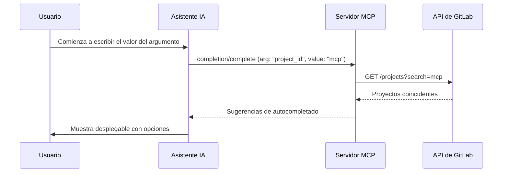

import FAQ from "../../../../components/FAQ.astro";

El autocompletado proporciona **sugerencias de relleno en tiempo real para los parámetros de las herramientas**. En lugar de memorizar IDs de proyectos, nombres de ramas o logins de usuario, escribes unos pocos caracteres y GitLab MCP Server consulta GitLab para encontrar valores coincidentes, devolviéndolos a través del método de protocolo MCP `completion/complete`. Esto transforma una búsqueda de varios pasos en una única selección interactiva.

GitLab MCP Server completa **18 nombres de argumento** (los argumentos de prompt y los parámetros de URI de recurso que reconoce el handler de `completion/complete`), organizados en completadores globales que funcionan en cualquier sitio y completadores por proyecto que buscan dentro de un proyecto elegido. Cada sugerencia se obtiene en directo, con como máximo una llamada a GitLab por petición y hasta 10 valores devueltos, así que los resultados siempre reflejan el estado actual de la instancia de GitLab conectada.

## ¿Qué problema resuelve el autocompletado?

Sin autocompletado, proporcionar un identificador implica buscarlo primero — y eso suele costar una llamada adicional a una herramienta. Con autocompletado, el asistente resuelve el valor sobre la marcha a medida que el usuario escribe, de modo que ya no hace falta un paso de descubrimiento aparte.

```text
Sin autocompletado:
  Usuario: "Crear issue en el proyecto..." → ¿Cuál es el ID? → Primero hay que ejecutar project.list

Con autocompletado:
  El usuario escribe: "mcp" → El servidor sugiere: "group/gitlab-mcp-server", "group/redmine-mcp-server"
```

Esto reduce una búsqueda de múltiples pasos a una **selección única e interactiva**.

## ¿Cómo funciona el autocompletado?

Cuando el usuario empieza a escribir el valor de un argumento, el cliente MCP envía una solicitud `completion/complete` al servidor. El servidor consulta el endpoint correspondiente de GitLab y devuelve las coincidencias como sugerencias que el cliente muestra en un desplegable. Todo el ciclo ocurre mientras el usuario escribe.


```mermaid
sequenceDiagram
    participant U as Usuario
    participant AI as Asistente IA
    participant S as Servidor MCP
    participant GL as API de GitLab

    U->>AI: Comienza a escribir el valor del argumento
    AI->>S: completion/complete (arg: "project_id", value: "mcp")
    S->>GL: GET /projects?search=mcp
    GL-->>S: Proyectos coincidentes
    S-->>AI: Sugerencias de autocompletado
    AI->>U: Muestra desplegable con opciones
```

## ¿Qué tipos de argumentos admiten autocompletado?

GitLab MCP Server completa **18 nombres de argumento**, organizados en completadores globales y por proyecto. Los completadores globales resuelven valores que existen a nivel de toda la instancia, mientras que los completadores por proyecto toman el `project_id` ya resuelto en la misma petición y buscan solo dentro de ese proyecto. Los argumentos de prompt (`ref/prompt`) reciben el conjunto completo; las plantillas de URI de recurso (`ref/resource`) completan `project_id`, `group_id`, `merge_request_iid` e `issue_iid`.

### Completadores globales

Funcionan sin contexto de proyecto:

| Argumento    | Completa                             | Ejemplo               |
| ------------ | ------------------------------------ | --------------------- |
| `project_id` | Rutas de proyecto, por ruta o nombre | `my-group/my-project` |
| `group_id`   | Rutas de grupo, por nombre           | `engineering`         |
| `username`   | Nombres de usuario de GitLab         | `john.doe`            |

### Completadores por proyecto

Requieren un `project_id` en la misma petición y buscan dentro de ese proyecto:

| Argumento                                  | Completa                                            | Ejemplo                   |
| ------------------------------------------ | --------------------------------------------------- | ------------------------- |
| `branch`, `source_branch`, `target_branch` | Nombres de ramas                                    | `feature/login`           |
| `from`, `to`, `ref`                        | Nombres de ramas y tags                             | `v1.2.0`, `feature/login` |
| `tag`                                      | Nombres de tags                                     | `v1.2.0`                  |
| `merge_request_iid`                        | IIDs de MRs abiertas                                | `42`                      |
| `issue_iid`                                | IIDs de issues abiertos                             | `100`                     |
| `pipeline_id`                              | IDs de pipelines recientes                          | `12345`                   |
| `sha`                                      | SHAs de commits recientes                           | `ddcc2f13`                |
| `label`                                    | Nombres de etiquetas                                | `priority::high`          |
| `milestone_id`                             | IDs de milestones                                   | `7`                       |
| `milestone`                                | Títulos de milestones (recurre a `group_id`)        | `Sprint 14`               |
| `job_id`                                   | IDs de jobs de un pipeline (necesita `pipeline_id`) | `501`                     |

## ¿Cómo mejora el autocompletado la precisión de la IA?

El autocompletado reduce errores en las llamadas a herramientas de la IA de varias formas concretas. En conjunto, recortan el número de llamadas fallidas por identificadores no válidos:

1. **Elimina errores tipográficos** — El asistente selecciona de sugerencias validadas en lugar de escribir valores exactos.
2. **Reduce viajes de ida y vuelta** — No es necesario ejecutar `project.list` antes de `issue.create`.
3. **Devuelve valores desnudos** — Las sugerencias son las cadenas literales que acepta una llamada (rutas, IIDs, refs), nunca etiquetas decoradas, así que una elección puede pasarse tal cual.
4. **Búsqueda en tiempo real** — Los resultados se actualizan mientras el usuario escribe, sin caché, así que nunca se sugiere una rama borrada.

:::tip
El autocompletado funciona mejor cuando el cliente MCP soporta el método de protocolo `completion/complete`. Si tu cliente no soporta autocompletado, aún puedes descubrir valores ejecutando la acción de listado del dominio: `project.list`, `branch.list` o `project.label_list` mediante `gitlab_execute_action` en la superficie predeterminada, o la acción `list` de la meta-herramienta correspondiente con `GITLAB_MCP_TOOL_SURFACE=meta`.
:::

<FAQ />

## Referencia de la fuente

:::note[Documentación para desarrolladores]
Esta página es la visión general orientada a usuarios. Para la referencia completa de autocompletado, consulta [docs/reference/capabilities/completions](https://github.com/jmrplens/gitlab-mcp-server/blob/main/docs/reference/capabilities/completions.md).
:::
