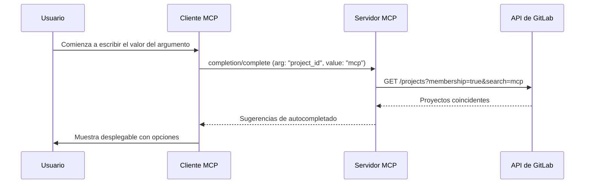

import FAQ from "../../../../components/FAQ.astro";

El autocompletado proporciona **sugerencias de relleno en tiempo real para los argumentos de prompts y plantillas de recurso**. En lugar de memorizar rutas de proyectos, nombres de ramas o logins de usuario, escribes unos pocos caracteres y GitLab MCP Server consulta GitLab para encontrar valores coincidentes, devolviéndolos a través del método de protocolo MCP `completion/complete`. Esto transforma una búsqueda de varios pasos en una única selección interactiva.

MCP completa dos cosas: los argumentos de un prompt (una referencia `ref/prompt`) y los parámetros de una plantilla de URI de recurso (una referencia `ref/resource`). Los parámetros de una herramienta no forman parte del autocompletado del protocolo, así que una llamada a herramienta nunca se autocompleta; esos los rellena el propio asistente.

GitLab MCP Server completa **18 nombres de argumento** (los argumentos de prompt y los parámetros de URI de recurso que reconoce el handler de `completion/complete`), organizados en completadores globales que funcionan en cualquier sitio y completadores por proyecto que buscan dentro de un proyecto elegido. Cada sugerencia se obtiene en directo y se devuelven hasta 10 valores, así que los resultados siempre reflejan el estado actual de la instancia de GitLab conectada. Una petición llega a GitLab como máximo una vez por cada listado que necesita: una vez para la mayoría de los argumentos, y dos para `from`, `to` y `ref`, que combinan los listados de ramas y de tags.

## ¿Qué problema resuelve el autocompletado?

Sin autocompletado, proporcionar un identificador a un prompt implica buscarlo primero, y eso suele costar una llamada adicional a una herramienta. Con autocompletado, el cliente resuelve el valor sobre la marcha a medida que el usuario escribe, de modo que ya no hace falta un paso de descubrimiento aparte.

```text
Sin autocompletado:
  El prompt review_mr pide project_id → ¿Cuál es la ruta? → Primero hay que ejecutar project.list

Con autocompletado:
  El usuario escribe "mcp" en project_id → El servidor sugiere: "group/gitlab-mcp-server", "group/redmine-mcp-server"
```

Esto reduce una búsqueda de múltiples pasos a una **selección única e interactiva**.

## ¿Cómo funciona el autocompletado?

Cuando el usuario empieza a escribir el valor de un argumento de prompt o de un parámetro de URI de recurso, el cliente MCP envía una solicitud `completion/complete` al servidor. El servidor consulta el endpoint correspondiente de GitLab y devuelve las coincidencias como sugerencias que el cliente muestra en un desplegable. Todo el ciclo ocurre mientras el usuario escribe.


```mermaid
sequenceDiagram
    participant U as Usuario
    participant C as Cliente MCP
    participant S as Servidor MCP
    participant GL as API de GitLab

    U->>C: Comienza a escribir el valor del argumento
    C->>S: completion/complete (arg: "project_id", value: "mcp")
    S->>GL: GET /projects?membership=true&search=mcp
    GL-->>S: Proyectos coincidentes
    S-->>C: Sugerencias de autocompletado
    C->>U: Muestra desplegable con opciones
```

Cada petición se responde en cinco pasos:

1. El cliente envía `completion/complete` con una referencia (`ref/prompt` con el nombre de un prompt, o `ref/resource` con una URI), el nombre del argumento y el valor parcial escrito hasta ahora, y, opcionalmente, `context.arguments` con los valores ya elegidos para los demás argumentos.
2. Un `ref/prompt` que nombra un prompt que este servidor no sirve se rechaza con `-32602`, el código que la especificación asigna a un nombre de prompt no válido.
3. Un argumento cuyos datos vienen solo de acciones que el operador quitó con `--exclude-tools` responde una lista vacía sin llegar a GitLab.
4. El nombre del argumento elige el completador. Un completador por proyecto lee `project_id` de `context.arguments` y, si no lo encuentra, responde una lista vacía.
5. El completador consulta GitLab con el valor parcial y devuelve hasta 10 valores coincidentes.

## ¿Qué tipos de argumentos admiten autocompletado?

GitLab MCP Server completa **18 nombres de argumento**, organizados en completadores globales y por proyecto. Los completadores globales resuelven valores que existen a nivel de toda la instancia, mientras que los completadores por proyecto toman el `project_id` que el cliente envía en `context.arguments` y buscan solo dentro de ese proyecto. Los argumentos de prompt (`ref/prompt`) reciben el conjunto completo; las plantillas de URI de recurso (`ref/resource`) completan `project_id`, `group_id`, `merge_request_iid` e `issue_iid`.

Se usan dos formas de coincidencia. Los argumentos respaldados por una búsqueda de GitLab (proyectos, grupos, usuarios, ramas, tags, etiquetas y milestones) pasan lo que escribiste al propio filtro `search` de GitLab para ese listado, que decide qué coincide y no se limita al principio de un nombre. Los argumentos que son números o hashes (IIDs de merge requests e issues, IDs de pipelines y jobs, SHAs de commits) leen una página de 20 elementos recientes y se quedan con aquellos cuyo identificador empieza por lo que escribiste.

### Completadores globales

Funcionan sin contexto de proyecto:

| Argumento    | Completa                             | Cómo se busca                                               | Ejemplo               |
| ------------ | ------------------------------------ | ----------------------------------------------------------- | --------------------- |
| `project_id` | Rutas de proyecto, por ruta o nombre | Búsqueda de GitLab en los proyectos de los que eres miembro | `my-group/my-project` |
| `group_id`   | Rutas de grupo, por nombre           | Búsqueda de grupos de GitLab                                | `engineering`         |
| `username`   | Nombres de usuario de GitLab         | Búsqueda de usuarios de GitLab, solo usuarios activos       | `john.doe`            |

### Completadores por proyecto

Requieren un `project_id` en `context.arguments` y buscan dentro de ese proyecto:

| Argumento                                  | Completa                                            | Cómo se busca                                                                                      | Ejemplo                   |
| ------------------------------------------ | --------------------------------------------------- | -------------------------------------------------------------------------------------------------- | ------------------------- |
| `branch`, `source_branch`, `target_branch` | Nombres de ramas                                    | Búsqueda de ramas de GitLab                                                                        | `feature/login`           |
| `from`, `to`, `ref`                        | Nombres de ramas y tags                             | Búsqueda de ramas y de tags, combinadas con las ramas primero                                      | `v1.2.0`, `feature/login` |
| `tag`                                      | Nombres de tags                                     | Búsqueda de tags de GitLab                                                                         | `v1.2.0`                  |
| `merge_request_iid`                        | IIDs de MRs abiertas                                | Las 20 merge requests abiertas más recientes, por prefijo de IID                                   | `42`                      |
| `issue_iid`                                | IIDs de issues abiertos                             | Los 20 issues abiertos más recientes, por prefijo de IID                                           | `100`                     |
| `pipeline_id`                              | IDs de pipelines recientes                          | Los 20 pipelines más recientes, por prefijo de ID                                                  | `12345`                   |
| `sha`                                      | SHAs de commits recientes                           | Los 20 commits más recientes de la rama por defecto, por prefijo de SHA, sin distinguir mayúsculas | `ddcc2f13`                |
| `label`                                    | Nombres de etiquetas                                | Búsqueda de etiquetas de GitLab                                                                    | `priority::high`          |
| `milestone_id`                             | IDs de milestones                                   | Búsqueda de milestones de GitLab, solo milestones activos                                          | `7`                       |
| `milestone`                                | Títulos de milestones (recurre a `group_id`)        | Búsqueda de milestones de GitLab, solo milestones activos                                          | `Sprint 14`               |
| `job_id`                                   | IDs de jobs de un pipeline (necesita `pipeline_id`) | Una página de 20 jobs del pipeline, por prefijo de ID                                              | `501`                     |

Dos completadores usan un contexto distinto. `milestone` se resuelve contra `project_id` cuando lo hay y contra `group_id` en otro caso, así que los prompts de milestones de grupo también se completan. `job_id` necesita tanto `project_id` como `pipeline_id` en `context.arguments`. Un prefijo de `sha` se compara con el hash completo del commit, así que pegar un SHA entero sigue coincidiendo, y el valor devuelto es el SHA corto.

## ¿Qué devuelve un autocompletado?

| Campo     | Valor                                                                                                                                                                                                                                         |
| --------- | --------------------------------------------------------------------------------------------------------------------------------------------------------------------------------------------------------------------------------------------- |
| `values`  | Como máximo 10 valores tal cual, siempre un array (vacío en lugar de ausente). Cada uno es la cadena literal que sustituye a lo que escribiste: una ruta de proyecto, un IID, una ref, nunca una etiqueta como `15: Fix login`                |
| `total`   | El número de coincidencias que GitLab indica en su cabecera `X-Total`, para los argumentos respaldados por una búsqueda de GitLab; se omite cuando GitLab no la envía, y para los argumentos de IID, ID y SHA, que se filtran después de leer |
| `hasMore` | `true` cuando hay más coincidencias que valores devueltos; se omite en otro caso                                                                                                                                                              |

El servidor lee hasta 20 elementos de GitLab para poder saber cuándo coinciden más de 10. Los resultados nunca se guardan en caché. En el protocolo 2026-07-28 el resultado lleva además `"resultType": "complete"`.

## ¿Cuándo es vacía la respuesta?

Una lista vacía es la respuesta normal siempre que no hay nada útil que sugerir, y nunca bloquea al cliente:

- **GitLab falla.** Cualquier error de la llamada a GitLab responde una lista vacía en lugar de un error. La causa se registra en el log a nivel debug y nunca se muestra al cliente.
- **Falta contexto.** Un argumento por proyecto sin `project_id` en `context.arguments`, `job_id` sin `pipeline_id`, y `milestone` sin `project_id` ni `group_id` responden todos una lista vacía.
- **El argumento no es uno de los 18,** o un argumento de plantilla de recurso no es uno de los cuatro.
- **El operador quitó los datos.** El autocompletado se acota con `--exclude-tools` (`GITLAB_MCP_EXCLUDE_TOOLS`) igual que las superficies de herramientas, recursos, suscripciones y prompts. Un operador que quita `issue.list` también lo quita aquí, así que el autocompletado de `issue_iid` responde una lista vacía sin llegar a GitLab. Un argumento servido por más de una acción conserva la mitad que quedó: quitar solo `tag.list` sigue completando `from`, `to` y `ref` con ramas. Para `milestone`, decide el ámbito: con un `project_id`, un `project.milestone_list` excluido responde vacío en lugar de recurrir a los milestones del grupo.
- **El servidor está al límite.** Un autocompletado rechazado por el límite de tasa, o en modo HTTP por el tope del proceso de llamadas abiertas a la vez, también se responde con una lista vacía.

**Un fallo es un error en su lugar.** Un `ref/prompt` que nombra un prompt que este servidor no sirve se rechaza con `-32602`, el mismo código con que `prompts/get` responde para ese nombre, porque es algo que envió quien llama y tiene que cambiarlo. Con `GITLAB_MCP_CAPABILITY_SURFACE=minimal`, donde no se sirve ningún prompt, toda referencia a un prompt se rechaza así en lugar de responderse con datos en vivo de GitLab para un prompt que `prompts/list` y `prompts/get` ya han denegado. Un prompt que las exclusiones del operador quitaron se rechaza del mismo modo.

**Una URI de recurso no se comprueba.** La URI de un `ref/resource` no se compara con las plantillas que tiene el servidor, y la especificación no lo pide: un cliente puede enviar una URI concreta donde el servidor solo tiene una plantilla. Solo el nombre del argumento decide la respuesta, así que una URI no reconocida nunca se rechaza.

## Seguridad

- **Los errores nunca llegan al cliente.** Un fallo de GitLab responde una lista vacía, sin ningún detalle de GitLab. El único rechazo, un nombre de prompt no servido, nombra el prompt que pidió quien llama y nada más.
- **Tu propia credencial, tu propia vista.** Cada autocompletado se ejecuta con la credencial de GitLab de quien llama, así que devuelve solo lo que ese token puede ver, y `project_id` busca solo entre los proyectos de los que eres miembro. En modo HTTP, un autocompletado que el servidor no puede atribuir a una credencial se responde con una lista vacía y un aviso en el log del servidor, nunca con el token de otro usuario.
- **Coste acotado.** Una petición hace como máximo una llamada a GitLab por cada listado que necesita (dos para `from`, `to` y `ref`), y lee como máximo 20 elementos de cada uno.
- **Limitado en tasa.** Cuando el límite de tasa está activo (`GITLAB_MCP_RATE_LIMIT_RPS` o `--rate-limit-rps`, activo por defecto en modo HTTP), el autocompletado usa un bucket propio, con diez veces la tasa y la ráfaga del bucket de llamadas a herramientas, porque un editor envía uno por cada pulsación. Un autocompletado que el bucket rechaza responde una lista vacía.
- **Las exclusiones se respetan.** Una acción quitada con `--exclude-tools` no se puede volver a leer mediante el autocompletado.

## Ejemplos

Los ejemplos muestran un intercambio JSON-RPC completo, tal como lo ve un cliente con el protocolo 2025-11-25.

**La ruta de un proyecto para un prompt.** El usuario escribe `mcp` en el argumento `project_id` del prompt `review_mr`:

```json
{
  "jsonrpc": "2.0",
  "id": 7,
  "method": "completion/complete",
  "params": {
    "ref": { "type": "ref/prompt", "name": "review_mr" },
    "argument": { "name": "project_id", "value": "mcp" }
  }
}
```

```json
{
  "jsonrpc": "2.0",
  "id": 7,
  "result": {
    "completion": {
      "values": ["group/gitlab-mcp-server", "group/redmine-mcp-server"],
      "total": 2
    }
  }
}
```

**Una ref para comparar.** El prompt `compare_branches` ya tiene su proyecto; el usuario escribe `v1.1` en `from`, y las ramas van antes que los tags:

```json
{
  "jsonrpc": "2.0",
  "id": 8,
  "method": "completion/complete",
  "params": {
    "ref": { "type": "ref/prompt", "name": "compare_branches" },
    "argument": { "name": "from", "value": "v1.1" },
    "context": { "arguments": { "project_id": "group/gitlab-mcp-server" } }
  }
}
```

```json
{
  "jsonrpc": "2.0",
  "id": 8,
  "result": {
    "completion": {
      "values": ["release/v1.1", "v1.1.5", "v1.1.6", "v1.1.7"],
      "total": 4
    }
  }
}
```

**El IID de una merge request en una URI de recurso.** El usuario rellena `gitlab://project/{project_id}/mr/{merge_request_iid}` y escribe `1`. Los IIDs se filtran después de leer, así que no vuelve ningún `total`:

```json
{
  "jsonrpc": "2.0",
  "id": 9,
  "method": "completion/complete",
  "params": {
    "ref": { "type": "ref/resource", "uri": "gitlab://project/{project_id}/mr/{merge_request_iid}" },
    "argument": { "name": "merge_request_iid", "value": "1" },
    "context": { "arguments": { "project_id": "group/gitlab-mcp-server" } }
  }
}
```

```json
{
  "jsonrpc": "2.0",
  "id": 9,
  "result": {
    "completion": {
      "values": ["15", "14", "12"]
    }
  }
}
```

Los valores son los IIDs tal cual, sin título. Un cliente que quiera mostrar títulos en su desplegable los lee aparte, por ejemplo del recurso de la merge request.

**Un prompt que el servidor no sirve:**

```json
{
  "jsonrpc": "2.0",
  "id": 10,
  "error": { "code": -32602, "message": "unknown prompt \"no_such_prompt\"" }
}
```

## ¿Cómo ayuda el autocompletado?

El autocompletado no cambia cómo llama el asistente a las herramientas. Lo que cambia es la entrada de la que parte: los valores que un usuario elige para un prompt o una URI de recurso vienen de GitLab, así que el prompt que recibe el asistente nombra cosas que existen.

| Sin autocompletado                                                | Con autocompletado                                      |
| ----------------------------------------------------------------- | ------------------------------------------------------- |
| La `branch` de un prompt se escribe de memoria y puede no existir | Se elige entre las ramas que devuelve GitLab            |
| El IID de una merge request se recuerda de memoria                | Se elige entre las merge requests abiertas del proyecto |
| El nombre de un tag se adivina                                    | Se elige entre los tags reales del proyecto             |

En la práctica:

1. **Elimina errores tipográficos.** El usuario elige entre sugerencias validadas en lugar de escribir valores exactos.
2. **Reduce viajes de ida y vuelta.** No hace falta ejecutar `project.list` para encontrar una ruta antes de rellenar un prompt.
3. **Devuelve los valores tal cual.** Las sugerencias son las cadenas literales que acepta un argumento (rutas, IIDs, refs), nunca etiquetas decoradas, así que una elección puede pasarse tal cual.
4. **Búsqueda en tiempo real.** Los resultados se actualizan mientras el usuario escribe, sin caché, así que nunca se sugiere una rama borrada.

Esto es más valioso para los **valores por proyecto**, como nombres de ramas, etiquetas y milestones, que varían entre proyectos y no se pueden adivinar de forma fiable.

:::tip
El autocompletado funciona mejor cuando el cliente MCP soporta el método de protocolo `completion/complete`. Si tu cliente no soporta autocompletado, aún puedes descubrir valores ejecutando la acción de listado del dominio: `project.list`, `branch.list` o `project.label_list` mediante `gitlab_execute_action` en la superficie predeterminada, o la acción `list` de la meta-herramienta correspondiente con `GITLAB_MCP_TOOL_SURFACE=meta`.
:::

<FAQ />

## Referencia de la fuente

:::note[Documentación para desarrolladores]
Esta página es la visión general orientada a usuarios. Para la referencia completa de autocompletado, consulta [docs/reference/capabilities/completions](https://github.com/jmrplens/gitlab-mcp-server/blob/main/docs/reference/capabilities/completions.md).
:::
