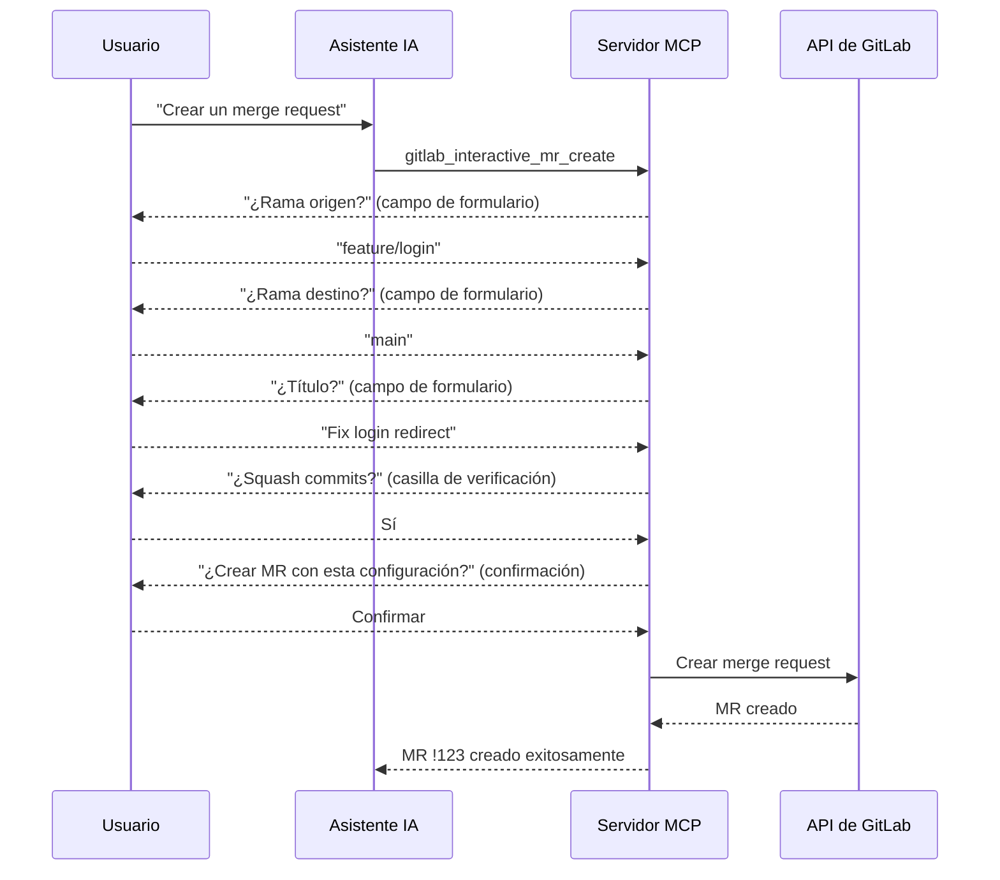

La elicitación permite al servidor solicitar información al usuario a través de formularios estructurados, habilitando flujos de creación tipo asistente para recursos complejos como issues, merge requests y releases.

## El problema

Las herramientas MCP estándar requieren que la IA proporcione **todos los parámetros de antemano** en una única llamada. Para recursos complejos — donde los campos dependen de elecciones anteriores y los datos faltantes provocan errores — la IA debe adivinar valores o hacer múltiples preguntas en el chat antes de llamar a la herramienta.

## Cómo funciona

Con la elicitación, el servidor puede pausar la ejecución y **preguntar directamente al usuario** a través de la interfaz del cliente MCP:

Cada paso puede validar la entrada y adaptar la siguiente pregunta en función de la respuesta anterior.

## Asistentes interactivos

El servidor proporciona herramientas de creación tipo asistente:

| Herramienta                         | Descripción                                                                      |
| ----------------------------------- | -------------------------------------------------------------------------------- |
| `gitlab_interactive_issue_create`   | Creación de issues paso a paso con selección de proyecto, etiquetas y asignación |
| `gitlab_interactive_mr_create`      | Creación guiada de merge requests con selección de ramas y opciones              |
| `gitlab_interactive_release_create` | Asistente de creación de releases con selección de tags y milestones             |
| `gitlab_interactive_project_create` | Creación de proyectos con selección de namespace y configuración                 |

### Beneficios del asistente

- **Revelación progresiva** — Primero solicita solo los campos obligatorios, luego los opcionales
- **Validación en cada paso** — Detecta errores antes de la llamada final a la API
- **Campos dependientes** — Los campos posteriores pueden depender de elecciones anteriores (por ejemplo, las ramas dependen del proyecto seleccionado)
- **Confirmación del usuario** — Siempre confirma antes de crear el recurso

## Confirmación para acciones destructivas

La elicitación también se utiliza para **solicitudes de confirmación** antes de operaciones destructivas. Cuando un usuario solicita una eliminación u otra acción irreversible, el servidor puede pedir confirmación explícita a través de la interfaz del cliente MCP.

## Requisitos

La elicitación requiere soporte del cliente MCP:

- **Soportado**: Claude Desktop, Claude Code
- **Aún no soportado**: VS Code Copilot, Cursor

### Degradación elegante

Cuando la elicitación no está disponible, el servidor recurre a las herramientas parametrizadas estándar. El asistente de IA proporciona todos los parámetros directamente, sin el flujo interactivo del asistente. La funcionalidad se mantiene — solo se reduce la experiencia interactiva.

:::tip
Incluso sin soporte de elicitación, puedes usar las herramientas de creación estándar (por ejemplo, `gitlab_issue` con `action: create`) proporcionando todos los parámetros en una única llamada.
:::
