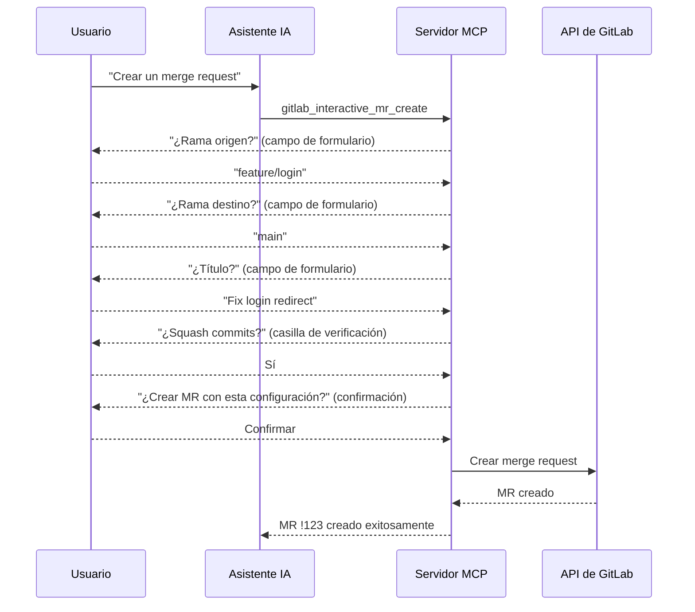

:::note[Documentación para desarrolladores]
Esta página es la visión general orientada a usuarios. Para la referencia completa de elicitación, consulta [docs/reference/capabilities/elicitation](https://github.com/jmrplens/gitlab-mcp-server/blob/main/docs/reference/capabilities/elicitation.md).
:::

La elicitación permite a GitLab MCP Server **solicitar información al usuario mediante formularios estructurados**, habilitando flujos de creación tipo asistente para recursos complejos como issues, merge requests, releases y proyectos. En lugar de exigir que la IA proporcione todos los parámetros de antemano, el servidor recopila los campos paso a paso, valida cada respuesta y confirma antes de crear el recurso.

Esta capacidad es de servidor a cliente y **dependiente del cliente**: el cliente MCP debe declarar soporte durante el handshake de inicialización. Cuando un cliente no admite la elicitación, GitLab MCP Server recurre a las herramientas parametrizadas estándar, de modo que la creación de recursos sigue funcionando sin el flujo interactivo.

## ¿Qué problema resuelve la elicitación?

Las herramientas MCP estándar requieren que la IA proporcione **todos los parámetros de antemano** en una única llamada. Para recursos complejos — donde los campos dependen de elecciones anteriores y los datos faltantes provocan errores — la IA debe adivinar valores o hacer múltiples preguntas en el chat antes de llamar a la herramienta. La elicitación elimina esas conjeturas al permitir que el servidor recopile y valide cada campo de forma interactiva.

## ¿Cómo funciona la elicitación?

Con la elicitación, el servidor pausa la ejecución y **pregunta directamente al usuario** a través de la interfaz del cliente MCP. Cada paso puede validar la respuesta y adaptar la siguiente pregunta en función de lo que el usuario acaba de introducir, y el flujo termina con una confirmación explícita antes de cualquier llamada a la API de GitLab.

```mermaid
sequenceDiagram
    participant U as Usuario
    participant AI as Asistente IA
    participant S as Servidor MCP
    participant GL as API de GitLab

    U->>AI: "Crear un merge request"
    AI->>S: gitlab_interactive_mr_create
    S-->>U: "¿Rama origen?" (campo de formulario)
    U-->>S: "feature/login"
    S-->>U: "¿Rama destino?" (campo de formulario)
    U-->>S: "main"
    S-->>U: "¿Título?" (campo de formulario)
    U-->>S: "Fix login redirect"
    S-->>U: "¿Squash commits?" (casilla de verificación)
    U-->>S: Sí
    S-->>U: "¿Crear MR con esta configuración?" (confirmación)
    U-->>S: Confirmar
    S->>GL: Crear merge request
    GL-->>S: MR creado
    S-->>AI: MR !123 creado exitosamente
```

## ¿Qué asistentes interactivos están disponibles?

GitLab MCP Server proporciona cuatro herramientas de creación tipo asistente. Cada una guía al usuario por los campos que necesita un recurso y confirma antes de realizar la llamada final a la API.

| Herramienta                         | Descripción                                                                      |
| ----------------------------------- | -------------------------------------------------------------------------------- |
| `gitlab_interactive_issue_create`   | Creación de issues paso a paso con selección de proyecto, etiquetas y asignación |
| `gitlab_interactive_mr_create`      | Creación guiada de merge requests con selección de ramas y opciones              |
| `gitlab_interactive_release_create` | Asistente de creación de releases con selección de tags y milestones             |
| `gitlab_interactive_project_create` | Creación de proyectos con selección de namespace y configuración                 |

### ¿Por qué usar un asistente en lugar de una única llamada?

Los asistentes añaden salvaguardas que una única llamada inicial no puede ofrecer, y eso es lo que los hace valiosos para recursos complejos:

- **Revelación progresiva** — Primero solicita solo los campos obligatorios, luego los opcionales.
- **Validación en cada paso** — Detecta errores antes de la llamada final a la API.
- **Campos dependientes** — Los campos posteriores pueden depender de elecciones anteriores (por ejemplo, las ramas dependen del proyecto seleccionado).
- **Confirmación del usuario** — Siempre confirma antes de crear el recurso.

## ¿Cómo protege la elicitación las acciones destructivas?

La elicitación también se utiliza para **solicitudes de confirmación** antes de operaciones destructivas. Cuando un usuario solicita una eliminación u otra acción irreversible, el servidor puede pedir confirmación explícita a través de la interfaz del cliente MCP antes de continuar, reduciendo el riesgo de pérdida accidental de datos.

## ¿Qué requiere la elicitación?

La elicitación requiere que el cliente MCP declare soporte para la capacidad:

- **Soportado**: Claude Desktop, Claude Code
- **Aún no soportado**: VS Code Copilot, Cursor

### ¿Qué ocurre sin soporte de elicitación?

Cuando la elicitación no está disponible, el servidor recurre a las herramientas parametrizadas estándar. El asistente de IA proporciona todos los parámetros directamente, sin el flujo interactivo del asistente. La funcionalidad se mantiene — solo se reduce la experiencia interactiva.

:::tip
Incluso sin soporte de elicitación, puedes usar las herramientas de creación estándar (por ejemplo, `gitlab_issue` con `action: create`) proporcionando todos los parámetros en una única llamada.
:::

## Preguntas frecuentes

### ¿Qué es la elicitación MCP?

La elicitación es una capacidad MCP que permite a GitLab MCP Server **pausar y solicitar información al usuario mediante formularios estructurados** renderizados por el cliente. Impulsa la creación tipo asistente de recursos complejos como issues, merge requests, releases y proyectos. En lugar de exigir todos los parámetros de antemano, el servidor recopila los campos paso a paso, valida cada respuesta, adapta las preguntas posteriores a las anteriores y confirma antes de crear el recurso.

### ¿Qué herramientas de asistente interactivo están disponibles?

GitLab MCP Server proporciona cuatro asistentes de elicitación: `gitlab_interactive_issue_create` (selección de proyecto, etiquetas, asignación), `gitlab_interactive_mr_create` (selección de ramas y opciones), `gitlab_interactive_release_create` (selección de tags y milestones) y `gitlab_interactive_project_create` (selección de namespace y configuración). Cada uno confirma con el usuario antes de realizar la llamada final a la API de GitLab.

### ¿Qué ocurre cuando un cliente no admite la elicitación?

GitLab MCP Server degrada de forma elegante a las herramientas parametrizadas estándar. El asistente proporciona todos los parámetros directamente en una sola llamada en lugar de usar el flujo del asistente. La funcionalidad se preserva por completo — solo se pierde la experiencia paso a paso. Por ejemplo, llamar a `gitlab_issue` con `action: create` y pasar todos los campos a la vez produce el mismo resultado sin soporte de elicitación.

### ¿Qué clientes MCP admiten la elicitación?

La elicitación la admiten **Claude Desktop** y **Claude Code**. **VS Code Copilot** y **Cursor** aún no la admiten, por lo que en esos clientes GitLab MCP Server recurre a las herramientas de creación parametrizadas estándar. Como el soporte de capacidades de los clientes cambia con frecuencia, confirma el estado actual en la documentación del cliente específico.
