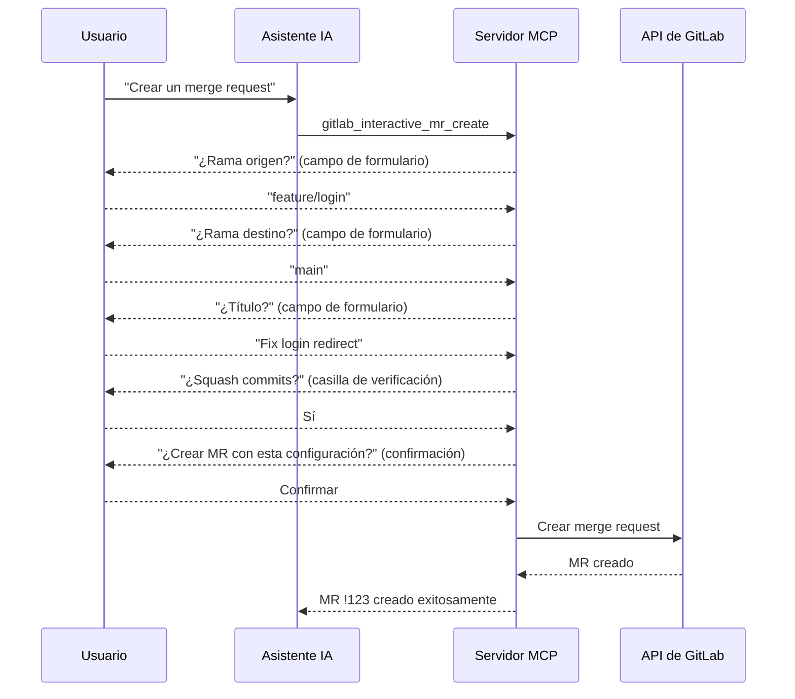

import FAQ from "../../../../components/FAQ.astro";

La elicitación permite a GitLab MCP Server **solicitar información al usuario mediante formularios estructurados**, habilitando flujos de creación tipo asistente para recursos complejos como issues, merge requests, releases y proyectos. En lugar de exigir que la IA proporcione todos los parámetros de antemano, el servidor recopila los campos paso a paso, valida cada respuesta y confirma antes de crear el recurso.

Esta capacidad es de servidor a cliente y **dependiente del cliente**: el cliente MCP debe declarar soporte: en `initialize` en el protocolo `2025-11-25` y anteriores, y en cada petición desde `2026-07-28`. Cuando un cliente no admite la elicitación, GitLab MCP Server recurre a las herramientas parametrizadas estándar, de modo que la creación de recursos sigue funcionando sin el flujo interactivo.

## ¿Qué problema resuelve la elicitación?

Las herramientas MCP estándar requieren que la IA proporcione **todos los parámetros de antemano** en una única llamada. Para recursos complejos — donde los campos dependen de elecciones anteriores y los datos faltantes provocan errores — la IA debe adivinar valores o hacer múltiples preguntas en el chat antes de llamar a la herramienta. La elicitación elimina esas conjeturas al permitir que el servidor recopile y valide cada campo de forma interactiva.

## ¿Cómo funciona la elicitación?

Con la elicitación, el servidor pausa la ejecución y **pregunta directamente al usuario** a través de la interfaz del cliente MCP. Cada respuesta se comprueba frente a su pregunta antes de pasar a la siguiente, y el flujo termina con una confirmación explícita antes de cualquier llamada a la API de GitLab.


```mermaid
sequenceDiagram
    participant U as Usuario
    participant AI as Asistente IA
    participant S as Servidor MCP
    participant GL as API de GitLab

    U->>AI: "Crear un merge request"
    AI->>S: gitlab_interactive_mr_create
    S-->>U: "¿Rama origen?" (campo de formulario)
    U-->>S: "feature/login"
    S-->>U: "¿Rama destino?" (campo de formulario)
    U-->>S: "main"
    S-->>U: "¿Título?" (campo de formulario)
    U-->>S: "Fix login redirect"
    S-->>U: "¿Squash commits?" (casilla de verificación)
    U-->>S: Sí
    S-->>U: "¿Crear MR con esta configuración?" (confirmación)
    U-->>S: Confirmar
    S->>GL: Crear merge request
    GL-->>S: MR creado
    S-->>AI: MR !123 creado exitosamente
```

Cada paso es una petición propia al cliente: un `elicitation/create` por pregunta, que lleva la pregunta y un JSON Schema para la respuesta (un campo de texto, una opción de una lista o un sí/no), para que el cliente pueda dibujar el control adecuado. El usuario responde a cada una aceptando, rechazando o cancelando.

### ¿Cuáles son las cuatro fases de un flujo?

1. **Comprobación de capacidad**: antes de preguntar nada, el asistente comprueba que el cliente declaró la elicitación. Si no lo hizo, el asistente se detiene y nombra la acción que hace el mismo trabajo (consulta [¿Qué ocurre sin soporte de elicitación?](#qué-ocurre-sin-soporte-de-elicitación)).
2. **Recopilación**: las preguntas se suceden una tras otra. Una opcional puede rechazarse o dejarse vacía, y el flujo continúa sin ese campo.
3. **Confirmación**: el asistente muestra un resumen de todo lo que ha recopilado y pide un sí o un no final.
4. **Ejecución**: solo tras ese sí llama a GitLab, y devuelve el objeto que GitLab ha creado.

Cancelar en cualquier paso, o responder no en la confirmación, termina el flujo sin enviar nada a GitLab.

### ¿Qué forma recibe un cliente en el protocolo?

El flujo es el mismo para todo cliente; cómo viajan las preguntas depende de la versión del protocolo MCP que hable el cliente:

| Protocolo del cliente     | Mecanismo                                      | En el protocolo                                                                                                                                                                                                                             |
| ------------------------- | ---------------------------------------------- | ------------------------------------------------------------------------------------------------------------------------------------------------------------------------------------------------------------------------------------------- |
| `2025-11-25` y anteriores | Peticiones síncronas iniciadas por el servidor | Mientras la llamada se ejecuta, el servidor envía una petición `elicitation/create` por pregunta y espera la respuesta: una `action` (`accept`, `decline` o `cancel`) y, si se acepta, el `content`                                         |
| `2026-07-28`              | Peticiones multi-ronda (MRTR, SEP-2322)        | El resultado de la herramienta lleva un mapa `inputRequests` indexado por pregunta y un `requestState` opaco; el cliente pregunta al usuario y repite la misma llamada con las respuestas en `inputResponses` y el `requestState` de vuelta |

En la vía multi-ronda cada ronda lleva una pregunta. Una primera ronda abreviada del asistente de issues tiene este aspecto:

```json
{
  "resultType": "input_required",
  "inputRequests": {
    "title": {
      "method": "elicitation/create",
      "params": {
        "message": "Enter the issue title",
        "requestedSchema": {
          "type": "object",
          "properties": {
            "title": { "type": "string", "title": "title", "description": "Enter the issue title" }
          },
          "required": ["title"]
        }
      }
    }
  },
  "requestState": "<opaco, firmado por el servidor>"
}
```

El asistente vuelve a ejecutarse desde el principio en cada ronda, y reproduce las respuestas que lleva `requestState` en lugar de preguntarlas de nuevo, así que el usuario ve las mismas preguntas en el mismo orden por ambas vías.

### ¿Qué versión del protocolo decide?

Decide la versión que el cliente **declaró**, no la que negoció su sesión, y en el handshake heredado ambas pueden diferir. `initialize` queda obsoleto en `2026-07-28`, así que el SDK de Go sobre el que está construido este servidor (v1.8.0) responde a un `initialize` que pide `2026-07-28` con `2025-11-25`, aunque conserva la versión que pidió el cliente. El servidor lee la versión que indica la petición, que un cliente de `2026-07-28` envía con cada petición y un cliente anterior indicó una sola vez en `initialize`. Por eso un cliente que pide `2026-07-28` en `initialize` recibe peticiones de entrada multi-ronda aunque su sesión haya negociado `2025-11-25`.

El SDK decide del mismo modo, y su propio cliente atiende `inputRequests` sea cual sea la versión negociada, así que un cliente construido sobre él no se ve afectado. Un cliente que dijera `2026-07-28` en `initialize` y no supiera tratar `inputRequests` recibiría un resultado con el que no puede hacer nada. La versión negociada debería gobernar ambos lados, y cambiarlo le corresponde al SDK; el defecto está [registrado aguas arriba](https://github.com/jmrplens/gitlab-mcp-server/blob/main/docs/development/upstream-bugs.md#the-declared-protocol-version-not-the-negotiated-one-selects-mrtr).

### ¿Qué es `resultType`?

En una sesión de `2026-07-28` todo resultado de herramienta lleva `resultType`: `input_required` en un resultado que pide entrada, `complete` en cualquier otro. También sigue a la versión declarada, así que un cliente que pidió `2026-07-28` en `initialize` recibe `resultType: "complete"` en llamadas corrientes que no piden ninguna entrada. Los resultados de una sesión heredada no llevan `resultType`.

### ¿Qué transportes la llevan?

El modo HTTP es [sin estado por defecto](/gitlab-mcp-server/es/operations/http-server/#modo-sin-estado-stateless), y eso decide cuál de las dos formas está disponible:

| Transporte                        | Protocolo del cliente     | Elicitación                                                                                                                                                       |
| --------------------------------- | ------------------------- | ----------------------------------------------------------------------------------------------------------------------------------------------------------------- |
| stdio, o HTTP `--stateless=false` | `2025-11-25` y anteriores | Disponible: peticiones `elicitation/create` síncronas                                                                                                             |
| stdio                             | `2026-07-28`              | Disponible: peticiones de entrada multi-ronda                                                                                                                     |
| HTTP sin estado (predeterminado)  | `2026-07-28`              | Disponible: las peticiones de entrada viajan dentro del resultado de la herramienta, así que no hace falta sesión ni canal iniciado por el servidor               |
| HTTP sin estado (predeterminado)  | `2025-11-25` y anteriores | No disponible: ningún canal sobrevive a la petición, así que los asistentes responden con su acción alternativa y una acción destructiva necesita `confirm: true` |
| HTTP `--stateless=false`          | `2026-07-28`              | No disponible: el despliegue no sirve esta revisión y responde `400`                                                                                              |

Un despliegue con `--stateless=false` no ofrece `2026-07-28` en absoluto, porque el transporte streamable del SDK solo sirve esa revisión sin sesiones. Una petición que la nombra recibe un `400` con un error JSON-RPC `-32022` cuyo `data.supported` enumera las revisiones que el despliegue sí negocia, para que el cliente reintente con una de ellas y use la forma síncrona ([Revisiones del protocolo que negocia este servidor](/gitlab-mcp-server/es/operations/http-server/#revisiones-del-protocolo-que-negocia-este-servidor)).

## ¿Qué asistentes interactivos están disponibles?

GitLab MCP Server proporciona cuatro herramientas de creación tipo asistente. Cada una guía al usuario por los campos que necesita un recurso y confirma antes de realizar la llamada final a la API.

| Herramienta                         | Descripción                                                                                                                             |
| ----------------------------------- | --------------------------------------------------------------------------------------------------------------------------------------- |
| `gitlab_interactive_issue_create`   | Creación de issues paso a paso: título, descripción, etiquetas, confidencialidad, confirmación                                          |
| `gitlab_interactive_mr_create`      | Creación guiada de merge requests: ramas, título, descripción, etiquetas, opciones de eliminar la rama origen y de squash, confirmación |
| `gitlab_interactive_release_create` | Asistente de creación de releases: nombre del tag, nombre de la release, descripción, confirmación                                      |
| `gitlab_interactive_project_create` | Creación de proyectos: nombre, descripción, visibilidad, inicialización del README, rama predeterminada, confirmación                   |

Los asistentes de issue, merge request y release reciben el `project_id` de destino como parámetro de la herramienta; los formularios recopilan el resto de campos. Estas cuatro herramientas se registran por nombre en las superficies meta e individual; en la superficie dinámica predeterminada se alcanzan mediante `gitlab_execute_action` con los IDs de catálogo `interactive.issue_create`, `interactive.mr_create`, `interactive.release_create` e `interactive.project_create`, que `gitlab_find_action` devuelve.

### ¿Qué pregunta cada asistente?

Las preguntas llegan en el orden de abajo. Rechazar una pregunta opcional continúa sin ese campo; rechazar una obligatoria, o cancelar en cualquier pregunta, termina el flujo. Toda pregunta de sí o no empieza en no. En el resumen final una descripción larga muestra sus primeros 100 caracteres.

#### Issue

| Paso | Pregunta                       | Respuesta | Obligatoria |
| ---: | ------------------------------ | --------- | :---------: |
|    1 | Título                         | Texto     |     Sí      |
|    2 | Descripción (Markdown)         | Texto     |     No      |
|    3 | Etiquetas, separadas por comas | Texto     |     No      |
|    4 | ¿Debe ser confidencial?        | Sí/no     |     No      |
|    5 | ¿Crear el issue? (resumen)     | Sí/no     |     Sí      |

#### Merge request

| Paso | Pregunta                                  | Respuesta | Obligatoria |
| ---: | ----------------------------------------- | --------- | :---------: |
|    1 | Rama origen                               | Texto     |     Sí      |
|    2 | Rama destino                              | Texto     |     Sí      |
|    3 | Título                                    | Texto     |     Sí      |
|    4 | Descripción (Markdown)                    | Texto     |     No      |
|    5 | Etiquetas, separadas por comas            | Texto     |     No      |
|    6 | ¿Eliminar la rama origen tras el merge?   | Sí/no     |     No      |
|    7 | ¿Hacer squash de los commits en el merge? | Sí/no     |     No      |
|    8 | ¿Crear el merge request? (resumen)        | Sí/no     |     Sí      |

#### Release

| Paso | Pregunta                                                   | Respuesta | Obligatoria |
| ---: | ---------------------------------------------------------- | --------- | :---------: |
|    1 | Nombre del tag (el tag debe existir ya)                    | Texto     |     Sí      |
|    2 | Nombre de la release (vacío deja a GitLab usar el del tag) | Texto     |     Sí      |
|    3 | Descripción, las notas de la release                       | Texto     |     No      |
|    4 | ¿Crear la release? (resumen)                               | Sí/no     |     Sí      |

#### Proyecto

| Paso | Pregunta                                      | Respuesta | Obligatoria |
| ---: | --------------------------------------------- | --------- | :---------: |
|    1 | Nombre del proyecto                           | Texto     |     Sí      |
|    2 | Descripción                                   | Texto     |     No      |
|    3 | Visibilidad: private, internal o public       | Opción    |     Sí      |
|    4 | ¿Inicializar el repositorio con un README?    | Sí/no     |     No      |
|    5 | Rama predeterminada (vacía para la de GitLab) | Texto     |     No      |
|    6 | ¿Crear el proyecto? (resumen)                 | Sí/no     |     Sí      |

El nombre de la release hay que responderlo, aunque la respuesta puede estar vacía. Rechazar la pregunta del README significa que no habrá README.

### ¿Por qué usar un asistente en lugar de una única llamada?

Los asistentes añaden salvaguardas que una única llamada inicial no puede ofrecer, y eso es lo que los hace valiosos para recursos complejos:

- **Un campo cada vez**: cada formulario pide un solo valor, así que no hay que aportarlo todo de golpe.
- **Validación en cada paso**: una respuesta que no encaja con su pregunta se detecta antes de la llamada final a la API.
- **Entrada directa**: el usuario escribe cada valor en un formulario, en lugar de que la IA lo transmita desde el chat.
- **Confirmación del usuario**: el recurso solo se crea después de que el usuario apruebe un resumen.

Ambos tipos de acción conviven:

| Aspecto                         | Acción estándar                                 | Asistente                                              |
| ------------------------------- | ----------------------------------------------- | ------------------------------------------------------ |
| **Entrada**                     | La IA proporciona todos los parámetros a la vez | El servidor pregunta al usuario, una pregunta cada vez |
| **Interacción del usuario**     | Indirecta, a través del chat con la IA          | Directa, mediante formularios estructurados            |
| **Validación**                  | Cuando se ejecuta la llamada                    | En cada respuesta, antes de seguir                     |
| **Cancelación**                 | No es posible una vez llamada                   | En cualquier pregunta                                  |
| **Ideal para**                  | Automatización, scripts, operaciones por lotes  | Creación interactiva, usuarios primerizos              |
| **Contexto que necesita la IA** | Todos los parámetros, de antemano               | Solo qué asistente llamar                              |

## ¿Qué ocurre si cancelas?

Cancelar en cualquier pregunta, rechazar una obligatoria o responder no en la revisión final termina el flujo antes de que se envíe nada a GitLab. La herramienta responde con un mensaje breve, como `Issue creation cancelled by user.`, y marca el resultado como error (`isError: true`): la llamada no produjo nada de lo que describe su esquema de salida, y el mensaje le dice al modelo que lo decidió el usuario y no que algo fallara.

Una respuesta que no encaja con la pregunta (un campo que falta, una opción que no se ofreció) es un fallo del cliente y no una decisión: se informa como error, nunca como cancelación, y el valor nunca se usa.

## ¿Cómo protege la elicitación las acciones destructivas?

La elicitación también se utiliza para **solicitudes de confirmación** antes de operaciones destructivas en las superficies meta e individual. Allí una llamada destructiva sigue adelante con la primera de estas condiciones que se cumpla:

1. `GITLAB_MCP_YOLO_MODE` tiene un valor verdadero o, si no está definida, lo tiene `AUTOPILOT`.
2. La llamada lleva `"confirm": true`.
3. El cliente admite la elicitación y el usuario aprueba la pregunta.

A un cliente que no admite elicitación se le rechaza la llamada con un mensaje que le pide volver a enviarla con `confirm: true` solo después de que el usuario la apruebe, y nada llega a GitLab. En una sesión de `2026-07-28` la pregunta viaja como una petición de entrada multi-ronda.

La superficie dinámica por defecto nunca pregunta: `gitlab_execute_action` rechaza una acción clasificada como destructiva salvo que la llamada lleve `confirm: true`, y ni `GITLAB_MCP_YOLO_MODE` ni `AUTOPILOT` omiten ese paso. Allí solo las dos protecciones que dependen de los argumentos usan también la elicitación. [Acciones destructivas](/gitlab-mcp-server/es/operations/security/#acciones-destructivas) enumera qué acciones cuentan como destructivas y describe las dos protecciones.

## ¿Cómo se protege la entrada?

- **Cada respuesta se comprueba frente a su pregunta** antes de que el asistente la use: una opción debe ser una de las ofrecidas, un número debe ser un número real dentro de sus límites, y una respuesta estructurada se valida contra el JSON Schema con el que se pidió. Una respuesta que no pasa se rechaza y nunca se transmite.
- **El resumen no se puede suplantar.** Cada valor que muestra la confirmación va escapado: los saltos de línea se colapsan, los esquemas de enlace se desactivan (`https[:]//`) y el Markdown del valor se muestra en lugar de renderizarse, así que un texto que vino del modelo no puede hacerse pasar por la propia pregunta del servidor.
- **Las preguntas de sí o no empiezan en no**, así que un cliente que rellena los valores por defecto las abre en no.
- **Las respuestas van atadas a la llamada.** En la vía multi-ronda las respuestas viajan en `requestState`, que el servidor firma, ata a la herramienta y a los argumentos exactos de la llamada, y acepta durante 10 minutos. Un estado caducado, o emitido para otra llamada, se ignora y las preguntas se repiten; un estado que el servidor no firmó se rechaza. La clave de firma se crea nueva en cada proceso, así que un estado emitido antes de un reinicio, o por otra réplica tras un balanceador, se rechaza en lugar de continuar.
- **El usuario tiene siempre la última palabra.** Todo asistente confirma antes de escribir nada en GitLab, y el usuario puede cancelar en cualquier momento sin efectos secundarios.

## ¿Qué requiere la elicitación?

El cliente MCP debe declarar la capacidad `elicitation` al conectarse, con el modo formulario o sin nombrar ningún modo (lo que el protocolo interpreta como formulario). El servidor lee esa declaración en cada llamada, así que en este lado no hay nada que configurar, y el mismo servidor atiende a clientes con ella y sin ella.

Qué clientes la declaran cambia de una versión a otra. Hoy la documentación de [VS Code](https://code.visualstudio.com/updates/v1_102) (desde la versión 1.102), [Cursor](https://cursor.com/docs/context/mcp) y [Claude Code](https://code.claude.com/docs/en/mcp) indica que la admiten. Para cualquier otro cliente, consulta su propia documentación.

### ¿Qué ocurre sin soporte de elicitación?

El asistente no se ejecuta. Su respuesta es un resultado de error que dice que el cliente no admite la elicitación y nombra la acción que hace el mismo trabajo con todos los campos pasados en la llamada. Cada asistente nombra la suya, por su ID de catálogo, y su descripción promete la misma:

| Asistente                           | Alternativa que nombra |
| ----------------------------------- | ---------------------- |
| `gitlab_interactive_issue_create`   | `issue.create`         |
| `gitlab_interactive_mr_create`      | `merge_request.create` |
| `gitlab_interactive_project_create` | `project.create`       |
| `gitlab_interactive_release_create` | `release.create`       |

La herramienta que ejecuta la alternativa depende de la superficie: en la superficie dinámica predeterminada es `gitlab_execute_action` con el ID como `action` (`{"action": "issue.create", "params": {...}}`), en la superficie meta la herramienta del dominio con `action` igual a `create` (`gitlab_issue`, `gitlab_merge_request`, `gitlab_project`, `gitlab_release`), y en la superficie individual una herramienta propia (`gitlab_issue_create`, `gitlab_mr_create`, `gitlab_project_create`, `gitlab_release_create`). La funcionalidad se conserva; solo se pierde la experiencia interactiva.

:::tip
Incluso sin soporte de elicitación, puedes usar las acciones de creación estándar (`issue.create` mediante `gitlab_execute_action` en la superficie predeterminada, o `gitlab_issue` con `action: create` cuando `GITLAB_MCP_TOOL_SURFACE=meta`) proporcionando todos los parámetros en una única llamada.
:::

<FAQ />

## Referencia de la fuente

:::note[Documentación para desarrolladores]
Esta página es la visión general orientada a usuarios. Para la referencia completa de elicitación, consulta [docs/reference/capabilities/elicitation](https://github.com/jmrplens/gitlab-mcp-server/blob/main/docs/reference/capabilities/elicitation.md).
:::
