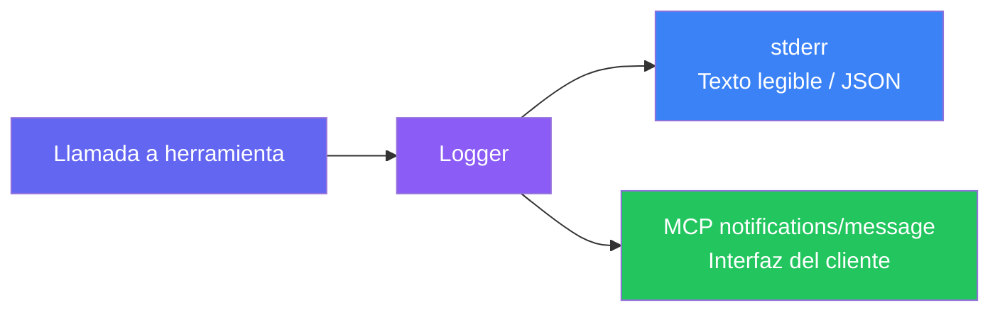

import { Badge } from "@astrojs/starlight/components";

GitLab MCP Server utiliza **registro dual** — los mensajes de log se envían tanto a stderr (para captura en terminal/archivo) como al cliente MCP a través de la capacidad de logging del protocolo.

## Salida dual



| Destino           | Formato                 | Propósito                                                                         |
| ----------------- | ----------------------- | --------------------------------------------------------------------------------- |
| **stderr**        | Texto legible o JSON    | Salida de terminal, redirección a archivo, depuración                             |
| **Protocolo MCP** | `notifications/message` | Mostrado en la interfaz del cliente MCP (por ejemplo, panel de salida de VS Code) |

Esto garantiza que los logs siempre sean visibles independientemente del soporte de logging del cliente.

## Niveles de log

### Niveles de stderr (`LOG_LEVEL`)

La variable de entorno `LOG_LEVEL` acepta cuatro valores:

| Nivel                                   | Cuándo se Usa                                                                                                                                         |
| --------------------------------------- | ----------------------------------------------------------------------------------------------------------------------------------------------------- |
| <Badge text="debug" variant="note" />   | Información de diagnóstico detallada — parámetros de llamadas a herramientas, detalles de peticiones/respuestas API, operaciones del pool de sesiones |
| <Badge text="info" variant="success" /> | Eventos operativos normales — inicio del servidor, registro de herramientas, comprobaciones de actualización                                          |
| <Badge text="warn" variant="caution" /> | Problemas no fatales — tiempos de espera de red, configuración opcional faltante, uso obsoleto                                                        |
| <Badge text="error" variant="danger" /> | Fallos — errores de autenticación, fallos de API, errores irrecuperables de herramientas                                                              |

### Niveles del protocolo MCP (RFC 5424)

Las notificaciones MCP `notifications/message` soportan los ocho niveles de severidad RFC 5424. Los clientes pueden filtrar mediante `logging/setLevel`:

| Nivel                                       | Severidad | Cuándo se Usa                                                    |
| ------------------------------------------- | --------- | ---------------------------------------------------------------- |
| <Badge text="debug" variant="note" />       | Mínima    | Detalles de diagnóstico (parámetros de herramientas, trazas API) |
| <Badge text="info" variant="success" />     |           | Eventos normales (inicio, registro)                              |
| <Badge text="notice" variant="note" />      |           | Condiciones significativas pero normales                         |
| <Badge text="warning" variant="caution" />  |           | Problemas potenciales (timeouts, deprecaciones)                  |
| <Badge text="error" variant="danger" />     |           | Fallos en operaciones (errores API, fallos de autenticación)     |
| <Badge text="critical" variant="danger" />  |           | Condiciones críticas que requieren atención inmediata            |
| <Badge text="alert" variant="danger" />     |           | Se debe actuar inmediatamente                                    |
| <Badge text="emergency" variant="danger" /> | Máxima    | El sistema no es utilizable                                      |

## Configuración

Establece el nivel de log mediante variable de entorno:

```bash
# Modo stdio
LOG_LEVEL=debug ./gitlab-mcp-server

# Modo HTTP
LOG_LEVEL=info ./gitlab-mcp-server --http --gitlab-url=https://gitlab.example.com
```

El nivel predeterminado es `info`.

## Mensajes de log MCP

Cuando el cliente MCP soporta logging, el servidor envía notificaciones de log estructuradas:

```json
{
	"jsonrpc": "2.0",
	"method": "notifications/message",
	"params": {
		"level": "info",
		"logger": "gitlab-mcp-server",
		"data": {
			"message": "starting MCP server",
			"transport": "stdio",
			"version": "2.1.0",
			"tools": 40,
			"resources": 24,
			"prompts": 38
		}
	}
}
```

### Reglas de seguridad

Los mensajes de log siguen reglas estrictas de seguridad:

- **Sin tokens** — Los tokens de GitLab nunca se incluyen en los mensajes de log
- **Identificadores enmascarados** — En modo HTTP, los tokens se muestran como `...a1b2` (solo los últimos 4 caracteres)
- **Sin PII** — Los datos enviados por el usuario no se registran en nivel `info` o superior
- **Solo debug** — Los datos detallados de petición/respuesta solo se registran en nivel `debug`

:::tip
En VS Code, visualiza los logs del servidor MCP mediante `Ctrl+Shift+P` → **MCP: List Servers** → selecciona el servidor → **Show Output**.
:::
