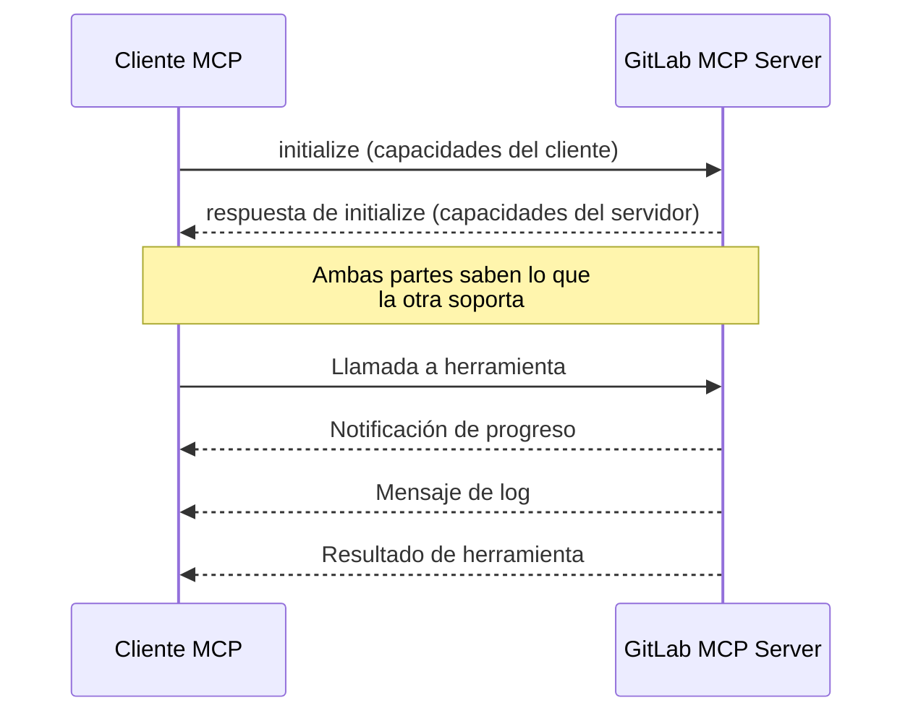

GitLab MCP Server implementa 7 capacidades del protocolo MCP que mejoran la forma en que los asistentes de IA interactúan con GitLab. Estas capacidades van más allá de las llamadas básicas a herramientas para proporcionar interacciones más ricas e inteligentes.

## Resumen de capacidades

| Capacidad                                   | Dirección          | Qué Habilita                                                                                   |
| ------------------------------------------- | ------------------ | ---------------------------------------------------------------------------------------------- |
| [Logging](/es/capabilities/logging)         | Servidor → Cliente | Mensajes de log estructurados enviados al cliente MCP para visibilidad                         |
| [Progress](/es/capabilities/progress)       | Servidor → Cliente | Actualizaciones de progreso en tiempo real para operaciones de larga duración                  |
| [Roots](/es/capabilities/roots)             | Cliente → Servidor | Contexto del workspace — auto-detectar proyecto de GitLab desde el repositorio git local       |
| [Sampling](/es/capabilities/sampling)       | Servidor → Cliente | Análisis impulsado por IA — el servidor envía datos de GitLab al LLM del cliente para análisis |
| [Elicitation](/es/capabilities/elicitation) | Servidor → Cliente | Asistentes interactivos — formularios paso a paso para crear recursos complejos                |
| [Completions](/es/capabilities/completions) | Cliente → Servidor | Autocompletado de argumentos para nombres de proyectos, ramas, usuarios y más                  |
| [Icons](/es/capabilities/icons)             | Servidor → Cliente | Iconos SVG para cada herramienta, recurso y prompt                                             |

## Cómo funcionan las capacidades

Las capacidades se negocian durante el handshake de inicialización MCP entre el cliente y el servidor:

**Capacidades declaradas por el servidor** (Logging, Completions) están siempre disponibles. **Capacidades dependientes del cliente** (Roots, Sampling, Elicitation) requieren que el cliente MCP declare soporte — el servidor verifica su presencia antes de usarlas y degrada gracefully cuando no están disponibles.

## Soporte de clientes

No todos los clientes MCP soportan todas las capacidades. El servidor se adapta automáticamente:

| Capacidad   | Claude Desktop | VS Code Copilot | Cursor | Claude Code |
| ----------- | -------------- | --------------- | ------ | ----------- |
| Logging     | ✅             | ✅              | ✅     | ✅          |
| Progress    | ✅             | ✅              | ✅     | ✅          |
| Completions | ✅             | ✅              | ❓     | ✅          |
| Roots       | ✅             | ✅              | ❓     | ✅          |
| Sampling    | ✅             | ❌              | ❌     | ✅          |
| Elicitation | ✅             | ❌              | ❌     | ✅          |
| Icons       | ✅             | ✅              | ✅     | ✅          |

:::note
El soporte de los clientes evoluciona rápidamente. Consulta la documentación de tu cliente MCP para el soporte de capacidades más actualizado.
:::
