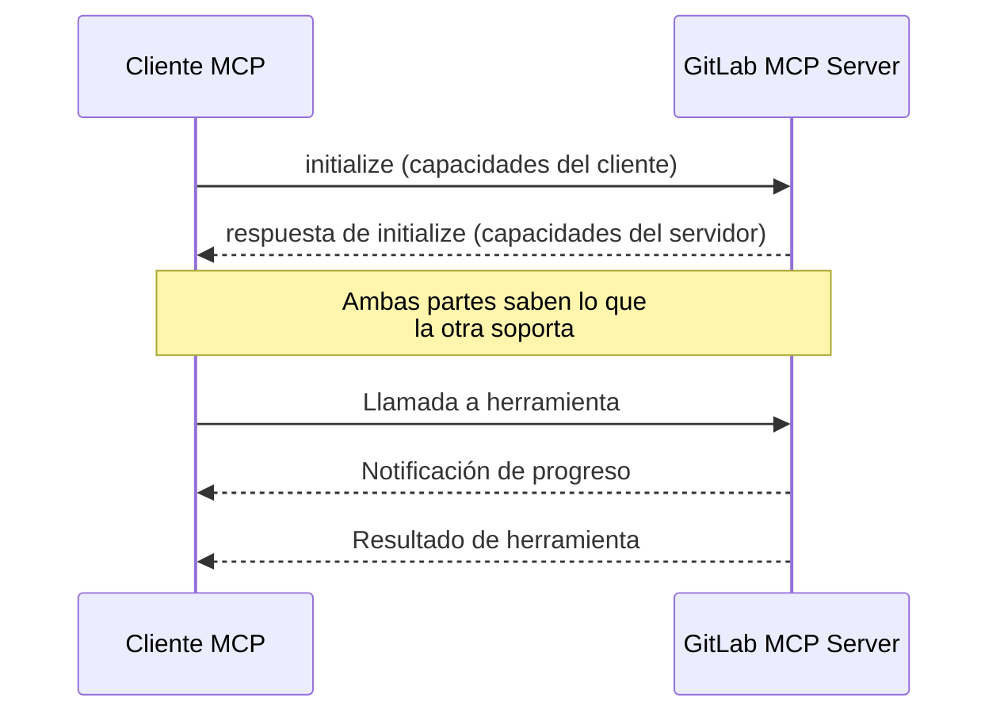

import FAQ from "../../../../components/FAQ.astro";

GitLab MCP Server implementa **tres capacidades del protocolo MCP** —progreso, elicitación y autocompletado— que van más allá de la llamada básica a herramientas para que los asistentes de IA sean más precisos e interactivos al trabajar con GitLab. Además adjunta **metadatos de iconos** a cada herramienta, recurso y prompt. En conjunto, estas funciones permiten a los asistentes informar del progreso, pedir información al usuario mediante formularios estructurados, autocompletar valores de argumentos y mostrar iconos reconocibles por dominio.

Las tres capacidades se negocian durante el handshake de inicialización MCP, mientras que los iconos son metadatos de presentación que los clientes renderizan o ignoran. Ninguno es obligatorio para que funcionen las llamadas básicas a herramientas: cuando un cliente carece de soporte, el servidor degrada de forma elegante y la operación de GitLab subyacente se completa igualmente.

## ¿Qué capacidades proporciona GitLab MCP Server?

GitLab MCP Server proporciona cuatro funciones diferenciadas, resumidas a continuación. El progreso y la elicitación envían información del servidor al cliente, el autocompletado obtiene sugerencias del servidor bajo demanda y los iconos son metadatos estáticos adjuntos a cada superficie.

| Capacidad                                                        | Dirección          | Qué Habilita                                                                    |
| ---------------------------------------------------------------- | ------------------ | ------------------------------------------------------------------------------- |
| [Progress](/gitlab-mcp-server/es/capabilities/progress/)         | Servidor → Cliente | Actualizaciones de progreso en tiempo real para operaciones de larga duración   |
| [Elicitation](/gitlab-mcp-server/es/capabilities/elicitation/)   | Servidor → Cliente | Asistentes interactivos — formularios paso a paso para crear recursos complejos |
| [Completions](/gitlab-mcp-server/es/capabilities/completions/)   | Cliente → Servidor | Autocompletado de argumentos para nombres de proyectos, ramas, usuarios y más   |
| [Icons](/gitlab-mcp-server/es/capabilities/icons/) _(metadatos)_ | Servidor → Cliente | Iconos SVG para cada herramienta, recurso y prompt                              |

## ¿Cómo se negocian las capacidades MCP?

Las capacidades se negocian una vez, durante el handshake de inicialización MCP entre el cliente y el servidor. Cada parte anuncia lo que admite, de modo que ninguna intenta usar una función que la otra no puede manejar. Tras el handshake, el servidor puede enviar notificaciones de progreso y solicitudes de elicitación, y el cliente puede pedir autocompletado.

```mermaid
sequenceDiagram
    participant C as Cliente MCP
    participant S as GitLab MCP Server

    C->>S: initialize (capacidades del cliente)
    S-->>C: respuesta de initialize (capacidades del servidor)
    Note over C,S: Ambas partes saben lo que<br/>la otra soporta

    C->>S: Llamada a herramienta
    S-->>C: Notificación de progreso
    S-->>C: Resultado de herramienta
```

**Las capacidades declaradas por el servidor** (autocompletado) están siempre disponibles porque GitLab MCP Server las anuncia de forma incondicional. **Las capacidades dependientes del cliente** (elicitación) requieren que el cliente MCP declare soporte — el servidor lo comprueba antes de usar la capacidad y degrada de forma elegante cuando no está disponible, recurriendo a las herramientas parametrizadas estándar para no perder funcionalidad.

## ¿Qué clientes MCP admiten cada capacidad?

El soporte de capacidades varía según el cliente MCP, y GitLab MCP Server se adapta automáticamente a lo que anuncie el cliente conectado. La tabla siguiente refleja clientes habituales en el momento de redactar esta página; como el soporte de los clientes evoluciona rápidamente, confirma el estado actual en la documentación de cada cliente.

| Capacidad   | Claude Desktop | VS Code Copilot | Cursor | Claude Code |
| ----------- | -------------- | --------------- | ------ | ----------- |
| Progress    | ✅              | ✅               | ✅      | ✅           |
| Completions | ✅              | ✅               | ❓      | ✅           |
| Elicitation | ✅              | ❌               | ❌      | ✅           |
| Icons¹      | ❌              | ✅               | ❓      | ❌           |

¹ Los iconos no son una capacidad negociada: el servidor los adjunta siempre y
un cliente que no puede renderizarlos simplemente los ignora, sin perder nada
funcional. La columna registra por tanto si un cliente los _renderiza_, no si
declara soporte. Consulta [Iconos](../icons/) para la matriz completa.

:::note
El soporte de los clientes evoluciona rápidamente. Consulta la documentación de tu cliente MCP para el soporte de capacidades más actualizado.
:::

<FAQ />

## Referencia de la fuente

:::note[Documentación para desarrolladores]
Esta página es la visión general orientada a usuarios. Para la referencia completa de capacidades, consulta [docs/reference/capabilities](https://github.com/jmrplens/gitlab-mcp-server/blob/main/docs/reference/capabilities/README.md).
:::
