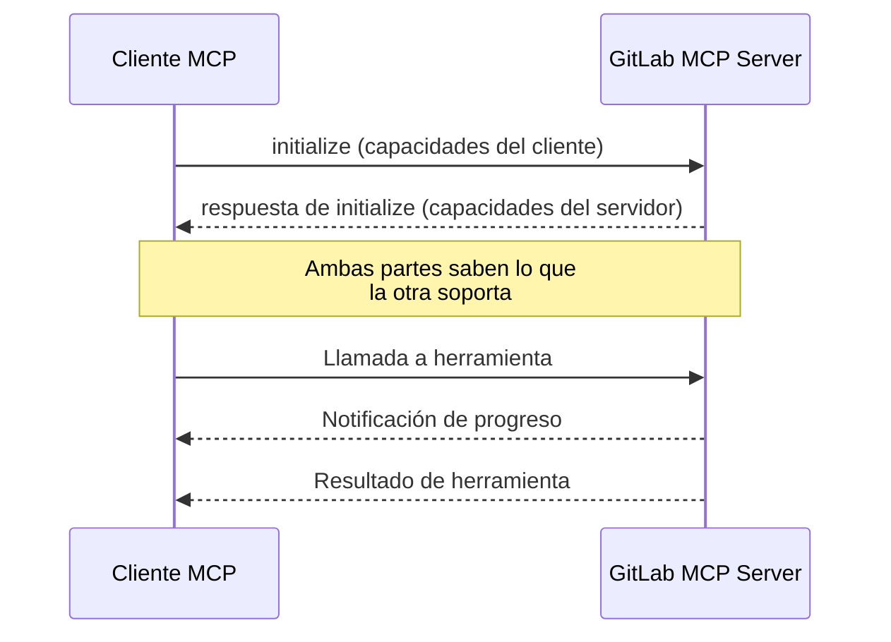

import stats from "../../../../data/stats.json";
import FAQ from "../../../../components/FAQ.astro";

GitLab MCP Server implementa las **4 capacidades MCP** que describe esta sección: progreso, elicitación, autocompletado y suscripciones a recursos. Van más allá de la llamada básica a herramientas para que los asistentes de IA sean más precisos e interactivos al trabajar con GitLab. Además adjunta **metadatos de iconos** a cada herramienta, recurso y prompt. En conjunto, estas funciones permiten a los asistentes informar del progreso, pedir información al usuario mediante formularios estructurados, autocompletar los argumentos de prompts y plantillas de recurso, vigilar recursos de GitLab en busca de cambios y mostrar iconos reconocibles por dominio.

Ninguna de las {stats.capabilities} capacidades es obligatoria para que funcionen las llamadas básicas a herramientas: cuando un cliente carece de soporte, el servidor se degrada de forma controlada y la operación de GitLab subyacente se completa igualmente. Los iconos son metadatos de presentación que los clientes renderizan o ignoran, no una capacidad que declare ninguna de las partes.

## ¿Qué capacidades proporciona GitLab MCP Server?

GitLab MCP Server proporciona cinco funciones diferenciadas, resumidas a continuación. El progreso es una notificación que el servidor envía mientras trabaja en una llamada; la elicitación es una petición que el servidor envía al cliente, que responde con lo que introdujo el usuario; el autocompletado son peticiones que el cliente envía cuando quiere sugerencias; las suscripciones notifican al cliente cuando un recurso vigilado cambia; y los iconos son metadatos estáticos adjuntos a cada superficie.

| Capacidad                                                          | Dirección                                                           | Qué Habilita                                                                                                                                                                                                   |
| ------------------------------------------------------------------ | ------------------------------------------------------------------- | -------------------------------------------------------------------------------------------------------------------------------------------------------------------------------------------------------------- |
| [Progreso](/gitlab-mcp-server/es/capabilities/progress/)           | Servidor → Cliente (notificación, para una llamada con token)       | Actualizaciones de progreso en tiempo real para operaciones de larga duración                                                                                                                                  |
| [Elicitación](/gitlab-mcp-server/es/capabilities/elicitation/)     | Servidor → Cliente (petición; el cliente responde)                  | Cuatro flujos guiados interactivos (issue, merge request, release, proyecto): formularios paso a paso para crear recursos complejos                                                                            |
| [Autocompletado](/gitlab-mcp-server/es/capabilities/completions/)  | Cliente → Servidor (petición)                                       | Autocompletado de argumentos de prompts y plantillas de recurso: rutas de proyecto, ramas, usuarios y más                                                                                                      |
| [Suscripciones](/gitlab-mcp-server/es/capabilities/subscriptions/) | Cliente → Servidor (petición; actualizaciones Servidor → Cliente)   | Notificaciones de cambio en vivo para 26 tipos de recurso de GitLab, atendidas mediante sondeo (solo `GITLAB_MCP_CAPABILITY_SURFACE=full`)                                                                     |
| [Iconos](/gitlab-mcp-server/es/capabilities/icons/) _(metadatos)_  | Servidor → Cliente (en cada listado y en la identidad del servidor) | 52 iconos: 51 para herramientas, recursos y prompts, más la marca que identifica al propio servidor. Cada uno es una entrada SVG más variantes WebP clara y oscura, transportadas como URIs de datos en base64 |

## ¿Cómo se negocian las capacidades MCP?

Las capacidades se declaran cuando empieza una sesión. En el protocolo 2025-11-25 y anteriores, ambas partes las indican en el handshake `initialize`. En el protocolo 2026-07-28 el servidor publica la misma declaración en su respuesta a `server/discover`, y el cliente indica sus propias capacidades en cada petición. Cada parte anuncia lo que admite, de modo que ninguna intenta usar una función que la otra no puede manejar. El progreso no forma parte de ninguna de las dos declaraciones: el cliente lo pide en cada llamada adjuntando un token de progreso a la petición. La [especificación de MCP](https://modelcontextprotocol.io/specification/) define cada capacidad y la forma en que se declara.

```mermaid
sequenceDiagram
    participant C as Cliente MCP
    participant S as GitLab MCP Server

    C->>S: initialize (capacidades del cliente)
    S-->>C: respuesta de initialize (capacidades del servidor)
    Note over C,S: Ambas partes saben lo que<br/>la otra soporta

    C->>S: Llamada a herramienta
    S-->>C: Notificación de progreso
    S-->>C: Resultado de herramienta
```

**Las capacidades declaradas por el servidor** son las que GitLab MCP Server anuncia por sí mismo: el autocompletado en todas las superficies de capacidades, y las suscripciones a recursos solo con `GITLAB_MCP_CAPABILITY_SURFACE=full` (la tabla siguiente recoge la declaración completa). **Las capacidades dependientes del cliente** (elicitación) requieren que el cliente MCP declare soporte: el servidor lo comprueba antes de usar la capacidad y se degrada de forma controlada cuando no está disponible, indicando la acción parametrizada estándar para no perder funcionalidad. **El progreso** no depende de ninguna de las dos declaraciones, solo del token de progreso que lleve la llamada.

## ¿Qué declara el servidor?

Lo que el servidor declara depende de la superficie de capacidades (`GITLAB_MCP_CAPABILITY_SURFACE`, o `--capability-surface` en modo HTTP), y de nada más: la superficie de herramientas, el tier y el token nunca lo cambian.

| Declaración                         | `full` | `minimal` | Notas                                                                                                     |
| ----------------------------------- | :----: | :-------: | --------------------------------------------------------------------------------------------------------- |
| `tools` con `listChanged: true`     |   ✅    |     ✅     | La ejecución de herramientas funciona en ambas superficies                                                |
| `resources` con `listChanged: true` |   ✅    |     ✅     | Minimal registra solo `gitlab://tools` y `gitlab://tools/{id}`, la forma exacta de llamada de cada acción |
| `resources.subscribe`               |   ✅    |     ❌     | El servidor lo indica explícitamente, ver más abajo                                                       |
| `prompts` con `listChanged: true`   |   ✅    |     ❌     | Full registra además el catálogo completo de prompts y recursos                                           |
| `completions`                       |   ✅    |     ✅     | Se declara porque el manejador de autocompletado está siempre instalado                                   |
| `logging`                           |   ❌    |     ❌     | Nunca se declara                                                                                          |

Los métodos que la declaración deja fuera se rechazan con `-32601` (método no encontrado) en lugar de responderse: `logging/setLevel` en todas las superficies, y `prompts/list`, `prompts/get` y `resources/subscribe` en minimal. El manejo del progreso sigue disponible en ambas superficies, porque no necesita declaración.

**Por qué `resources.subscribe` se indica explícitamente.** El SDK de MCP sobre el que está construido el servidor activaría el bit por sí solo, pero únicamente cuando ya se ha registrado algún recurso, y el servidor responde al handshake mientras su catálogo todavía se está registrando. Un cliente al que en ese momento se le dice que los recursos no admiten suscripción no vuelve a preguntar, así que en la superficie full el servidor indica el bit por sí mismo. En minimal no hay nada a lo que suscribirse, y el bit queda desactivado.

**Cómo se comprueban las capacidades del cliente.** La elicitación no la declara el servidor; la declara el cliente, y el servidor lee esa declaración en cada llamada, en el momento en que un flujo guiado la necesita: de los metadatos de la propia petición en el protocolo 2026-07-28, y de lo que el cliente envió en `initialize` en las revisiones anteriores. Un flujo guiado que no encuentra soporte de elicitación responde con un mensaje que nombra la acción estándar que recibe todos los campos en una sola llamada (`issue.create`, `merge_request.create`, `project.create` o `release.create`).

## ¿Qué garantiza el servidor?

Esto se cumple para todas las capacidades, en todas las superficies y transportes:

- **Una capacidad ausente no hace nada, nunca es un error por sí misma.** Una llamada sin token de progreso se ejecuta exactamente igual que con uno, salvo por las notificaciones, y una notificación de progreso que no se puede enviar nunca hace fallar la llamada. No hay nada que activar, y nada se rompe cuando un cliente admite menos.
- **Las respuestas se comprueban antes de usarse.** Cada respuesta que un cliente devuelve a una elicitación se valida antes de que el servidor actúe sobre ella: una respuesta de texto debe ser texto, una elección debe ser una de las opciones ofrecidas, un número debe estar dentro de sus límites, una confirmación debe ser un sí o un no, y un formulario construido a partir de un esquema arbitrario se valida contra ese esquema. Una respuesta que no encaja se rechaza como una respuesta que el servidor no pudo leer; nunca se toma como que el usuario la rechazó o la canceló.
- **Degradación elegante.** Un cliente al que le falta una capacidad pierde solo esa capacidad: las herramientas, los recursos y los prompts siguen funcionando, y el servidor nunca se detiene porque un cliente admita menos de lo que podría.

## ¿Qué clientes MCP admiten cada capacidad?

El soporte de capacidades varía según el cliente MCP, y GitLab MCP Server se adapta automáticamente a lo que anuncie el cliente conectado. La tabla siguiente refleja clientes habituales en el momento de redactar esta página; como el soporte de los clientes evoluciona rápidamente, confirma el estado actual en la documentación de cada cliente.

| Capacidad      | Claude Desktop | VS Code Copilot | Cursor | Claude Code |
| -------------- | -------------- | --------------- | ------ | ----------- |
| Progreso       | ✅              | ✅               | ✅      | ✅           |
| Autocompletado | ✅              | ✅               | ❓      | ✅           |
| Elicitación    | ❓              | ✅               | ✅      | ✅           |
| Suscripciones² | ❓              | ✅               | ❓      | ❓           |
| Iconos¹        | ❌              | ✅               | ❓      | ❌           |

² VS Code se suscribe automáticamente a cada recurso que lee y encamina
`resources/updated` a su pipeline de cambios de archivo. Cursor envía
peticiones `resources/subscribe` (incluso a servidores que no anuncian la
capacidad), pero no está verificado si muestra las notificaciones
resultantes — como tampoco lo está el manejo de suscripciones en Claude
Desktop y Claude Code. Los clientes que nunca se suscriben no pierden nada:
los recursos siguen siendo legibles bajo demanda.

La fila de elicitación sigue la documentación de cada cliente, enlazada desde
[¿Qué requiere la elicitación?](/gitlab-mcp-server/es/capabilities/elicitation/#qué-requiere-la-elicitación).

¹ Los iconos no son una capacidad negociada: el servidor los adjunta siempre y
un cliente que no puede renderizar ninguno de ellos simplemente los ignora,
sin perder nada funcional. La columna registra si un cliente renderiza al
menos una de las tres entradas que gitlab-mcp-server adjunta a cada icono
—un SVG escalable más variantes WebP clara/oscura—, no si admite todos los
formatos. VS Code Copilot, por ejemplo, rechaza la entrada SVG
(`image/svg+xml` no está en su lista de MIME permitidos) pero renderiza la
variante WebP que coincide con su tema. Consulta
[Iconos](/gitlab-mcp-server/es/capabilities/icons/) para la matriz completa.

:::note
El soporte de los clientes evoluciona rápidamente. Consulta la documentación de tu cliente MCP para el soporte de capacidades más actualizado.
:::

<FAQ />
