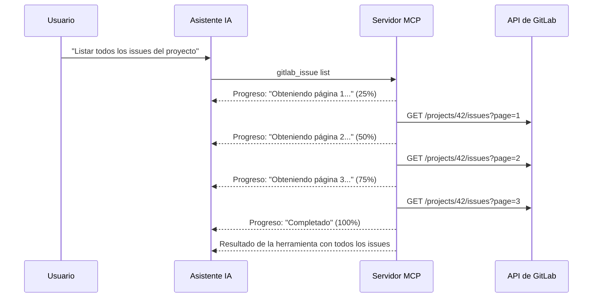

GitLab MCP Server envía notificaciones de progreso en tiempo real durante operaciones de larga duración, permitiendo a los clientes MCP mostrar indicadores de progreso al usuario.

## Cómo Funciona

Cuando una herramienta realiza múltiples pasos o procesa grandes conjuntos de datos, el servidor envía mensajes `notifications/progress` al cliente:



## Casos de Uso

El reporte de progreso se utiliza para operaciones que pueden tardar varios segundos:

| Operación | Detalle del Progreso |
|---|---|
| **Recuperación de listas paginadas** | Progreso de obtención página por página |
| **Operaciones masivas** | Progreso por elemento (por ejemplo, actualización masiva de issues) |
| **Análisis por sampling** | Fases de recopilación de datos → análisis LLM |
| **Importación CSV** | Progreso de importación fila por fila |
| **Actualización automática** | Pasos de descarga y aplicación |

## Visualización en el Cliente

La forma en que se muestra el progreso depende del cliente MCP:

- **VS Code / Copilot** — Indicador de progreso en la barra de estado o panel de salida
- **Claude Desktop** — Texto de progreso mostrado durante la ejecución de la herramienta
- **Claude Code** — Actualizaciones de progreso en tiempo real en la terminal

## Formato del Mensaje de Progreso

Las notificaciones de progreso siguen el formato del protocolo MCP:

```json
{
  "jsonrpc": "2.0",
  "method": "notifications/progress",
  "params": {
    "progressToken": "tool-call-123",
    "progress": 50,
    "total": 100,
    "message": "Fetching page 2 of 4..."
  }
}
```

| Campo | Descripción |
|---|---|
| `progressToken` | ID de correlación que vincula el progreso con la llamada original a la herramienta |
| `progress` | Número de paso actual |
| `total` | Número total de pasos (cuando se conoce) |
| `message` | Descripción legible del paso actual |

:::note
Las notificaciones de progreso son de mejor esfuerzo. Si el cliente MCP no soporta la visualización de progreso, las notificaciones se ignoran silenciosamente y la herramienta se completa normalmente.
:::
