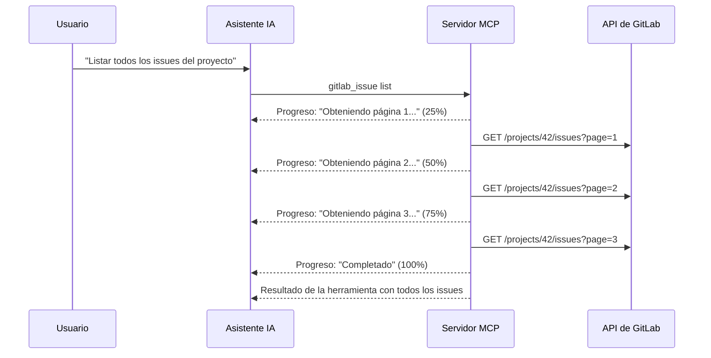

import FAQ from "../../../../components/FAQ.astro";

GitLab MCP Server envía **notificaciones de progreso en tiempo real durante operaciones de larga duración**, para que los clientes MCP puedan mostrar indicadores de progreso al usuario en lugar de una espera opaca. Cuando una herramienta abarca varios pasos o procesa grandes conjuntos de datos, el servidor emite mensajes `notifications/progress` que informan de cuánto ha avanzado el trabajo.

El progreso es de **mejor esfuerzo**: mejora la experiencia de usuario pero nunca es obligatorio para la corrección. Los clientes que no pueden mostrar el progreso ignoran silenciosamente las notificaciones, y la herramienta devuelve igualmente su resultado completo con normalidad.

## ¿Cómo funciona el reporte de progreso?

Cuando una herramienta realiza múltiples pasos o procesa grandes conjuntos de datos, el servidor envía mensajes `notifications/progress` al cliente a medida que avanza el trabajo. Cada mensaje se correlaciona con la llamada original a la herramienta, de modo que el cliente puede asociar la actualización a la solicitud correcta y mostrar un indicador de progreso mientras se sigue ensamblando el resultado final.


```mermaid
sequenceDiagram
    participant U as Usuario
    participant AI as Asistente IA
    participant S as Servidor MCP
    participant GL as API de GitLab

    U->>AI: "Listar todos los issues del proyecto"
    AI->>S: gitlab_issue list
    S-->>AI: Progreso: "Obteniendo página 1..." (25%)
    S->>GL: GET /projects/42/issues?page=1
    S-->>AI: Progreso: "Obteniendo página 2..." (50%)
    S->>GL: GET /projects/42/issues?page=2
    S-->>AI: Progreso: "Obteniendo página 3..." (75%)
    S->>GL: GET /projects/42/issues?page=3
    S-->>AI: Progreso: "Completado" (100%)
    S-->>AI: Resultado de la herramienta con todos los issues
```

## ¿Cuándo envía el servidor actualizaciones de progreso?

El reporte de progreso se utiliza para operaciones que pueden tardar varios segundos. En cada caso, la notificación describe lo que el servidor está haciendo en ese momento, de modo que el usuario percibe movimiento en lugar de una llamada bloqueada.

| Operación                            | Detalle del Progreso                                                |
| ------------------------------------ | ------------------------------------------------------------------- |
| **Recuperación de listas paginadas** | Progreso de obtención página por página                             |
| **Operaciones masivas**              | Progreso por elemento (por ejemplo, actualización masiva de issues) |
| **Importación CSV**                  | Progreso de importación fila por fila                               |
| **Actualización automática**         | Pasos de descarga y aplicación                                      |

## ¿Cómo muestran el progreso los clientes?

La forma en que se muestra el progreso depende del cliente MCP; el servidor emite las mismas notificaciones en todos los casos, y cada cliente las renderiza en su propia interfaz:

- **VS Code / Copilot** — Indicador de progreso en la barra de estado o panel de salida
- **Claude Desktop** — Texto de progreso mostrado durante la ejecución de la herramienta
- **Claude Code** — Actualizaciones de progreso en tiempo real en la terminal

## ¿Qué contiene una notificación de progreso?

Las notificaciones de progreso siguen el formato JSON-RPC del protocolo MCP. El objeto `params` lleva cuatro campos que, en conjunto, permiten a un cliente renderizar una barra de progreso o una línea de estado.

```json
{
	"jsonrpc": "2.0",
	"method": "notifications/progress",
	"params": {
		"progressToken": "tool-call-123",
		"progress": 50,
		"total": 100,
		"message": "Fetching page 2 of 4..."
	}
}
```

| Campo           | Descripción                                                                        |
| --------------- | ---------------------------------------------------------------------------------- |
| `progressToken` | ID de correlación que vincula el progreso con la llamada original a la herramienta |
| `progress`      | Número de paso actual                                                              |
| `total`         | Número total de pasos (cuando se conoce)                                           |
| `message`       | Descripción legible del paso actual                                                |

:::note
Las notificaciones de progreso son de mejor esfuerzo. Si el cliente MCP no soporta la visualización de progreso, las notificaciones se ignoran silenciosamente y la herramienta se completa normalmente.
:::

<FAQ />

## Referencia de la fuente

:::note[Documentación para desarrolladores]
Esta página es la visión general orientada a usuarios. Para la referencia completa de progreso, consulta [docs/reference/capabilities/progress](https://github.com/jmrplens/gitlab-mcp-server/blob/main/docs/reference/capabilities/progress.md).
:::
