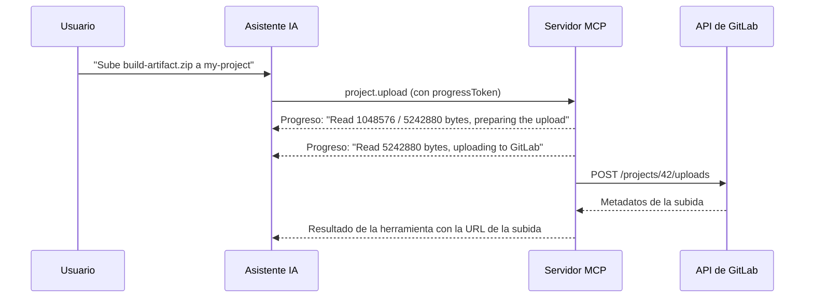

import FAQ from "../../../../components/FAQ.astro";

GitLab MCP Server envía **notificaciones de progreso en tiempo real durante operaciones de larga duración**, para que los clientes MCP puedan mostrar indicadores de progreso al usuario en lugar de una espera opaca. Cuando una herramienta abarca varios pasos, transmite una carga grande o sondea GitLab, el servidor emite mensajes `notifications/progress` que informan de cuánto ha avanzado el trabajo.

El progreso es de **mejor esfuerzo**: mejora la experiencia de usuario pero nunca es obligatorio para la corrección. Los clientes que no pueden mostrar el progreso ignoran silenciosamente las notificaciones, y la herramienta devuelve igualmente su resultado completo con normalidad.

## ¿Cómo funciona el reporte de progreso?

Cuando una herramienta realiza múltiples pasos, transmite una carga grande o sondea GitLab, el servidor envía mensajes `notifications/progress` al cliente a medida que avanza el trabajo. El cliente suministra un token de progreso con la llamada a la herramienta; cada mensaje lleva ese token, de modo que el cliente puede asociar la actualización a la solicitud correcta y mostrar un indicador de progreso mientras se sigue ensamblando el resultado final. Una llamada sin token no recibe notificaciones y por lo demás se comporta igual.


```mermaid
sequenceDiagram
    participant U as Usuario
    participant AI as Asistente IA
    participant S as Servidor MCP
    participant GL as API de GitLab

    U->>AI: "Sube build-artifact.zip a my-project"
    AI->>S: project.upload (con progressToken)
    S-->>AI: Progreso: "Read 1048576 / 5242880 bytes, preparing the upload"
    S-->>AI: Progreso: "Read 5242880 bytes, uploading to GitLab"
    S->>GL: POST /projects/42/uploads
    GL-->>S: Metadatos de la subida
    S-->>AI: Resultado de la herramienta con la URL de la subida
```

Los bytes miden la lectura, no la transferencia. El cliente de GitLab ensambla el cuerpo completo de la petición en memoria antes de enviar nada, así que todos los avisos se han emitido ya cuando el primer byte llega a la red, y la transferencia en sí no informa de nada hasta que termina.

## ¿Cuándo envía el servidor actualizaciones de progreso?

El reporte de progreso se utiliza para operaciones que pueden tardar varios segundos. En cada caso, la notificación describe lo que el servidor está haciendo en ese momento, de modo que el usuario percibe movimiento en lugar de una llamada bloqueada. Las herramientas simples de una sola petición como `branch.list` se completan demasiado rápido para informar de nada.

| Operación                   | Detalle del Progreso                                                                                                                                              |
| --------------------------- | ----------------------------------------------------------------------------------------------------------------------------------------------------------------- |
| **Subida de archivos**      | Contado en bytes mientras `project.upload` lee el contenido y prepara la petición                                                                                 |
| **Publicación de paquetes** | Contado en bytes mientras `package.publish` y `package.publish_and_link` leen el archivo; `package.publish_directory` cuenta todos los archivos en una sola serie |
| **Descarga de paquetes**    | Contado en bytes mientras `package.download` escribe el archivo en disco; el total no se conoce, así que se omite                                                 |
| **Acciones de espera**      | Cada sondeo de `pipeline.wait` y `job.wait` hasta que el pipeline o el job se asienta                                                                             |
| **Transferencias**          | Cada relectura de `project.transfer` y `group.transfer` hasta que el traslado se aplica                                                                           |
| **Asistentes interactivos** | Un aviso por fase de los cuatro flujos interactivos de creación (cuatro o cinco fases), y después un aviso final cuando el objeto ya existe                       |

Solo las llamadas a herramientas informan de progreso, en todas las superficies de herramientas: la acción ejecuta el mismo código tanto si se llama mediante `gitlab_execute_action` como mediante una meta-herramienta o una herramienta individual. En las acciones de espera y las transferencias el total no se conoce, así que `total` se omite y `progress` cuenta los intentos.

## ¿Qué pasos informan los asistentes?

Cada asistente interactivo envía un aviso al entrar en cada fase, y un aviso final cuando GitLab ya ha creado el objeto, de modo que la barra llega al 100% en lugar de quedarse un paso antes. Una fase puede contener varias preguntas: el asistente de issues pide el título y la descripción durante su primera fase. Los asistentes son las acciones `interactive.issue_create`, `interactive.mr_create`, `interactive.release_create` e `interactive.project_create`, registradas como las herramientas `gitlab_interactive_*` en las superficies meta e individual.

| Asistente                    | Fases | Mensajes, en orden                                                                                                                                                                           |
| ---------------------------- | :---: | -------------------------------------------------------------------------------------------------------------------------------------------------------------------------------------------- |
| `interactive.issue_create`   |   4   | `Collecting issue details...`, `Collecting optional fields...`, `Confirming issue creation...`, `Creating issue...`, y después `Issue created`                                               |
| `interactive.mr_create`      |   5   | `Collecting branch information...`, `Collecting MR details...`, `Collecting optional fields...`, `Confirming MR creation...`, `Creating merge request...`, y después `Merge request created` |
| `interactive.release_create` |   4   | `Collecting release details...`, `Collecting release description...`, `Confirming release creation...`, `Creating release...`, y después `Release created`                                   |
| `interactive.project_create` |   4   | `Collecting project details...`, `Collecting project settings...`, `Confirming project creation...`, `Creating project...`, y después `Project created`                                      |

Una fase envía como `progress` su número menos uno (la primera fase de cuatro envía `0` con `total` 4), y el aviso final envía `progress` igual a `total`. Un asistente que el usuario cancela, o que falla, se detiene donde está y no envía el aviso final.

## ¿Cómo se configura el progreso?

No hay ningún ajuste que active el progreso. Está activo en cualquier llamada a herramienta que lleve un token de progreso (`_meta.progressToken` en la petición `tools/call`), e inactivo en la que no lo lleva, donde cada actualización de progreso se omite sin coste. Dentro de una llamada el valor de `progress` solo aumenta: una actualización que no lo aumentaría se descarta. Una llamada cancelada deja de informar en el acto.

Por dónde viajan los avisos depende del transporte:

| Transporte                                           | Por dónde viaja el progreso                                                                                                                        |
| ---------------------------------------------------- | -------------------------------------------------------------------------------------------------------------------------------------------------- |
| stdio                                                | Por la misma tubería, mientras se ejecuta la llamada                                                                                               |
| HTTP, respuestas SSE (por defecto)                   | En la respuesta `text/event-stream` del POST que lleva la llamada, con o sin estado                                                                |
| HTTP con `--json-response`, sin estado (por defecto) | Por ninguna parte: el progreso se descarta. Las herramientas siguen funcionando y devuelven su resultado; no informan de nada mientras se ejecutan |
| HTTP con `--json-response` y `--stateless=false`     | Solo a un cliente que mantiene abierto su stream `GET` independiente, fuera de banda por ese stream en lugar de junto a su llamada                 |

**`--json-response` desactiva el progreso en un despliegue sin estado**, y en uno con estado para cualquier cliente que no mantenga abierto un stream. Un cuerpo de respuesta JSON lleva una respuesta y ningún otro aviso, así que una notificación generada mientras se ejecuta una llamada no tiene por dónde viajar en él: va al stream SSE independiente, que un despliegue sin estado nunca abre porque responde a `GET` con `405`. El servidor avisa una vez al arrancar cuando se pasa el flag. Consulta [Modo sin estado](/gitlab-mcp-server/es/operations/http-server/#modo-sin-estado-stateless) para el transporte en sí.

## Seguridad

- **Tokens opacos.** Un token de progreso es un valor que elige el cliente. El servidor lo devuelve tal como llegó, nunca lo registra en el log por encima del nivel debug y nunca lo incluye en un mensaje de error.
- **Sin impacto en la llamada.** Una notificación de progreso que no se puede enviar se registra a nivel debug y se ignora: la herramienta continúa y devuelve su resultado igualmente.
- **Inactivo significa silencioso.** Una llamada sin token, o sin una sesión por la que enviar, convierte cada actualización de progreso en una operación vacía, así que ninguna ruta del código depende de que el progreso se entregue.
- **Nada nuevo en los mensajes.** Un mensaje describe el trabajo con lo que la llamada ya recibió o ya leyó: recuentos de bytes, un nombre de archivo, el ID de un pipeline o un job con su número de intento, el namespace al que se mueve un proyecto. Nunca lleva una credencial ni el contenido de un archivo.

## ¿Cómo muestran el progreso los clientes?

La forma en que se muestra el progreso depende del cliente MCP; el servidor emite las mismas notificaciones en todos los casos, y cada cliente las renderiza en su propia interfaz:

- **VS Code / Copilot** — Indicador de progreso en la barra de estado o panel de salida
- **Claude Desktop** — Texto de progreso mostrado durante la ejecución de la herramienta
- **Claude Code** — Actualizaciones de progreso en tiempo real en la terminal

## ¿Qué contiene una notificación de progreso?

Las notificaciones de progreso siguen el formato JSON-RPC del protocolo MCP. El objeto `params` lleva cuatro campos que, en conjunto, permiten a un cliente renderizar una barra de progreso o una línea de estado.

```json
{
  "jsonrpc": "2.0",
  "method": "notifications/progress",
  "params": {
    "progressToken": "tool-call-123",
    "progress": 1048576,
    "total": 5242880,
    "message": "Read 1048576 / 5242880 bytes, preparing the upload"
  }
}
```

| Campo           | Descripción                                                                                                          |
| --------------- | -------------------------------------------------------------------------------------------------------------------- |
| `progressToken` | ID de correlación que vincula el progreso con la llamada original a la herramienta, suministrado por el cliente      |
| `progress`      | Progreso hasta ahora; las herramientas por pasos cuentan desde 0 (el paso 1 de 3 envía `0`), y el valor solo aumenta |
| `total`         | Cantidad total de trabajo (cuando se conoce)                                                                         |
| `message`       | Descripción legible del paso actual                                                                                  |

### Avisos de ejemplo

El asistente de issues, llamado con el token de progreso `wiz-1`, envía estos cinco avisos en orden:

| Aviso | `progress` | `total` | `message`                       |
| :---: | :--------: | :-----: | ------------------------------- |
|   1   |     0      |    4    | `Collecting issue details...`   |
|   2   |     1      |    4    | `Collecting optional fields...` |
|   3   |     2      |    4    | `Confirming issue creation...`  |
|   4   |     3      |    4    | `Creating issue...`             |
|   5   |     4      |    4    | `Issue created`                 |

Una acción de espera no conoce el total, así que `total` se omite y `progress` cuenta los sondeos. El tercer sondeo de `pipeline.wait` sobre el pipeline 41557 envía:

```json
{
  "jsonrpc": "2.0",
  "method": "notifications/progress",
  "params": {
    "progressToken": "call-42",
    "progress": 3,
    "message": "Polling pipeline #41557 (attempt 3, status check)..."
  }
}
```

`job.wait` escribe `Polling job #<id> (attempt <n>, status check)...` del mismo modo. Una transferencia repite un mismo mensaje en cada relectura, `Waiting for GitLab to move the project to <namespace>` o `Waiting for GitLab to move the group`, con `progress` contando las lecturas. Una subida termina su recuento de bytes con `Read <n> bytes, uploading to GitLab`, el momento en que la petición se entrega a GitLab, y una descarga de paquete informa `Downloaded <n> bytes`.

:::note
Las notificaciones de progreso son de mejor esfuerzo. Si el cliente MCP no soporta la visualización de progreso, las notificaciones se ignoran silenciosamente y la herramienta se completa normalmente.
:::

<FAQ />
