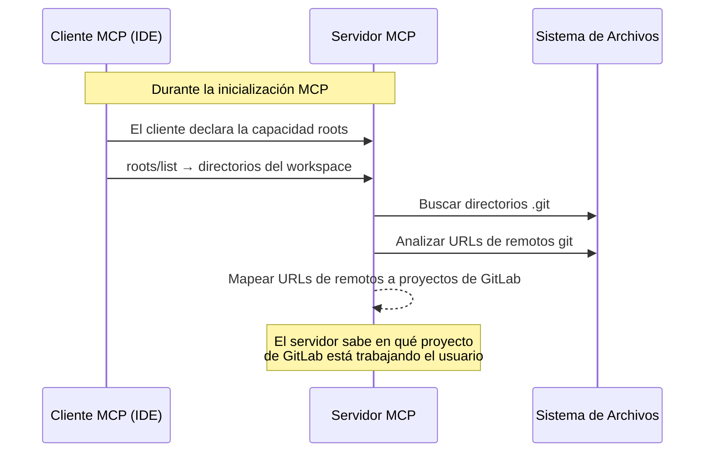

Roots permite al cliente MCP compartir sus directorios de workspace con el servidor, habilitando la detección automática del proyecto de GitLab en el que estás trabajando.

## El problema

Sin contexto del workspace, cada llamada a herramienta requiere un identificador de proyecto explícito:

```text
Usuario: "Listar ramas"
→ Error: project_id requerido
Usuario: "Listar ramas en el proyecto mi-grupo/mi-proyecto"
→ Devuelve ramas
```

Con roots, el servidor puede determinar el proyecto automáticamente desde tu repositorio git local.

## Cómo funciona



### Resolución de proyectos

El servidor resuelve proyectos de GitLab desde los roots del workspace mediante estos pasos:

1. **Recibir roots** — El cliente envía las rutas de sus directorios de workspace
2. **Detección de git** — El servidor busca directorios `.git` en el workspace
3. **Análisis de remotos** — Se analizan las URLs de remotos git (soporta formatos HTTPS y SSH)
4. **Coincidencia con GitLab** — Las URLs de remotos se comparan con la `GITLAB_URL` configurada para identificar el proyecto

Formatos de URL de remoto soportados:

| Formato | Ejemplo                                         |
| ------- | ----------------------------------------------- |
| HTTPS   | `https://gitlab.ejemplo.com/grupo/proyecto.git` |
| SSH     | `git@gitlab.ejemplo.com:grupo/proyecto.git`     |

### Herramienta de descubrimiento de proyectos

La herramienta `gitlab_resolve_project_from_remote` expone esta capacidad de resolución explícitamente. Toma una URL de remoto git y devuelve los detalles del proyecto de GitLab correspondiente, permitiendo al asistente de IA resolver el contexto del proyecto bajo demanda.

## Enriquecimiento automático de contexto

Cuando roots están disponibles, el servidor proporciona contexto del workspace a través del recurso `gitlab://workspace/roots`. Esto permite a los asistentes de IA comprender el contexto del proyecto actual del usuario y realizar llamadas a herramientas más informadas.

## Requisitos

Roots requiere que el cliente MCP declare la capacidad `roots` durante la inicialización. La mayoría de los clientes MCP modernos lo soportan:

- **VS Code / Copilot** — envía las rutas de carpetas del workspace
- **Claude Desktop** — envía los directorios de proyecto configurados
- **Claude Code** — envía el directorio de trabajo actual
