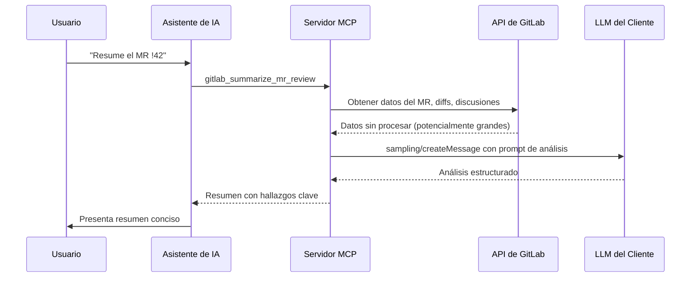

Sampling permite al servidor solicitar al LLM del cliente MCP que analice datos de GitLab — como obtener un resumen de un merge request con 50 comentarios o diagnosticar por qué falló un pipeline, sin leer cientos de líneas de log.

## Cómo Funciona

En lugar de devolver datos sin procesar para que la IA los analice, el servidor recopila datos de GitLab, los envía al LLM del cliente a través del método de protocolo `sampling/createMessage`, y devuelve el resultado del análisis.

### Las Cuatro Fases

1. **Recopilación de datos** — El servidor obtiene datos relevantes de las APIs de GitLab
2. **Construcción del prompt** — Los datos se formatean con un prompt de análisis específico para la tarea
3. **Análisis del LLM** — El prompt se envía al LLM del cliente vía sampling
4. **Entrega del resultado** — El análisis se devuelve como resultado de la herramienta

## Herramientas de Análisis

11 herramientas impulsadas por sampling están disponibles:

### Revisión de Código

| Herramienta                  | Descripción                                                                      |
| ---------------------------- | -------------------------------------------------------------------------------- |
| `gitlab_analyze_mr_changes`  | Analizar cambios de código del merge request en busca de calidad, bugs y mejoras |
| `gitlab_review_mr_security`  | Revisión enfocada en seguridad de los cambios del merge request                  |
| `gitlab_summarize_mr_review` | Resumir discusiones y feedback de revisión del merge request                     |

### Análisis de Issues

| Herramienta                  | Descripción                                                   |
| ---------------------------- | ------------------------------------------------------------- |
| `gitlab_summarize_issue`     | Resumen conciso de un issue con contexto completo y discusión |
| `gitlab_analyze_issue_scope` | Estimar complejidad y alcance de un issue                     |

### Análisis de CI/CD

| Herramienta                         | Descripción                                                       |
| ----------------------------------- | ----------------------------------------------------------------- |
| `gitlab_analyze_pipeline_failure`   | Diagnosticar por qué falló un pipeline con análisis de causa raíz |
| `gitlab_analyze_ci_configuration`   | Revisar `.gitlab-ci.yml` para mejores prácticas y problemas       |
| `gitlab_analyze_deployment_history` | Analizar patrones de despliegue y fiabilidad                      |

### Salud del Proyecto

| Herramienta                        | Descripción                                              |
| ---------------------------------- | -------------------------------------------------------- |
| `gitlab_generate_release_notes`    | Auto-generar notas de release desde issues del milestone |
| `gitlab_generate_milestone_report` | Reporte de progreso del sprint/milestone con métricas    |
| `gitlab_find_technical_debt`       | Identificar indicadores de deuda técnica en el proyecto  |

## Seguridad: Eliminación de Credenciales

Antes de enviar cualquier dato al LLM, el servidor elimina credenciales sensibles usando coincidencia de patrones regex:

| Patrón              | Ejemplos                                                       |
| ------------------- | -------------------------------------------------------------- |
| Tokens de GitLab    | `glpat-*`, `gloas-*`, `gldt-*`                                 |
| Credenciales de AWS | `AKIA*`, claves secretas de AWS                                |
| Tokens de Slack     | `xoxb-*`, `xoxp-*`                                             |
| JWTs                | `eyJ*` (JSON Web Tokens)                                       |
| Secretos genéricos  | Claves privadas, claves API que coinciden con patrones comunes |

Todos los patrones coincidentes se reemplazan con `[REDACTED]` antes de que los datos lleguen al LLM.

### Capas de Seguridad Adicionales

| Capa                                   | Protección                                                               |
| -------------------------------------- | ------------------------------------------------------------------------ |
| **Eliminación de credenciales**        | Eliminación basada en regex de tokens, claves y secretos                 |
| **Prevención de inyección de prompts** | El prompt del sistema instruye al LLM a ignorar intentos de inyección    |
| **Limitación de tamaño**               | Los datos de entrada se truncan para prevenir desbordamiento de contexto |
| **Prompt del sistema reforzado**       | Instrucciones enfocadas en análisis que resisten el uso indebido         |

## Requisitos

Sampling requiere que el cliente MCP soporte la capacidad de `sampling`. Durante la inicialización, el servidor verifica el soporte del cliente:

- **Soportado**: Claude Desktop, Claude Code
- **Aún no soportado**: VS Code Copilot, Cursor

Cuando sampling no está disponible, el servidor devuelve un mensaje útil explicando que la herramienta requiere un cliente con soporte de sampling, y sugiere usar las herramientas de obtención de datos subyacentes directamente.
