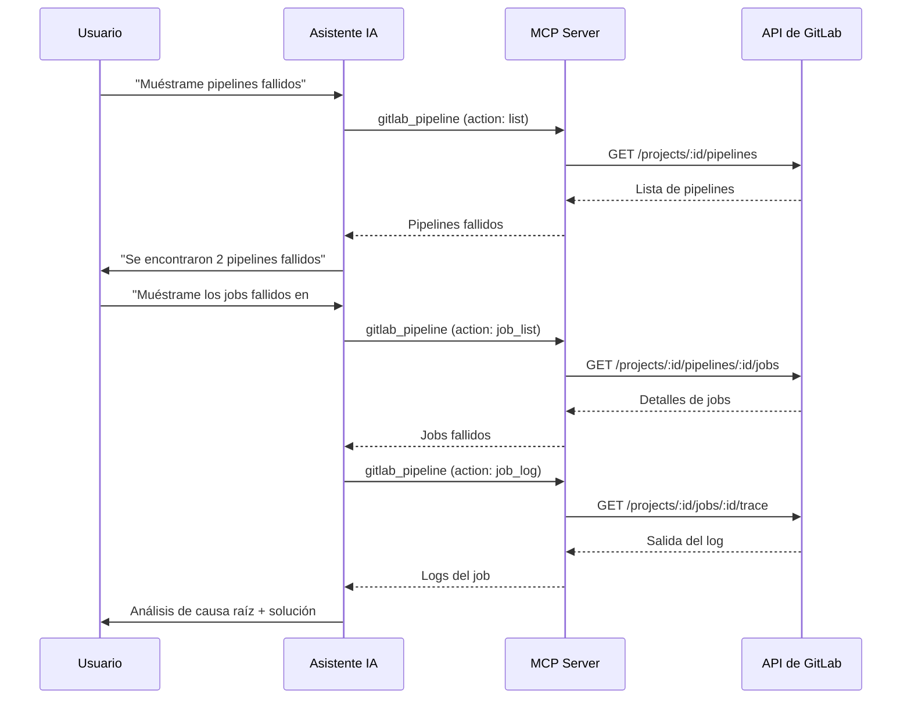

import { CardGrid, LinkCard } from "@astrojs/starlight/components";

<CardGrid>
	<LinkCard
		title="Revisión de Código"
		href="/gitlab-mcp-server/es/examples/code-review-workflows/"
		description="Revisión de MRs, análisis con IA y discusiones"
	/>
	<LinkCard
		title="Gestión de Issues"
		href="/gitlab-mcp-server/es/examples/issue-management/"
		description="Triaje, seguimiento y gestión de proyectos"
	/>
	<LinkCard
		title="Ejemplos de Uso"
		href="/gitlab-mcp-server/es/examples/usage/"
		description="Referencia rápida para todos los dominios"
	/>
</CardGrid>

Ejemplos paso a paso para flujos de trabajo CI/CD comunes. Cada ejemplo muestra el prompt en lenguaje natural y las acciones de meta-tools que el servidor ejecuta.

## Monitorizar estado de pipelines



### Obtener resumen de pipelines

**Prompt**: "Muéstrame todos los pipelines de la última semana en my-group/backend que fallaron"

```text
gitlab_pipeline → action: list, project_id: "my-group/backend", status: "failed"
```

Devuelve: IDs de pipelines, ramas, razones de fallo y duraciones.

### Investigar un pipeline fallido

**Prompt**: "Muéstrame los jobs fallidos en el pipeline #45892"

```text
gitlab_pipeline → action: job_list, project_id: "my-group/backend", pipeline_id: 45892, scope: "failed"
```

Devuelve: nombres de jobs, stages, mensajes de error e información del runner.

### Leer logs de jobs

**Prompt**: "Obtén la salida del log del job 'test-integration' en el pipeline #45892"

```text
gitlab_pipeline → action: job_log, project_id: "my-group/backend", job_id: 98765
```

Devuelve: salida completa del log del job. Útil para diagnosticar fallos en tests sin abrir la interfaz de GitLab.

### Análisis de fallos con IA

**Prompt**: "Analiza por qué falló el pipeline #45892 y sugiere correcciones"

```text
gitlab_analyze_pipeline_failure (sampling) → obtiene logs de jobs, identifica causa raíz, sugiere correcciones
```

El servidor usa sampling LLM para leer logs de jobs, correlacionar errores entre stages y proporcionar pasos de remediación accionables.

---

## Gestionar variables CI/CD

### Listar variables del proyecto

**Prompt**: "¿Qué variables CI/CD están configuradas en el proyecto backend?"

```text
gitlab_ci_variable → action: project_list, project_id: "my-group/backend"
```

Devuelve: claves de variables, estado de protección, estado de enmascaramiento y ámbitos de entorno. Los valores están enmascarados por seguridad.

### Añadir variable de despliegue

**Prompt**: "Añade una variable CI/CD DEPLOY_TOKEN con valor 'abc123' al proyecto backend, enmascarada y protegida"

```text
gitlab_ci_variable → action: project_create, project_id: "my-group/backend",
  key: "DEPLOY_TOKEN", value: "abc123", masked: true, protected: true
```

### Actualizar ámbito de variable

**Prompt**: "Actualiza la variable DATABASE_URL en backend para que solo aplique al entorno de producción"

```text
gitlab_ci_variable → action: project_update, project_id: "my-group/backend",
  key: "DATABASE_URL", environment_scope: "production"
```

---

## Programación de pipelines

### Crear build nocturno

**Prompt**: "Crea una programación de pipeline que se ejecute cada noche a las 2 AM UTC en la rama main"

```text
gitlab_pipeline → action: schedule_create, project_id: "my-group/backend",
  description: "Nightly build", ref: "main", cron: "0 2 * * *", cron_timezone: "UTC"
```

### Listar programaciones activas

**Prompt**: "Muéstrame todas las programaciones de pipeline en el proyecto backend"

```text
gitlab_pipeline → action: schedule_list, project_id: "my-group/backend"
```

Devuelve: descripciones, expresiones cron, próximas ejecuciones e información del propietario.

---

## Gestión de entornos

### Listar entornos

**Prompt**: "Muéstrame todos los entornos del proyecto backend"

```text
gitlab_environment → action: list, project_id: "my-group/backend"
```

Devuelve: nombres de entornos, URLs externas, información del último despliegue y estado.

### Consultar historial de despliegues

**Prompt**: "Muéstrame los despliegues recientes al entorno de producción"

```text
gitlab_environment → action: deployment_list, project_id: "my-group/backend", environment: "production"
```

### Detener un entorno de revisión

**Prompt**: "Detén el entorno review/feature-login en el proyecto backend"

```text
gitlab_environment → action: stop, project_id: "my-group/backend", environment_id: 42
```

---

## Validar configuración CI

### Lint de configuración CI

**Prompt**: "Valida el .gitlab-ci.yml en my-group/backend buscando errores de sintaxis"

```text
gitlab_template → action: ci_lint, project_id: "my-group/backend"
```

Devuelve: estado de validación, YAML fusionado, advertencias y detalles de errores.

### Revisión de CI con IA

**Prompt**: "Revisa la configuración CI en my-group/backend buscando mejores prácticas"

```text
gitlab_analyze_ci_configuration (sampling) → lee .gitlab-ci.yml, analiza estructura, sugiere mejoras
```

Verifica: jobs redundantes, falta de caché, manejo ineficiente de artefactos, mejores prácticas de seguridad y oportunidades de paralelización.

---

## Métricas DORA

### Rendimiento del proyecto

**Prompt**: "Muéstrame las métricas DORA del proyecto backend en los últimos 30 días"

```text
gitlab_dora_metrics → action: project, project_id: "my-group/backend",
  metric: "all", start_date: "2024-01-01", end_date: "2024-01-31"
```

Devuelve: frecuencia de despliegue, tiempo de entrega para cambios, tiempo de restauración del servicio y tasa de fallo en cambios.

### Métricas a nivel de grupo

**Prompt**: "Compara las métricas DORA entre todos los proyectos del grupo platform"

```text
gitlab_dora_metrics → action: group, group_id: "platform",
  metric: "all", interval: "monthly"
```

Devuelve: métricas agregadas para todo el grupo, útil para dashboards de liderazgo de ingeniería.

---

:::tip
Todos los ejemplos de CI/CD usan el modo meta-tool (por defecto). El asistente de IA mapea tu petición en lenguaje natural al parámetro `action` correcto automáticamente.
:::
