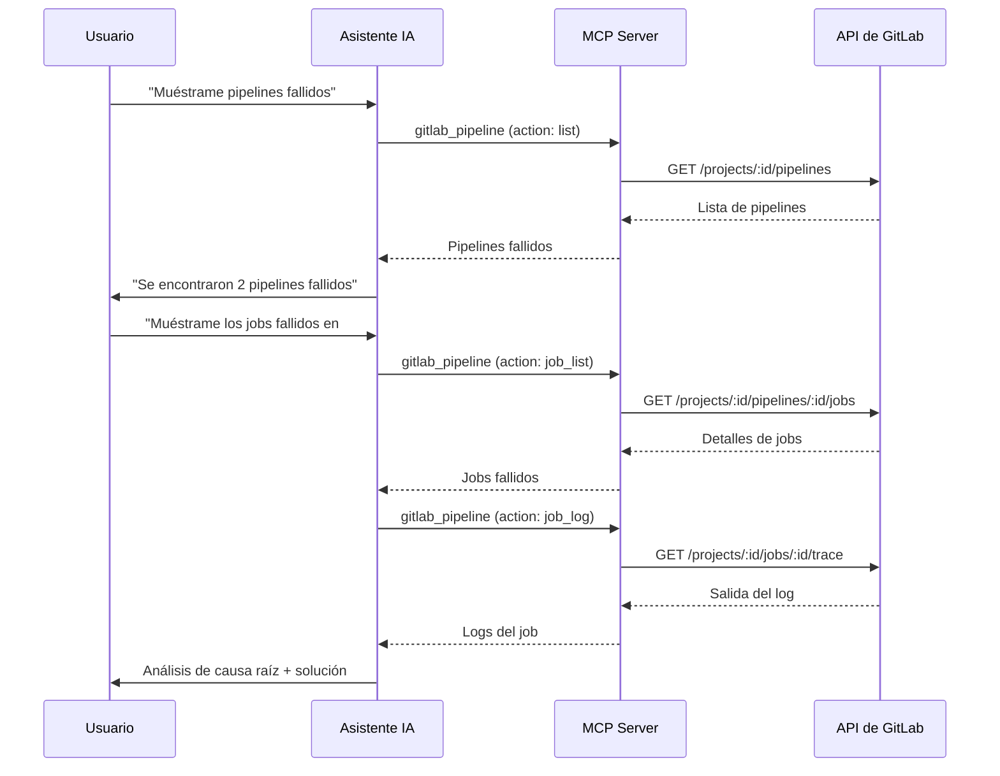

import { CardGrid, LinkCard } from "@astrojs/starlight/components";

<CardGrid>
	<LinkCard
		title="Revisión de Código"
		href="/gitlab-mcp-server/es/examples/code-review-workflows/"
		description="Revisión de MRs, análisis con IA y discusiones"
	/>
	<LinkCard
		title="Gestión de Issues"
		href="/gitlab-mcp-server/es/examples/issue-management/"
		description="Triaje, seguimiento y gestión de proyectos"
	/>
	<LinkCard
		title="Ejemplos de uso"
		href="/gitlab-mcp-server/es/examples/usage/"
		description="Referencia rápida para todos los dominios"
	/>
</CardGrid>

Estos flujos CI/CD paso a paso muestran cómo diagnosticar fallos de pipelines, gestionar variables CI/CD, programar builds, controlar entornos, validar la configuración y leer métricas DORA — todo en lenguaje natural. Cada ejemplo combina el prompt que escribes con la acción exacta de meta-tool que el servidor ejecuta, para que veas con precisión qué ocurre por debajo y puedas reutilizar la llamada directamente.

## Diagnosticar un pipeline fallido

Cuando un pipeline falla, este flujo te lleva desde la lista de pipelines fallidos hasta el log del job concreto que explica el fallo — sin salir de tu asistente. Lista los pipelines fallidos, profundiza en los jobs que fallan y luego lee el log del job para encontrar la causa raíz.


```mermaid
sequenceDiagram
    participant U as Usuario
    participant AI as Asistente IA
    participant MCP as MCP Server
    participant GL as API de GitLab

    U->>AI: "Muéstrame pipelines fallidos"
    AI->>MCP: gitlab_pipeline (action: list)
    MCP->>GL: GET /projects/:id/pipelines
    GL-->>MCP: Lista de pipelines
    MCP-->>AI: Pipelines fallidos
    AI->>U: "Se encontraron 2 pipelines fallidos"
    U->>AI: "Muéstrame los jobs fallidos en #45892"
    AI->>MCP: gitlab_pipeline (action: job_list)
    MCP->>GL: GET /projects/:id/pipelines/:id/jobs
    GL-->>MCP: Detalles de jobs
    MCP-->>AI: Jobs fallidos
    AI->>MCP: gitlab_pipeline (action: job_log)
    MCP->>GL: GET /projects/:id/jobs/:id/trace
    GL-->>MCP: Salida del log
    MCP-->>AI: Logs del job
    AI->>U: Análisis de causa raíz + solución
```

### Obtener resumen de pipelines

**Prompt**: "Muéstrame todos los pipelines fallidos en my-group/backend"

```text
gitlab_pipeline → action: list, project_id: "my-group/backend", status: "failed"
```

Devuelve: IDs de pipelines, ramas, razones de fallo y duraciones.

### Investigar un pipeline fallido

**Prompt**: "Muéstrame los jobs fallidos en el pipeline #45892"

```text
gitlab_pipeline → action: job_list, project_id: "my-group/backend", pipeline_id: 45892, scope: "failed"
```

Devuelve: nombres de jobs, stages, mensajes de error e información del runner.

### Leer logs de jobs

**Prompt**: "Obtén la salida del log del job 'test-integration' en el pipeline #45892"

```text
gitlab_pipeline → action: job_log, project_id: "my-group/backend", job_id: 98765
```

Devuelve: salida completa del log del job. Útil para diagnosticar fallos en tests sin abrir la interfaz de GitLab.

---

## Gestionar variables CI/CD

Configura el entorno en el que se ejecutan tus pipelines listando, creando y acotando variables CI/CD. Úsalo para inspeccionar lo que ya está definido, añadir secretos como tokens de despliegue con enmascaramiento y protección, o restringir una variable a un único entorno.

### Listar variables del proyecto

**Prompt**: "¿Qué variables CI/CD están configuradas en el proyecto backend?"

```text
gitlab_ci_variable → action: project_list, project_id: "my-group/backend"
```

Devuelve: claves de variables, estado de protección, estado de enmascaramiento y ámbitos de entorno. Los valores están enmascarados por seguridad.

### Añadir variable de despliegue

**Prompt**: "Añade una variable CI/CD DEPLOY_TOKEN con valor 'abc123' al proyecto backend, enmascarada y protegida"

```text
gitlab_ci_variable → action: project_create, project_id: "my-group/backend",
  key: "DEPLOY_TOKEN", value: "abc123", masked: true, protected: true
```

### Actualizar ámbito de variable

**Prompt**: "Actualiza la variable DATABASE_URL en backend para que solo aplique al entorno de producción"

```text
gitlab_ci_variable → action: project_update, project_id: "my-group/backend",
  key: "DATABASE_URL", environment_scope: "production"
```

---

## Programación de pipelines

Automatiza pipelines recurrentes con programaciones basadas en cron —por ejemplo, un build nocturno— y revisa qué programaciones ya existen y cuándo se ejecutarán a continuación.

### Crear build nocturno

**Prompt**: "Crea una programación de pipeline que se ejecute cada noche a las 2 AM UTC en la rama main"

```text
gitlab_pipeline → action: schedule_create, project_id: "my-group/backend",
  description: "Nightly build", ref: "main", cron: "0 2 * * *", cron_timezone: "UTC"
```

### Listar programaciones activas

**Prompt**: "Muéstrame todas las programaciones de pipeline en el proyecto backend"

```text
gitlab_pipeline → action: schedule_list, project_id: "my-group/backend"
```

Devuelve: descripciones, expresiones cron, próximas ejecuciones e información del propietario.

---

## Gestión de entornos

Controla y sigue dónde se despliega tu código. Lista los entornos para ver su estado y sus URLs, revisa el historial de despliegues de producción y detén los entornos de revisión efímeros cuando ya no se necesiten.

### Listar entornos

**Prompt**: "Muéstrame todos los entornos del proyecto backend"

```text
gitlab_environment → action: list, project_id: "my-group/backend"
```

Devuelve: nombres de entornos, URLs externas, información del último despliegue y estado.

### Consultar historial de despliegues

**Prompt**: "Muéstrame los despliegues recientes al entorno de producción"

```text
gitlab_environment → action: deployment_list, project_id: "my-group/backend", environment: "production"
```

### Detener un entorno de revisión

**Prompt**: "Detén el entorno review/feature-login en el proyecto backend"

```text
gitlab_environment → action: stop, project_id: "my-group/backend", environment_id: 42
```

---

## Validar configuración CI

Detecta errores de `.gitlab-ci.yml` antes de que rompan un pipeline validando la configuración. El servidor devuelve el estado de validación junto con el YAML totalmente fusionado, para que confirmes que los includes y las plantillas se resuelven como esperas.

### Lint de configuración CI

**Prompt**: "Valida el .gitlab-ci.yml en my-group/backend buscando errores de sintaxis"

```text
gitlab_template → action: ci_lint, project_id: "my-group/backend"
```

Devuelve: estado de validación, YAML fusionado, advertencias y detalles de errores.

---

## Métricas DORA

Mide el rendimiento de entrega con las cuatro métricas DORA —frecuencia de despliegue, tiempo de entrega para cambios, tiempo de restauración del servicio y tasa de fallo en cambios— a nivel de proyecto o de grupo. Las métricas DORA requieren una licencia de GitLab Premium o Ultimate.

### Rendimiento del proyecto

**Prompt**: "Muéstrame las métricas DORA del proyecto backend en los últimos 30 días"

```text
gitlab_dora_metrics → action: project, project_id: "my-group/backend",
  metric: "all", start_date: "2024-01-01", end_date: "2024-01-31"
```

Devuelve: frecuencia de despliegue, tiempo de entrega para cambios, tiempo de restauración del servicio y tasa de fallo en cambios.

### Métricas a nivel de grupo

**Prompt**: "Compara las métricas DORA entre todos los proyectos del grupo platform"

```text
gitlab_dora_metrics → action: group, group_id: "platform",
  metric: "all", interval: "monthly"
```

Devuelve: métricas agregadas para todo el grupo, útil para dashboards de liderazgo de ingeniería.

## Llamadas CI/CD dinámicas primero

En la superficie dinámica predeterminada, el asistente descubre primero la acción CI/CD exacta y su esquema, y luego la ejecuta — así los prompts anteriores se resuelven a IDs canónicos `domain.action` en lugar de a meta-herramientas con nombre. El patrón de dos pasos es buscar y luego ejecutar:

```text
gitlab_find_action → query: "estado del último pipeline del proyecto"
gitlab_execute_action → action: "pipeline.latest", params: { project_id: "42" }
```

Para jobs fallidos, descubre primero la acción de log o reintento y luego ejecuta con el schema devuelto:

```text
gitlab_find_action → query: "obtener trace de job fallido"
gitlab_execute_action → action: "job.trace", params: { project_id: "42", job_id: 9876 }
```

---

:::tip
Estos prompts CI/CD funcionan con la superficie dinámica predeterminada. Con `TOOL_SURFACE=meta`, el asistente de IA mapea las mismas solicitudes a la meta-herramienta de dominio y al parámetro `action` apropiados.
:::
