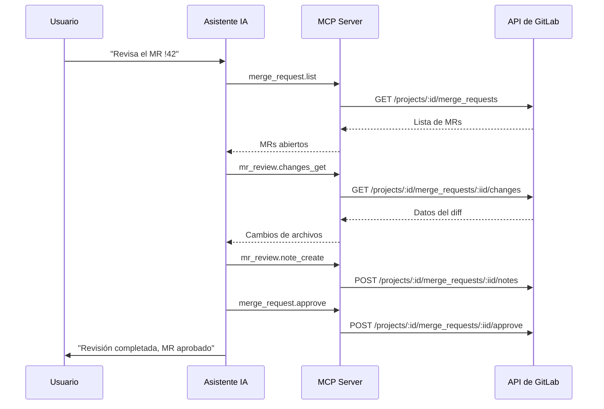

import { CardGrid, LinkCard } from "@astrojs/starlight/components";
import FAQ from "../../../../components/FAQ.astro";

<CardGrid>
  <LinkCard
    title="Flujos CI/CD"
    href="/gitlab-mcp-server/es/examples/ci-cd-workflows/"
    description="Gestión y monitorización de pipelines"
  />
  <LinkCard
    title="Gestión de Issues"
    href="/gitlab-mcp-server/es/examples/issue-management/"
    description="Triaje, seguimiento y gestión de proyectos"
  />
  <LinkCard
    title="Ejemplos de uso"
    href="/gitlab-mcp-server/es/examples/usage/"
    description="Referencia rápida para todos los dominios"
  />
</CardGrid>

Estos flujos paso a paso cubren el ciclo completo de revisión de merge requests: encontrar los MRs que requieren tu atención, leer sus diffs, comprobar el estado de aprobación, dejar notas y discusiones en hilo y, finalmente, fusionar o rebasar. Cada ejemplo combina el prompt que escribes con la acción exacta del catálogo que el servidor ejecuta, escrita como `dominio.acción → parámetros`: en la superficie dinámica predeterminada es el `action` que pasas a `gitlab_execute_action`, y con `GITLAB_MCP_TOOL_SURFACE=meta` es el `action` de la meta-herramienta `gitlab_<dominio>`, para que puedas reutilizar la llamada directamente. Los diffs, notas, discusiones y notas borrador viven en el dominio `mr_review` (`gitlab_mr_review` en la superficie meta); el resto del ciclo de vida del MR, en `merge_request`.

## Flujo de revisión de MRs

Este es el bucle central de revisión: lista los MRs abiertos asignados a ti, lee los cambios de archivos, publica comentarios de revisión y aprueba cuando el código esté correcto. El diagrama sigue un único MR (`!42`) a través de esa secuencia.



### Listar MRs pendientes de revisión

**Prompt**: "Muéstrame todos los merge requests asignados a mí para revisión en el proyecto backend"

```text
merge_request.list → project_id: "my-group/backend",
  reviewer_username: "johndoe", state: "opened"
```

Devuelve: títulos de MRs, autores, ramas, etiquetas y estado de revisión.

### Ver cambios de un MR

**Prompt**: "Muéstrame los cambios de archivos en el MR !42"

```text
mr_review.changes_get → project_id: "my-group/backend", merge_request_iid: 42
```

Devuelve: lista de archivos modificados con adiciones, eliminaciones y diffs completos.

### Verificar estado de aprobación

**Prompt**: "¿Quién ha aprobado el MR !42 y quién falta por aprobar?"

```text
merge_request.approval_state → project_id: "my-group/backend",
  merge_request_iid: 42
```

Devuelve: reglas de aprobación, aprobaciones requeridas, aprobaciones actuales y aprobadores elegibles.

### Aprobar un MR

**Prompt**: "Aprueba el merge request !42 en el proyecto backend"

```text
merge_request.approve → project_id: "my-group/backend",
  merge_request_iid: 42
```

---

## Revisión de código con IA

No existe una herramienta de "revisión con IA" separada. La revisión asistida por IA ocurre cuando el asistente lee el diff de un MR con `mr_review.changes_get`, razona sobre el código y luego escribe sus hallazgos como notas o discusiones en hilo. Una petición típica, _"Lee los cambios del MR !42 y señala cualquier problema de manejo de errores o de seguridad"_, encadena la acción de lectura anterior con las acciones `mr_review.note_create` y `mr_review.discussion_create` siguientes, todo dentro de una misma conversación.

---

## Discusiones y notas de MR

Comparte el feedback de revisión directamente en el MR. Publica un único comentario en línea, abre una discusión en hilo para un tema más amplio, encuentra los hilos que siguen sin resolver o prepara notas en borrador para publicar toda tu revisión a la vez.

Los tres tipos de comentario se comportan de forma distinta, y elegir mal es el error de revisión más habitual:

| Tipo          | Acción                        | ¿Resoluble?       | ¿Visible al instante?         | Úsalo para                                         |
| ------------- | ----------------------------- | ----------------- | ----------------------------- | -------------------------------------------------- |
| Nota          | `mr_review.note_create`       | No                | Sí                            | Un comentario suelto                               |
| Discusión     | `mr_review.discussion_create` | Sí                | Sí                            | Feedback que debe resolverse antes del merge       |
| Nota borrador | `mr_review.draft_note_create` | Sí, al publicarse | No — en espera hasta publicar | Una revisión de varios comentarios publicada junta |

Solo las discusiones cuentan para el control de hilos sin resolver. Las notas borrador evitan que el autor reciba una notificación por cada comentario mientras revisas un MR grande.

### Añadir un comentario de revisión

**Prompt**: "Añade un comentario al MR !42 diciendo 'El manejo de errores en auth.go necesita un mecanismo de reintento'"

```text
mr_review.note_create → project_id: "my-group/backend",
  merge_request_iid: 42, body: "El manejo de errores en auth.go necesita un mecanismo de reintento"
```

### Crear un hilo de discusión

**Prompt**: "Inicia una discusión en el MR !42 sobre la estrategia de migración de base de datos"

```text
mr_review.discussion_create → project_id: "my-group/backend",
  merge_request_iid: 42, body: "Discutamos la estrategia de migración de base de datos..."
```

### Listar hilos sin resolver

**Prompt**: "Muéstrame todos los hilos de discusión sin resolver en el MR !42"

```text
mr_review.discussion_list → project_id: "my-group/backend",
  merge_request_iid: 42
```

Filtra los resultados por hilos donde `resolved: false` para encontrar elementos pendientes de revisión.

### Usar notas borrador

**Prompt**: "Crea una nota de revisión en borrador en el MR !42 — publicaré todos mis comentarios juntos"

```text
mr_review.draft_note_create → project_id: "my-group/backend",
  merge_request_iid: 42, note: "Considera usar un context timeout aquí..."
```

Las notas borrador solo son visibles para ti hasta que las publiques todas a la vez con `mr_review.draft_note_publish_all`.

---

## Ciclo de vida del MR

Lleva un merge request por todo su ciclo de vida: ábrelo desde una rama de funcionalidad, rebásalo sobre la última versión del destino, fusiónalo (opcionalmente con squash) o ciérralo cuando un enfoque queda reemplazado.

### Crear un MR

**Prompt**: "Crea un merge request de la rama feature/auth-refactor a main en el proyecto backend"

```text
merge_request.create → project_id: "my-group/backend",
  source_branch: "feature/auth-refactor", target_branch: "main",
  title: "Refactorizar módulo de autenticación"
```

### Fusionar tras aprobación

**Prompt**: "Fusiona el MR !42 usando squash commit"

```text
merge_request.merge → project_id: "my-group/backend",
  merge_request_iid: 42, squash: true
```

### Rebase antes de fusionar

**Prompt**: "Haz rebase del MR !42 contra la última rama main"

```text
merge_request.rebase → project_id: "my-group/backend",
  merge_request_iid: 42
```

### Cerrar sin fusionar

**Prompt**: "Cierra el MR `!99`, el enfoque fue reemplazado por el MR `!105`"

```text
merge_request.update → project_id: "my-group/backend",
  merge_request_iid: 99, state_event: "close"
```

---

## Comparar ramas

Antes de abrir o fusionar un MR, compara dos ramas para ver exactamente qué cambiaría. La comparación devuelve los commits, los archivos modificados y las estadísticas del diff entre ambas.

### Diff entre ramas

**Prompt**: "Compara la rama develop con main en el proyecto backend"

```text
repository.compare → project_id: "my-group/backend",
  from: "main", to: "develop"
```

Devuelve: lista de commits, archivos modificados y estadísticas del diff entre las dos ramas.

## Llamadas de revisión dinámicas primero

En la superficie dinámica predeterminada, el asistente descubre primero la acción de revisión y su esquema, y luego la ejecuta, así que cada bloque anterior es el `action` de una llamada a `gitlab_execute_action`. El patrón de dos pasos es buscar y luego ejecutar:

```text
gitlab_find_action → query: "merge requests pendientes de mi revisión"
gitlab_execute_action → action: "merge_request.list", params: { project_id: "my-group/backend", reviewer_username: "johndoe", state: "opened" }
```

Leer un diff y publicar un comentario en hilo siguen la misma forma:

```text
gitlab_find_action → query: "diff de un merge request"
gitlab_execute_action → action: "mr_review.changes_get", params: { project_id: "my-group/backend", merge_request_iid: 42 }
gitlab_execute_action → action: "mr_review.discussion_create", params: { project_id: "my-group/backend", merge_request_iid: 42, body: "Discutamos la estrategia de migración de base de datos..." }
```

Con `GITLAB_MCP_TOOL_SURFACE=meta` las mismas llamadas van a `gitlab_merge_request` con `action: list` y a `gitlab_mr_review` con `action: changes_get` y `action: discussion_create`, cada una con los parámetros anidados en `params`.

---

:::tip
Para la mejor experiencia de revisión, combina varios prompts en secuencia: primero lista los MRs, luego lee los cambios y después solicita análisis con IA. El asistente de IA mantiene el contexto entre prompts.
:::

<FAQ />
