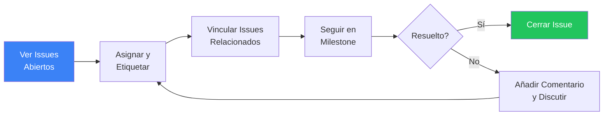

import { CardGrid, LinkCard } from "@astrojs/starlight/components";

<CardGrid>
	<LinkCard
		title="Flujos CI/CD"
		href="/gitlab-mcp-server/es/examples/ci-cd-workflows/"
		description="Gestión y monitorización de pipelines"
	/>
	<LinkCard
		title="Revisión de Código"
		href="/gitlab-mcp-server/es/examples/code-review-workflows/"
		description="Revisión de MRs, análisis con IA y discusiones"
	/>
	<LinkCard
		title="Ejemplos de Uso"
		href="/gitlab-mcp-server/es/examples/usage/"
		description="Referencia rápida para todos los dominios"
	/>
</CardGrid>

Ejemplos paso a paso para flujos de gestión de issues y triaje de proyectos. Cada ejemplo muestra el prompt en lenguaje natural y las acciones de meta-tools que el servidor ejecuta.

## Triaje de issues



### Ver issues abiertos

**Prompt**: "Muéstrame todos los issues abiertos en el proyecto backend con la etiqueta 'bug'"

```text
gitlab_issue → action: list, project_id: "my-group/backend",
  state: "opened", labels: "bug"
```

Devuelve: títulos de issues, autores, etiquetas, milestones, asignados y fechas de creación.

### Asignar y etiquetar

**Prompt**: "Asigna el issue #123 a johndoe y añade las etiquetas 'priority::high' y 'team::backend'"

```text
gitlab_issue → action: update, project_id: "my-group/backend",
  issue_iid: 123, assignee_ids: [45], add_labels: "priority::high,team::backend"
```

### Triaje masivo por milestone

**Prompt**: "Muéstrame todos los issues sin asignar en el milestone Sprint 15"

```text
gitlab_issue → action: list, project_id: "my-group/backend",
  milestone: "Sprint 15", assignee_id: 0
```

Devuelve: issues sin asignados que necesitan atención antes de que comience el sprint.

### Cerrar issues resueltos

**Prompt**: "Cierra el issue #456 con un comentario explicando la corrección"

```text
gitlab_issue → action: note_create, project_id: "my-group/backend",
  issue_iid: 456, body: "Corregido en MR !89 — el timeout era causado por..."
gitlab_issue → action: update, project_id: "my-group/backend",
  issue_iid: 456, state_event: "close"
```

---

## Análisis de issues con IA

### Resumir un issue

**Prompt**: "Resume el issue #234 y todos sus comentarios"

```text
gitlab_summarize_issue (sampling) → lee descripción del issue y todas las notas, produce resumen
```

Devuelve: declaración del problema, puntos clave de discusión, soluciones propuestas, estado actual y bloqueantes.

### Encontrar deuda técnica

**Prompt**: "Identifica la deuda técnica en los issues del proyecto backend"

```text
gitlab_find_technical_debt (sampling) → analiza patrones de issues, etiquetas y antigüedad
```

Devuelve: elementos de deuda categorizados (calidad de código, brechas de testing, infraestructura, documentación) con calificaciones de severidad.

---

## Vinculación de issues

### Crear issues relacionados

**Prompt**: "Vincula el issue #100 como relacionado al issue #200 en el proyecto backend"

```text
gitlab_issue → action: link_create, project_id: "my-group/backend",
  issue_iid: 100, target_issue_iid: 200, link_type: "relates_to"
```

### Crear relaciones de bloqueo

**Prompt**: "Marca el issue #300 como bloqueante del issue #400"

```text
gitlab_issue → action: link_create, project_id: "my-group/backend",
  issue_iid: 300, target_issue_iid: 400, link_type: "blocks"
```

### Ver vínculos de issues

**Prompt**: "Muéstrame todos los issues relacionados al issue #100"

```text
gitlab_issue → action: link_list, project_id: "my-group/backend", issue_iid: 100
```

Devuelve: issues vinculados con tipos de relación (relates_to, blocks, is_blocked_by).

---

## Etiquetas y milestones

### Organizar con etiquetas

**Prompt**: "Crea una etiqueta con ámbito 'priority::critical' con color rojo en el proyecto backend"

```text
gitlab_label → action: create, project_id: "my-group/backend",
  name: "priority::critical", color: "#CC0000"
```

### Seguimiento de progreso de milestone

**Prompt**: "Muéstrame el progreso del milestone Sprint 15"

```text
gitlab_milestone → action: get, project_id: "my-group/backend", milestone_id: 15
```

Devuelve: porcentaje de completado, conteo de issues abiertos/cerrados, fecha de inicio, fecha límite y días restantes.

### Generar informe de milestone

**Prompt**: "Genera un informe detallado para el milestone Q2"

```text
gitlab_generate_milestone_report (sampling) → analiza issues del milestone, MRs y velocidad
```

Devuelve: resumen ejecutivo, métricas de completado, tendencias de velocidad, elementos de riesgo y fecha estimada de finalización.

---

## Discusiones de issues

### Añadir un comentario

**Prompt**: "Comenta en el issue #123: 'Reproducido en staging — el error solo ocurre con peticiones concurrentes'"

```text
gitlab_issue → action: note_create, project_id: "my-group/backend",
  issue_iid: 123, body: "Reproducido en staging — el error solo ocurre con peticiones concurrentes"
```

### Iniciar una discusión con hilos

**Prompt**: "Crea un hilo de discusión en el issue #123 sobre la arquitectura propuesta"

```text
gitlab_issue → action: discussion_create, project_id: "my-group/backend",
  issue_iid: 123, body: "Discutamos la arquitectura propuesta para esta funcionalidad..."
```

### Reacciones con emoji

**Prompt**: "Añade una reacción de pulgar arriba al issue #123"

```text
gitlab_issue → action: award_emoji_create, project_id: "my-group/backend",
  issue_iid: 123, name: "thumbsup"
```

---

## Búsqueda entre proyectos

### Buscar issues por palabra clave

**Prompt**: "Busca issues que mencionen 'memory leak' en todos mis proyectos"

```text
gitlab_search → scope: "issues", search: "memory leak"
```

Devuelve: issues coincidentes en todos los proyectos accesibles con títulos, descripciones y rutas de proyecto.

### Buscar dentro de un grupo

**Prompt**: "Encuentra todos los issues abiertos con etiqueta 'security' en el grupo platform"

```text
gitlab_issue → action: list, group_id: "platform",
  state: "opened", labels: "security"
```

Devuelve: issues relacionados con seguridad en todos los proyectos del grupo.

---

:::tip
Combina búsqueda con triaje para un flujo eficiente: primero busca issues que coincidan con un patrón, luego asígnalos, etiquétalos y vincúlalos en secuencia. El asistente de IA mantiene el contexto entre prompts.
:::
