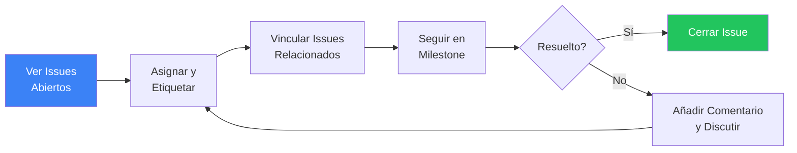

import { CardGrid, LinkCard } from "@astrojs/starlight/components";

<CardGrid>
	<LinkCard
		title="Flujos CI/CD"
		href="/gitlab-mcp-server/es/examples/ci-cd-workflows/"
		description="Gestión y monitorización de pipelines"
	/>
	<LinkCard
		title="Revisión de Código"
		href="/gitlab-mcp-server/es/examples/code-review-workflows/"
		description="Revisión de MRs, análisis con IA y discusiones"
	/>
	<LinkCard
		title="Ejemplos de Uso"
		href="/gitlab-mcp-server/es/examples/usage/"
		description="Referencia rápida para todos los dominios"
	/>
</CardGrid>

Estos flujos paso a paso cubren la gestión de issues de principio a fin: triar issues abiertos, asignarlos y etiquetarlos, vincular issues relacionados y bloqueantes, seguir el progreso de los milestones, mantener discusiones y buscar entre proyectos. Cada ejemplo combina el prompt que escribes con la acción exacta de meta-tool que el servidor ejecuta, para que puedas reutilizar la llamada directamente.

## Triaje de issues

El bucle de triaje lleva un issue desde su entrada hasta su resolución: ver los issues abiertos, asignarlos y etiquetarlos, vincular los relacionados, seguirlos en un milestone y cerrarlos o mantener la discusión. El diagrama muestra ese ciclo y dónde vuelve a empezar.


```mermaid
flowchart LR
    A[Ver Issues<br/>Abiertos] --> B[Asignar y<br/>Etiquetar]
    B --> C[Vincular Issues<br/>Relacionados]
    C --> D[Seguir en<br/>Milestone]
    D --> E{Resuelto?}
    E -->|Sí| F[Cerrar Issue]
    E -->|No| G[Añadir Comentario<br/>y Discutir]
    G --> B

    style A fill:#3b82f6,color:#fff
    style F fill:#22c55e,color:#fff
```

### Ver issues abiertos

**Prompt**: "Muéstrame todos los issues abiertos en el proyecto backend con la etiqueta 'bug'"

```text
gitlab_issue → action: list, project_id: "my-group/backend",
  state: "opened", labels: "bug"
```

Devuelve: títulos de issues, autores, etiquetas, milestones, asignados y fechas de creación.

### Asignar y etiquetar

**Prompt**: "Asigna el issue #123 a johndoe y añade las etiquetas 'priority::high' y 'team::backend'"

```text
gitlab_issue → action: update, project_id: "my-group/backend",
  issue_iid: 123, assignee_ids: [45], add_labels: "priority::high,team::backend"
```

### Triaje masivo por milestone

**Prompt**: "Muéstrame todos los issues sin asignar en el milestone Sprint 15"

```text
gitlab_issue → action: list, project_id: "my-group/backend",
  milestone: "Sprint 15", assignee_id: 0
```

Devuelve: issues sin asignados que necesitan atención antes de que comience el sprint.

### Cerrar issues resueltos

**Prompt**: "Cierra el issue #456 con un comentario explicando la corrección"

```text
gitlab_issue → action: note_create, project_id: "my-group/backend",
  issue_iid: 456, body: "Corregido en MR !89 — el timeout era causado por..."
gitlab_issue → action: update, project_id: "my-group/backend",
  issue_iid: 456, state_event: "close"
```

---

## Análisis de issues con IA

No existe una herramienta de "análisis con IA" dedicada. El análisis asistido por IA ocurre cuando el asistente lee los issues con `gitlab_issue → action: list` o `action: get`, razona sobre su contenido y luego actúa sobre el resultado — asignando, etiquetando, vinculando o comentando con las acciones siguientes. Por ejemplo, _"Encuentra los bugs abiertos en backend, agrúpalos por causa raíz probable y etiqueta los duplicados"_ encadena una acción de lectura con las acciones de triaje de esta guía, todo en una misma conversación.

---

## Vinculación de issues

Modela las relaciones entre issues para que las dependencias sean explícitas. Marca issues como relacionados, registra relaciones de bloqueo y revisa todos los vínculos asociados a un issue.

### Crear issues relacionados

**Prompt**: "Vincula el issue #100 como relacionado al issue #200 en el proyecto backend"

```text
gitlab_issue → action: link_create, project_id: "my-group/backend",
  issue_iid: 100, target_issue_iid: 200, link_type: "relates_to"
```

### Crear relaciones de bloqueo

**Prompt**: "Marca el issue #300 como bloqueante del issue #400"

```text
gitlab_issue → action: link_create, project_id: "my-group/backend",
  issue_iid: 300, target_issue_iid: 400, link_type: "blocks"
```

### Ver vínculos de issues

**Prompt**: "Muéstrame todos los issues relacionados al issue #100"

```text
gitlab_issue → action: link_list, project_id: "my-group/backend", issue_iid: 100
```

Devuelve: issues vinculados con tipos de relación (relates_to, blocks, is_blocked_by).

---

## Etiquetas y milestones

Organiza y mide el trabajo con etiquetas y milestones. Crea etiquetas con ámbito para categorizar issues y consulta el progreso de un milestone para ver cuánto le falta a un sprint para completarse.

### Organizar con etiquetas

**Prompt**: "Crea una etiqueta con ámbito 'priority::critical' con color rojo en el proyecto backend"

```text
gitlab_label → action: create, project_id: "my-group/backend",
  name: "priority::critical", color: "#CC0000"
```

### Seguimiento de progreso de milestone

**Prompt**: "Muéstrame el progreso del milestone Sprint 15"

```text
gitlab_milestone → action: get, project_id: "my-group/backend", milestone_id: 15
```

Devuelve: porcentaje de completado, conteo de issues abiertos/cerrados, fecha de inicio, fecha límite y días restantes.

---

## Discusiones de issues

Mantén la conversación en el propio issue. Añade un comentario rápido, abre una discusión en hilo para un tema más profundo o reacciona con emojis para reconocer las novedades sin añadir ruido.

### Añadir un comentario

**Prompt**: "Comenta en el issue #123: 'Reproducido en staging — el error solo ocurre con peticiones concurrentes'"

```text
gitlab_issue → action: note_create, project_id: "my-group/backend",
  issue_iid: 123, body: "Reproducido en staging — el error solo ocurre con peticiones concurrentes"
```

### Iniciar una discusión con hilos

**Prompt**: "Crea un hilo de discusión en el issue #123 sobre la arquitectura propuesta"

```text
gitlab_issue → action: discussion_create, project_id: "my-group/backend",
  issue_iid: 123, body: "Discutamos la arquitectura propuesta para esta funcionalidad..."
```

### Reacciones con emoji

**Prompt**: "Añade una reacción de pulgar arriba al issue #123"

```text
gitlab_issue → action: award_emoji_create, project_id: "my-group/backend",
  issue_iid: 123, name: "thumbsup"
```

---

## Búsqueda entre proyectos

Encuentra issues más allá de un solo proyecto. Busca globalmente por palabra clave en todos los proyectos a los que tienes acceso, o limita la búsqueda a un grupo para localizar issues por etiqueta.

### Buscar issues por palabra clave

**Prompt**: "Busca issues que mencionen 'memory leak' en todos mis proyectos"

```text
gitlab_search → scope: "issues", search: "memory leak"
```

Devuelve: issues coincidentes en todos los proyectos accesibles con títulos, descripciones y rutas de proyecto.

### Buscar dentro de un grupo

**Prompt**: "Encuentra todos los issues abiertos con etiqueta 'security' en el grupo platform"

```text
gitlab_issue → action: list, group_id: "platform",
  state: "opened", labels: "security"
```

Devuelve: issues relacionados con seguridad en todos los proyectos del grupo.

---

:::tip
Combina búsqueda con triaje para un flujo eficiente: primero busca issues que coincidan con un patrón, luego asígnalos, etiquétalos y vincúlalos en secuencia. El asistente de IA mantiene el contexto entre prompts.
:::
