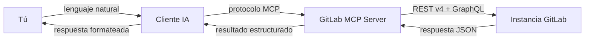

import { Card, CardGrid, LinkCard } from "@astrojs/starlight/components";

**GitLab MCP Server** es un servidor [Model Context Protocol](https://modelcontextprotocol.io/) que permite a los asistentes de IA interactuar con GitLab a través de lenguaje natural. Pide a tu IA que cree issues, revise merge requests, analice pipelines y mucho más — todo sin salir de tu editor.

## ¿Qué puede hacer?

En lugar de alternar entre tu editor y la interfaz web de GitLab, simplemente pregunta:

```text
Muéstrame todas las merge requests abiertas en my-project que necesitan revisión
```

```text
¿Por qué falló el pipeline en la rama feature/auth? Resume el error y sugiere una solución
```

```text
Crea un issue titulado "Refactorizar módulo de auth" con etiqueta de prioridad y asígnamelo
```

El servidor traduce estas solicitudes en llamadas a la API de GitLab, las ejecuta y devuelve resultados estructurados que tu asistente de IA puede entender y sobre los que puede actuar.

## Características principales

| Característica                  | Detalles                                                                                                                                       |
| ------------------------------- | ---------------------------------------------------------------------------------------------------------------------------------------------- |
| **32 Meta-herramientas**        | Herramientas agrupadas por dominio que cubren proyectos, issues, merge requests, pipelines, CI/CD, wikis, releases y más                       |
| **11 Herramientas de análisis** | Análisis impulsado por IA mediante MCP sampling — diagnóstico de fallos en pipelines, revisión de seguridad de MRs, detección de deuda técnica |
| **44 Recursos MCP**             | Endpoints de datos de solo lectura para información de proyectos, perfiles de usuario, configuración del servidor                              |
| **38 Prompts MCP**              | Plantillas de prompts predefinidas para informes, auditorías, análisis entre proyectos y flujos de trabajo en equipo                           |
| **Modo HTTP multiusuario**      | Despliega como servidor compartido con aislamiento por token para entornos de equipo                                                           |
| **GitLab CE y EE**              | Compatible con Community Edition y Enterprise Edition, incluyendo instancias autoalojadas                                                      |
| **Herramientas Enterprise**     | 15 herramientas adicionales opcionales para funciones de GitLab Premium/Ultimate (métricas DORA, vulnerabilidades, cumplimiento)               |
| **Autoactualización**           | Mecanismo de autoactualización integrado — ejecuta siempre la última versión                                                                   |
| **Multiplataforma**             | Binario único para Linux, macOS y Windows (amd64 y arm64)                                                                                      |

## Ejemplo rápido

**Tú:** "¿Qué merge requests están abiertas en `my-org/backend` y quién está asignado?"

**Asistente de IA** (mediante GitLab MCP Server):

> Se encontraron 3 merge requests abiertas en `my-org/backend`:
>
> | MR   | Título                       | Autor    | Asignado | Pipeline        |
> | ---- | ---------------------------- | -------- | -------- | --------------- |
> | !142 | Add rate limiting middleware | @alice   | @bob     | ✅ exitoso      |
> | !139 | Fix N+1 query in /users      | @charlie | @alice   | ❌ fallido      |
> | !137 | Update OpenAPI spec          | @bob     | —        | ⏳ en ejecución |
>
> **!139** tiene un pipeline fallido — ¿quieres que analice el fallo?

**Tú:** "Sí, comprueba por qué falló !139"

**Asistente de IA:**

> El pipeline #8847 falló en la etapa `test`, job `unit-tests`:
>
> ```text
> FAIL: TestUserService_ListUsers — expected 10 results, got 15
> ```
>
> La corrección del N+1 cambió la consulta para devolver todos los resultados sin aplicar el límite de paginación predeterminado.
> **Solución sugerida:** Añadir `.Limit(defaultPageSize)` a la consulta en `user_repository.go:87`.

## Ejemplos de prompts

Prueba estos con tu asistente de IA una vez conectado GitLab MCP Server:

### Proyectos y código

- _"Lista mis proyectos de GitLab"_
- _"Muestra el README del proyecto my-app"_
- _"Busca comentarios TODO en el código"_

### Merge Requests y revisión de código

- _"Muestra los merge requests abiertos en my-app"_
- _"Resume los cambios del MR !42"_
- _"¿Es seguro mergear el MR !15? Revisa problemas de seguridad"_

### Issues y planificación

- _"Lista los issues abiertos asignados a mí"_
- _"Crea un bug report titulado 'Arreglar página de login' con etiqueta 'bug'"_
- _"¿Cuál es el progreso del milestone v2.0?"_

### CI/CD y Pipelines

- _"¿Cuál es el estado del último pipeline de my-app?"_
- _"¿Por qué falló el último pipeline?"_
- _"Muestra las variables CI del proyecto my-app"_

### Informes y análisis

- _"Genera notas de release de v1.0 a v2.0"_
- _"Dame un resumen de standup diario"_
- _"Evalúa el riesgo del merge request !23"_

## Comenzar

<CardGrid>
	<LinkCard
		title="Primeros pasos"
		href="/gitlab-mcp-server/getting-started/"
		description="Instala el binario y conéctalo a tu primer cliente de IA en minutos"
	/>
	<LinkCard
		title="Arquitectura"
		href="/gitlab-mcp-server/architecture/"
		description="Comprende cómo el servidor conecta los asistentes de IA con GitLab"
	/>
	<LinkCard
		title="Configuración"
		href="/gitlab-mcp-server/configuration/"
		description="Variables de entorno, configuraciones de clientes y opciones de despliegue"
	/>
	<LinkCard
		title="Referencia de herramientas"
		href="/gitlab-mcp-server/tools/overview/"
		description="Explora todas las herramientas MCP disponibles por dominio"
	/>
</CardGrid>

## Cómo funciona



El servidor actúa como puente: tu cliente de IA envía llamadas a herramientas a través del protocolo MCP, el servidor las traduce en peticiones a la API REST v4 o GraphQL de GitLab y devuelve los resultados tanto en JSON estructurado (para la IA) como en Markdown formateado (para ti).

## Clientes de IA compatibles

GitLab MCP Server funciona con cualquier cliente compatible con MCP:

- **VS Code + GitHub Copilot** — mediante configuración `mcp.json`
- **Claude Desktop** — mediante `claude_desktop_config.json`
- **Cursor** — mediante `.cursor/mcp.json`
- **Claude Code** — mediante `claude code mcp add`
- **Cualquier cliente MCP** — transporte stdio o HTTP
