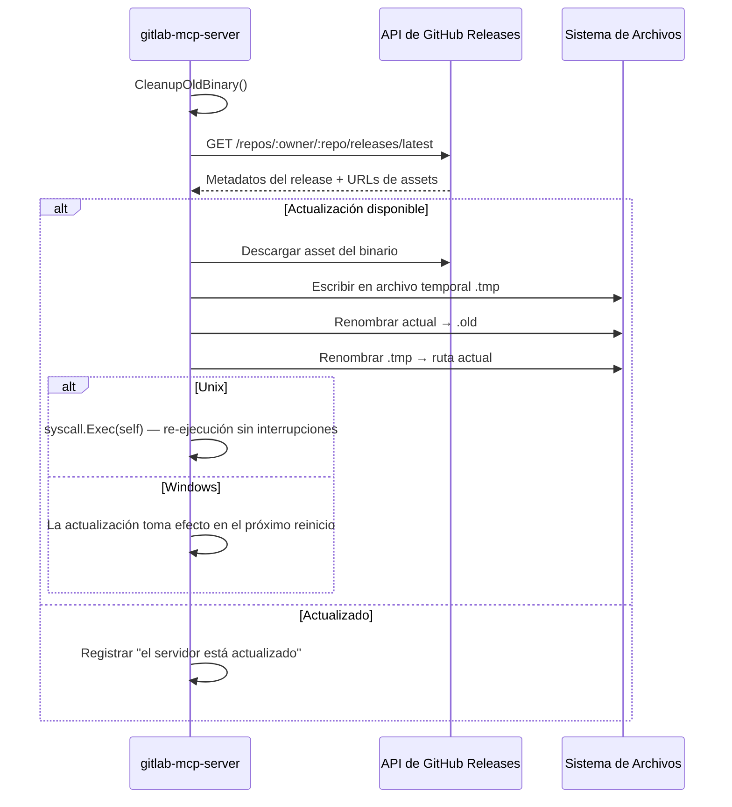

GitLab MCP Server puede detectar, descargar y aplicar automáticamente nuevas versiones desde GitHub. Las actualizaciones usan un **truco de renombrado** — el binario en ejecución se renombra a `.old`, el nuevo binario se coloca en la ruta original, y en Unix el proceso se re-ejecuta sin interrupciones.

## Modos de Actualización

La variable `AUTO_UPDATE` controla cómo se manejan las actualizaciones:

| Valor | Modo | Comportamiento |
|---|---|---|
| `true` (por defecto) | Aplicar automáticamente | Detectar y aplicar actualizaciones automáticamente |
| `check` | Solo notificar | Detectar actualizaciones y registrar disponibilidad, pero no aplicar |
| `false` | Deshabilitado | Omitir todas las verificaciones de actualización |

Alias aceptados: `1`/`yes` para true, `0`/`no` para false. El valor no distingue mayúsculas de minúsculas.

## Cómo Funciona



### Verificación al Inicio (Modo Stdio)

En modo stdio (el predeterminado), la actualización automática se ejecuta como una **verificación previa al inicio** con un timeout de 15 segundos antes de que el servidor MCP comience a aceptar conexiones:

1. `CleanupOldBinary()` elimina cualquier archivo `.old` sobrante de una actualización anterior
2. Verifica si hay una versión más nueva en GitHub
3. Si el modo es `true` y existe una versión más nueva, descarga y reemplaza el binario
4. En **Linux/macOS**: se re-ejecuta vía `syscall.Exec()` — mismo PID, mismos pipes stdin/stdout, sin interrupción para el cliente MCP
5. En **Windows**: registra que la actualización tomará efecto en el próximo reinicio

La verificación al inicio es **no fatal** — cualquier error (timeout de red, releases no encontrados) se registra como advertencia y no impide que el servidor arranque.

### Verificación Periódica (Modo HTTP)

En modo HTTP, la actualización automática se ejecuta como una **verificación periódica en segundo plano**:

1. Una goroutine verifica actualizaciones cada `AUTO_UPDATE_INTERVAL` (por defecto: 1 hora)
2. En cada ciclo, verifica GitHub para un release más nuevo con un timeout de 30 segundos
3. Si el modo es `true`, aplica la actualización y registra un aviso de reinicio
4. La goroutine se detiene cuando el servidor se apaga

## Configuración

### Variables de Entorno (Modo Stdio)

| Variable | Por Defecto | Descripción |
|---|---|---|
| `AUTO_UPDATE` | `true` | Modo de actualización: `true`, `check` o `false` |
| `AUTO_UPDATE_REPO` | `jmrplens/gitlab-mcp-server` | Slug del repositorio de GitHub (`propietario/repo`) para assets del release |
| `AUTO_UPDATE_INTERVAL` | `1h` | Intervalo de verificación (usado por las verificaciones periódicas del modo HTTP) |

### Flags de CLI (Modo HTTP)

| Flag | Por Defecto | Descripción |
|---|---|---|
| `--auto-update` | `true` | Modo de actualización: `true`, `check` o `false` |
| `--auto-update-repo` | `jmrplens/gitlab-mcp-server` | Slug del repositorio de GitHub (`propietario/repo`) para assets del release |
| `--auto-update-interval` | `1h` | Intervalo entre verificaciones periódicas de actualización |

:::note
La actualización automática usa la **API de GitHub Releases** — es completamente independiente de tu configuración de GitLab. Tus ajustes de `GITLAB_URL`, `GITLAB_TOKEN` y `GITLAB_SKIP_TLS_VERIFY` no afectan a la actualización automática.
:::

### Ejemplos de Configuración

Desactivar la actualización automática completamente:

```env
AUTO_UPDATE=false
```

Modo de solo verificación (registrar disponibilidad pero no aplicar):

```env
AUTO_UPDATE=check
```

Usar un repositorio fork personalizado:

```env
AUTO_UPDATE_REPO=mi-org/mi-fork-gitlab-mcp
```

## Flag de Apagado para Actualizadores Externos

Herramientas externas (como pe-agnostic-store) pueden terminar todas las instancias en ejecución antes de reemplazar el binario en disco:

```bash
gitlab-mcp-server --shutdown
```

Este flag:

1. Encuentra todos los procesos `gitlab-mcp-server` en ejecución por nombre
2. Envía una señal de terminación graceful
3. Espera hasta 5 segundos a que los procesos terminen
4. Fuerza la terminación de cualquier proceso restante
5. Finaliza — no se inicia ningún servidor MCP

No se requieren permisos de administrador o root. Esto funciona en Linux, macOS y Windows.

## Reversión

Si una actualización causa problemas:

1. El binario anterior se conserva como `gitlab-mcp-server.old` (o `.exe.old` en Windows) junto al binario actual
2. Para revertir, detén el servidor y renombra el archivo `.old` de vuelta al nombre original
3. El archivo `.old` se limpia automáticamente en el próximo inicio exitoso

## Soporte de Repositorio Personalizado

Puedes apuntar la actualización automática a cualquier repositorio de GitHub que siga el formato de release esperado:

1. Establece `AUTO_UPDATE_REPO=propietario/repo` a tu repositorio
2. Crea releases en GitHub con binarios de plataforma nombrados `gitlab-mcp-server-{os}-{arch}`
3. Incluye un asset `checksums.txt` con hashes SHA-256 (formato goreleaser)

:::caution
Los nombres de los assets del release **deben ser nombres de archivo exactos** (ej., `gitlab-mcp-server-linux-amd64`). Nunca añadas sufijos descriptivos como `(Linux AMD64)` — la librería de actualización busca por nombre exacto y fallará con nombres decorados.
:::
