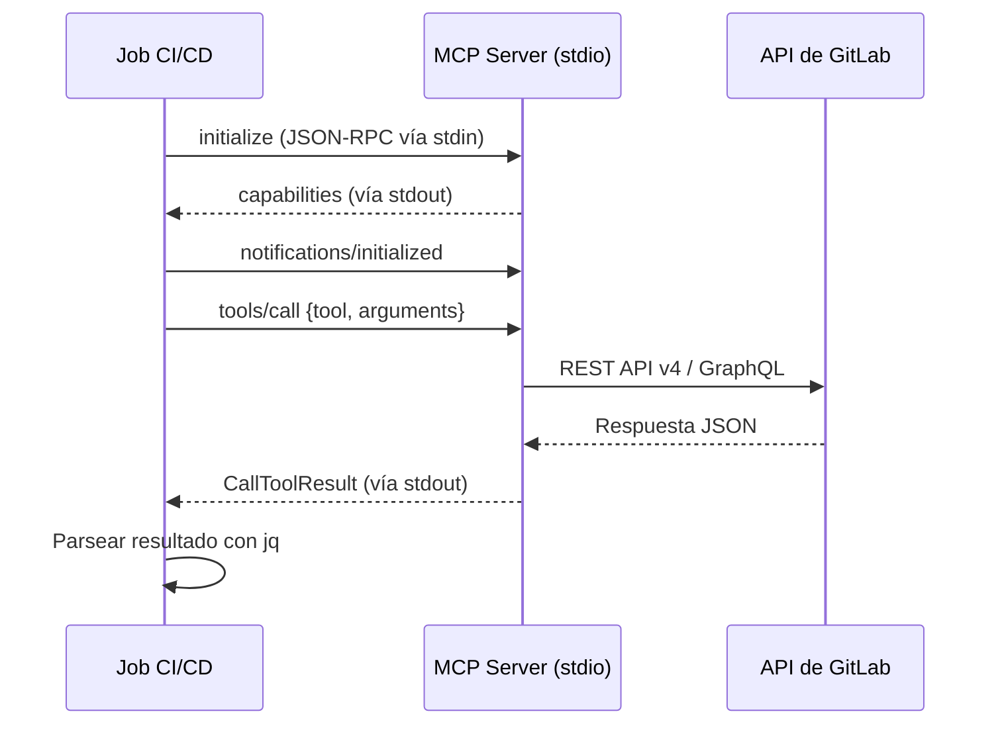

import { Steps, Tabs, TabItem } from "@astrojs/starlight/components";
import FAQ from "../../../../components/FAQ.astro";

gitlab-mcp-server puede ejecutarse dentro de jobs CI/CD como cualquier otra herramienta CLI. Hay dos modos de uso disponibles:

| Modo                               | LLM Necesario | Caso de uso                                                                 |   Determinismo    |
| ---------------------------------- | :-----------: | --------------------------------------------------------------------------- | :---------------: |
| **Determinista** (JSON-RPC)        |      No       | Operaciones scriptadas: listar issues, publicar comentarios, crear releases |  ✅ Determinista   |
| **Con LLM** (cliente MCP headless) |      Sí       | Flujos inteligentes: revisión de código, triaje de issues, análisis de MRs  | ❌ No determinista |

Ambos modos se autentican con un **Personal Access Token** (PAT) o **Project Access Token**. Los despliegues Enterprise/Premium con un token de scope `api` tienen acceso a toda la superficie de herramientas. Los despliegues GitLab.com tienen acceso al conjunto principal de herramientas más las herramientas adicionales específicas de Orbit.



## Requisitos previos

<Steps>

1. **Descarga el binario** desde [GitHub Releases](https://github.com/jmrplens/gitlab-mcp-server/releases):

   ```bash
   curl -sSL "https://github.com/jmrplens/gitlab-mcp-server/releases/latest/download/gitlab-mcp-server-linux-amd64" \
     -o gitlab-mcp-server
   chmod +x gitlab-mcp-server
   ```

2. **Crea un Project Access Token** con scope `api` (recomendado sobre PATs personales para CI).

3. **Almacena el token** como variable CI/CD enmascarada llamada `MCP_PAT`.

</Steps>

:::caution
No ejecutes el binario publicado de Linux sobre una imagen Alpine. Los binarios de Linux son ejecutables independientes de posición que usan el cargador dinámico de glibc (`/lib64/ld-linux-x86-64.so.2`), que musl no proporciona, así que `./gitlab-mcp-server` falla con un engañoso `not found` aunque el archivo exista y sea ejecutable. Usa una imagen base con glibc (`debian:stable-slim`, `ubuntu`, `python:3.12-slim`) o la imagen de contenedor `ghcr.io/jmrplens/gitlab-mcp-server`, compilada contra musl. Deduce su transporte a partir de la entrada estándar, y un runner de CI no promete nada sobre la forma de esa entrada, así que indica `--transport stdio` de forma explícita para un job por stdio.
:::

## Modo 1: Determinista (Sin LLM)

Envía mensajes JSON-RPC directamente al servidor a través de stdio. Totalmente determinista — sin LLM ni API externa necesaria.

### Cómo funciona

El servidor se comunica a través del [protocolo MCP](https://modelcontextprotocol.io/specification/2025-11-25/basic/transports#stdio) sobre stdin/stdout usando JSON-RPC 2.0. Cada interacción requiere un handshake `initialize`, una notificación `initialized`, y luego una o más solicitudes `tools/call`.

El nombre de herramienta que puede invocar un job depende de la **superficie de herramientas** activa. La predeterminada es `dynamic` y registra exactamente dos herramientas —`gitlab_find_action` y `gitlab_execute_action`—, así que un script llama a `gitlab_execute_action` con un ID canónico `domain.action` y un objeto `params`. Invocar una herramienta individual sobre la superficie predeterminada responde con `{"code":-32602,"message":"unknown tool ..."}`; como es un error JSON-RPC y no un resultado de herramienta, `jq -s '.[1].result.content[0].text'` imprime `null` y el job termina sin salida y sin fallar. Si prefieres una herramienta por operación, define `TOOL_SURFACE=individual` en las `variables:` del job: los nombres individuales empiezan por el dominio, no por el verbo (`gitlab_issue_list`, `gitlab_mr_list`, `gitlab_project_get`); consulta el [Resumen de herramientas](/gitlab-mcp-server/es/tools/overview/).

### Ejemplo en GitLab CI

```yaml
# .gitlab-ci.yml
mcp-list-issues:
  stage: test
  image: debian:stable-slim
  variables:
    GITLAB_URL: ${CI_SERVER_URL}
    GITLAB_TOKEN: ${MCP_PAT}
  before_script:
    - apt-get update && apt-get install -y --no-install-recommends ca-certificates curl jq
    - curl -sSL "https://github.com/jmrplens/gitlab-mcp-server/releases/latest/download/gitlab-mcp-server-linux-amd64"
      -o gitlab-mcp-server
    - chmod +x gitlab-mcp-server
  script:
    - |
      RESULT=$({
        echo '{"jsonrpc":"2.0","method":"initialize","params":{"protocolVersion":"2025-11-25","capabilities":{},"clientInfo":{"name":"ci","version":"1.0"}},"id":1}'
        echo '{"jsonrpc":"2.0","method":"notifications/initialized"}'
        echo '{"jsonrpc":"2.0","method":"tools/call","params":{"name":"gitlab_execute_action","arguments":{"action":"issue.list","params":{"project_id":"'"${CI_PROJECT_ID}"'","state":"opened","per_page":5}}},"id":2}'
      } | ./gitlab-mcp-server 2>/dev/null | jq -s '.[1]')
    # jq -e para que un error JSON-RPC o un error de herramienta hagan fallar el
    # job en lugar de imprimir "null" y salir con 0.
    - jq -e 'has("error") | not' >/dev/null <<<"${RESULT}"
    - jq -e '.result.isError != true' >/dev/null <<<"${RESULT}"
    - jq -r '.result.content[0].text' <<<"${RESULT}"
```

### Función auxiliar

Para pipelines con muchas llamadas, envuelve el protocolo en una función reutilizable:

```bash
mcp_call() {
  local action="$1"
  local args="$2"
  local response
  response=$({
    echo '{"jsonrpc":"2.0","method":"initialize","params":{"protocolVersion":"2025-11-25","capabilities":{},"clientInfo":{"name":"ci","version":"1.0"}},"id":1}'
    echo '{"jsonrpc":"2.0","method":"notifications/initialized"}'
    echo '{"jsonrpc":"2.0","method":"tools/call","params":{"name":"gitlab_execute_action","arguments":{"action":"'"${action}"'","params":'"${args}"'}},"id":2}'
  } | ./gitlab-mcp-server 2>/dev/null | jq -s '.[1]')

  # Un error JSON-RPC y un error de herramienta son fallos distintos, y ninguno
  # llega al estado de salida del pipeline anterior: sin estas comprobaciones la
  # función imprime "null" y el job termina con éxito.
  if jq -e 'has("error")' >/dev/null <<<"${response}"; then
    echo "MCP ${action} ha fallado: $(jq -r '.error.message' <<<"${response}")" >&2
    return 1
  fi
  if jq -e '.result.isError == true' >/dev/null <<<"${response}"; then
    echo "MCP ${action} ha devuelto un error de herramienta: $(jq -r '.result.content[0].text' <<<"${response}")" >&2
    return 1
  fi
  jq -r '.result.content[0].text' <<<"${response}"
}

# Uso
ISSUES=$(mcp_call "issue.list" '{"project_id":"'"${CI_PROJECT_ID}"'","state":"opened"}')
```

## Modo 2: Con LLM (Cliente MCP headless)

Usa un cliente MCP headless para que un LLM seleccione y orqueste las herramientas. Ideal para flujos inteligentes como revisión de código, triaje de issues y generación de notas de release.

### Cliente recomendado: IBM mcp-cli

[IBM mcp-cli](https://github.com/IBM/mcp-cli) soporta modo comando para flujos automatizados con LLM, con proveedores OpenAI, Anthropic, Azure, Gemini, Groq y Ollama local.

### GitLab CI: revisión automática de MRs

```yaml
# .gitlab-ci.yml
auto-review:
  stage: review
  image: python:3.12-slim
  variables:
    GITLAB_URL: ${CI_SERVER_URL}
    GITLAB_TOKEN: ${MCP_PAT}
    OPENAI_API_KEY: ${OPENAI_KEY}
  before_script:
    - apt-get update && apt-get install -y curl
    - curl -sSL "https://github.com/jmrplens/gitlab-mcp-server/releases/latest/download/gitlab-mcp-server-linux-amd64"
      -o gitlab-mcp-server
    - chmod +x gitlab-mcp-server
    - pip install --quiet mcp-cli
  script:
    - |
      cat > server_config.json << 'EOF'
      {
        "mcpServers": {
          "gitlab": {
            "command": "./gitlab-mcp-server",
            "env": {
              "GITLAB_URL": "${GITLAB_URL}",
              "GITLAB_TOKEN": "${GITLAB_TOKEN}"
            }
          }
        }
      }
      EOF
    - |
      mcp-cli cmd \
        --config-file server_config.json \
        --server gitlab \
        --provider openai \
        --model gpt-4o \
        --prompt "Revisa el merge request !${CI_MERGE_REQUEST_IID} en el proyecto ${CI_PROJECT_ID}. Comprueba calidad de código, problemas de seguridad y tests faltantes. Publica tu revisión como nota en el MR." \
        --raw
  rules:
    - if: $CI_MERGE_REQUEST_IID
```

### Usar un LLM local (Ollama)

Para pipelines que no pueden usar APIs de LLM externas, ejecuta Ollama como servicio CI:

```yaml
local-llm-review:
  stage: review
  image: python:3.12-slim
  services:
    - name: ollama/ollama:latest
      alias: ollama
  variables:
    GITLAB_URL: ${CI_SERVER_URL}
    GITLAB_TOKEN: ${MCP_PAT}
    OLLAMA_HOST: http://ollama:11434
  before_script:
    - apt-get update && apt-get install -y --no-install-recommends curl
    - curl -sSL "https://github.com/jmrplens/gitlab-mcp-server/releases/latest/download/gitlab-mcp-server-linux-amd64"
      -o gitlab-mcp-server
    - chmod +x gitlab-mcp-server
    - pip install --quiet mcp-cli
    - curl -s "${OLLAMA_HOST}/api/pull" -d '{"name":"qwen2.5-coder:7b"}'
  script:
    - |
      cat > server_config.json << 'EOF'
      {
        "mcpServers": {
          "gitlab": {
            "command": "./gitlab-mcp-server",
            "env": {
              "GITLAB_URL": "${GITLAB_URL}",
              "GITLAB_TOKEN": "${GITLAB_TOKEN}"
            }
          }
        }
      }
      EOF
    - |
      mcp-cli cmd \
        --config-file server_config.json \
        --server gitlab \
        --provider ollama \
        --model qwen2.5-coder:7b \
        --prompt "Resume los últimos 5 merge requests del proyecto ${CI_PROJECT_ID}." \
        --raw
```

## Transporte HTTP en CI

Para pipelines con muchas llamadas a herramientas, el transporte HTTP evita la sobrecarga de inicio de proceso por llamada:

```yaml
http-mode-pipeline:
  script:
    # Iniciar servidor HTTP en segundo plano
    - ./gitlab-mcp-server --http --gitlab-url="${CI_SERVER_URL}" --http-addr=127.0.0.1:8080 &
    - sleep 2
    # Llamar herramientas vía HTTP
    - |
      curl -s -X POST http://127.0.0.1:8080/mcp \
        -H "Content-Type: application/json" \
        -H "PRIVATE-TOKEN: ${MCP_PAT}" \
        -d '{"jsonrpc":"2.0","method":"tools/call","params":{"name":"gitlab_execute_action","arguments":{"action":"issue.list","params":{"project_id":"'"${CI_PROJECT_ID}"'","state":"opened"}}},"id":2}' \
        | jq '.result.content[0].text'
```

Consulta [Servidor HTTP](/gitlab-mcp-server/es/operations/http-server/) para detalles completos.

## Herramientas CI/CD disponibles

Más allá de ejecutar el servidor en pipelines, GitLab MCP Server proporciona herramientas completas de gestión CI/CD que los asistentes de IA pueden usar interactivamente. Están disponibles mediante la superficie dinámica find/execute predeterminada y mediante meta-herramientas explícitas con `TOOL_SURFACE=meta`.

### Pipelines

El dominio `pipeline` gestiona el ciclo de vida completo de los pipelines. Sus acciones son IDs `pipeline.<acción>` para `gitlab_execute_action` en la superficie dinámica predeterminada y los valores de `action` de la meta-herramienta `gitlab_pipeline` con `TOOL_SURFACE=meta`:

| Acción                | Descripción                                                                                         |
| --------------------- | --------------------------------------------------------------------------------------------------- |
| `list`                | Listar pipelines con filtrado por estado, ref                                                       |
| `get`                 | Obtener detalles y estado del pipeline                                                              |
| `create`              | Disparar un nuevo pipeline con variables                                                            |
| `cancel`              | Cancelar un pipeline en ejecución                                                                   |
| `retry`               | Reintentar un pipeline fallido                                                                      |
| `delete`              | Eliminar un pipeline                                                                                |
| `variables`           | Listar variables del pipeline                                                                       |
| `test_report`         | Obtener el informe de tests de un pipeline                                                          |
| `wait`                | **Esperar a la finalización** del pipeline con polling                                              |
| `schedule_*`          | CRUD de programaciones (list, get, create, edit, delete, run, take_ownership)                       |
| `schedule_*_variable` | CRUD de variables de programación (list_variables, create_variable, edit_variable, delete_variable) |
| `trigger_*`           | Gestión de tokens de trigger (list, get, create, update, delete)                                    |

:::tip[Esperar pipeline]
La acción `wait` consulta un pipeline hasta que alcanza un estado terminal (success, failed, canceled). Esto es especialmente útil en scripts CI que necesitan bloquearse hasta que un pipeline disparado termine.
:::

### Jobs

El dominio `job` proporciona gestión completa de jobs. Sus acciones son IDs `job.<acción>` para `gitlab_execute_action` en la superficie dinámica predeterminada y los valores de `action` de la meta-herramienta `gitlab_job` con `TOOL_SURFACE=meta`:

| Acción              | Descripción                                       |
| ------------------- | ------------------------------------------------- |
| `list`              | Listar jobs de un pipeline                        |
| `get`               | Obtener detalles del job                          |
| `play`              | Ejecutar un job manual                            |
| `cancel`            | Cancelar un job en ejecución                      |
| `retry`             | Reintentar un job fallido                         |
| `trace`             | Obtener la salida del log del job                 |
| `artifacts`         | Listar artefactos del job                         |
| `download_artifact` | Descargar un artefacto específico                 |
| `delete_artifacts`  | Eliminar artefactos del job                       |
| `wait`              | **Esperar a la finalización** del job con polling |

### Configuración CI/CD

| Dominio (meta-herramienta)           | Acciones                                                            | Descripción                          |
| ------------------------------------ | ------------------------------------------------------------------- | ------------------------------------ |
| `template` (`gitlab_template`)       | `lint`, `lint_project`                                              | Validar sintaxis de `.gitlab-ci.yml` |
| `ci_variable` (`gitlab_ci_variable`) | `list`, `get`, `create`, `update`, `delete`                         | Gestionar variables CI/CD            |
| `environment` (`gitlab_environment`) | `list`, `get`, `create`, `update`, `delete`, `stop`, `deployment_*` | Gestionar entornos y despliegues     |

### Ejemplo: pipeline con variables

Disparar un pipeline con variables personalizadas en la superficie dinámica predeterminada:

```json
{
  "tool": "gitlab_execute_action",
  "arguments": {
    "action": "pipeline.create",
    "params": {
      "project_id": "my-group/my-project",
      "ref": "main",
      "variables": [
        { "key": "DEPLOY_ENV", "value": "staging", "variable_type": "env_var" },
        { "key": "CONFIG", "value": "...", "variable_type": "file" }
      ]
    }
  }
}
```

Con `TOOL_SURFACE=meta` la misma llamada es `gitlab_pipeline` con `{ "action": "create", "params": { ... } }`; las meta-herramientas solo aceptan `action` y `params` en el nivel superior, así que los parámetros van anidados en `params` en ambas superficies.

Para la referencia completa de herramientas, consulta [Resumen de herramientas](/gitlab-mcp-server/es/tools/overview/).

## Mejores prácticas de seguridad

| Práctica       | Recomendación                                                      |
| -------------- | ------------------------------------------------------------------ |
| Tipo de token  | **Project Access Token** — limitado a un proyecto, auditable       |
| Scope          | `api` para acceso completo, `read_api` para flujos de solo lectura |
| Expiración     | Máximo 90 días, rotar antes de que expire                          |
| Almacenamiento | **Variable CI/CD enmascarada** — nunca commitear al repositorio    |
| Multi-proyecto | Usar **Group Access Tokens** para flujos entre proyectos           |

## Solución de problemas

| Error                                           | Solución                                                                            |
| ----------------------------------------------- | ----------------------------------------------------------------------------------- |
| `not found` / permiso denegado                  | Verifica que el binario se descargó para la plataforma correcta, ejecuta `chmod +x` |
| `401 Unauthorized`                              | Comprueba que la variable `MCP_PAT` está configurada y el token no ha expirado      |
| `x509: certificate signed by unknown authority` | Configura `GITLAB_SKIP_TLS_VERIFY=true`                                             |
| Timeout en respuestas grandes                   | Añade argumento `per_page` para limitar resultados                                  |
| Errores de proveedor en mcp-cli                 | Verifica las variables de API key, prueba `pip install --upgrade mcp-cli`           |

<FAQ />

## Referencia de la fuente

:::note[Documentación para desarrolladores]
Para la referencia técnica completa, consulta [`docs/ci-cd.md`](https://github.com/jmrplens/gitlab-mcp-server/blob/main/docs/guides/ci-cd.md) en el repositorio.
:::
