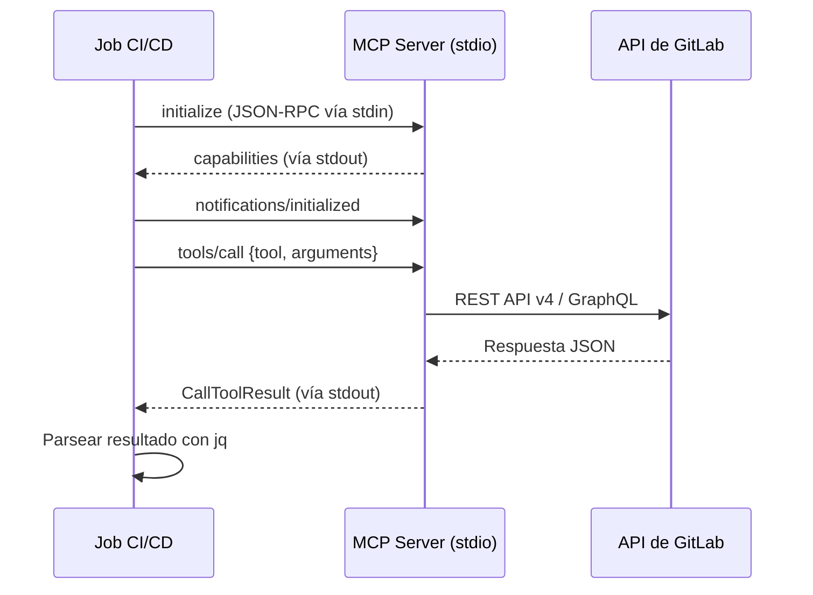

import { Steps, Tabs, TabItem } from "@astrojs/starlight/components";
import FAQ from "../../../../components/FAQ.astro";

gitlab-mcp-server puede ejecutarse dentro de jobs CI/CD como cualquier otra herramienta CLI. Hay dos modos de uso disponibles:

| Modo                               | LLM Necesario | Caso de uso                                                                 |   Determinismo    |
| ---------------------------------- | :-----------: | --------------------------------------------------------------------------- | :---------------: |
| **Determinista** (JSON-RPC)        |      No       | Operaciones scriptadas: listar issues, publicar comentarios, crear releases |  ✅ Determinista   |
| **Con LLM** (cliente MCP headless) |      Sí       | Flujos inteligentes: revisión de código, triaje de issues, análisis de MRs  | ❌ No determinista |

Ambos modos se autentican con un **Personal Access Token** (PAT) o **Project Access Token**. Un token con scope `api` alcanza todas las acciones que sirve el tier de la instancia, a las que Premium y Ultimate añaden las suyas. En GitLab.com, Premium y Ultimate sirven además las acciones de Orbit.

Esta página trata de ejecutar el servidor dentro de un job. Para las acciones de pipelines, jobs, variables, programaciones y triggers que puede invocar un asistente, consulta [Herramientas CI/CD disponibles](#herramientas-cicd-disponibles) más abajo y los [ejemplos de flujos CI/CD](/gitlab-mcp-server/es/examples/ci-cd-workflows/).


```mermaid
sequenceDiagram
    participant CI as Job CI/CD
    participant MCP as MCP Server (stdio)
    participant GL as API de GitLab

    CI->>MCP: initialize (JSON-RPC vía stdin)
    MCP-->>CI: capabilities (vía stdout)
    CI->>MCP: notifications/initialized
    CI->>MCP: tools/call {tool, arguments}
    MCP->>GL: REST API v4 / GraphQL
    GL-->>MCP: Respuesta JSON
    MCP-->>CI: CallToolResult (vía stdout)
    CI->>CI: Parsear resultado con jq
```

## Requisitos previos

<Steps>

1. **Descarga el binario** desde [GitHub Releases](https://github.com/jmrplens/gitlab-mcp-server/releases):

   ```bash
   curl -sSL "https://github.com/jmrplens/gitlab-mcp-server/releases/latest/download/gitlab-mcp-server-linux-amd64" \
     -o gitlab-mcp-server
   chmod +x gitlab-mcp-server
   ```

   Para fijar una release en lugar de seguir la más reciente, sustituye `releases/latest/download/` por `releases/download/v<versión>/`, como muestra [Binario nativo](/gitlab-mcp-server/es/install/binary/#descarga-manual).

2. **Crea un Project Access Token** (recomendado sobre PATs personales para CI) en **Settings > Access Tokens** del proyecto. Dale `api` para todas las herramientas que pueda invocar el job, o `read_api` para un job que solo lee (acciones de listar, obtener y buscar): el servidor responde a un token `read_api` con su superficie de solo lectura. Fija una fecha de expiración; 90 días como máximo es un buen valor por defecto.

3. **Almacena el token** como variable CI/CD enmascarada llamada `MCP_PAT`, como describe [Almacenar el token](#almacenar-el-token).

</Steps>

:::caution
No ejecutes el binario publicado de Linux sobre una imagen Alpine. Los binarios de Linux son ejecutables independientes de posición que usan el cargador dinámico de glibc (`/lib64/ld-linux-x86-64.so.2`), que musl no proporciona, así que `./gitlab-mcp-server` falla con un engañoso `not found` aunque el archivo exista y sea ejecutable. Usa una imagen base con glibc (`debian:stable-slim`, `ubuntu`, `python:3.12-slim`) o la imagen de contenedor `ghcr.io/jmrplens/gitlab-mcp-server`, compilada contra musl. Deduce su transporte a partir de la entrada estándar, y un runner de CI no promete nada sobre la forma de esa entrada, así que indica `--transport stdio` de forma explícita para un job por stdio.
:::

### Almacenar el token

**GitLab CI**: en **Settings > CI/CD > Variables**, añade:

| Variable  | Valor           | Propiedades                  |
| --------- | --------------- | ---------------------------- |
| `MCP_PAT` | `glpat-xxxx...` | Masked, Protected (opcional) |

**GitHub Actions**: en **Settings > Secrets and variables > Actions**, añade un secreto de repositorio llamado `MCP_PAT`.

Nunca escribas un token en un archivo de pipeline ni lo imprimas en el log de un job: todos los ejemplos de esta página lo pasan por la variable secreta del sistema de CI y por nada más.

## Modo 1: Determinista (Sin LLM)

Envía mensajes JSON-RPC directamente al servidor a través de stdio. Totalmente determinista — sin LLM ni API externa necesaria.

### Cómo funciona

El servidor se comunica a través del [protocolo MCP](https://modelcontextprotocol.io/specification/2025-11-25/basic/transports#stdio) sobre stdin/stdout usando JSON-RPC 2.0. Cada interacción requiere un handshake `initialize`, una notificación `initialized`, y luego una o más solicitudes `tools/call`.

**Mantén stdin abierto hasta que llegue la respuesta.** El servidor se detiene cuando se cierra su entrada estándar, y cancela todas las llamadas que sigan en curso en ese momento, así que una llamada solo recibe respuesta si stdin sigue abierto cuando su resultado está listo. Una llamada a herramienta espera además a que el servidor construya su catálogo de herramientas, lo que sigue a sus primeras peticiones a GitLab, así que el resultado llega un momento después del handshake. Enviar al servidor un conjunto fijo de líneas por una tubería (`{ echo ...; } | ./gitlab-mcp-server`) cierra stdin en cuanto se escribe la última línea, y el job lee `null` en lugar de un resultado. Todos los ejemplos de abajo arrancan el servidor como coproceso de bash, le escriben las peticiones, leen sus respuestas hasta que llega la del `id` esperado y solo entonces cierran su entrada.

El nombre de herramienta que puede invocar un job depende de la **superficie de herramientas** activa. La predeterminada es `dynamic` y registra exactamente dos herramientas, `gitlab_find_action` y `gitlab_execute_action`, así que un script llama a `gitlab_execute_action` con un ID canónico `domain.action` y un objeto `params`. Invocar una herramienta individual sobre la superficie predeterminada responde con `{"code":-32602,"message":"unknown tool ..."}`; como es un error JSON-RPC y no un resultado de herramienta, `jq -r '.result.content[0].text'` imprime `null` y el job termina sin salida y sin fallar salvo que compruebe `error`, como hacen los ejemplos de abajo. Si prefieres una herramienta por operación, define `GITLAB_MCP_TOOL_SURFACE=individual` en las `variables:` del job: los nombres individuales empiezan por el dominio, no por el verbo (`gitlab_issue_list`, `gitlab_mr_list`, `gitlab_project_get`); consulta el [Resumen de herramientas](/gitlab-mcp-server/es/tools/overview/).

### Ejemplo en GitLab CI

```yaml
# .gitlab-ci.yml
mcp-list-issues:
  stage: test
  image: debian:stable-slim
  variables:
    GITLAB_URL: ${CI_SERVER_URL}
    GITLAB_TOKEN: ${MCP_PAT}
  before_script:
    - apt-get update && apt-get install -y --no-install-recommends ca-certificates curl jq
    - curl -sSL "https://github.com/jmrplens/gitlab-mcp-server/releases/latest/download/gitlab-mcp-server-linux-amd64"
      -o gitlab-mcp-server
    - chmod +x gitlab-mcp-server
  script:
    - |
      # stdin sigue abierto hasta leer la respuesta al id 2: el servidor
      # cancela una llamada en curso cuando se cierra su entrada.
      coproc MCP { ./gitlab-mcp-server 2>/dev/null; }
      to=${MCP[1]} from=${MCP[0]} pid=${MCP_PID}
      echo '{"jsonrpc":"2.0","method":"initialize","params":{"protocolVersion":"2025-11-25","capabilities":{},"clientInfo":{"name":"ci","version":"1.0"}},"id":1}' >&"${to}"
      echo '{"jsonrpc":"2.0","method":"notifications/initialized"}' >&"${to}"
      echo '{"jsonrpc":"2.0","method":"tools/call","params":{"name":"gitlab_execute_action","arguments":{"action":"issue.list","params":{"project_id":"'"${CI_PROJECT_ID}"'","state":"opened","per_page":5}}},"id":2}' >&"${to}"
      RESULT=""
      while IFS= read -r line <&"${from}"; do
        if jq -e '.id == 2' >/dev/null <<<"${line}"; then RESULT=${line}; break; fi
      done
      exec {to}>&-
      wait "${pid}"
    # Un RESULT vacío significa que el servidor terminó sin responder. Después,
    # jq -e hace fallar el job ante un error JSON-RPC o un error de herramienta
    # en lugar de imprimir "null" y salir con 0.
    - test -n "${RESULT}"
    - jq -e 'has("error") | not' >/dev/null <<<"${RESULT}"
    - jq -e '.result.isError != true' >/dev/null <<<"${RESULT}"
    - jq -r '.result.content[0].text' <<<"${RESULT}"
```

### Script independiente

El mismo intercambio como script que puede invocar un job, con el token tomado de la variable enmascarada:

```bash
#!/bin/bash
set -euo pipefail

export GITLAB_URL="${CI_SERVER_URL}"
export GITLAB_TOKEN="${MCP_PAT}"

coproc MCP { ./gitlab-mcp-server 2>/dev/null; }
to=${MCP[1]} from=${MCP[0]} pid=${MCP_PID}

# 1. Handshake de inicialización
echo '{"jsonrpc":"2.0","method":"initialize","params":{"protocolVersion":"2025-11-25","capabilities":{},"clientInfo":{"name":"ci-script","version":"1.0"}},"id":1}' >&"${to}"
# 2. Notificación initialized
echo '{"jsonrpc":"2.0","method":"notifications/initialized"}' >&"${to}"
# 3. Invocar una acción mediante la superficie dinámica predeterminada
echo '{"jsonrpc":"2.0","method":"tools/call","params":{"name":"gitlab_execute_action","arguments":{"action":"issue.list","params":{"project_id":"'"${CI_PROJECT_ID}"'","state":"opened","per_page":10}}},"id":2}' >&"${to}"

# 4. Leer hasta que llegue la respuesta al id 2, y solo entonces cerrar stdin
RESULT=""
while IFS= read -r line <&"${from}"; do
  if jq -e '.id == 2' >/dev/null <<<"${line}"; then RESULT=${line}; break; fi
done
exec {to}>&-
wait "${pid}"

if [[ -z "${RESULT}" ]]; then
  echo "el servidor terminó sin responder" >&2
  exit 1
fi
jq '.' <<<"${RESULT}"
```

El servidor responde con un mensaje JSON-RPC por línea. El bucle los lee uno a uno, se salta la respuesta a `initialize` (`id` 1) y se detiene en el resultado de la herramienta (`id` 2), el momento en que ya es seguro cerrar la entrada del servidor; la forma `{ echo ...; } | ./gitlab-mcp-server`, que cierra stdin de inmediato, no recibe ningún resultado.

### Varias llamadas en una sesión

Un mismo proceso puede responder a varias llamadas. Da a cada una su propio `id`, mantén stdin abierto hasta que todos los `id` tengan respuesta y relaciona cada respuesta con su llamada por el `id`, no por la posición:

```bash
#!/bin/bash
set -euo pipefail

export GITLAB_URL="${CI_SERVER_URL}"
export GITLAB_TOKEN="${MCP_PAT}"

coproc MCP { ./gitlab-mcp-server 2>/dev/null; }
to=${MCP[1]} from=${MCP[0]} pid=${MCP_PID}

echo '{"jsonrpc":"2.0","method":"initialize","params":{"protocolVersion":"2025-11-25","capabilities":{},"clientInfo":{"name":"ci","version":"1.0"}},"id":1}' >&"${to}"
echo '{"jsonrpc":"2.0","method":"notifications/initialized"}' >&"${to}"

# Listar los merge requests abiertos
echo '{"jsonrpc":"2.0","method":"tools/call","params":{"name":"gitlab_execute_action","arguments":{"action":"merge_request.list","params":{"project_id":"'"${CI_PROJECT_ID}"'","state":"opened"}}},"id":2}' >&"${to}"

# Obtener los detalles del proyecto
echo '{"jsonrpc":"2.0","method":"tools/call","params":{"name":"gitlab_execute_action","arguments":{"action":"project.get","params":{"project_id":"'"${CI_PROJECT_ID}"'"}}},"id":3}' >&"${to}"

# Mantener stdin abierto hasta que las dos llamadas tengan respuesta
RESPONSES=()
while (( ${#RESPONSES[@]} < 2 )) && IFS= read -r line <&"${from}"; do
  if jq -e '.id == 2 or .id == 3' >/dev/null <<<"${line}"; then RESPONSES+=("${line}"); fi
done
exec {to}>&-
wait "${pid}"

printf '%s\n' "${RESPONSES[@]}" | jq -s '.'
```

### Función auxiliar

Para pipelines con muchas llamadas, envuelve el protocolo en una función reutilizable. Su tercer argumento, opcional, fija el `id` JSON-RPC de la llamada, cualquier número salvo 1, que usa el handshake:

```bash
mcp_call() {
  local action="$1"
  local args="$2"
  local id="${3:-2}"
  local response="" line to from pid
  coproc MCP { ./gitlab-mcp-server 2>/dev/null; }
  to=${MCP[1]} from=${MCP[0]} pid=${MCP_PID}
  echo '{"jsonrpc":"2.0","method":"initialize","params":{"protocolVersion":"2025-11-25","capabilities":{},"clientInfo":{"name":"ci","version":"1.0"}},"id":1}' >&"${to}"
  echo '{"jsonrpc":"2.0","method":"notifications/initialized"}' >&"${to}"
  echo '{"jsonrpc":"2.0","method":"tools/call","params":{"name":"gitlab_execute_action","arguments":{"action":"'"${action}"'","params":'"${args}"'}},"id":'"${id}"'}' >&"${to}"

  # stdin sigue abierto hasta que llega la respuesta: el servidor cancela una
  # llamada en curso cuando se cierra su entrada.
  while IFS= read -r line <&"${from}"; do
    if jq -e --argjson id "${id}" '.id == $id' >/dev/null <<<"${line}"; then
      response=${line}
      break
    fi
  done
  exec {to}>&-
  wait "${pid}"

  # Que no haya respuesta, un error JSON-RPC y un error de herramienta son
  # fallos distintos, y ninguno fija un estado de salida: sin estas
  # comprobaciones la función no imprime nada útil y el job termina con éxito.
  if [[ -z "${response}" ]]; then
    echo "MCP ${action}: el servidor terminó sin responder" >&2
    return 1
  fi
  if jq -e 'has("error")' >/dev/null <<<"${response}"; then
    echo "MCP ${action} ha fallado: $(jq -r '.error.message' <<<"${response}")" >&2
    return 1
  fi
  if jq -e '.result.isError == true' >/dev/null <<<"${response}"; then
    echo "MCP ${action} ha devuelto un error de herramienta: $(jq -r '.result.content[0].text' <<<"${response}")" >&2
    return 1
  fi
  jq -r '.result.content[0].text' <<<"${response}"
}

# Uso
ISSUES=$(mcp_call "issue.list" '{"project_id":"'"${CI_PROJECT_ID}"'","state":"opened"}')
echo "Issues abiertos: ${ISSUES}"

# CI_MERGE_REQUEST_IID solo existe en los pipelines de merge request
MR_DETAILS=$(mcp_call "merge_request.get" '{"project_id":"'"${CI_PROJECT_ID}"'","merge_request_iid":"'"${CI_MERGE_REQUEST_IID}"'"}')
echo "Detalles del MR: ${MR_DETAILS}"
```

## Modo 2: Con LLM (Cliente MCP headless)

Usa un cliente MCP headless para que un LLM seleccione y orqueste las herramientas. Ideal para flujos inteligentes como revisión de código, triaje de issues y generación de notas de release.

### Cliente recomendado: IBM mcp-cli

[IBM mcp-cli](https://github.com/IBM/mcp-cli) soporta modo comando para flujos automatizados con LLM, con proveedores OpenAI, Anthropic, Azure, Gemini, Groq y Ollama local:

- `mcp-cli cmd --prompt "..."` entrega al modelo una tarea en lenguaje natural, y el modelo elige e invoca las herramientas.
- `mcp-cli cmd --tool <name> --tool-args '{...}'` invoca una herramienta directamente, sin que ningún modelo decida nada.
- Su modo interactivo también puede construir planes de herramientas en varios pasos como grafos de dependencias y ejecutar en paralelo los pasos independientes.

### Configuración del servidor

mcp-cli lee sus servidores de `server_config.json`:

```json
{
  "mcpServers": {
    "gitlab": {
      "command": "./gitlab-mcp-server"
    }
  }
}
```

El archivo no nombra ninguna credencial a propósito. mcp-cli arranca el servidor con el propio entorno del job, así que `GITLAB_URL` y `GITLAB_TOKEN` definidas como variables del job le llegan sin cambios. No expande variables de entorno dentro del archivo: un bloque `env` escrito como `"GITLAB_TOKEN": "${GITLAB_TOKEN}"` sustituiría el token real por ese texto literal. El único marcador que resuelve es un valor completo de la forma `${TOKEN:<namespace>:<name>}`, que lee de su propio almacén de tokens y no del entorno (comprobado con mcp-cli 0.20.1).

### GitLab CI: revisión automática de MRs

```yaml
# .gitlab-ci.yml
auto-review:
  stage: review
  image: python:3.12-slim
  variables:
    GITLAB_URL: ${CI_SERVER_URL}
    GITLAB_TOKEN: ${MCP_PAT}
    OPENAI_API_KEY: ${OPENAI_KEY}
  before_script:
    - apt-get update && apt-get install -y curl
    - curl -sSL "https://github.com/jmrplens/gitlab-mcp-server/releases/latest/download/gitlab-mcp-server-linux-amd64"
      -o gitlab-mcp-server
    - chmod +x gitlab-mcp-server
    - pip install --quiet mcp-cli
  script:
    - |
      cat > server_config.json << 'EOF'
      {
        "mcpServers": {
          "gitlab": {
            "command": "./gitlab-mcp-server"
          }
        }
      }
      EOF
    - |
      mcp-cli cmd \
        --config-file server_config.json \
        --server gitlab \
        --provider openai \
        --model gpt-4o \
        --prompt "Revisa el merge request !${CI_MERGE_REQUEST_IID} en el proyecto ${CI_PROJECT_ID}. Comprueba calidad de código, problemas de seguridad y tests faltantes. Publica tu revisión como nota en el MR." \
        --raw
  rules:
    - if: $CI_MERGE_REQUEST_IID
```

### GitLab CI: triaje de issues programado

La misma configuración, lanzada desde una programación de pipeline, puede etiquetar el backlog. El token necesita `api`, porque añadir etiquetas es una escritura:

```yaml
# .gitlab-ci.yml
triage-issues:
  stage: deploy
  image: python:3.12-slim
  variables:
    GITLAB_URL: ${CI_SERVER_URL}
    GITLAB_TOKEN: ${MCP_PAT}
    OPENAI_API_KEY: ${OPENAI_KEY}
  before_script:
    - apt-get update && apt-get install -y curl
    - curl -sSL "https://github.com/jmrplens/gitlab-mcp-server/releases/latest/download/gitlab-mcp-server-linux-amd64"
      -o gitlab-mcp-server
    - chmod +x gitlab-mcp-server
    - pip install --quiet mcp-cli
  script:
    - |
      cat > server_config.json << 'EOF'
      {
        "mcpServers": {
          "gitlab": {
            "command": "./gitlab-mcp-server"
          }
        }
      }
      EOF
    - |
      mcp-cli cmd \
        --config-file server_config.json \
        --server gitlab \
        --provider openai \
        --model gpt-4o \
        --prompt "Lista todos los issues abiertos del proyecto ${CI_PROJECT_ID} que no tengan etiquetas. Para cada uno, analiza su contenido y añade las etiquetas adecuadas (bug, feature, documentation, etc.)." \
        --raw
  rules:
    - if: $CI_PIPELINE_SOURCE == "schedule"
```

### Usar un LLM local (Ollama)

Para pipelines que no pueden usar APIs de LLM externas, ejecuta Ollama como servicio CI. El proveedor Ollama de mcp-cli (de su dependencia `chuk-llm`) encuentra el servicio a través de `OLLAMA_BASE_URL`, que también lee su descubrimiento de modelos, y nunca a través de `OLLAMA_HOST`:

```yaml
local-llm-review:
  stage: review
  image: python:3.12-slim
  services:
    - name: ollama/ollama:latest
      alias: ollama
  variables:
    GITLAB_URL: ${CI_SERVER_URL}
    GITLAB_TOKEN: ${MCP_PAT}
    OLLAMA_BASE_URL: http://ollama:11434
  before_script:
    - apt-get update && apt-get install -y --no-install-recommends curl
    - curl -sSL "https://github.com/jmrplens/gitlab-mcp-server/releases/latest/download/gitlab-mcp-server-linux-amd64"
      -o gitlab-mcp-server
    - chmod +x gitlab-mcp-server
    - pip install --quiet mcp-cli
    - curl -s "${OLLAMA_BASE_URL}/api/pull" -d '{"name":"qwen2.5-coder:7b"}'
  script:
    - |
      cat > server_config.json << 'EOF'
      {
        "mcpServers": {
          "gitlab": {
            "command": "./gitlab-mcp-server"
          }
        }
      }
      EOF
    - |
      mcp-cli cmd \
        --config-file server_config.json \
        --server gitlab \
        --provider ollama \
        --model qwen2.5-coder:7b \
        --prompt "Resume los últimos 5 merge requests del proyecto ${CI_PROJECT_ID}." \
        --raw
```

## Transporte HTTP en CI

Para pipelines con muchas llamadas a herramientas, el transporte HTTP evita la sobrecarga de inicio de proceso por llamada:

```yaml
# .gitlab-ci.yml
http-mode-pipeline:
  stage: test
  image: debian:stable-slim
  before_script:
    - apt-get update && apt-get install -y --no-install-recommends ca-certificates curl jq
    - curl -sSL "https://github.com/jmrplens/gitlab-mcp-server/releases/latest/download/gitlab-mcp-server-linux-amd64"
      -o gitlab-mcp-server
    - chmod +x gitlab-mcp-server
  script:
    # Arrancar el servidor en segundo plano y esperar a que /health responda.
    # --json-response hace que cada respuesta sea un cuerpo JSON plano que jq
    # puede leer; por defecto es un sobre text/event-stream.
    - |
      ./gitlab-mcp-server --http \
        --gitlab-url="${CI_SERVER_URL}" \
        --http-addr=127.0.0.1:8080 \
        --json-response &
      for _ in $(seq 30); do
        curl -fsS http://127.0.0.1:8080/health >/dev/null && break
        sleep 1
      done
    # El transporte predeterminado no tiene estado: cada POST es autónomo, así
    # que un tools/call no necesita un initialize previo. curl lee la cabecera
    # del token de un archivo que solo este usuario puede leer, así que el
    # token nunca llega a su argv.
    - |
      HEADER=$(mktemp)
      printf 'PRIVATE-TOKEN: %s\n' "${MCP_PAT}" > "${HEADER}"
      curl -s -X POST http://127.0.0.1:8080/mcp \
        -H "Content-Type: application/json" \
        -H "Accept: application/json, text/event-stream" \
        -H @"${HEADER}" \
        -d '{"jsonrpc":"2.0","method":"tools/call","params":{"name":"gitlab_execute_action","arguments":{"action":"issue.list","params":{"project_id":"'"${CI_PROJECT_ID}"'","state":"opened"}}},"id":2}' \
        | jq '.result.content[0].text'
      rm -f "${HEADER}"
```

Tres detalles deciden si ese job lee una respuesta:

- **`--json-response`.** Sin él, cada respuesta es un sobre `text/event-stream` que `jq` no puede parsear. El flag tiene un coste que el servidor indica al arrancar: las notificaciones de progreso no pueden viajar en un cuerpo JSON, así que una acción larga como `pipeline.wait` no informa de nada hasta que termina.
- **La cabecera `Accept`.** El transporte responde `400` (`Accept must contain both 'application/json' and 'text/event-stream'`) a un POST cuyo `Accept` solo admite uno de los dos. El `*/*` por defecto de curl admite ambos, así que nómbralos explícitamente, como pide el protocolo: un cliente con un valor por defecto más estrecho recibe el rechazo.
- **Sin handshake.** `--stateless` está activo por defecto, así que cada POST es autónomo y la llamada anterior es toda la conversación.

En modo HTTP cada credencial está limitada por defecto a 10 llamadas por segundo con una ráfaga de 40; un job que itere más deprisa puede subir `--rate-limit-rps` y `--rate-limit-burst` ([Limitación de tasa](/gitlab-mcp-server/es/operations/http-server/#limitación-de-tasa)). Consulta [Servidor HTTP](/gitlab-mcp-server/es/operations/http-server/) para todos los flags y las opciones de autenticación.

## GitHub Actions

El servidor funciona igual en un job de GitHub Actions contra cualquier instancia de GitLab. GitHub no define `CI_SERVER_URL`, así que nombra la instancia y el proyecto como variables del repositorio (**Settings > Secrets and variables > Actions**, pestaña Variables), junto al secreto `MCP_PAT`. Un `GITLAB_URL` sin definir o vacío significa `https://gitlab.com`, así que una variable que nunca se creó envía el token allí.

### Modo determinista

```yaml
# .github/workflows/mcp-query.yml
name: MCP Query
on:
  workflow_dispatch:

jobs:
  list-issues:
    runs-on: ubuntu-latest
    env:
      GITLAB_URL: ${{ vars.GITLAB_URL }}
      GITLAB_TOKEN: ${{ secrets.MCP_PAT }}
      GITLAB_PROJECT: ${{ vars.GITLAB_PROJECT }}
    steps:
      - name: Download gitlab-mcp-server
        run: |
          curl -sSL "https://github.com/jmrplens/gitlab-mcp-server/releases/latest/download/gitlab-mcp-server-linux-amd64" \
            -o gitlab-mcp-server
          chmod +x gitlab-mcp-server

      - name: List open issues
        run: |
          # stdin sigue abierto hasta leer la respuesta al id 2
          coproc MCP { ./gitlab-mcp-server 2>/dev/null; }
          to=${MCP[1]} from=${MCP[0]} pid=${MCP_PID}
          echo '{"jsonrpc":"2.0","method":"initialize","params":{"protocolVersion":"2025-11-25","capabilities":{},"clientInfo":{"name":"ci","version":"1.0"}},"id":1}' >&"${to}"
          echo '{"jsonrpc":"2.0","method":"notifications/initialized"}' >&"${to}"
          echo '{"jsonrpc":"2.0","method":"tools/call","params":{"name":"gitlab_execute_action","arguments":{"action":"issue.list","params":{"project_id":"'"${GITLAB_PROJECT}"'","state":"opened","per_page":5}}},"id":2}' >&"${to}"
          RESULT=""
          while IFS= read -r line <&"${from}"; do
            if jq -e '.id == 2' >/dev/null <<<"${line}"; then RESULT=${line}; break; fi
          done
          exec {to}>&-
          wait "${pid}"
          test -n "${RESULT}"
          jq -e 'has("error") | not' >/dev/null <<<"${RESULT}"
          jq -e '.result.isError != true' >/dev/null <<<"${RESULT}"
          jq -r '.result.content[0].text' <<<"${RESULT}"
```

`GITLAB_PROJECT` contiene el ID numérico del proyecto o su ruta `grupo/proyecto`.

### Modo con LLM

```yaml
# .github/workflows/mcp-summary.yml
name: MCP Summary
on:
  workflow_dispatch:

jobs:
  summarize:
    runs-on: ubuntu-latest
    env:
      GITLAB_URL: ${{ vars.GITLAB_URL }}
      GITLAB_TOKEN: ${{ secrets.MCP_PAT }}
      GITLAB_PROJECT: ${{ vars.GITLAB_PROJECT }}
      OPENAI_API_KEY: ${{ secrets.OPENAI_KEY }}
    steps:
      - name: Setup
        run: |
          curl -sSL "https://github.com/jmrplens/gitlab-mcp-server/releases/latest/download/gitlab-mcp-server-linux-amd64" \
            -o gitlab-mcp-server
          chmod +x gitlab-mcp-server
          pipx install mcp-cli

      - name: Summarize recent changes
        run: |
          cat > server_config.json << 'EOF'
          {
            "mcpServers": {
              "gitlab": {
                "command": "./gitlab-mcp-server"
              }
            }
          }
          EOF
          mcp-cli cmd \
            --config-file server_config.json \
            --server gitlab \
            --provider openai \
            --model gpt-4o \
            --prompt "Resume los merge requests fusionados la última semana en el proyecto de GitLab ${GITLAB_PROJECT}." \
            --raw
```

Igual que en los jobs de GitLab CI, el token llega al servidor por el entorno del job y nunca se escribe en `server_config.json`.

## Herramientas CI/CD disponibles

Más allá de ejecutar el servidor en pipelines, GitLab MCP Server proporciona herramientas completas de gestión CI/CD que los asistentes de IA pueden usar interactivamente. Están disponibles mediante la superficie dinámica find/execute predeterminada y mediante meta-herramientas explícitas con `GITLAB_MCP_TOOL_SURFACE=meta`.

### Pipelines

El dominio `pipeline` gestiona el ciclo de vida completo de los pipelines. Sus acciones son IDs `pipeline.<acción>` para `gitlab_execute_action` en la superficie dinámica predeterminada y los valores de `action` de la meta-herramienta `gitlab_pipeline` con `GITLAB_MCP_TOOL_SURFACE=meta`:

| Acción                | Descripción                                                                                                           |
| --------------------- | --------------------------------------------------------------------------------------------------------------------- |
| `list`                | Listar pipelines con filtrado por estado, ref                                                                         |
| `get`                 | Obtener detalles y estado del pipeline                                                                                |
| `create`              | Disparar un nuevo pipeline con variables                                                                              |
| `cancel`              | Cancelar un pipeline en ejecución                                                                                     |
| `retry`               | Reintentar un pipeline fallido                                                                                        |
| `delete`              | Eliminar un pipeline                                                                                                  |
| `variables`           | Listar variables del pipeline                                                                                         |
| `test_report`         | Obtener el informe de tests de un pipeline                                                                            |
| `wait`                | **Esperar a la finalización** del pipeline con polling                                                                |
| `latest`              | Obtener el último pipeline de una ref                                                                                 |
| `test_report_summary` | Obtener el resumen del informe de tests de un pipeline                                                                |
| `update_metadata`     | Actualizar los metadatos de un pipeline (nombre)                                                                      |
| `trigger_*`           | Gestión de tokens de trigger de pipeline (list, get, create, update, delete, run)                                     |
| `schedule_*`          | CRUD de programaciones de pipeline (list, get, create, update, delete, run, take ownership, list triggered pipelines) |
| `schedule_*_variable` | CRUD de variables de programación (create, edit, delete)                                                              |

Las filas de programaciones pertenecen al mismo grupo `gitlab_pipeline` que el resto, así que en la superficie dinámica sus IDs se leen `pipeline.schedule_list`, `pipeline.schedule_run`, `pipeline.schedule_take_ownership`, `pipeline.schedule_list_triggered_pipelines`, `pipeline.schedule_create_variable`, `pipeline.schedule_edit_variable`, etc.; en la superficie meta son valores de `action` de `gitlab_pipeline` como el resto de la tabla.

:::tip[Esperar pipeline]
La acción `wait` consulta un pipeline hasta que alcanza un estado terminal (success, failed, canceled). Esto es especialmente útil en scripts CI que necesitan bloquearse hasta que un pipeline disparado termine.
:::

### Jobs

El dominio `job` proporciona gestión completa de jobs. Sus acciones son IDs `job.<acción>` para `gitlab_execute_action` en la superficie dinámica predeterminada y los valores de `action` de la meta-herramienta `gitlab_job` con `GITLAB_MCP_TOOL_SURFACE=meta`:

| Acción               | Descripción                                                                                        |
| -------------------- | -------------------------------------------------------------------------------------------------- |
| `list`               | Listar jobs de un pipeline                                                                         |
| `get`                | Obtener detalles del job                                                                           |
| `play`               | Ejecutar un job manual                                                                             |
| `cancel`             | Cancelar un job en ejecución                                                                       |
| `retry`              | Reintentar un job fallido                                                                          |
| `trace`              | Obtener la salida del log del job                                                                  |
| `artifacts`          | Descargar el archivo de artefactos de un job, o un informe por `file_type` (19.4+)                 |
| `download_artifacts` | Descargar el último archivo de artefactos de una ref y un nombre de job                            |
| `download_single_*`  | Descargar un único fichero de los artefactos de un job, por ID de job o por ref y nombre de job    |
| `keep_artifacts`     | Conservar los artefactos más allá de su caducidad                                                  |
| `delete_artifacts`   | Eliminar los artefactos de un job (una variante a nivel de proyecto elimina los de todos los jobs) |
| `erase`              | Borrar el log y los artefactos de un job                                                           |
| `list_project`       | Listar jobs de todo un proyecto                                                                    |
| `list_bridges`       | Listar los jobs de trigger (bridge) de un pipeline                                                 |
| `wait`               | **Esperar a la finalización** del job con polling                                                  |

Las dos descargas de un único fichero son `job.download_single_artifact` (por ID de job) y `job.download_single_artifact_by_ref` (por ref y nombre de job); la eliminación a nivel de proyecto es `job.delete_project_artifacts`.

### Configuración CI/CD

| Dominio (meta-herramienta)           | Acciones                                                            | Descripción                          |
| ------------------------------------ | ------------------------------------------------------------------- | ------------------------------------ |
| `template` (`gitlab_template`)       | `lint`, `lint_project`                                              | Validar sintaxis de `.gitlab-ci.yml` |
| `ci_variable` (`gitlab_ci_variable`) | `list`, `get`, `create`, `update`, `delete`                         | Gestionar variables CI/CD            |
| `environment` (`gitlab_environment`) | `list`, `get`, `create`, `update`, `delete`, `stop`, `deployment_*` | Gestionar entornos y despliegues     |

### Ejemplo: pipeline con variables

Disparar un pipeline con variables personalizadas en la superficie dinámica predeterminada:

```json
{
  "tool": "gitlab_execute_action",
  "arguments": {
    "action": "pipeline.create",
    "params": {
      "project_id": "my-group/my-project",
      "ref": "main",
      "variables": [
        { "key": "DEPLOY_ENV", "value": "staging", "variable_type": "env_var" },
        { "key": "CONFIG", "value": "...", "variable_type": "file" }
      ]
    }
  }
}
```

Con `GITLAB_MCP_TOOL_SURFACE=meta` la misma llamada es `gitlab_pipeline` con `{ "action": "create", "params": { ... } }`; las meta-herramientas solo aceptan `action` y `params` en el nivel superior, así que los parámetros van anidados en `params` en ambas superficies.

Para la referencia completa de herramientas, consulta [Resumen de herramientas](/gitlab-mcp-server/es/tools/overview/).

## Mejores prácticas de seguridad

| Práctica       | Recomendación                                                                  |
| -------------- | ------------------------------------------------------------------------------ |
| Tipo de token  | **Project Access Token**, limitado a un proyecto, auditable                    |
| Scope          | `api` para acceso completo, `read_api` para flujos de solo lectura             |
| Expiración     | Máximo 90 días, rotar antes de que expire                                      |
| Almacenamiento | **Variable CI/CD enmascarada**, nunca commiteada al repositorio                |
| Visibilidad    | Marca la variable como **Protected** si solo la necesitan las ramas protegidas |
| Multi-proyecto | Usar **Group Access Tokens** para flujos entre proyectos                       |

### Scope mínimo para el flujo

Ajusta el scope del token a lo que hace el job. Un token `read_api` recibe la superficie de solo lectura, así que una escritura que el job no necesitaba ni siquiera aparece en la lista ([Scopes del token](/gitlab-mcp-server/es/operations/security/#scopes-del-token)):

| Flujo                              | Scope necesario |
| ---------------------------------- | --------------- |
| Listar issues, MRs, pipelines      | `read_api`      |
| Publicar comentarios, crear issues | `api`           |
| Gestionar releases, paquetes       | `api`           |
| Flujo completo de revisión de MRs  | `api`           |

### Group Access Tokens

Para un flujo que abarca varios proyectos, crea un único **Group Access Token** en lugar de un token por proyecto:

1. Ve a **Settings > Access Tokens** del grupo.
2. Crea un token con el scope que necesita el flujo.
3. Úsalo en cualquier proyecto del grupo, almacenado igual que `MCP_PAT`.

## Solución de problemas

| Error                                           | Solución                                                                                                                                                                                                                                                                       |
| ----------------------------------------------- | ------------------------------------------------------------------------------------------------------------------------------------------------------------------------------------------------------------------------------------------------------------------------------ |
| `not found` / permiso denegado                  | En una imagen Alpine (musl) el binario publicado no puede arrancar: usa una imagen con glibc o la imagen de contenedor. Si no es el caso, comprueba que el binario corresponde a la plataforma del runner, ejecuta `chmod +x` y confírmalo con `./gitlab-mcp-server --version` |
| `401 Unauthorized`                              | Comprueba que `MCP_PAT` está definida, no ha expirado y lleva `api` o `read_api`; un Project Access Token solo sirve para el proyecto al que pertenece                                                                                                                         |
| `x509: certificate signed by unknown authority` | Define `GITLAB_MCP_SKIP_TLS_VERIFY: "true"` en las `variables:` del job (entre comillas, para que YAML lo trate como texto)                                                                                                                                                    |
| Timeout en respuestas grandes                   | Añade `per_page` a los `params` de la acción, por ejemplo `{"action": "issue.list", "params": {"project_id": "123", "per_page": 20}}`                                                                                                                                          |
| Errores de proveedor en mcp-cli                 | Comprueba que la variable de clave del proveedor está definida (`OPENAI_API_KEY`, `ANTHROPIC_API_KEY`) o, con Ollama, que el servicio responde en `OLLAMA_BASE_URL` (mcp-cli no lee `OLLAMA_HOST`); después prueba `pip install --upgrade mcp-cli`                             |

<FAQ />

## Referencia de la fuente

:::note[Documentación para desarrolladores]
Para la referencia técnica completa, consulta [`docs/guides/ci-cd.md`](https://github.com/jmrplens/gitlab-mcp-server/blob/main/docs/guides/ci-cd.md) en el repositorio.
:::
