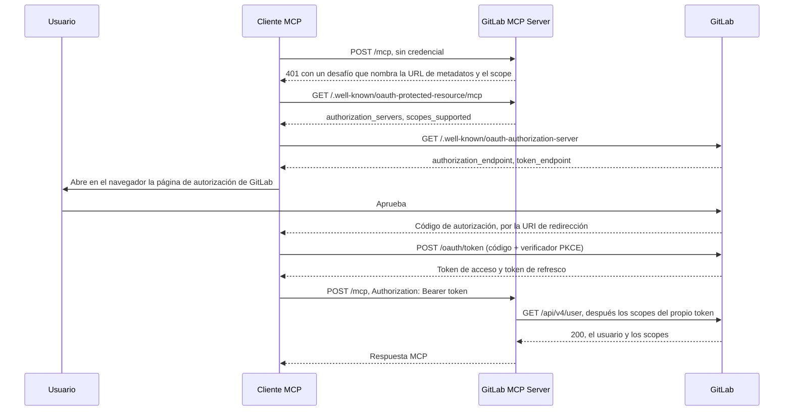

import { Tabs, TabItem } from "@astrojs/starlight/components";
import FAQ from "../../../../components/FAQ.astro";

Cuando GitLab MCP Server funciona con `--auth-mode=oauth`, un cliente MCP que habla OAuth 2.1 identifica a su usuario en GitLab, en el navegador, y envía en cada petición el token que recibe. GitLab solo emite ese token para una aplicación OAuth que conoce, así que un despliegue necesita una **aplicación OAuth de GitLab**, y cada cliente se configura con el ID de esa aplicación.

El servidor no participa en el intercambio. Es el **servidor de recursos**: publica dónde autorizar y verifica contra GitLab cada token que recibe. El cliente OAuth es el cliente MCP (VS Code, Claude Code, Cursor), que obtiene el token directamente de GitLab, así que el servidor ni guarda ni necesita el secreto de la aplicación.

:::note[¿Usas el endpoint alojado?]
`https://mcp.jmrp.io/gitlab` ya tiene su aplicación registrada, y su [ficha del servidor](https://mcp.jmrp.io/servers/gitlab/) publica el client ID y un fragmento por cliente; consulta [Endpoint alojado](/gitlab-mcp-server/es/install/hosted/). Esta página es para un despliegue que ejecutas tú.
:::

## Antes de empezar

- **Permiso para crear la aplicación**: un administrador para una de toda la instancia, el Owner del grupo para una de grupo. Cualquier usuario puede crear una propia.
- **Una URL de GitLab https.** Los tokens Bearer se reenvían a la instancia en cada llamada, así que el modo OAuth rechaza un `--gitlab-url` `http`, y `--skip-tls-verify` para una instancia que no está en loopback. `http` solo se acepta para un host de loopback (`localhost`, `127.0.0.1`, `::1`), para desarrollo.
- **La URL que usarán los clientes**, que el servidor recibe como `--public-url`: una URL https (`http` solo para un host de loopback), sin barra final ni fragmento. El servidor se niega a arrancar en modo OAuth sin ella.

Los flags, y cómo encaja el modo OAuth en el resto del modo HTTP, están en [Modo servidor HTTP](/gitlab-mcp-server/es/operations/http-server/#modo-oauth).

## Cómo funciona el flujo



1. El cliente envía una petición sin credencial y recibe `401` con un desafío que nombra la URL de metadatos RFC 9728 y el scope que debe pedir.
2. Lee el documento de metadatos, que nombra la instancia de GitLab donde autorizar (`authorization_servers`) y el scope (`scopes_supported`), y después los metadatos del propio servidor de autorización de GitLab.
3. Ejecuta contra GitLab el flujo de código de autorización con PKCE, en el navegador del usuario, como la aplicación OAuth con cuyo ID se configuró.
4. Envía el token de acceso como `Authorization: Bearer` en cada petición.
5. El servidor verifica el token contra GitLab y cachea la identidad durante `--oauth-cache-ttl`; consulta [Duración de los tokens y caché de identidades](#duración-de-los-tokens-y-caché-de-identidades).

## Paso 1: crear la aplicación

GitLab documenta el propio formulario en [Configure GitLab as an OAuth 2.0 authentication identity provider](https://docs.gitlab.com/integration/oauth_provider/).

### Dónde crearla

Los tres tipos solo se diferencian en quién es dueño de la aplicación y puede revocarla; el flujo OAuth es el mismo.

| Tipo      | Dónde en GitLab                                                                                | Créala cuando                                                                  | Notas                                              |
| --------- | ---------------------------------------------------------------------------------------------- | ------------------------------------------------------------------------------ | -------------------------------------------------- |
| Instancia | **Admin** > **Applications** (`/admin/applications`) > **New application**                     | Administras un GitLab autogestionado y el despliegue sirve a toda la instancia | No disponible para usuarios normales en GitLab.com |
| Grupo     | **Settings** > **Applications** del grupo                                                      | Un equipo comparte el despliegue y debe seguir siendo dueño de la aplicación   | Sobrevive a la salida de cualquier miembro         |
| Usuario   | Tu avatar > **Edit profile** > **Access** > **Applications** (`/-/user_settings/applications`) | Ejecutas tú el despliegue, o estás en GitLab.com sin ser dueño de un grupo     | Ligada a tu cuenta, y se revoca con ella           |

### Rellenar el formulario

1. **Name**: algo que diga a los usuarios qué están autorizando, por ejemplo `MCP Server`.
2. **Redirect URI**: una línea por cada callback que envíen los clientes de tus usuarios; consulta el [Paso 2](#paso-2-registrar-las-uri-de-redirección).
3. **Confidential**: desmárcalo. Los clientes MCP son clientes OAuth públicos: se ejecutan en la máquina del usuario, no guardan ningún secreto y protegen el intercambio del código con PKCE.
4. **Scopes**: `api`, `read_api` o ambos; consulta [Qué scope marcar](#qué-scope-marcar).
5. Guarda la aplicación y copia su **Application ID**. Ese es el `clientId` con el que se configura cada cliente. A ningún cliente se le da el secreto.

:::note[Device authorization grant]
Si el formulario ofrece el **Device authorization grant** (RFC 8628), déjalo desactivado. Ningún cliente MCP lo usa: el flujo de autorización de MCP es la concesión de código de autorización con PKCE y una redirección en el navegador, y una concesión que nada usa solo abre la puerta al phishing con códigos de dispositivo.
:::

### Qué scope marcar

- **`api`**: lo que pide un despliegue que puede escribir. Cada acción que expone este servidor es una llamada REST v4 o GraphQL hecha con el token del usuario.
- **`read_api`**: lo que pide un despliegue arrancado con `--read-only` o `--safe-mode`, y el scope adecuado para un cliente que no debe cambiar nada, como un inspector en el navegador o un panel. **Todo despliegue admite un token `read_api`, también uno que puede escribir**, y le sirve la superficie de herramientas de solo lectura: la comprobación de escritura se hace por acción, no por despliegue.
- **`mcp`**: no lo marques para este servidor. Es el scope del servidor MCP integrado de GitLab, y un token que solo lo lleva no alcanza nada de la API REST ni GraphQL a la que llama este servidor; consulta [Registro dinámico de clientes y el scope `mcp`](#registro-dinámico-de-clientes-y-el-scope-mcp).

El servidor admite un token que lleve `read_api` o `api`, porque `api` cubre `read_api`. Un token que GitLab acepta pero que no lleva ninguno de los dos, uno con solo `read_user` por ejemplo, se responde con `403` y un desafío `insufficient_scope`.

**Un cliente pide un solo scope, y la aplicación tiene que tenerlo marcado.** El despliegue anuncia exactamente uno, en su desafío `401` y en el campo RFC 9728 `scopes_supported`: `api` cuando puede escribir, `read_api` con `--read-only` o `--safe-mode`, para que no se pida a ningún usuario más de lo que el servidor puede usar. GitLab rechaza, antes de cualquier pantalla de consentimiento y con `invalid_scope` ("The requested scope is invalid, unknown, or malformed"), una autorización que nombra un scope que la aplicación no tiene:

| La aplicación tiene | Un cliente que pide `api` | Que pide `read_api` | Que pide `api read_api` |
| ------------------- | ------------------------- | ------------------- | ----------------------- |
| Solo `api`          | Autorizado                | `invalid_scope`     | `invalid_scope`         |
| Solo `read_api`     | `invalid_scope`           | Autorizado          | `invalid_scope`         |
| Los dos             | Autorizado                | Autorizado          | Autorizado              |

Por eso el despliegue nunca anuncia los dos: un cliente que lee `scopes_supported` pide todos los scopes que hay en él. Un cliente que quiera una credencial de solo lectura en un despliegue que puede escribir nombra `read_api` él mismo en lugar de tomar el scope anunciado (`oauth.scopes` en Claude Code, `auth.scopes` en Cursor, `oauth.oauthScopes` en Kiro), con una aplicación que tenga `read_api` marcado; el token se admite y recibe la superficie de solo lectura. Los scopes de una aplicación se pueden editar sin recrearla, y su Application ID no cambia.

## Paso 2: registrar las URI de redirección

Cada cliente envía su propio callback, y GitLab lo compara con la lista de la aplicación. Registra todos los callbacks que vayan a enviar los clientes de tus usuarios, uno por línea en el campo **Redirect URI**.

| Cliente                    | URI de redirección                                 | Nota                                                                                                                                                                                                               |
| -------------------------- | -------------------------------------------------- | ------------------------------------------------------------------------------------------------------------------------------------------------------------------------------------------------------------------ |
| VS Code, GitHub Copilot    | `http://127.0.0.1:33418`                           | Un literal IP de loopback, así que el puerto no cuenta                                                                                                                                                             |
| VS Code Remote, vscode.dev | `https://vscode.dev/redirect`                      | Para entornos de desarrollo remotos                                                                                                                                                                                |
| Cursor (escritorio)        | `http://localhost:8787/callback`                   | Un callback fijo; la ruta forma parte de la comparación                                                                                                                                                            |
| Cursor (web, Cloud Agents) | `https://www.cursor.com/agents/mcp/oauth/callback` | Solo para las superficies alojadas de Cursor                                                                                                                                                                       |
| Claude Code (CLI)          | `http://localhost:8090/callback`                   | Con `--callback-port 8090`; registra el puerto que fijes                                                                                                                                                           |
| Claude Desktop, claude.ai  | `https://claude.ai/api/mcp/auth_callback`          | Compartido por las superficies alojadas de Claude                                                                                                                                                                  |
| OpenAI Codex CLI           | `http://127.0.0.1/callback`                        | Un literal IP de loopback, así que el puerto que elija Codex no cuenta; si fijas `mcp_oauth_callback_url`, registra esa URL en su lugar. Solo con `--oauth-client-id`: la vía del token Bearer no necesita ninguna |
| Gemini CLI                 | El `oauth.redirectUri` fijado en su configuración  | Registra exactamente lo que fijes                                                                                                                                                                                  |
| Kiro                       | El `oauth.redirectUri` fijado en su configuración  | Registra exactamente lo que fijes; si no lo defines, Kiro escucha en un puerto `localhost` aleatorio con el que ninguna entrada puede coincidir                                                                    |
| LM Studio                  | `http://127.0.0.1:33389/mcp-oauth-callback`        | Un literal IP de loopback, tal como lo documenta LM Studio                                                                                                                                                         |

:::caution[`localhost` no es `127.0.0.1`]
GitLab compara un literal IP de loopback solo por su host, como pide el RFC 8252 para las aplicaciones nativas, así que el puerto que elija VS Code no importa. `localhost` es un nombre, no un literal IP, y una entrada que lo nombra se compara exactamente, puerto y ruta incluidos. El callback de Claude Code es `http://localhost:<puerto>/callback`, así que una entrada `http://localhost` a secas nunca coincide con él: `--callback-port` es obligatorio, y la URI registrada lleva ese puerto y la ruta `/callback`. Sin él, Claude Code escucha en un puerto aleatorio con el que ninguna entrada puede coincidir.
:::

Para un equipo con VS Code, Claude Code y Cursor de escritorio, el campo queda así:

```text
http://127.0.0.1:33418
https://vscode.dev/redirect
http://localhost:8090/callback
http://localhost:8787/callback
```

## Paso 3: arrancar el servidor y comprobar los metadatos

```bash
gitlab-mcp-server --http \
  --gitlab-url=https://gitlab.example.com \
  --auth-mode=oauth \
  --public-url=https://mcp.example.com/mcp
```

`--public-url` es el identificador de recurso RFC 9728: la URL con la que se configuran los clientes, publicada exactamente como se escribe. `GITLAB_MCP_AUTH_MODE` y `GITLAB_MCP_PUBLIC_URL` fijan esos dos ajustes desde el entorno, y un flag pasado explícitamente gana.

La ruta del documento de metadatos se deriva de ella poniendo el segmento well-known entre el host y la ruta, así que este despliegue lo publica en `/.well-known/oauth-protected-resource/mcp`, y un `--public-url` sin ruta en `/.well-known/oauth-protected-resource` sin más ([dónde viven los metadatos](/gitlab-mcp-server/es/operations/http-server/#dónde-viven-los-metadatos-raíz-del-host-o-sub-ruta)). Compruébalo desde la máquina del servidor:

```bash
curl -s http://localhost:8080/.well-known/oauth-protected-resource/mcp | jq .
```

```json
{
  "resource": "https://mcp.example.com/mcp",
  "authorization_servers": ["https://gitlab.example.com"],
  "scopes_supported": ["api"],
  "bearer_methods_supported": ["header"],
  "resource_name": "GitLab MCP Server",
  "resource_documentation": "https://jmrp.io/docs/gitlab-mcp-server/operations/http-server/"
}
```

- `authorization_servers` lista todas las instancias que publica `--gitlab-url`, y `scopes_supported` dice `read_api` con `--read-only` o `--safe-mode`.
- `resource_documentation` se publica siempre, y por defecto es la página de servidor HTTP de este sitio. RFC 9728 no tiene ningún campo para un client ID, así que lo más cerca que puede estar un servidor de recursos de decirle a un cliente qué aplicación usar es una página que lo diga: apunta `--resource-documentation` a una tuya que nombre tu Application ID y sus URI de redirección.
- `--resource-policy-uri` y `--resource-tos-uri` añaden `resource_policy_uri` y `resource_tos_uri`, y se omiten mientras estén vacíos. Los tres toman una URL https.

### Tras un proxy inverso

La ruta de los metadatos está en la **raíz del host**, tenga la ruta que tenga `--public-url`. Arrancado con `--public-url=https://mcp.example.com/gitlab`, un despliegue publica `https://mcp.example.com/.well-known/oauth-protected-resource/gitlab`, que un proxy que solo reenvía `/gitlab/` nunca enruta. Enruta esa ruta exacta al servidor, sin reescribirla:

```nginx
location = /.well-known/oauth-protected-resource/gitlab {
    proxy_pass http://127.0.0.1:8080;   # sin reescribir la ruta
    proxy_set_header Host $host;
}
```

- **`location =` es una coincidencia exacta, y eso es lo importante.** Un `location` de prefijo mandaría aquí todas las rutas bajo `/.well-known/oauth-protected-resource/`, incluidos los documentos de los demás servidores que comparten el host, y este servidor solo sirve la única ruta que deriva de su `--public-url`. Un despliegue dueño de su nombre de host deriva la ruta escueta, y enruta esa.
- **`--public-url` se publica literalmente, y los clientes la comparan exactamente.** Se convierte en el campo `resource` tal como está escrita, y el RFC 9728 sección 3.3 hace que un cliente la compare, punto de código por punto de código, con la URL a la que envió su petición. Configura los clientes con esa cadena exacta: ni un alias, ni el host con `www.` delante, ni una barra final (que el servidor rechaza de todos modos al arrancar). Un cliente apuntado a `https://mcp.example.com/gitlab/` rechaza el documento de un despliegue arrancado con `--public-url=https://mcp.example.com/gitlab`.
- **`Host` tiene que llegar al servidor como el host público**, que es lo que hace `proxy_set_header Host $host;`. Lo leen dos comprobaciones. La guarda de `Host` responde `403` a un host que el despliegue no declaró cuando la petición llega por loopback, y el host de `--public-url` está declarado. La comprobación cross-origin compara el `Origin` de un navegador con `Host` cuando el navegador no envía `Sec-Fetch-Site`, así que reenviar un nombre interno rompe llamadas legítimas del mismo origen desde un navegador.
- **Los clientes de navegador necesitan `--trusted-origins`.** Un `POST` cross-origin desde un navegador se rechaza antes de la autenticación salvo que su origen esté en la lista, y el origen de `--public-url` se considera de confianza automáticamente; consulta [Protección cross-origin](/gitlab-mcp-server/es/operations/security/#protección-cross-origin).

Las configuraciones completas para nginx, Caddy, Traefik, Apache y Cloudflare Tunnel están en [Despliegue remoto](/gitlab-mcp-server/es/operations/remote-deployment/#tras-un-proxy-inverso).

### El desafío 401

Una petición que no lleva credencial se responde así:

```http
HTTP/1.1 401 Unauthorized
WWW-Authenticate: Bearer realm="gitlab-mcp-server", scope="api", resource_metadata="https://mcp.example.com/.well-known/oauth-protected-resource/mcp"
```

El cuerpo es un error JSON-RPC con código `-40100`. `resource_metadata` es donde empieza el descubrimiento. `scope` nombra el mismo scope único que `scopes_supported`, así que un cliente pide un solo scope lea cuál de los dos lea: la especificación MCP hace que un cliente tome primero el scope del desafío, y algunos clientes, Claude Code entre ellos, leen los metadatos en su lugar. Un cliente que pidiera a GitLab todos los scopes que anuncia su servidor de autorización recibiría `invalid_scope`. El scope es una recomendación, no el listón de admisión: un cliente que pide `read_api` a propósito se admite y recibe la superficie de solo lectura.

Todo desafío `401` lleva ese `scope`, también el que responde a un token no válido, así que un cliente que lee la cabecera y nunca descarga los metadatos sigue sabiendo qué pedir. El `403` que responde a un token por debajo del mínimo es la excepción: su desafío `insufficient_scope` nombra `read_api`, lo mínimo que admite el servidor, como pide el RFC 6750 para ese error. Un GitLab limitado o que no responde produce `503` con `Retry-After` y sin desafío, porque el token nunca se llegó a juzgar ([Seguridad](/gitlab-mcp-server/es/operations/security/#modo-oauth)).

## Paso 4: configurar los clientes

Configura cada cliente con el **Application ID** del Paso 1 y con el valor de `--public-url` como URL del servidor.

<Tabs>
<TabItem label="VS Code / Copilot">

```json
{
  "servers": {
    "gitlab": {
      "type": "http",
      "url": "https://mcp.example.com/mcp",
      "oauth": {
        "clientId": "TU_APPLICATION_ID_DE_GITLAB"
      }
    }
  }
}
```

</TabItem>
<TabItem label="Claude Code">

```bash
claude mcp add gitlab \
  --transport http \
  --client-id TU_APPLICATION_ID_DE_GITLAB \
  --callback-port 8090 \
  https://mcp.example.com/mcp
```

</TabItem>
</Tabs>

Configura siempre el client ID. Sin él, estos clientes recurren al registro dinámico de clientes, que en GitLab produce un token que este servidor no puede usar; consulta la sección siguiente.

### Otros clientes

| Cliente                   | OAuth contra GitLab | Cómo                                                                                                                                   |
| ------------------------- | ------------------- | -------------------------------------------------------------------------------------------------------------------------------------- |
| OpenAI Codex CLI          | Sí                  | `codex mcp add <name> --url <URL> --oauth-client-id <APP_ID>`, o sin OAuth con `bearer_token_env_var` en `~/.codex/config.toml`        |
| Gemini CLI                | Sí                  | `mcpServers.<name>.oauth`: `clientId` más un `redirectUri` fijado                                                                      |
| Kiro                      | Sí                  | `mcpServers.<name>.oauth`: `clientId` más un `redirectUri` fijado, en `.kiro/settings/mcp.json`                                        |
| LM Studio                 | Sí                  | Un bloque `auth` con `CLIENT_ID` en su `mcp.json`                                                                                      |
| mcp-remote (proxy stdio)  | Sí                  | `--static-oauth-client-info`                                                                                                           |
| MCP Inspector             | Sí                  | Credenciales de cliente estáticas en su configuración de autenticación                                                                 |
| GitLab Duo Agent Platform | **No**              | Documenta una entrada HTTP solo con `type` y `url`, sin cabecera: ejecuta el servidor por stdio, o llega a HTTP con mcp-remote         |
| Zed                       | **No**              | Solo admite CIMD y DCR, y ninguno de los dos produce un token de GitLab con scope `api`: envía un token de acceso personal como Bearer |
| JetBrains AI Assistant    | **No**              | No ejecuta ningún flujo OAuth y documenta una entrada remota como una `url` sola: llega al servidor con mcp-remote y un token personal |

Todos los clientes de las filas "No" siguen funcionando. El modo OAuth acepta un token de acceso personal enviado como `Authorization: Bearer <glpat-...>` y lo verifica contra GitLab igual que un token de acceso OAuth, salvo que el despliegue [admita solo su propia aplicación](#admitir-solo-tu-propia-aplicación); GitLab Duo y JetBrains lo envían a través de mcp-remote ([Configuración de clientes](/gitlab-mcp-server/es/install/clients/#mcp-remote-un-puente-stdio)). La cabecera `PRIVATE-TOKEN` se rechaza en modo OAuth.

## Registro dinámico de clientes y el scope `mcp`

El servidor de autorización de GitLab.com anuncia un endpoint de registro RFC 7591 (`/oauth/register`), así que un cliente que admite el registro dinámico de clientes (DCR) se registra solo sin que tú crees nada. Esa vía no funciona con este servidor, y merece la pena entender por qué.

**GitLab construyó el DCR para su propio servidor MCP.** A un cliente registrado dinámicamente se le da el scope `mcp` pida lo que pida, y un token con ese scope alcanza el endpoint MCP integrado de GitLab y nada más. Cada acción de este servidor es una llamada REST o GraphQL, así que el servidor rechaza ese token en la puerta, con `403` e `insufficient_scope`, porque no lleva ni `read_api` ni `api`.

Así que **una aplicación prerregistrada con `api` o `read_api` es obligatoria**, y su Application ID se configura en cada cliente. Un cliente al que no se le puede dar un client ID estático (Zed y JetBrains hoy) no puede usar la vía OAuth contra GitLab en absoluto, y envía en su lugar un token de acceso personal como Bearer.

GitLab tampoco implementa los Client ID Metadata Documents (CIMD), el mecanismo que la especificación de autorización de MCP prefiere ahora al DCR, al que declara obsoleto. Está registrado aguas arriba en [gitlab-org/gitlab#585069](https://gitlab.com/gitlab-org/gitlab/-/work_items/585069).

## Duración de los tokens y caché de identidades

Hay dos duraciones en juego: la del token de GitLab y la de la caché de verificación de este servidor.

### Los tokens de acceso de GitLab

GitLab emite tokens de acceso OAuth que caducan a las dos horas, con un token de refresco al lado, y desde GitLab 19.1 un administrador de una instancia autogestionada puede cambiar esa duración. Lo que pasa al caducar depende del cliente:

- Un cliente que implementa el refresco, Claude Code y VS Code entre ellos, renueva el token sin que el usuario lo note.
- Uno que no lo implementa muestra un error de autenticación más o menos cada dos horas y pide al usuario que autorice de nuevo.
- El servidor no interviene en ninguno de los dos casos: verifica el token que llegue y responde `401` en cuanto GitLab lo rechaza.

Un token de acceso personal enviado como Bearer no tiene nada de esto. Dura hasta su propia fecha de caducidad, y por eso sigue siendo la opción práctica para uso desatendido y en CI.

### La caché de identidades del servidor

| Evento                                       | Qué pasa                                                                                                                                                                                                                                                                              |
| -------------------------------------------- | ------------------------------------------------------------------------------------------------------------------------------------------------------------------------------------------------------------------------------------------------------------------------------------- |
| Un token se presenta por primera vez         | GitLab lo verifica: `GET /api/v4/user`, después los scopes y la caducidad del propio token (`/api/v4/personal_access_tokens/self`, o `/oauth/token/info`). La identidad se cachea                                                                                                     |
| El mismo token dentro de `--oauth-cache-ttl` | Se responde desde la caché, sin llamar a GitLab                                                                                                                                                                                                                                       |
| Pasa el TTL, o la caducidad del propio token | Se verifica de nuevo en la siguiente petición                                                                                                                                                                                                                                         |
| El token se revoca en GitLab                 | La primera llamada que GitLab rechaza termina la entrada del token en el pool. Desde la siguiente petición, GitLab rechaza la comprobación propia del servidor y la petición se responde con `401`, aunque la identidad siga en caché hasta que pasan el TTL o la caducidad del token |
| La caché está llena (10.000 identidades)     | Una identidad caducada deja sitio a la nueva o, si no la hay, la identidad usada hace más tiempo                                                                                                                                                                                      |
| Identidades que nadie vuelve a presentar     | Se barren en segundo plano una vez caducadas                                                                                                                                                                                                                                          |

La caché solo guarda verificaciones correctas, con una clave que es un resumen SHA-256 de la instancia y el token, y ninguna entrada contiene material del token. `--oauth-cache-ttl` (por defecto `15m`, de `1m` a `2h`; `GITLAB_MCP_OAUTH_CACHE_TTL` en el entorno) limita cuánto tiempo se reutiliza una identidad verificada sin preguntar a GitLab, y la caducidad del propio token lo acorta cuando GitLab la informa. No mantiene en servicio un token revocado: desde la petición siguiente a la primera llamada que GitLab rechaza, la comprobación propia del servidor lo rechaza, como dice la tabla. Un token que GitLab rechazó se recuerda aparte, durante cinco minutos, y entretanto se rechaza de memoria. En todo el proceso se verifican a la vez como mucho 16 tokens que la caché no tiene; un token nuevo que no encuentra hueco libre en cinco segundos recibe `503` con `Retry-After`, sin haber sido juzgado ([Modo OAuth en Seguridad](/gitlab-mcp-server/es/operations/security/#modo-oauth)).

## Admitir solo tu propia aplicación

Por defecto el servidor admite cualquier credencial que acepte la instancia: un token de tu aplicación, un token de cualquier otra aplicación OAuth del mismo GitLab o un token de acceso personal. El servidor de autorización de GitLab no publica `resource_indicators_supported`, así que la restricción de audiencia del RFC 8707 no está disponible y el token por sí solo no dice para qué aplicación se emitió; el razonamiento está en el [ADR-0019](https://github.com/jmrplens/gitlab-mcp-server/blob/main/docs/development/adr/adr-0019-audience-binding-unavailable-at-the-authorization-server.md).

`--oauth-client-uid` (`GITLAB_MCP_OAUTH_CLIENT_UID` en el entorno) activa en su lugar la comprobación que permite la especificación MCP. Su valor es el **Application ID** del Paso 1, la misma cadena que los clientes configuran como `clientId`: GitLab la informa como `application.uid` cuando el servidor pregunta por un token nuevo en `/oauth/token/info`, y solo se admite un token que nombre una de las aplicaciones de la lista. Pon varias, separadas por comas, cuando `--gitlab-url` publique varias instancias, porque cada una tiene su propia aplicación.

```bash
gitlab-mcp-server --http \
  --gitlab-url=https://gitlab.example.com \
  --auth-mode=oauth \
  --public-url=https://mcp.example.com/mcp \
  --oauth-client-uid=TU_APPLICATION_ID_DE_GITLAB \
  --resource-documentation=https://docs.example.com/gitlab-mcp
```

- **Los tokens de acceso personal se rechazan**, también los de grano fino, porque no pertenecen a ninguna aplicación. Por eso la comprobación está desactivada por defecto: deja sin la vía Bearer a todos los clientes de las filas "No" de [Otros clientes](#otros-clientes).
- **Un token de otra aplicación, o un token de acceso personal, se responde con `401`**, `error="invalid_token"` y un `error_uri` que nombra la página publicada como `resource_documentation`. No se carga al presupuesto de fallos de la dirección, y se recuerda durante cinco minutos:

  ```http
  HTTP/1.1 401 Unauthorized
  WWW-Authenticate: Bearer realm="gitlab-mcp-server", error="invalid_token", error_description="the token was not issued to an OAuth application this deployment admits", error_uri="https://docs.example.com/gitlab-mcp", scope="api", resource_metadata="https://mcp.example.com/.well-known/oauth-protected-resource/mcp"
  ```

  Esa página es donde quien lee el rechazo descubre qué aplicación usar, así que apunta `--resource-documentation` a una tuya cuando fijes aplicaciones.

- **Un token que GitLab no describe también se rechaza**, con `503` y `Retry-After` en lugar de `401`: una comprobación que el servidor no pudo hacer no admite nada, y el rechazo se presenta como un fallo aguas arriba, sin cachearlo ni cargarlo.

## Consideraciones de seguridad

- **Un cliente público, sin secreto.** Los clientes MCP se ejecutan en el dispositivo del usuario y son clientes OAuth públicos, que es lo que OAuth 2.1 espera de las aplicaciones nativas. No pongas nunca el secreto de la aplicación en la configuración de un cliente; el Application ID es todo lo que un cliente necesita.
- **PKCE.** El código de autorización queda ligado al cliente que lo pidió, así que un código interceptado no sirve de nada. GitLab admite PKCE con `S256`.
- **El almacenamiento del token es cosa del cliente.** La seguridad del token depende de dónde lo guarde el cliente; VS Code lo guarda en el almacén de credenciales del sistema operativo. El servidor no guarda ningún token: su caché usa un resumen como clave y contiene identidades.
- **Ningún scope más amplio de lo necesario.** La aplicación necesita el scope que piden sus clientes: `api` para un despliegue que puede escribir, `read_api` para uno que no puede o para un cliente que lo fija. `sudo` y los scopes de repositorio y de registro no le aportan nada a este servidor. `admin_mode` solo importa en una aplicación para administradores que deban alcanzar las acciones de administración, que solo se listan a un token que lo lleve ([filtrado de herramientas por scopes](/gitlab-mcp-server/es/operations/security/#filtrado-de-herramientas-por-scopes)); como el despliegue anuncia un solo scope, sus clientes nombran `api admin_mode` ellos mismos.
- **Fija la aplicación en un despliegue compartido** con `--oauth-client-uid`, para que no se admita un token emitido para alguna otra aplicación del mismo GitLab; consulta [Admitir solo tu propia aplicación](#admitir-solo-tu-propia-aplicación).

## Solución de problemas

| Síntoma                                           | Causa                                                                                                                                                                               | Qué hacer                                                                                                                                            |
| ------------------------------------------------- | ----------------------------------------------------------------------------------------------------------------------------------------------------------------------------------- | ---------------------------------------------------------------------------------------------------------------------------------------------------- |
| `redirect_uri_mismatch` de GitLab                 | El callback del cliente no está registrado exactamente como lo envía el cliente                                                                                                     | Añade la URI exacta del [Paso 2](#paso-2-registrar-las-uri-de-redirección); para `localhost`, con puerto y ruta                                      |
| `invalid_client` de GitLab                        | El `clientId` del cliente no es el Application ID de la aplicación, o la aplicación está marcada como **Confidential** y el cliente, que no guarda ningún secreto, no envía ninguno | Copia de nuevo el Application ID, exactamente, y desmarca **Confidential** en la aplicación ([Paso 1](#rellenar-el-formulario))                      |
| `invalid_scope` antes de cualquier consentimiento | El cliente pidió un scope que la aplicación no tiene: `api` a una con solo `read_api`, `read_api` a una con solo `api`, o los dos a la vez desde un servidor anterior a 3.1.0       | Marca ese scope en la aplicación, o fija el cliente al que tiene; el Application ID no cambia                                                        |
| `access_denied` de GitLab                         | La autorización se denegó, en la pantalla de consentimiento de GitLab o por parte de GitLab                                                                                         | Autoriza de nuevo y aprueba. Un scope que la aplicación no tiene se responde con `invalid_scope`, no con esto                                        |
| El flujo OAuth no llega a empezar                 | El servidor no está en modo OAuth, o la URL de metadatos del desafío no responde                                                                                                    | Comprueba `--auth-mode=oauth`, y que la URL de `resource_metadata` responde `200` ([Paso 3](#paso-3-arrancar-el-servidor-y-comprobar-los-metadatos)) |
| `403` con `insufficient_scope`                    | El token no lleva ni `read_api` ni `api`; suele ser el scope `mcp` de un cliente que se registró solo                                                                               | Configura el `clientId` del cliente, y autoriza de nuevo                                                                                             |
| `401` con `error_uri`                             | `--oauth-client-uid` está fijado, y el token es de otra aplicación o es un token de acceso personal                                                                                 | Usa un cliente configurado con el Application ID fijado                                                                                              |
| Funciona con `curl` pero no desde el cliente      | El cliente no envía `Authorization: Bearer`; `PRIVATE-TOKEN` se rechaza en modo OAuth                                                                                               | Revisa el log MCP del cliente                                                                                                                        |

Más síntomas de OAuth, entre ellos un `503` con un token nuevo y un `404` en la ruta de metadatos, están en [Solución de problemas](/gitlab-mcp-server/es/operations/troubleshooting/#modo-oauth---auth-modeoauth).

## Referencias

- [GitLab: Configure GitLab as an OAuth 2.0 authentication identity provider](https://docs.gitlab.com/integration/oauth_provider/): la documentación de GitLab sobre las aplicaciones OAuth.
- [RFC 9728: OAuth 2.0 Protected Resource Metadata](https://datatracker.ietf.org/doc/html/rfc9728): la especificación que implementa `--auth-mode=oauth`.
- [RFC 8252: OAuth 2.0 for Native Apps](https://datatracker.ietf.org/doc/html/rfc8252): las URI de redirección de loopback y por qué no se compara su puerto.
- [The OAuth 2.1 Authorization Framework](https://datatracker.ietf.org/doc/draft-ietf-oauth-v2-1/): el borrador que hace obligatorio PKCE.
- [Especificación MCP: Authorization](https://modelcontextprotocol.io/specification/2026-07-28/basic/authorization), con sus páginas de [descubrimiento del servidor de autorización](https://modelcontextprotocol.io/specification/2026-07-28/basic/authorization/authorization-server-discovery), [registro de clientes](https://modelcontextprotocol.io/specification/2026-07-28/basic/authorization/client-registration) y [consideraciones de seguridad](https://modelcontextprotocol.io/specification/2026-07-28/basic/authorization/security-considerations).

<FAQ />
