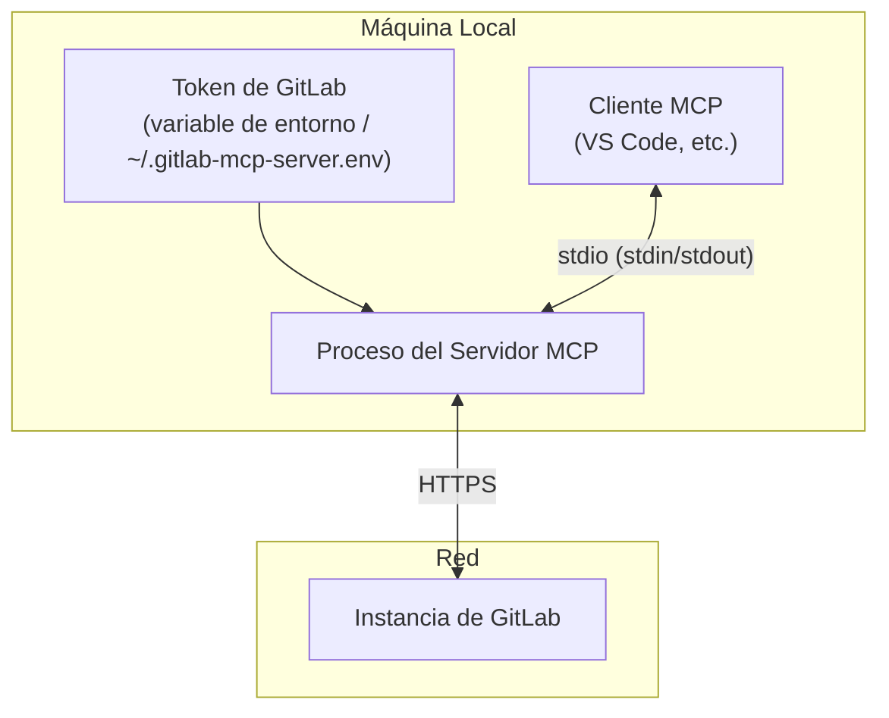

import FAQ from "../../../../components/FAQ.astro";

**GitLab MCP Server nunca almacena tu token de GitLab.** En modo stdio lee el token de una variable de entorno al arrancar, lo mantiene solo en memoria durante la vida del proceso y lo envía únicamente a tu instancia de GitLab —por TLS cuando `GITLAB_URL` apunta a un endpoint `https://` (el valor por defecto)— nunca a terceros. El modo solo lectura y el modo seguro (vistas previas en dry-run) añaden salvaguardas opcionales, y cada release incluye checksums y firmas para verificar su integridad. Esta página detalla ese modelo de seguridad, el manejo de credenciales y las mejores prácticas para un despliegue seguro.

## Descripción general del modelo de seguridad


```mermaid
flowchart TB
    subgraph Local["Máquina Local"]
        Token["Token de GitLab<br/>(variable de entorno / ~/.gitlab-mcp-server.env)"]
        Server["Proceso del Servidor MCP"]
        Client["Cliente MCP<br/>(VS Code, etc.)"]
    end
    subgraph Remote["Red"]
        GitLab["Instancia de GitLab"]
    end

    Token --> Server
    Client <-->|"stdio (stdin/stdout)"| Server
    Server <-->|"HTTPS"| GitLab
```

### Principios clave

- **Aislamiento del token**: En modo stdio, el token de GitLab nunca sale del proceso local del servidor. Se carga desde el entorno y se utiliza exclusivamente para llamadas a la API de GitLab.
- **Sin reenvío de tokens**: El token nunca se envía al cliente MCP y nunca se incluye en las salidas de herramientas.
- **Aislamiento a nivel de proceso**: El servidor se ejecuta como un proceso local comunicándose a través de stdin/stdout. No se abren puertos de red en modo stdio.
- **Mínimo privilegio**: El servidor solo necesita un token de GitLab con los scopes requeridos para las operaciones que deseas utilizar.

## Gestión de tokens

### Recomendado: Archivo de entorno

Almacena tu token en `~/.gitlab-mcp-server.env` con permisos restringidos:

```bash
# Crear el archivo de entorno en el home; el diálogo deja el token fuera del historial de la shell
printf 'GitLab token: ' && read -rs t && printf 'GITLAB_TOKEN=%s\n' "$t" > ~/.gitlab-mcp-server.env && unset t && echo
# Añade GITLAB_URL aquí solo para instancias autogestionadas.

# Restringir permisos (solo lectura/escritura del propietario)
chmod 600 ~/.gitlab-mcp-server.env
```

Para guardar el archivo en otro sitio, nómbralo por ruta absoluta en `GITLAB_MCP_ENV_FILE`.

:::danger
Un `.env` en tu directorio de trabajo **no** se lee, así que poner ahí el token no hace nada. Ese directorio pertenece al repositorio que abrió tu editor. Nunca hagas commit de un archivo que contenga un token.
:::

### Variables de entrada en VS Code

Para usuarios de VS Code, puedes usar variables de entrada para evitar almacenar tokens en texto plano:

```json
{
  "servers": {
    "gitlab": {
      "type": "stdio",
      "command": "gitlab-mcp-server",
      "env": {
        "GITLAB_TOKEN": "${input:gitlabToken}"
      }
    }
  }
}
```

El token se solicita al inicio y se mantiene solo en memoria.

### Mantén el token fuera de la configuración del cliente

Los archivos de configuración de clientes MCP que viven en un proyecto, como `.vscode/mcp.json`, `.cursor/mcp.json` o `.idea/mcp.json`, se suben a menudo al repositorio con todo lo demás. El servidor lee por su cuenta `~/.gitlab-mcp-server.env`, o el archivo que nombre `GITLAB_MCP_ENV_FILE`, así que la entrada de cualquier cliente puede omitir `GITLAB_TOKEN` y llevar solo ajustes que no son secretos. También sirve la forma propia de un cliente de mantener un secreto fuera de su archivo, como las variables de entrada de arriba o el ajuste [`envFile`](https://code.visualstudio.com/docs/copilot/reference/mcp-configuration#_standard-io-stdio-servers) de VS Code.

Si la entrada de un cliente lleva el token escrito en ella:

- guárdala en la configuración local de ese cliente en tu máquina, nunca en un archivo dentro de un proyecto o espacio de trabajo que otras personas puedan leer;
- trata el archivo como un secreto, porque quien pueda leerlo tiene el token;
- rota el token de inmediato si el archivo queda expuesto, en un commit, una copia de seguridad o una pantalla compartida.

Prefiere tokens con fecha de caducidad y rótalos de forma periódica. Un token rotado hay que sustituirlo allí donde esté configurado: el archivo de entorno, la configuración del cliente o el entorno.

### Scopes del token

Tres scopes clásicos cambian lo que sirve el servidor, y un token necesita uno de los dos primeros para que se le sirva algo:

| Scope        | Qué le da al servidor                                                                                                             |
| ------------ | --------------------------------------------------------------------------------------------------------------------------------- |
| `read_api`   | La admisión, y las acciones que GitLab acepta con `read_api` para un token sin `api`                                              |
| `api`        | La admisión, y todas las acciones que permite el nivel, escrituras incluidas                                                      |
| `admin_mode` | Los cinco grupos de administración que se enumeran en [Filtrado de herramientas por scopes](#filtrado-de-herramientas-por-scopes) |

Un token que GitLab acepta y que no lleva ni `read_api` ni `api` no alcanza ninguna herramienta, así que se rechaza. `read_repository`, `write_repository`, `read_user` y los scopes del registro no le dan nada a este servidor por sí solos, y en un token que además lleva `read_api` o `api` no cambian nada de lo que se le sirve.

:::tip
Si solo necesitas operaciones de lectura, usa el scope `read_api`: el servidor lo detecta al arrancar y sirve las acciones que GitLab acepta con él, tanto en stdio como en modo HTTP. Eso no es una sesión de solo lectura: GitLab acepta `read_api` para unas pocas acciones que escriben, como descargar un paquete a un fichero local o que un personal access token se revoque a sí mismo ([Filtrado de herramientas por scopes](#filtrado-de-herramientas-por-scopes)). Para un despliegue que no deba escribir nada, activa también `GITLAB_MCP_READ_ONLY=true`.
:::

### Filtrado de herramientas por scopes

Al arrancar en stdio, y para cada credencial del pool en modo HTTP, el servidor lee la descripción del propio token (`GET /api/v4/personal_access_tokens/self`) y reduce lo que sirve de dos formas:

- **`read_api`.** A un token sin `api` se le sirven las acciones cuyas peticiones acepta GitLab con `read_api`, juzgadas acción por acción a partir de las peticiones que envía: un `GET` o un `HEAD` de REST, una consulta GraphQL y las pocas rutas que GitLab abre a `read_api` en todos los métodos, como la vista previa de Markdown. No es la superficie de solo lectura que sirve `GITLAB_MCP_READ_ONLY`. Se retienen dos lecturas que GitLab solo responde con `api`, el lint de CI (`template.lint`) y la evaluación del firewall de dependencias; y se sirven cinco acciones que escriben, porque GitLab las acepta con `read_api`: la descarga de un paquete, que escribe un fichero en la máquina del servidor, revocar el propio token, que GitLab permite a un personal access token y rechaza a un token OAuth lleve el scope que lleve, y tres que GitLab autentica con un token de trigger, de registro o de runner que pasa quien llama (`pipeline.trigger_run`, `runner.register`, `runner.delete_by_token`). La entrada de cada acción en la [referencia de herramientas](/gitlab-mcp-server/es/reference/tools/) dice el scope que necesita. El modo seguro, la confirmación que pide una acción destructiva y `GITLAB_MCP_READ_ONLY` siguen tratando esas cinco como escrituras, y también las anotaciones de las herramientas: en una sesión `read_api`, `gitlab_execute_action` lleva `readOnlyHint: false` y `destructiveHint: true`, y en la superficie meta `gitlab_access`, `gitlab_package`, `gitlab_pipeline` y `gitlab_runner` pierden `readOnlyHint` (`gitlab_access` y `gitlab_runner` llevan `destructiveHint: true`), así que un cliente que ejecuta sin preguntar las herramientas de solo lectura pregunta antes de llamarlas. En modo HTTP la reducción es por token, así que el token `read_api` de un cliente nunca reduce el token `api` de otro.
- **Administración.** Cinco grupos del catálogo necesitan `admin_mode` en todas sus acciones, y se quitan del catálogo para un token que no lo lleva. En la superficie meta son las herramientas `gitlab_admin`, `gitlab_enterprise_user`, `gitlab_project_alias`, `gitlab_geo` y `gitlab_storage_move`; en la superficie dinámica sus acciones ni se listan ni se ejecutan; en la superficie individual no se registra ninguna herramienta proyectada desde ellos.

La retirada es de todo o nada por grupo, así que `gitlab_admin` se pasa un poco: cuatro de sus lecturas (`admin.topic_list`, `admin.topic_get`, `admin.broadcast_message_list` y `admin.broadcast_message_get`) GitLab se las sirve a cualquier token y se van con las demás. Se equivoca hacia el menor acceso.

Cuando los scopes no se pueden leer, en una instancia antigua o restringida o cuando la descripción no obtiene respuesta, no se filtra nada y el token cuenta como capaz de escribir: un «no» erróneo quitaría herramientas sin avisar, mientras que un «sí» erróneo aparece como el propio `403` de GitLab en la única llamada que lo intentó. Un token de grano fino se lee igual, porque su lista de scopes no dice nada de su concesión ([más abajo](#tokens-de-acceso-personal-de-grano-fino)).

Esto evita que la IA intente operaciones que fallarían con errores de permisos y mantiene la lista de herramientas enfocada en lo que tu token puede hacer realmente.

Para omitir el filtrado por scopes y registrar todas las herramientas independientemente de los permisos del token:

```bash
GITLAB_MCP_IGNORE_SCOPES=true
```

O en modo HTTP:

```bash
./gitlab-mcp-server --http --ignore-scopes
```

:::note
Cuando se omite el filtrado, las herramientas se registran igualmente pero las llamadas a la API pueden fallar con `403 Forbidden` si el token no tiene los permisos necesarios. Los scopes del token se siguen leyendo: uno que no lleva ni `read_api` ni `api` no alcanza ninguna herramienta, así que se rechaza en ambos modos, con un `403` por HTTP y con JSON-RPC `-40300` en cada petición del catálogo en stdio, diga lo que diga este ajuste.
:::

### Tokens de acceso personal de grano fino

Un token de grano fino no lleva scopes: su lista de scopes es el valor único `granular`, y lo que puede hacer es una concesión de permisos con nombre fijada al crearlo. El servidor lo lee como autoridad desconocida, nunca como de solo lectura, así que el filtrado por scopes de arriba no le quita nada. Decide en cambio su concesión: cuando el token puede leer su propia concesión (Personal Access Token: Read) y la versión de la instancia (Metadata: Read), y la instancia ejecuta GitLab 19.4, la versión que registra la tabla de permisos del servidor, a cada sesión se le listan las acciones que alcanza la concesión, juzgadas acción por acción contra los permisos que declara GitLab 19.4.1, y una llamada a cualquier otra se responde con el permiso que necesita antes de que nada llegue a GitLab. Si no, solo se retienen las acciones que ningún token de grano fino alcanza, y GitLab juzga el resto.

Sea cual sea el token, el servidor lo admite con el mínimo que necesita cualquier acción y aplica la autoridad acción por acción ([ADR-0018](https://github.com/jmrplens/gitlab-mcp-server/blob/main/docs/development/adr/adr-0018-authorization-admits-per-action-gating.md), [ADR-0024](https://github.com/jmrplens/gitlab-mcp-server/blob/main/docs/development/adr/adr-0024-fine-grained-token-authority-per-action.md)). El tipo de token decide de dónde se lee esa autoridad:

| Token                                          | Qué lee el servidor                                                                                                                                                                                                       | Qué decide una acción                                                                                                                                         | Cuando el servidor no puede saberlo                                                                                            |
| ---------------------------------------------- | ------------------------------------------------------------------------------------------------------------------------------------------------------------------------------------------------------------------------- | ------------------------------------------------------------------------------------------------------------------------------------------------------------- | ------------------------------------------------------------------------------------------------------------------------------ |
| Token de acceso personal clásico o token OAuth | Sus scopes (`/personal_access_tokens/self`, o `/oauth/token/info` para un token OAuth, solo con `--auth-mode=oauth`; en los demás casos los scopes de un token OAuth son desconocidos y cuentan como capaces de escribir) | Si las peticiones de la acción necesitan `api` o `read_api`, y los grupos de `admin_mode` de arriba                                                           | Los scopes desconocidos cuentan como capaces de escribir; el `403` de GitLab responde a la llamada que el token no puede hacer |
| Token de acceso personal de grano fino         | Su concesión (`GET /personal_access_tokens/:id`) y la versión de la instancia (`GET /version`)                                                                                                                            | Si la concesión alcanza todas las peticiones que hace la acción, juzgada contra lo que declara GitLab 19.4.1 para cada ruta y cada tipo o mutación de GraphQL | Solo se retiene lo que ningún token de grano fino puede alcanzar; GitLab juzga el resto y el servidor cita su rechazo          |

Lo que mantiene segura la lectura de la concesión:

- **La concesión nunca es una clave.** Es un valor que acuña quien llama, así que ningún catálogo, servidor ni caché de manifiesto compartido se indexa por ella, ni tampoco por la versión que informa una instancia, que con `--allow-any-gitlab-url` también es de quien llama. Por eso un mismo despliegue HTTP sirve tokens clásicos y de grano fino a la vez y reduce la superficie en cada petición.
- **Lo que se lee se acota donde se lee.** La concesión, como mucho 1 MiB y 1000 scopes cada vez, y se vuelve a leer en cada revalidación; la versión, solo con la forma que usan las versiones de GitLab y como mucho 64 bytes.
- **Un rechazo cuesta lo que cuesta cualquier rechazo.** Una llamada retenida gasta su token del rate limit como cualquier llamada rechazada y no se carga a ningún presupuesto de fallos. El `403` de la puerta HTTP para un token de grano fino sin User: Read no se cobra, porque GitLab autenticó el token, y se recuerda durante cinco minutos.
- **Una línea de log nombra como mucho tres permisos de la concesión.** Nombra la fase (si se evaluó la concesión), la razón por la que no se evaluó, la versión contra la que se juzgó y, para una concesión que nombra permisos que el registro no conoce, cuántos y como mucho tres de sus nombres, cada uno cortado en 64 bytes; nunca el token, su id, el resto de su concesión ni sus proyectos y grupos.
- **En REST un «sí» erróneo es el propio `403` de GitLab**, que nombra el permiso, y el servidor lo cita. **En GraphQL es silencioso**: una posición a la que no llega la concesión vuelve como `null`, y una lista descarta los elementos a los que no llega. Por eso el requisito de una acción GraphQL incluye los objetos de los que está hecha su respuesta, se retienen las acciones cuya respuesta GitLab no puede servir a ningún token de grano fino, y una respuesta que puede salir vacía para la credencial lleva una nota que lo dice.

`--ignore-scopes` no desactiva nada de esto. Consulta [Tokens de grano fino](/gitlab-mcp-server/es/operations/fine-grained-tokens/).

## Verificación TLS

Por defecto, el servidor verifica los certificados TLS al conectarse a GitLab. Para certificados autofirmados:

```bash
GITLAB_MCP_SKIP_TLS_VERIFY=true
```

:::caution
Desactivar la verificación TLS elimina la protección contra ataques de intermediario (man-in-the-middle). Usa esto solo en entornos de desarrollo con certificados autofirmados. Nunca desactives la verificación TLS en producción.
:::

En modo HTTP, `--auth-mode=oauth` rechaza `--skip-tls-verify` para una instancia que no sea loopback: los tokens bearer se reenvían a esa instancia en cada llamada, y un certificado sin verificar permitiría a cualquier host que respondiera en su dirección recogerlos. En su lugar, instala la CA en el almacén de confianza del sistema o apunta `SSL_CERT_FILE` a un bundle de CA.

## Modo de solo lectura

Habilita el modo de solo lectura para prevenir cualquier operación de escritura:

```bash
GITLAB_MCP_READ_ONLY=true
```

El modo de solo lectura retira cada acción que escribe, y lo hace acción por acción y no herramienta por herramienta. Dos de las tres superficies de herramientas sirven muchas acciones con una sola herramienta: una herramienta meta como `gitlab_issue` sirve tanto `list` como `create`, y la superficie dinámica enruta todas las acciones por `gitlab_execute_action`. Quitar esas herramientas enteras se llevaría por delante sus lecturas, así que la política se aplica al catálogo de acciones con el que se construyen las tres superficies:

- **Superficie dinámica** (la predeterminada): las acciones de escritura desaparecen de `gitlab_find_action`, y `gitlab_execute_action` sigue, anotada como de solo lectura, para las lecturas que aún puede enrutar. Si se le pide una acción retirada, responde que la acción existe y que este despliegue la retiene, no que sea desconocida.
- **Superficie meta**: cada herramienta de dominio conserva sus acciones de lectura, y una acción de escritura se responde como acción desconocida, con la lista de las válidas.
- **Superficie individual**: una herramienta es una acción, así que las herramientas de escritura no se registran.

Nada llega a GitLab para una acción retirada, pueda lo que pueda el token. Un token sin `api` recibe la misma reducción sin el ajuste, y la superficie dinámica nombra entonces el scope del token como la causa.

Esto es útil para:

- Flujos de trabajo de exploración y descubrimiento
- Entornos de demostración
- Entornos donde el token tiene acceso de escritura pero deseas restringir el servidor

## Modo seguro

Habilita el modo seguro para previsualizar operaciones de escritura sin ejecutarlas:

```bash
GITLAB_MCP_SAFE_MODE=true
```

El modo seguro mantiene listadas las acciones de escritura pero responde a cada una con una vista previa en lugar de ejecutarla, y también funciona acción por acción: en las superficies dinámica y meta `issue.create` se previsualiza mientras `issue.list` se ejecuta.

- La vista previa es una tarjeta encabezada por `Safe mode blocked` y la acción, con filas para el estado (`blocked`), el modo (`safe`) y la acción (su ID canónico en las superficies dinámica y meta, el nombre de la herramienta en la individual), los argumentos que habría enviado la llamada en un bloque JSON y la pista `Set GITLAB_MCP_SAFE_MODE=false to execute this operation`. En la superficie individual vuelve como un resultado de error, porque la herramienta no se ejecutó. No se envía nada a GitLab
- Las acciones de solo lectura se ejecutan normalmente
- Si `GITLAB_MCP_READ_ONLY=true` también está configurado, tiene precedencia: las acciones de escritura no existen en lugar de previsualizarse

Esto es útil para flujos de trabajo dry-run, entornos de formación y depuración de parámetros de herramientas.

## Acciones destructivas

Una acción cuyo efecto no se puede deshacer llamando a su opuesta se clasifica como destructiva, una vez por acción en el catálogo, y las tres superficies leen ese único bit (`destructiveHint`). Borrar algo es el caso evidente pero no el único: una acción que entrega algo a alguien de fuera de la instancia también entra. `project.mirror_add` es la que merece nombrarse, porque no parece destructiva: crear un mirror de push no borra nada, y le da al host nombrado en su `url` una copia continua de todo el repositorio. Un modelo que obedeciera a la descripción de un issue que pide un «mirror de respaldo» podría, si no, enviar el repositorio fuera con una sola llamada, así que esa llamada necesita confirmación como cualquier otra destructiva.

En todas las superficies, una llamada destructiva sigue adelante con la primera de estas condiciones que se cumpla:

1. `GITLAB_MCP_YOLO_MODE` tiene un valor verdadero (`1`, `true` o `yes`) o, si no está definida, lo tiene `AUTOPILOT`: para pipelines desatendidos.
2. La llamada lleva `"confirm": true`, que en la superficie dinámica es un `confirm: true` en el nivel superior, junto a `action` y `params`.
3. El cliente admite elicitación y el usuario aprueba la pregunta. Solo preguntan las superficies meta e individual: la superficie dinámica por defecto nunca pregunta, así que ahí las dos primeras son las únicas vías.

Si no, se rechaza por defecto (fail-closed) y nada llega a GitLab. Un cliente que no puede preguntar, y cualquier llamada de la superficie dinámica, recibe un error que le pide repetir la llamada con `confirm: true` solo después de que el usuario lo apruebe de forma explícita. Un usuario que se niega obtiene una respuesta que le dice al modelo que no lo reintente y que pregunte qué quiere en su lugar; una pregunta cerrada sin respuesta se informa como que no cambió nada, y se puede volver a hacer.

Por tanto, `GITLAB_MCP_YOLO_MODE` y `AUTOPILOT` omiten el mismo paso en las tres superficies; hasta la 3.1.0 la superficie dinámica no leía ninguno de los dos y exigía `confirm: true` dijeran lo que dijeran. El modo de solo lectura y el modo seguro van antes que todo esto: un despliegue de solo lectura no tiene ninguna acción destructiva que llamar, y el modo seguro responde a una con su vista previa, diga lo que diga cualquiera de los dos ajustes. Las dos protecciones de [Cuando deciden los argumentos](#cuando-deciden-los-argumentos) siguen el mismo orden. [Gestión de errores](/gitlab-mcp-server/es/operations/error-handling/#acciones-destructivas-y-confirmación) cita lo que dice cada rechazo.

### Cuando deciden los argumentos

Un bit por acción no puede describir una acción que destruye algo con unos argumentos y nada con el resto, y clasificar una acción así pondría una confirmación delante de cada edición corriente, que es una confirmación que quien llama aprende a aceptar sin mirar. Dos acciones se protegen en su propio handler, con la misma precedencia, y declaran un campo `confirm` para que su esquema de entrada lo muestre:

- `issue.work_item_update`: un `assignee_ids` o `crm_contact_ids` vacío y explícito quita todas las entradas actuales, mientras que omitir el campo lo deja intacto. Vaciar entradas que existen necesita la confirmación.
- `project.pull_mirror_configure`: `mirror_overwrites_diverged_branches` hace que cada sincronización sustituya las ramas divergentes de este proyecto por las del origen, lo que [GitLab documenta](https://docs.gitlab.com/user/project/repository/mirror/pull/) como la pérdida de los cambios locales. La protección pregunta cuando la configuración que deja la llamada a la vez trae cambios del origen y sobrescribe, y es esta llamada la que la arma o la redirige: al activar el indicador, al habilitar el mirror o al cambiar su URL.

La configuración de un mirror de pull en conjunto no es destructiva a propósito, como decidió el [issue 674](https://github.com/jmrplens/gitlab-mcp-server/issues/674): sin el indicador de sobrescritura GitLab deja de actualizar una rama divergente en lugar de sustituirla, nada del proyecto sale de la instancia, y clasificar la acción pondría una confirmación delante de desactivar un mirror hostil.

## Entrada y salida de las herramientas

### Validación de la entrada

- Un campo desconocido se rechaza antes de que se ejecute el handler. El esquema de entrada de cada herramienta individual fija `additionalProperties: false`; en las superficies meta y dinámica el objeto `params` del sobre está abierto en el esquema, y un campo desconocido dentro de él se rechaza cuando la acción decodifica sus parámetros, de forma estricta, antes de que se ejecute el handler. La clave reservada `confirm` se retira antes, para que nunca active ninguna de las dos comprobaciones.
- Los campos obligatorios se comprueban antes de enviar nada a GitLab.
- Una ruta local que una herramienta lee o escribe (`file_path`, `directory_path`, `output_path`) se resuelve a través de los enlaces simbólicos y tiene que estar en el directorio de trabajo, en el directorio temporal del sistema o en un directorio que añadan los ajustes `GITLAB_MCP_ALLOWED_*_DIRS` ([Configuración](/gitlab-mcp-server/es/configuration/)). Un archivo que se lee tiene que ser un archivo regular que no supere `GITLAB_MCP_UPLOAD_MAX_FILE_SIZE`. Por HTTP se rechaza cualquier ruta local que aporte quien llama, porque sus archivos no están en la máquina donde corre el servidor, y `content_base64` es la forma remota.
- Los nombres de paquetes genéricos y de sus archivos se comprueban contra las reglas de nombres de GitLab antes de una subida.

### Contenido escrito por otras personas

Los resultados de las herramientas llevan texto que escribieron otras personas: descripciones de issues y merge requests, mensajes de commit, notas, páginas de wiki, contenido de archivos y logs de jobs. Cualquiera de ellos puede estar escrito para dirigir a un modelo. El servidor no puede distinguir una instrucción de una descripción, así que se asegura de que ese texto no pueda cambiar la estructura de la respuesta en la que va:

| Dónde cae el texto                                | Función               | Qué impide                                                                                                                                                                            |
| ------------------------------------------------- | --------------------- | ------------------------------------------------------------------------------------------------------------------------------------------------------------------------------------- |
| Una celda de tabla o un valor de una sola línea   | `EscapeMdTableCell`   | Que las barras y los saltos de línea rompan la fila; `<` y `[` se escapan, así que un valor no puede convertirse en una etiqueta ni en un enlace activos                              |
| Un encabezado                                     | `EscapeMdHeading`     | Que un `#` inicial cambie el nivel, que un salto de línea termine el encabezado, y etiquetas o enlaces dentro de él                                                                   |
| Un cuerpo de varias líneas                        | `WrapGFMBody`         | Cada línea pasa a ser una línea de cita, así que el cuerpo no puede añadir un encabezado, un elemento de lista ni una sección; el encabezado de guía del propio servidor se desactiva |
| Un enlace                                         | `MdTitleLink`         | Se escapan las dos mitades, así que ninguna puede cerrar el enlace, y una dirección que no es `http` ni `https` se muestra como código en lugar de enlazarse                          |
| Un bloque de código (un archivo, un log, un diff) | `MarkdownFencedBlock` | La valla es más larga que cualquier racha de comillas invertidas del cuerpo, así que nada dentro puede cerrar el bloque                                                               |

Los cuatro primeros también eliminan los caracteres de control. Un bloque de código es el único sitio donde escapar no es la respuesta, porque un archivo o un log tiene que mostrarse tal cual; la contención la da la valla. Una comprobación de la propia compilación del proyecto lee cada formateador y la hace fallar cuando un valor que viene de GitLab llega a uno de esos sitios sin pasar por su función, así que ninguna versión publicada puede llevar uno así.

Se consideraron marcadores de frontera alrededor de ese texto, como etiquetas `<user_content>`, y no se adoptaron. Los resultados de herramientas ya llegan como elementos `content` estructurados y separados, aparte de los prompts del sistema y del usuario y entre sí, y con la estructura contenida un marcador añadiría tokens sin añadir ninguna frontera. Nada de esto impide que un modelo siga una instrucción escrita en prosa normal; para eso están la confirmación de las acciones destructivas, el modo de solo lectura y un token con pocos permisos.

### Errores

Un resultado de error lleva la operación, una clasificación del fallo, el mensaje del propio GitLab cuando lo dio, el estado HTTP y, cuando se conoce, una pista que nombra el siguiente paso. Lleva también la línea de la petición que rechazó GitLab (`METHOD scheme://host/path: status`), así que lo que la llamada puso en la ruta, un proyecto, un IID o la ruta de un archivo, se repite ahí; la cadena de consulta y el cuerpo de la petición no se copian en él, y tampoco una traza de pila ni ningún detalle interno. Consulta [Manejo de errores](/gitlab-mcp-server/es/operations/error-handling/).

## Seguridad en modo HTTP

Al ejecutar en modo HTTP (`--http`), aplican consideraciones de seguridad adicionales:

### El listener

- **`--http-addr` vale por defecto `:8080`, que es cualquier interfaz**, no loopback. `--http-addr=127.0.0.1:8080` mantiene el listener en el propio host, y una ruta del sistema de archivos (`--http-addr=/run/gitlab-mcp.sock`) abre en su lugar un socket unix, con `--http-socket-mode` (por defecto `0660`, propietario y grupo) decidiendo quién puede conectarse: eso elimina el salto de red hasta un proxy en la misma máquina en lugar de cifrarlo.
- **TLS puede terminar en el propio listener**: `--tls-cert` y `--tls-key` sirven HTTPS, los dos o ninguno, cargados al arrancar para que una ruta errónea detenga el arranque en lugar de hacer fallar el primer handshake. TLS 1.2 es el mínimo.
- **Toda respuesta lleva las cabeceras de seguridad**, los rechazos incluidos: `X-Content-Type-Options: nosniff`, `X-Frame-Options: DENY`, `Content-Security-Policy: default-src 'none'; frame-ancestors 'none'`, `Referrer-Policy: no-referrer` y `Cache-Control: no-store`, salvo las dos fichas del servidor y el documento de metadatos RFC 9728, documentos públicos que envían en su lugar `Cache-Control: public, max-age=3600`. El cuerpo de una petición está acotado en tamaño (`--max-request-body-bytes`, 4 MiB por defecto) y en anidamiento JSON (100 niveles).

### Autenticación por solicitud

En modo HTTP no se configura ninguna credencial al arrancar. Cada petición trae la suya, y el servidor actúa como el dueño de ese token y como nadie más:

```http
Authorization: Bearer <gitlab-personal-access-token>
```

- **El modo legacy** (el predeterminado) acepta también `PRIVATE-TOKEN: <token>`, que gana cuando llegan las dos cabeceras.
- **El modo OAuth** (`--auth-mode=oauth`) solo lee `Authorization: Bearer`, y verifica cada token contra GitLab antes de que la petición llegue al handler MCP.

En los dos, un token que GitLab acepta tiene que llevar `read_api` o `api`; uno por debajo de eso se responde con `403`, sin cargarse a los presupuestos de la dirección. Un token que GitLab rechaza se responde con `401`. Cada rechazo, con su estado, su código JSON-RPC y sus cabeceras, se enumera en [Modo servidor HTTP](/gitlab-mcp-server/es/operations/http-server/).

### Validación de la cabecera Host

Una petición cuyo `Host` nombra un host que el despliegue no declaró se rechaza con `403` en todas las rutas, contra el DNS rebinding. Declarado significa los nombres de loopback (`localhost`, `127.0.0.1`, `::1`), el host al que se ata `--http-addr` cuando nombra uno y el host que anuncia `--public-url`, que es lo que permite que funcione un proxy inverso que conserva el `Host` del cliente. Una petición que viene de una dirección de `--trusted-proxies` puede llevar el host que reenvíe ese salto, y una petición sin ningún `Host` se atiende, porque el health check de un balanceador no envía ninguno y ningún navegador lo omite.

Un bind comodín (`:8080`, `0.0.0.0`, `::`) no declara ningún host propio: rechaza un `Host` no declarado solo en una conexión aceptada por loopback, que es a lo que tiene que llegar un ataque de rebinding. Un socket unix no aplica nada de esto, porque ningún nombre resuelve a un archivo. La comprobación es del propio servidor; la protección de localhost que trae el SDK de MCP está desactivada porque no puede ver `--public-url` ni `--trusted-proxies`.

### A qué instancia llega una petición

Lo que puede hacer la cabecera `GITLAB-URL` depende de cuántas instancias publica `--gitlab-url`:

| Instancias publicadas                                            | Qué hace la cabecera                                                                                                                                                                                                    |
| ---------------------------------------------------------------- | ----------------------------------------------------------------------------------------------------------------------------------------------------------------------------------------------------------------------- |
| Una                                                              | Nada: se ignora y se registra, y todas las peticiones van a esa instancia                                                                                                                                               |
| Varias (`--gitlab-url` repetido, o una lista separada por comas) | Es obligatoria y tiene que nombrar una de ellas. Una petición sin ella se rechaza con `400`, y una que nombra otra instancia con `403` en modo OAuth y `400` en modo legacy                                             |
| Ninguna, con `--allow-any-gitlab-url`                            | Nombra cualquier instancia, y una petición sin ella, o con un valor mal formado, se rechaza con `400`. Solo se acepta cuando `--http-addr` se ata a una dirección de loopback o a un socket unix, y nunca en modo OAuth |
| Ninguna, sin esa opción                                          | Nada: el servidor se niega a arrancar                                                                                                                                                                                   |

La lista de permitidas es lo que hace segura una instancia por petición en modo OAuth: el token bearer se verifica contra la instancia que elige la petición, así que una cabecera libre permitiría a quien llama nombrar un host propio y recibir una credencial válida. Las instancias se comparan en forma canónica (host en minúsculas, sin puerto por defecto, sin barra final), y un token se verifica y se cachea por instancia, nunca entre ellas. El modo OAuth también se niega a arrancar con una instancia que no sea `https`, salvo en loopback. Adónde puede conectarse el servidor una vez elegida la instancia está en [Conexiones salientes](#conexiones-salientes).

### Aislamiento de sesiones

El servidor mantiene un **pool LRU limitado** de entradas por credencial:

- Cada par de token y URL de GitLab obtiene su propia entrada aislada: su cliente de GitLab, su cubo del rate limit, sus vigilantes de recursos y sus sesiones. El servidor MCP y su catálogo de herramientas los comparten todas las credenciales de la misma configuración, porque ninguno depende de la credencial, y cada petición se ejecuta con el cliente que lleva su propia entrada
- Las credenciales son independientes — un usuario no puede acceder al contexto de otro, ni a su estado de vigilancia, ni a la existencia de su tráfico
- Las sesiones inactivas expiran después de `--session-timeout` (por defecto: 30 minutos) con `--stateless=false`; el transporte sin estado por defecto termina la sesión de cada POST con su respuesta
- Con `--stateless=false` las sesiones que mantiene el proceso están acotadas entre todas las credenciales en la mitad de su techo de llamadas retenidas, 96 bajo un límite duro de descriptores de 1024, sin opción de configurarlo; cada sesión ocupa al abrirse una plaza de llamada retenida para su flujo independiente, así que nunca se le rechaza el flujo. El siguiente `initialize` se rechaza antes de que exista la sesión, con las mismas palabras de servidor ocupado, `503`, `Retry-After` y la conexión cerrada, y no le cuesta nada a su credencial. Antes del techo, un proceso con ese límite mantenía cada sesión que se le ofrecía hasta que los flujos ocupaban los 1024 descriptores y entonces dejaba de responder; con él, 4000 sesiones ofrecidas desde una credencial o desde cien lo dejaron en 96 sesiones y como mucho 183 descriptores, respondiendo a `/health`. Llenarlo no le cuesta nada a quien llama, porque `initialize` no gasta ningún token del rate limit, así que una credencial puede hacer que se rechace el `initialize` de cualquier otro inquilino durante tanto como `--session-timeout`. No hay un techo por credencial a su lado, por decisión (issue 951), porque una credencial es una clave que quien llama puede acuñar y un número así se multiplicaría con cada token que acuñe, ni tampoco un tope fijo junto a la cifra derivada: donde el límite es grande, lo que acota la memoria que ocupan las sesiones es el límite de memoria con el que corre el proceso (el del contenedor, o `MemoryMax` en una unidad de systemd)
- Las entradas del pool están acotadas por `--max-http-clients` (por defecto: 100), que limita entradas token+URL, no sesiones ni las peticiones que retienen. Bajo ese límite el desalojo prefiere una entrada que no esté atendiendo una suscripción, y se lleva una ocupada solo cuando todas las entradas del pool lo están; a la credencial desalojada se le avisa en lugar de dejarla muda
- Las llamadas que esas entradas mantienen abiertas están acotadas en todo el proceso según su límite de descriptores, sin opción de configurarlo: 192 a la vez bajo un límite duro de 1024, muchas más bajo los límites que suelen tener un servicio de systemd o un contenedor. Un `subscriptions/listen` no cuenta, en ninguna revisión, porque ya lo cuentan los límites de listen, y cada llamada de un lote JSON-RPC cuenta por separado. La siguiente llamada se rechaza con palabras que solo dicen que el servidor está ocupado, con `503`, `Retry-After` y la conexión cerrada en el protocolo 2026-07-28, y no le cuesta nada más a su credencial: para entonces ya ha gastado su admisión (en modo legacy, quizá la construcción de su entrada del pool, una comprobación contra GitLab y, en el límite del pool, el desalojo de la entrada tranquila de otra credencial; en modo OAuth, un hueco de verificación), pero ningún token del rate limit. Una llamada retenida cuesta dos descriptores de fichero, seis goroutines, unos 51 KiB de heap vivo y unos 190 KiB de memoria residente. Antes del techo, un proceso con un límite duro de 1024 al que se ofrecieron 1000 llamadas retuvo 503 y luego dejó de aceptar conexiones, `/health` incluido, y 442 de las llamadas fallaron con `too many open files` al conectar con GitLab; con él, cien credenciales ofreciendo 4000 llamadas dejaron el proceso en 394 descriptores con `/health` respondiendo. No hay un techo por credencial a su lado, por decisión (issue 951), porque una credencial es una clave que quien llama puede acuñar, así que una sola credencial puede llenarlo, y el servidor no tiene un tope de memoria propio: lo que acota la memoria que ocupan las llamadas retenidas es el límite de memoria con el que corre el proceso (el del contenedor, o `MemoryMax` en una unidad de systemd), y a una unidad sin `MemoryMax` propio la acotan las slices que la contienen, si alguna lo fija, y, si no, solo el host

### Presupuestos de autenticación

Dos presupuestos rechazan una petición antes de leer su credencial, así que un cliente bloqueado no cuesta nada y no llega a GitLab. Hacen preguntas distintas, y esa diferencia es la razón por la que solo uno de ellos escala.

| Presupuesto            | Por defecto           | Qué pregunta                                       | Qué hace                                      |
| ---------------------- | --------------------- | -------------------------------------------------- | --------------------------------------------- |
| Bloqueo por fallos     | 10 fallos en 1 minuto | Cuántas autenticaciones falló esta dirección       | Bloquea el resto de la ventana                |
| Credenciales distintas | 50 en 10 minutos      | Cuántas credenciales *diferentes* se le rechazaron | Bloquea un minuto, luego diez, luego una hora |

Diez fallos en un minuto es tanto un cliente atascado reintentando un token malo como un ataque, y un minuto de bloqueo es la respuesta correcta a ambos. Cincuenta tokens inválidos distintos solo es un ataque: una persona tiene un token y una flota detrás de un NAT tiene uno cada una, así que un vecino legítimo nunca alcanza esa cuenta por mal que se comporte su cliente.

El segundo presupuesto merece la pena aunque el servidor rechace esas peticiones de forma barata igualmente. Cada credencial distinta que llega a verificarse es una petición a GitLab desde la dirección de **tu** despliegue, y GitLab limita por dirección de origen la autenticación fallida, así que quien rocía tokens está gastando tu crédito con GitLab y el estrangulamiento que este acabe aplicando cae sobre todos tus usuarios.

Las credenciales se cuentan como resúmenes SHA-256 truncados y nunca se guardan en claro, y una credencial que el despliegue ya está sirviendo se admite desde una dirección bloqueada, de modo que un cliente ruidoso tras una dirección compartida no puede dejar fuera a sus vecinos.

```bash
# Los valores por defecto, escritos. Pon un límite a 0 para desactivar ese presupuesto.
gitlab-mcp-server --http \
  --auth-failure-limit=10 --auth-failure-window=1m \
  --auth-distinct-token-limit=50 --auth-distinct-token-window=10m
```

La escalera se construye a partir de `--auth-failure-window`: una ventana, luego diez, luego sesenta, y se olvida tras sesenta de silencio. Se detiene ahí en vez de crecer sin fin, porque un bloqueo es una defensa y no un castigo, y quien herede después esa dirección no hizo nada para merecerlo.

Con la telemetría activada, los rechazos se exportan como `gitlab_mcp.auth.blocks`, separados por el presupuesto que rechazó. La dirección no es, deliberadamente, una dimensión de esa métrica.

### Recomendaciones para modo HTTP

- Termina TLS en un proxy inverso, o en el propio servidor con `--tls-cert`/`--tls-key`; si el proxy comparte máquina, `--http-addr=/run/…/server.sock` elimina el salto en lugar de cifrarlo
- Configura `--trusted-proxy-header` con la cabecera que tu proxy establece (ej. `CF-Connecting-IP`, `X-Real-IP`, `X-Forwarded-For`) junto con `--trusted-proxies`, las direcciones o rangos CIDR desde los que conecta el proxy, para que los dos presupuestos de autenticación anteriores carguen a las direcciones reales de los clientes y no a la del proxy; el limitador de tasa por llamada se indexa por token y no necesita ninguna dirección. **La cabecera solo se cree en una conexión que venga de una dirección de la lista**; desde cualquier otro origen se ignora y se carga al propio origen, así que un cliente que llegue al listener directamente no puede elegir la dirección a la que se cargan sus fallos. Una opción sin la otra impide el arranque. Para `X-Forwarded-For`, el servidor lee desde la derecha, saltando los saltos que están a su vez en la lista, y carga al primero que no lo esté; un salto que no sea una dirección carga al origen de la conexión.
- Habilita la limitación de peticiones en el proxy
- Restringe el acceso a redes de confianza
- Monitoriza las métricas de sesiones para detectar patrones inusuales

### Modo OAuth

Para despliegues HTTP en producción, considera usar el modo OAuth (`--auth-mode=oauth`). Habilita autenticación OAuth 2.1 compatible con RFC 9728:

- Los usuarios autorizan a través del navegador — no es necesario distribuir tokens manualmente
- OAuth 2.1 con PKCE protege contra la interceptación del código de autorización
- Una identidad verificada se cachea durante `--oauth-cache-ttl` (por defecto 15 minutos, de 1 a 120 minutos) y nunca más allá de la caducidad del propio token cuando GitLab la informa. La clave es un resumen SHA-256 de la instancia y el token, y la entrada guarda el id de usuario, el nombre de usuario, los scopes y la caducidad, nada del token. Las entradas caducadas se descartan al leerlas, y un barrido en segundo plano, a un cuarto del TTL y nunca con más frecuencia que cada 30 segundos, quita las que nadie vuelve a leer
- Los scopes concedidos se introspeccionan desde GitLab en lugar de asumirse: `/api/v4/personal_access_tokens/self` para un token de acceso personal, `/oauth/token/info` para un token OAuth. Un token que no está en la caché cuesta por tanto hasta tres peticiones a GitLab, `GET /api/v4/user` y las dos introspecciones. Cuando ninguna describe el token y alguna lo rechazó con `401` o `403`, el token se lee como sin ningún scope y se rechaza con `403` en la puerta (salvo el rechazo de GitLab a un permiso de grano fino, que marca un token de grano fino). Solo cuando no respondió nada en absoluto, un `404`, un `5xx` o un tiempo de espera agotado, se asume `api` y se registra en `DEBUG`, para que una instancia antigua o un endpoint inalcanzable siga funcionando, salvo que esté definido `--oauth-client-uid` ([más abajo](#vinculación-de-audiencia-una-desviación-documentada))
- El modo OAuth es **solo Bearer**: `PRIVATE-TOKEN` se rechaza con `401`. Los clientes sin soporte OAuth envían un token de acceso personal como `Authorization: Bearer <glpat-...>`, que se verifica igual
- La admisión solo exige `read_api`, lo mínimo que necesita cualquier acción; que una llamada pueda escribir se decide acción por acción, contra la superficie construida para ese token. Por eso un despliegue que escribe acepta también un token `read_api`, y le sirve las acciones que GitLab acepta con `read_api`. Una credencial que GitLab acepta solo se rechaza en la puerta cuando no lleva ningún scope de la API de GitLab, cuando es un token de grano fino al que GitLab niega User: Read (punto siguiente), o cuando `--oauth-client-uid` no admite su aplicación ([más abajo](#vinculación-de-audiencia-una-desviación-documentada)). El desafío y `scopes_supported` nombran un único scope recomendado, nunca dos: `api`, que da la superficie completa, o con `--read-only` o `--safe-mode` `read_api`, que deja fuera las dos lecturas que GitLab solo responde con `api` (`template.lint` y `project.dependency_firewall_evaluate`, retenidas nombrando `api`). Un único scope porque un cliente pide a GitLab todos los scopes que aparecen, y GitLab rechaza una petición que nombra un scope que la aplicación OAuth no tiene. Un cliente que quiera una credencial a la que GitLab no acepte ninguna escritura pide `read_api` por su cuenta: GitLab no acepta ninguna de un token OAuth que lo lleve, y de un personal access token enviado como token Bearer solo su propia revocación
- Un token de acceso personal de grano fino enviado como token Bearer cumple el mínimo `read_api`. Uno al que GitLab niega User: Read, que necesita el `GET /api/v4/user` de la puerta, se responde con `403`, no se carga al presupuesto de fallos de la dirección y se recuerda durante cinco minutos ([Tokens de grano fino](/gitlab-mcp-server/es/operations/fine-grained-tokens/))
- La caché de identidades guarda como mucho 10.000, el pool más grande que se le puede dar al servidor. Un token recién verificado que la encuentra llena ocupa el lugar de una identidad caducada si la hay, y si no de la usada hace más tiempo, que se vuelve a verificar la próxima vez que se presente. Cada petición lee la entrada de su token, así que lo que expulsa a una identidad viva son otras 10.000 credenciales distintas usadas desde su última petición; en un despliegue que ya atiende cerca de esa cifra, lo hace cada verificación nueva
- En todo el proceso se verifican como mucho 16 tokens que no están en caché a la vez, los envíe quien los envíe, así que los tokens inventados que lleguen desde cualquier número de direcciones tienen como mucho 16 peticiones en curso contra GitLab. Eso acota la concurrencia, no el ritmo: a 50 ms por ida y vuelta son unas 320 peticiones por segundo, más de lo que GitLab.com admite de tráfico no autenticado desde una dirección. Un token nuevo espera hasta cinco segundos a que quede un hueco libre y después recibe `503` con `Retry-After`, sin guardarse en caché ni cobrarse a ningún presupuesto, con el mismo texto que una verificación cuya respuesta no se pudo leer; un cliente que sabe que la instancia está sana puede deducir aun así que otros están verificando, el único bit que delata un límite de todo el proceso. Un token en caché nunca espera. El límite no es configurable y es independiente de las comprobaciones de credencial del propio pool
- El precio de ese límite: una credencial legítima que se presenta por primera vez durante una avalancha de tokens inventados espera en la misma cola que la avalancha y solo se atiende si queda un hueco libre antes de que pasen sus cinco segundos, mientras la avalancha ocupe todos los huecos. Medido contra un GitLab de prueba que responde en 100 ms, una vez asentada la cola de la avalancha, con una avalancha de 400 tokens inventados por segundo, se atendieron 42 y 40 de 120 credenciales nuevas en dos ejecuciones, tras 5,5 s en lugar de 0,5 s, y se rechazaron las demás, mientras que todas las peticiones con credenciales en caché se atendieron en ambos brazos, con una mediana de 14 ms con el límite y de 13 a 15 ms sin él; la instancia recibió unas 160 peticiones por segundo, dieciséis huecos entre la ida y vuelta, como mucho 20 a la vez, frente a unas 420 por segundo y hasta 56 a la vez sin el límite (5.640 peticiones en los 35 segundos que van de la primera petición de la fase a la respuesta de su última en espera, frente a 12.600 en 30). La avalancha en espera la sostiene el servidor, una conexión por cada petición que espera, y nada salvo el ritmo al que llegan acota cuántas esperan. Una credencial en caché nunca espera un hueco, pero comparte el listener con esa avalancha: si el límite duro de descriptores es menor que el ritmo de llegada por cinco segundos, una credencial en caché que abre una conexión se retrasa o se rechaza junto con ella. La medición se hizo con un límite de 1048576 y nunca llegó a él. La misma avalancha retiene memoria: cada petición en espera costó al proceso unos 50 KiB en la medición (la memoria residente subió unos 100 MiB con unas 2.000 en espera y 250 MiB con unas 5.000), así que si el límite de memoria con el que corre el proceso es menor que el ritmo de llegada por cinco segundos por esa cifra, la avalancha termina el proceso y con él toda credencial en caché
- Los rechazos son baratos y acotados por los dos presupuestos anteriores, y un token que GitLab ya rechazó se rechaza desde memoria durante cinco minutos en lugar de volver a preguntar, desde una caché indexada por un resumen SHA-256 de la instancia y el token y limitada a 4096 entradas, porque sus claves las pone quien llama. Ni una caída ni un `429` de GitLab se cachean nunca, porque no dicen nada sobre la credencial

Una petición sin autenticar la puede generar cualquiera, y reenviar cada una a GitLab convertiría un despliegue público en un amplificador. Por eso una petición se encuentra con estas capas en orden, y un cliente bloqueado no cuesta nada: el presupuesto de fallos por dirección y el de credenciales distintas, la caché de tokens rechazados, la caché de identidades verificadas y, solo después, el límite de verificaciones, la única capa que acota el caso distribuido de muchas direcciones que se quedan cada una por debajo de su presupuesto.

Consulta [Aplicación OAuth](/gitlab-mcp-server/es/operations/oauth-app/) para crear la Aplicación OAuth de GitLab requerida, y [Modo servidor HTTP](/gitlab-mcp-server/es/operations/http-server/) para los detalles completos de configuración.

#### Vinculación de audiencia: una desviación documentada

La especificación de autorización de MCP dice que un servidor debe aceptar solo tokens emitidos para él, comprobándolo por la audiencia del token (indicadores de recurso de RFC 8707) o verificando de otro modo que es el destinatario previsto, y que no debe pasar a una API superior un token que recibió. Este servidor no cumple ninguna de las dos cosas por el mecanismo que nombran, y la desviación se acepta en lugar de discutirse ([ADR-0019](https://github.com/jmrplens/gitlab-mcp-server/blob/main/docs/development/adr/adr-0019-audience-binding-unavailable-at-the-authorization-server.md)):

- **No hay audiencia que comprobar.** El servidor de autorización de GitLab no publica `resource_indicators_supported`, comprobado contra GitLab.com el 2026-08-29 y de nuevo el 2026-09-05, así que un cliente no puede pedir un token ligado a este servidor y ningún token que emite GitLab lleva uno.
- **El token se reenvía.** El servidor envía a GitLab el propio bearer del cliente en cada llamada. Lo que lo hace aceptable aquí, y no en general, es que GitLab es a la vez el servidor de autorización que emitió el token y la API a la que se devuelve: no se añade autoridad, cada acción se ejecuta como el dueño del token, y el token se verifica contra la instancia en la que se va a usar antes de cualquier uso. La alternativa, una credencial de servicio propia del servidor, lo convertiría en una autoridad que ejecuta acciones que ningún usuario autorizó.

Lo que sí se impone: el token se verifica contra la instancia que eligió la petición antes que nada, sus scopes reales se leen en lugar de asumirse, solo se acepta `Authorization: Bearer`, y los metadatos RFC 9728 se sirven en la ruta que se deriva de `--public-url`. Trata el token como lo que es, una credencial de GitLab confiada a este servidor, con el alcance tan reducido como permita el trabajo.

La alternativa de la especificación, verificar el destinatario de otro modo, está disponible y desactivada por defecto. `--oauth-client-uid` (`GITLAB_MCP_OAUTH_CLIENT_UID`, separado por comas) enumera las aplicaciones OAuth cuyos tokens admite el despliegue, comparadas con `application.uid` de `/oauth/token/info`. Un token que no nombra ninguna aplicación o nombra otra se rechaza con `401`; una introspección que no respondió se rechaza con `503` y `Retry-After`, sin cachearse ni cobrarse, porque un anclaje que admitiera lo que no pudo comprobar haría de romper la introspección la forma de saltárselo. Está desactivado por defecto porque rechaza todo token de acceso personal, que no pertenece a ninguna aplicación. Cómo configurarlo está en [Aplicación OAuth](/gitlab-mcp-server/es/operations/oauth-app/).

#### Qué pide a este servidor la especificación de autorización

Las páginas de autorización de 2026-07-28 se leyeron cláusula por cláusula contra este servidor el 2026-09-05. Las cláusulas que obligan a un servidor de recursos se cumplen así:

- **Metadatos del recurso protegido** (RFC 9728) con al menos una entrada en `authorization_servers`, servidos en la ruta que se deriva de `--public-url`. Cada instancia publicada aparece en su forma canónica, porque un cliente construye con ella la URL de los metadatos del servidor de autorización y tiene que encontrar un `issuer` idéntico, y el modo OAuth se niega a arrancar sin ninguna instancia que publicar.
- **Descubrimiento**: se sirven los dos mecanismos, `resource_metadata` en cada desafío `401` y el documento well-known, y cada desafío nombra además el `scope` que hay que pedir.
- **Validar cada token antes de procesar la petición** (sección 5.2 de OAuth 2.1): contra la instancia que eligió la petición, con la caducidad tomada del token, el scope comprobado en la puerta y de nuevo en cada acción, y todos los métodos que pueden llegar a una sesión autenticados, `GET` y `DELETE` con estado incluidos.
- **Manejo de tokens**: la caché de identidades guarda resúmenes e identidades, nunca el bearer; una línea de log nombra un token por un resumen con clave y por ninguno de sus caracteres; y la única transmisión aceptada es la cabecera `Authorization`, que declara `bearer_methods_supported`.

El resto de esas páginas obliga al cliente (PKCE con `S256`, el parámetro `resource`, `state`, la comprobación de `iss`) o al servidor de autorización (registro de clientes, validación de las URI de redirección, rotación de los refresh tokens). Este servidor no registra clientes, no emite tokens y no reenvía nada a un servidor de autorización de terceros, así que no le aplica la cláusula del confused deputy sobre proxies con un client ID estático.

Los metadatos del servidor de autorización de GitLab.com, leídos en las mismas fechas, publican `code_challenge_methods_supported`, así que pasa la comprobación de PKCE que todo cliente MCP debe hacer, y un `registration_endpoint`. No publican `resource_indicators_supported`, `client_id_metadata_document_supported`, `authorization_response_iss_parameter_supported` ni ningún campo de DPoP, y por eso los metadatos de este servidor tampoco llevan campos de DPoP, TLS mutuo, detalles de autorización ni metadatos firmados: cada uno anunciaría una capacidad que el servidor de autorización no ofrece.

#### Qué le dice un rechazo al cliente

El código de error de [RFC 6750](https://www.rfc-editor.org/rfc/rfc6750) en `WWW-Authenticate` es la diferencia entre que un cliente vuelva a autorizar, pida más scope o simplemente reintente. En modo OAuth cada desafío lleva `scope` y `resource_metadata`, y:

| Condición                                                                                                                                                   | Estado | Desafío                                                                           |
| ----------------------------------------------------------------------------------------------------------------------------------------------------------- | ------ | --------------------------------------------------------------------------------- |
| Sin credencial                                                                                                                                              | `401`  | Sin código `error` (sección 3.1 de RFC 6750)                                      |
| GitLab rechazó el token                                                                                                                                     | `401`  | `error="invalid_token"` con una descripción                                       |
| El token no lleva ni `read_api` ni `api`, o es un token de grano fino al que GitLab negó User: Read                                                         | `403`  | `error="insufficient_scope"`, con `scope="read_api"`                              |
| El token no se emitió para una aplicación que admita `--oauth-client-uid`                                                                                   | `401`  | `error="invalid_token"`, y un `error_uri` que nombra la documentación del recurso |
| La dirección supera un presupuesto de autenticación                                                                                                         | `429`  | Ninguno; `Retry-After` lleva el bloqueo más largo que retiene la petición         |
| GitLab está saturado o inalcanzable, no quedó libre ningún hueco de verificación en cinco segundos, o la introspección que necesita el anclaje no respondió | `503`  | Ninguno; `Retry-After`                                                            |

La última fila importa más de lo que parece. Informar de un GitLab saturado como `invalid_token` haría que un cliente correcto descartase una credencial buena y arrancase un flujo de autorización nuevo, añadiendo tráfico justo cuando la instancia pedía menos. Un `503` no lleva desafío, transmite el propio `Retry-After` de GitLab cuando lo envió, y dice que el token no se ha rechazado. El `401` del anclaje es el único rechazo cuyo remedio está fuera del protocolo, conseguir un token de la aplicación que publicó el operador, y por eso solo él lleva `error_uri`; no se carga al presupuesto de fallos y se recuerda como un tipo de rechazo propio, porque GitLab no rechazó nada. Cada estado con su código JSON-RPC, el modo legacy incluido, está en [Modo servidor HTTP](/gitlab-mcp-server/es/operations/http-server/).

#### Amenazas

| Amenaza                       | Mitigación                                                                                                                                                                                                                                                                                                                                                      |
| ----------------------------- | --------------------------------------------------------------------------------------------------------------------------------------------------------------------------------------------------------------------------------------------------------------------------------------------------------------------------------------------------------------- |
| Reutilización de un token     | Una identidad se cachea no más que `--oauth-cache-ttl` o la caducidad del propio token, y después se vuelve a verificar                                                                                                                                                                                                                                         |
| Filtración de claves de caché | Las claves son resúmenes SHA-256 de la instancia y el token, y una identidad cacheada no lleva nada del token                                                                                                                                                                                                                                                   |
| Fuerza bruta                  | Los presupuestos de fallos y de credenciales distintas bloquean una dirección antes de leer su siguiente credencial, y un token rechazado se responde desde memoria; una credencial que el despliegue ya sirve está exenta de un bloqueo                                                                                                                        |
| Amplificación hacia GitLab    | Un token conocido, aceptado o rechazado, se responde desde memoria; el presupuesto de fallos limita una dirección a diez verificaciones fallidas por ventana por defecto; como mucho se ejecutan 16 verificaciones a la vez en todo el proceso                                                                                                                  |
| Volcado de memoria            | Las cachés guardan resúmenes, identidades, el tipo de un rechazo y, para un token al que GitLab negó un permiso en la puerta, la frase de GitLab tal como la cita la puerta, filtrada y cortada en 512 bytes. El cliente de GitLab del pool guarda su credencial mientras vive la entrada, porque sin ella no puede llamar a GitLab, y nada se escribe en disco |

### Protección cross-origin

A una página en un navegador se le puede hacer enviar peticiones a cualquier servidor al que llegue ese navegador, que es en lo que se apoyan el DNS rebinding y la falsificación de peticiones entre sitios. Dos capas lo rechazan, porque las rutas tienen funciones distintas:

- **Todas las rutas** están detrás de la protección cross-origin de la biblioteca estándar de Go, que rechaza un `POST` o un `DELETE` cross-origin de un navegador y deja pasar `GET`, `HEAD` y `OPTIONS`, para que `/health`, la server card y los metadatos OAuth se puedan leer desde cualquier sitio.
- **El endpoint MCP** está además detrás de una guarda que rechaza un `Origin` que no es de confianza en todos los métodos salvo un preflight de CORS, porque con sesiones con estado un `GET` cross-origin abriría si no un flujo de eventos en la sesión de otro.

Juntas cumplen el requisito del transporte 2026-07-28 de validar `Origin` en toda conexión entrante. Un cliente que no es navegador (un CLI, un IDE, un SDK) no envía ni `Origin` ni `Sec-Fetch-Site` y siempre pasa. Para el resto, la decisión es:

| Petición                                                             | Resultado                                  |
| -------------------------------------------------------------------- | ------------------------------------------ |
| Sin `Origin` y sin `Sec-Fetch-Site` (un cliente que no es navegador) | Se permite                                 |
| `Sec-Fetch-Site: none` o `same-origin`                               | Se permite                                 |
| `Sec-Fetch-Site: same-site` o `cross-site`                           | `403` salvo que el origen sea de confianza |
| Con `Origin`, sin `Sec-Fetch-Site`, y su host igual a `Host`         | Se permite                                 |
| Con `Origin`, sin `Sec-Fetch-Site`, y su host distinto de `Host`     | `403` salvo que el origen sea de confianza |

El rechazo llega antes de la autenticación, como un error JSON-RPC y no como texto plano, porque la especificación de Streamable HTTP le dice a un cliente que recibe un `4xx` cuyo cuerpo no es un error JSON-RPC que concluya que el servidor es anterior a la negociación de versiones. Lleva el `id` de la petición cuando el cuerpo tenía uno:

```text
HTTP/1.1 403 Forbidden
Content-Type: application/json

{"jsonrpc":"2.0","id":1,"error":{"code":-40300,"message":"Cross-origin request refused: the Origin header names an origin this deployment does not trust."}}
```

Para permitir clientes de navegador desde orígenes concretos, decláralos explícitamente:

```bash
gitlab-mcp-server --http --trusted-origins=https://mcp.example.com
```

Una lista blanca **es** validación: todo origen que no esté en ella se sigue rechazando. Una IP a secas sirve para despliegues locales (`http://192.168.1.50:8080`), y el origen de `--public-url` es de confianza automáticamente, lo que en modo OAuth significa que el origen al que apunta el descubrimiento RFC 9728 no necesita configuración extra. `*` acepta cualquier origen y desactiva la protección, con un aviso al arrancar; solo es razonable en una red de confianza o tras un proxy del mismo origen que sea la única entrada. Una entrada malformada impide arrancar, porque un despliegue que cree que un origen es de confianza cuando no lo es está peor que uno que se niega a arrancar.

Permitir el origen es solo la mitad de lo que necesita un navegador. Antes de un `POST` cross-origin con `Authorization` o con un cuerpo JSON, envía un preflight `OPTIONS` sin credenciales, que el modo OAuth rechazaba con `401`, así que la petición real nunca llegaba a salir. Un preflight desde un origen de confianza se responde directamente; estas son sus cabeceras CORS:

```http
HTTP/1.1 204 No Content
Access-Control-Allow-Origin: https://claude.ai
Access-Control-Allow-Methods: GET, POST, DELETE, OPTIONS
Access-Control-Allow-Headers: Authorization, Content-Type, Accept, If-None-Match, Mcp-Session-Id, Mcp-Protocol-Version, Last-Event-ID, Mcp-Method, Mcp-Name, Mcp-Param-Action
Access-Control-Expose-Headers: Mcp-Session-Id, Mcp-Protocol-Version, WWW-Authenticate, Retry-After, ETag
Access-Control-Max-Age: 86400
Vary: Origin
Vary: Access-Control-Request-Method
Vary: Access-Control-Request-Headers
```

Las cabeceras permitidas dependen del despliegue. `Mcp-Method` y `Mcp-Name` son obligatorias desde el protocolo 2026-07-28, así que un preflight sin ellas rechazaría las cabeceras que luego exige el servidor. `Mcp-Param-Action` lleva el ID de acción de `gitlab_execute_action`, para que un gateway pueda enrutar por él sin leer el cuerpo, y es la única cabecera `Mcp-Param-*` que declara este servidor. `PRIVATE-TOKEN` se añade solo en modo legacy, el único que la lee, y `GITLAB-URL` solo cuando la cabecera puede cambiar a qué instancia llega una petición, que nunca ocurre con una sola instancia publicada.

La respuesta real lleva el mismo `Access-Control-Allow-Origin` y el mismo `Access-Control-Expose-Headers`, y sin ellos un navegador no deja a un script leer ninguna de esas cabeceras: `WWW-Authenticate` es lo que permite a un cliente cross-origin encontrar la URL de `resource_metadata` y empezar el flujo OAuth, `Retry-After` es lo que le permite respetar un `429` o un `503`, y `ETag` es lo que le permite revalidar la server card. El origen se devuelve tal cual en lugar de responder `*`, porque un navegador rechaza el comodín en una petición con credenciales, y `--trusted-origins='*'` devuelve el origen que preguntó, sea cual sea. Un origen que no es de confianza no recibe ninguna cabecera CORS.

El preflight de un origen que no es de confianza se pasa hacia dentro en lugar de responderse, porque el documento de metadatos y la server card responden por su cuenta al preflight de cualquier origen. Nunca se cobra como autenticación fallida: un preflight no lleva credencial por definición, y contarlo permitiría que diez preguntas rutinarias de un navegador bloquearan una dirección.

Si un proxy inverso delante ya anuncia CORS en nombre del servidor, la forma con la que arrancaron casi todos los despliegues, su bloque `add_header Access-Control-*` y su atajo para `OPTIONS` tienen que salir de la location MCP en el mismo cambio. Dos cabeceras `Access-Control-Allow-Origin` son un fallo de CORS, no una fusión: `curl` responde `200` y el navegador rechaza la respuesta, y Chromium dice que la cabecera "contains multiple values ... but only one is allowed". Dejar las dos deja el endpoint peor que antes, porque el `*` solitario del proxy al menos servía para peticiones sin credenciales.

## Conexiones salientes

Todo lo anterior trata de lo que llega al servidor. Esto trata de adónde se conecta el servidor, la otra mitad de una pregunta de falsificación de peticiones, y se aplica a los dos transportes ([ADR-0022](https://github.com/jmrplens/gitlab-mcp-server/blob/main/docs/development/adr/adr-0022-operator-named-destinations-are-exempt.md)).

El servidor se conecta a la instancia de GitLab para la que está configurado y sigue las redirecciones con las que responde GitLab: los artefactos de jobs, las trazas de jobs y las descargas de paquetes se responden con una redirección al almacenamiento de objetos o a una CDN allí donde hay almacenamiento de objetos configurado, que es GitLab.com y la mayoría de las instancias autogestionadas. Las cabeceras de credencial (`PRIVATE-TOKEN`, `Authorization`, `Sudo`, `Job-Token`) se quitan en cuanto un salto sale del host configurado y sus subdominios, o pasa de `https` a `http`; las URL prefirmadas se autentican por su query string, así que la descarga sigue funcionando. Se siguen como mucho diez saltos. Esos destinos de redirección son hosts distintos de la instancia a los que el servidor llega porque GitLab lo indica; la [Política de privacidad](/gitlab-mcp-server/es/operations/privacy/) describe el resto de los flujos de datos, la telemetría entre ellos.

Dos destinos no los elige el operador: una instancia que quien llama nombra en `GITLAB-URL` con `--allow-any-gitlab-url`, y un salto de redirección que salió de la instancia configurada. La comprobación se hace en el dialer, después de la resolución DNS y una vez por cada dirección resuelta, así que un nombre se juzga por lo que resolvió, sin ventana entre la comprobación y la conexión, y la primera petición y cada salto de redirección pasan por la misma comprobación:

| Nivel | Rechaza                                                                                                           | Se aplica a                                                                                                              | Cómo desactivarlo                                                                              |
| ----- | ----------------------------------------------------------------------------------------------------------------- | ------------------------------------------------------------------------------------------------------------------------ | ---------------------------------------------------------------------------------------------- |
| A     | Las direcciones de metadatos de la nube `169.254.169.254`, `169.254.170.2`, `fd00:ec2::254` y `100.100.100.200`   | Toda conexión que abre el servidor, en cualquier despliegue, y tras un proxy toda URL que deletree una de ellas          | No se puede: nada legítimo sirve una API de GitLab ni un almacén de objetos desde una de ellas |
| B     | Direcciones de loopback, privadas (RFC 1918 y unique-local), CGNAT `100.64.0.0/10`, link-local y no especificadas | Una instancia de `GITLAB-URL` con `--allow-any-gitlab-url`, y un salto de redirección que salió del host de la instancia | `--allow-private-instances` (`GITLAB_MCP_ALLOW_PRIVATE_INSTANCES=true`)                        |

- **Una dirección que nombró el operador nunca se comprueba**, resuelva a lo que resuelva. `--gitlab-url` y `GITLAB_URL` son la configuración del propio operador, así que un GitLab en `localhost`, en `10.x`, en `192.168.x` o tras una VPN funciona sin configurar nada, y a propósito no hay forma de hacer la comprobación más estricta. Una redirección a una dirección privada también se permite sin la opción cuando la propia instancia configurada resuelve a una dirección privada, el GitLab autogestionado con su almacén de objetos en la misma red; el nivel A sigue aplicándose ahí, y una instancia que nombró quien llama nunca cumple esa condición.
- **Una conexión reutilizada se juzga por el pool en el que está.** Una petición atendida desde una conexión keep-alive ociosa no pasa por el dialer, así que las peticiones se reparten entre dos pools de conexiones según lo que responde el nivel B para ellas, y a una petición a la que el nivel B rechazaría una dirección privada solo se le entrega una conexión que se abrió a su vez bajo ese rechazo.
- **Tras un proxy de salida** (`HTTP_PROXY`, `HTTPS_PROXY`), la conexión es al proxy, que es configuración del propio operador y solo pasa por el nivel A. El destino que hay detrás se juzga antes de enviar nada cuando su URL lo deletrea como dirección; un nombre de host lo resuelve el proxy, así que a qué llega, un endpoint de metadatos incluido, depende de la política de salida del propio proxy. Los hosts a los que hay que llegar directamente van en `NO_PROXY`.

Un destino rechazado no envía nada a la dirección. Una llamada a herramienta rechazada en el dialer lo dice en su error, que nombra `--allow-private-instances` y dice que las direcciones de metadatos de la nube siguen rechazadas valga lo que valga. [Modo servidor HTTP](/gitlab-mcp-server/es/operations/http-server/) tiene la receta para un despliegue local contra un GitLab en la misma máquina.

## Dos cláusulas de MCP que el servidor cumple en parte

La especificación de MCP (revisión 2026-07-28) tiene un único límite obligatorio y una nota sobre `clientInfo` que este servidor cumple solo en parte. Dónde se sitúa en cada una se decidió en el [issue 959](https://github.com/jmrplens/gitlab-mcp-server/issues/959).

### Limitar la frecuencia de invocación de herramientas

Los servidores "MUST [...] Rate limit tool invocations" ([server/tools](https://modelcontextprotocol.io/specification/2026-07-28/server/tools), consideraciones de seguridad). La cláusula no fija unidad, valor ni forma de rechazo, así que esta es la posición:

| Transporte | Por defecto                                     | Unidad                                                                | Por qué                                                                                                                                                                                                    |
| ---------- | ----------------------------------------------- | --------------------------------------------------------------------- | ---------------------------------------------------------------------------------------------------------------------------------------------------------------------------------------------------------- |
| HTTP       | Activo: 10 peticiones por segundo, 40 de margen | Un token bucket por entrada del pool, un par de token y URL de GitLab | El despliegue es compartido, así que el volumen de un cliente en bucle recae sobre la instancia y sobre todos los demás clientes                                                                           |
| stdio      | Desactivado (`GITLAB_MCP_RATE_LIMIT_RPS=0`)     | Un token bucket para el proceso, que es una persona y un token        | No hay otro inquilino al que proteger, un limitador solo rechazaría las propias llamadas de su único usuario, y los límites por usuario de GitLab siguen aplicándose a cada llamada que el proceso reenvía |

El bucket cuenta peticiones, se rellena al ritmo configurado por segundo y lo consumen `tools/call`, `resources/read`, `resources/subscribe`, `subscriptions/listen` y `prompts/get`, cada uno una petición a GitLab en nombre de quien llama. Una llamada a herramienta rechazada vuelve como un resultado de herramienta marcado con `isError` que empieza por `rate limit exceeded for <tool>`; los demás métodos se rechazan dentro del protocolo con el código JSON-RPC `-42900`. Los rechazos se cuentan en una métrica y se registran en `WARN`, una línea por ventana de diez segundos que dice cuántos rechazos representa.

Hay dos métodos más medidos, en buckets propios derivados del mismo ajuste y desactivados con él en `0`. `completion/complete` consume uno diez veces más holgado en ritmo y ráfaga, porque un editor pide completados mientras escribes, y un completado rechazado es uno vacío en lugar de un error. `tools/list` no llega a GitLab pero gasta el procesador que comparten todos los inquilinos del proceso (un listado en la superficie individual serializa unos 3,2 MB), así que consume un bucket que se rellena diez veces más despacio con la misma ráfaga, y antes uno que comparte todo el proceso, contado en herramientas listadas: 3000 por segundo y 48000 de margen, sin opción de configurarlo. Los dos rechazos de listado usan las mismas palabras, y solo la línea de log, con `"scope":"process"`, distingue el de todo el proceso. `initialize`, `resources/list` y `prompts/list` no se miden.

Para limitar también la invocación de herramientas en stdio, fija la variable en el bloque `env` del cliente. `--rate-limit-rps` y `--rate-limit-burst` solo se leen en modo HTTP: stdio los ignora y lo dice al arrancar, nombrando estas variables, así que en stdio las variables son el único interruptor:

```json
"env": {
  "GITLAB_URL": "https://gitlab.example.com",
  "GITLAB_TOKEN": "glpat-...",
  "GITLAB_MCP_RATE_LIMIT_RPS": "5",
  "GITLAB_MCP_RATE_LIMIT_BURST": "20"
}
```

#### Valores recomendados

| Despliegue                    | `--rate-limit-rps`                    | Por qué                                                                                                                                   |
| ----------------------------- | ------------------------------------- | ----------------------------------------------------------------------------------------------------------------------------------------- |
| GitLab.com                    | `20`                                  | Deja margen para bucles de paginación por debajo de los propios límites por usuario de la API de GitLab.com                               |
| Autogestionado                | Por debajo del límite de la instancia | GitLab aplica los límites por usuario y por IP que fijó su administrador, y un bucket por encima solo reenvía llamadas que GitLab rechaza |
| CI o automatización por lotes | De `2` a `4`                          | Conservador, para pipelines que llaman a muchas herramientas por job                                                                      |
| Valor por defecto en HTTP     | `10`                                  | Activo salvo que digas lo contrario; acota a un cliente en bucle sin tocar el uso normal                                                  |
| Valor por defecto en stdio    | `0` (desactivado)                     | Confía en el propio límite de GitLab, que es la respuesta correcta para un proceso local de un solo usuario                               |

El limitador se suma a tres defensas y no sustituye a ninguna: los propios límites por usuario de GitLab, que siguen siendo la principal; el límite de `--max-http-clients` sobre las credenciales del pool; y la política que aplique un proxy inverso o un cortafuegos de aplicaciones web delante. No guarda estado entre reinicios.

### Comportamiento elegido a partir de `clientInfo`

La especificación dice que el `clientInfo` que envía un cliente lo declara el propio cliente, y que las implementaciones "SHOULD NOT use them to change the behavior of the client or server, and SHOULD NOT rely on them for security decisions" ([basic](https://modelcontextprotocol.io/specification/2026-07-28/basic)). El servidor cumple la segunda mitad. Se aparta de la primera a propósito y en un único sitio: el [perfil de Codex](/gitlab-mcp-server/es/compatibility/), que escribe las prioridades de las anotaciones como 0 o 1 para una sesión cuyo `clientInfo` nombra Codex, porque las builds de Codex incluidas en ChatGPT.app fallan con cualquier resultado que lleve una prioridad fraccionaria.

- Lee el `clientInfo` de la sesión siempre que lo haya: stdio en cualquiera de las dos épocas del protocolo, HTTP con `--stateless=false` y cualquier sesión en 2026-07-28, cuyas peticiones lo llevan cada una. Un cliente Codex en 2025-11-25 o anterior contra el transporte HTTP sin estado por defecto no tiene ninguno, porque allí cada POST es una sesión propia que nunca vio el `initialize`, así que para ese caso el perfil lee otra etiqueta declarada por el propio cliente, un User-Agent que empiece por `codex-mcp-client/`, que el cliente MCP de Codex envía en cada petición ([issue 1043](https://github.com/jmrplens/gitlab-mcp-server/issues/1043)). Eso amplía la desviación sin cambiar su naturaleza: la cabecera solo se lee cuando falta `clientInfo`, y solo para ese mismo número.
- Cambia cómo se escribe un número y nada de lo que lee un modelo, y nunca decide quién es un cliente ni qué puede hacer: la identidad sale de la credencial de cada petición.
- `GITLAB_MCP_CLIENT_COMPAT=off` lo desactiva, y entonces todos los clientes reciben la misma respuesta.
- Se retira cuando esté ampliamente desplegada una versión de Codex construida sobre una release de `rmcp` que lleve el arreglo, no solo cuando se publique; el [registro de fallos upstream](https://github.com/jmrplens/gitlab-mcp-server/blob/main/docs/development/upstream-bugs.md#a-non-integer-annotation-priority-breaks-a-tool-call) sigue cada paso.

## Verificación de la integridad del release

Cada GitHub Release incluye tres artefactos de integridad:

- `checksums.txt` — hashes SHA-256 de todos los binarios del release
- `checksums.txt.sigstore.json` — bundle de firma keyless [Cosign](https://docs.sigstore.dev/cosign/system_config/installation/) / Sigstore (GitHub OIDC, sin distribución de claves)
- `<artefacto>.sbom.json` — un SBOM en formato SPDX por cada binario

A partir del primer release posterior a 3.1.0, cada release incluye también `THIRD_PARTY_NOTICES`, los textos de licencia, aviso y patente de todos los módulos que enlazan los binarios, que los SBOM nombran sin incluir. Se genera a partir de los binarios en el momento del release y figura en `checksums.txt`, así que los pasos siguientes lo verifican como a un binario.

Nada de esto se verifica por ti: el servidor nunca descarga ni reemplaza su propio binario, así que quien pone un binario en la máquina es quien lo comprueba. Los gestores de paquetes hacen su propia verificación (Homebrew fija una fórmula con checksums; npm y el registro de contenedores fijan digests). Para un binario que descargues tú, verifica tanto la firma como el checksum antes de ejecutarlo.

### 1. Instalar Cosign

Sigue la [guía oficial de instalación](https://docs.sigstore.dev/cosign/system_config/installation/). Instalación rápida:

```bash
# macOS
brew install cosign

# Linux (binario de release)
curl -L https://github.com/sigstore/cosign/releases/latest/download/cosign-linux-amd64 -o cosign
chmod +x cosign && sudo mv cosign /usr/local/bin/
```

:::caution[Para la imagen de contenedor usa Cosign 3.x]
Las firmas las produce Cosign 3.x, que las adjunta como referrers OCI 1.1. Cosign 2.x busca en su lugar la etiqueta antigua `sha256-<digest>.sig` y responde **`no signatures found`** sobre una imagen correctamente firmada, sin nada que indique que está mirando donde no es. Ese mensaje significa que tu cliente es demasiado antiguo, no que la imagen no esté firmada. Compruébalo con `cosign version` y actualiza si informa de una 2.x. La verificación del blob `checksums.txt` (paso 3) no se ve afectada.
:::

### 2. Descargar los artefactos del release

Desde la [página de Releases](https://github.com/jmrplens/gitlab-mcp-server/releases), descarga:

- El binario para tu plataforma (ej. `gitlab-mcp-server-linux-amd64`)
- `checksums.txt`
- `checksums.txt.sigstore.json`

### 3. Verificar la firma

```bash
cosign verify-blob \
  --bundle checksums.txt.sigstore.json \
  --certificate-identity-regexp "^https://github.com/jmrplens/gitlab-mcp-server/" \
  --certificate-oidc-issuer "https://token.actions.githubusercontent.com" \
  checksums.txt
```

Una verificación exitosa imprime `Verified OK`. La restricción `--certificate-identity-regexp` garantiza que la firma fue producida por un workflow de GitHub Actions ejecutado en este repositorio, y `--certificate-oidc-issuer` ancla la identidad al emisor OIDC oficial de GitHub.

:::caution
Si la verificación falla, **no ejecutes el binario**. Un fallo indica que el archivo de checksums fue manipulado o no se originó en el pipeline de release de este repositorio.
:::

### 4. Verificar el checksum del binario

Después de verificar la firma, valida que tu binario coincida con el checksum firmado:

```bash
# Linux
sha256sum --check --ignore-missing checksums.txt

# macOS (shasum no tiene --ignore-missing; filtra la línea relevante primero)
grep "$(ls gitlab-mcp-server-*)" checksums.txt | shasum -a 256 -c
```

Salida esperada: `gitlab-mcp-server-linux-amd64: OK` (o el nombre de archivo correspondiente para tu plataforma).

### 5. Verificar la procedencia de compilación (opcional)

Cada artefacto del release lleva una atestación de procedencia SLSA guardada por GitHub, que liga el fichero a la ejecución de workflow que lo produjo:

```bash
gh attestation verify gitlab-mcp-server-linux-amd64 -R jmrplens/gitlab-mcp-server \
  --signer-workflow jmrplens/gitlab-mcp-server/.github/workflows/release.yml
```

Es independiente de la firma Cosign: la firma dice que los checksums vienen del pipeline de release de este repositorio; la atestación dice qué ejecución construyó exactamente este fichero. `--signer-workflow` exige que la atestación venga del workflow de release, porque `-R` por sí solo acepta una emitida por cualquier workflow del repositorio; añade `--source-ref refs/tags/v<versión>` para exigir además una release concreta, que es lo que exigen `install.sh` e `install.ps1`.

### 6. Verificar la imagen de contenedor

La imagen se publica en dos registros, y a ambos se sube el mismo índice, así que el digest es idéntico y cualquiera de las dos referencias verifica el mismo artefacto:

```bash
# Firma: quién subió este índice. Cualquiera de los dos registros, misma respuesta.
cosign verify ghcr.io/jmrplens/gitlab-mcp-server:3.0.0 \
  --certificate-identity-regexp "^https://github.com/jmrplens/gitlab-mcp-server/" \
  --certificate-oidc-issuer "https://token.actions.githubusercontent.com"

cosign verify docker.io/jmrplens/gitlab-mcp-server:3.0.0 \
  --certificate-identity-regexp "^https://github.com/jmrplens/gitlab-mcp-server/" \
  --certificate-oidc-issuer "https://token.actions.githubusercontent.com"

# Procedencia de compilación: qué commit y qué ejecución de workflow la produjeron
gh attestation verify oci://ghcr.io/jmrplens/gitlab-mcp-server:3.0.0 -R jmrplens/gitlab-mcp-server \
  --signer-workflow jmrplens/gitlab-mcp-server/.github/workflows/release.yml
gh attestation verify oci://docker.io/jmrplens/gitlab-mcp-server:3.0.0 -R jmrplens/gitlab-mcp-server \
  --signer-workflow jmrplens/gitlab-mcp-server/.github/workflows/release.yml
```

Los dos comandos responden preguntas distintas y ninguno sustituye al otro. La firma liga el índice a la identidad del workflow de release; su predicado está vacío, así que dice quién subió la imagen y no qué entró en ella. La atestación de procedencia nombra el commit de origen y la ejecución del workflow.

La imagen lleva además una atestación de SBOM sobre el índice **y** sobre cada manifiesto de plataforma, de modo que tanto un escáner que resuelve una etiqueta como uno que resuelve la plataforma que ejecuta encuentran un documento. El tipo de predicado es `https://spdx.dev/Document` sin versión, que es la forma con la que comparan los escáneres:

```bash
# SBOM: qué hay dentro de la imagen. Una etiqueta resuelve al índice, que lleva uno.
gh attestation verify oci://ghcr.io/jmrplens/gitlab-mcp-server:3.0.0 -R jmrplens/gitlab-mcp-server \
  --signer-workflow jmrplens/gitlab-mcp-server/.github/workflows/release.yml \
  --predicate-type https://spdx.dev/Document

# O por el digest del manifiesto de plataforma que realmente ejecutas
digest=$(docker buildx imagetools inspect ghcr.io/jmrplens/gitlab-mcp-server:3.0.0 \
  --format '{{range .Manifest.Manifests}}{{if and .Platform (eq .Platform.Architecture "amd64")}}{{.Digest}}{{end}}{{end}}')
gh attestation verify "oci://ghcr.io/jmrplens/gitlab-mcp-server@${digest}" -R jmrplens/gitlab-mcp-server \
  --signer-workflow jmrplens/gitlab-mcp-server/.github/workflows/release.yml \
  --predicate-type https://spdx.dev/Document
```

Cada uno de esos documentos se adjunta una segunda vez como referrer `application/spdx+json` en crudo, porque lo que escribe la atestación es un bundle de sigstore y un lector que busca el propio tipo de medio SPDX no lo reconoce. Ambos aparecen juntos:

```bash
oras discover --format tree ghcr.io/jmrplens/gitlab-mcp-server:3.0.0
```

:::note
Las atestaciones de procedencia y de SBOM de la imagen empiezan en el primer release posterior al 3.0.0. Sobre el propio 3.0.0 los comandos `gh attestation verify` de arriba responden que no encuentran atestación: ese release está firmado pero no atestado. El comando de firma sí funciona sobre 3.0.0.
:::

## Vulnerabilidades conocidas en un binario

Los escáneres que leen un binario o el SBOM de una imagen (Trivy, Grype, osv-scanner, Docker Scout) informan de cada aviso contra cualquier módulo de Go que el binario nombre en su información de compilación, se enlace o no el código vulnerable. La CI hace ahora esa misma pregunta a cada binario que compila el release, en cada pull request y en cada push a main, y el workflow de release la repite sobre el árbol etiquetado antes de publicar nada: compila cada uno y lo contrasta con la base de datos de vulnerabilidades de Go a nivel de módulo, y un hallazgo hace fallar la compilación salvo que lo acepte una declaración revisada del repositorio. Puedes hacérsela a un binario que hayas descargado:

```bash
go run golang.org/x/vuln/cmd/govulncheck@latest -mode binary -scan module ./gitlab-mcp-server-linux-amd64
```

Los releases 3.0.0 y 3.1.0 llevan `golang.org/x/crypto` en su información de compilación, así que esos escáneres informan de `GO-2026-5932` sobre ellos, aunque ninguno enlaza los paquetes openpgp a los que se refiere el aviso: el módulo estaba ahí por una única función HKDF, que los releases posteriores toman de la biblioteca estándar de Go, de modo que ya no llevan el módulo. Los releases anteriores al 3.0.0 sí enlazaban openpgp, a través del subsistema de autoactualización que el 3.0.0 eliminó.

## ¿El token aparece en los logs?

El servidor no registra el token. El logging de llamadas a herramientas es estructurado y escribe un conjunto fijo de campos en stderr: el nombre de la herramienta, la duración de la llamada, el error cuando lo hay y, si la petición lleva una identidad autenticada, el nombre de usuario y el ID de GitLab con fines de auditoría. El token no es uno de esos campos, y se envía a GitLab como cabecera de la petición y no en la URL, así que tampoco aparece en las rutas registradas.

Un campo se acerca, a propósito: en modo HTTP una línea en la que el servidor rechaza un token, en cualquiera de los dos modos de autenticación, la línea del pool sobre una credencial recién añadida y el aviso sobre opciones de petición que el despliegue ignoró nombran el token por un identificador (`credential_hash`), dieciséis caracteres hexadecimales de un HMAC-SHA-256 del token bajo una clave que el proceso genera al arrancar y no escribe en ningún sitio. El único rechazo que no lo lleva es el de un token de grano fino al que GitLab negó el permiso de leer su propio usuario: su línea nombra solo los permisos que GitLab enumeró, y nada sobre quien llama. El identificador no lleva ninguno de los caracteres del token, no autentica nada y permite a un operador asociar un rechazo a un cliente y a la entrada del pool que creó la misma credencial. Como la clave nunca sale del proceso, un log no puede confirmar una suposición: calcular el resumen de un token candidato, o de una contraseña que alguien pegó donde va un token, no reproduce el identificador. El precio es que el identificador no se puede calcular a partir del token de un cliente, y que el de una misma credencial cambia en cada reinicio y es distinto en cada réplica. Se queda en stderr: la copia del log que se exporta a un colector de OpenTelemetry lo lleva eliminado.

Dos matices que conviene decir con claridad. Primero, los logs de cualquier nivel contienen la URL de GitLab, las rutas de proyecto y los identificadores de recursos sobre los que operas, y `GITLAB_MCP_LOG_LEVEL=debug` añade más detalle de ese tipo: trátalos como cualquier otro log operativo. Segundo, el servidor no puede controlar lo que tu cliente MCP registre en su propia transcripción. Si encuentras una credencial en la salida del servidor, repórtalo por el canal indicado abajo.

## Reportar una vulnerabilidad

Reporta los problemas de seguridad de forma privada mediante [GitHub Security Advisories](https://github.com/jmrplens/gitlab-mcp-server/security/advisories/new), que mantiene el reporte confidencial hasta que se publique una corrección coordinada. **No abras un issue público para una vulnerabilidad de seguridad.**

Un reporte útil incluye la versión afectada (`gitlab-mcp-server --version`), el transporte en uso (stdio o HTTP), los pasos para reproducirlo y el impacto que crees que tiene. Si GitHub Security Advisories no está disponible para ti, contacta con el mantenedor en privado en GitHub ([@jmrplens](https://github.com/jmrplens)) en lugar de por un canal público. La política completa, con las versiones soportadas y los idiomas preferidos, está en [SECURITY.md](https://github.com/jmrplens/gitlab-mcp-server/blob/main/SECURITY.md).

## Lista de verificación de mejores prácticas

### Seguridad del token

- ☐ Usa un token de GitLab dedicado con los scopes mínimos requeridos
- ☐ Almacena tokens en `~/.gitlab-mcp-server.env` con permisos `chmod 600`
- ☐ Mantén fuera del control de versiones cualquier archivo que contenga un token
- ☐ Mantén el token fuera de los archivos de configuración de clientes que viven en un proyecto
- ☐ Prefiere tokens con fecha de caducidad y rótalos periódicamente
- ☐ Usa el scope `read_api` cuando no se necesita acceso de escritura

### Configuración del servidor

- ☐ Habilita `GITLAB_MCP_READ_ONLY=true` para flujos de trabajo de solo lectura
- ☐ Mantén la verificación TLS habilitada (`GITLAB_MCP_SKIP_TLS_VERIFY` sin establecer o `false`)
- ☐ Usa transporte stdio cuando sea posible (sin exposición de red)
- ☐ Mantén el binario del servidor actualizado por el canal con el que lo instalaste
- ☐ Verifica la firma Cosign/Sigstore en la primera instalación manual (<a href="#verificación-de-la-integridad-del-release">instrucciones arriba</a>)
- ☐ Bloqueo de esquema: los esquemas de entrada de las herramientas individuales aplican `additionalProperties: false`, y las superficies meta y dinámica decodifican `params` de forma estricta, así que se rechazan los campos inesperados

### Modo HTTP

- ☐ Termina TLS — proxy inverso, `--tls-cert`/`--tls-key`, o un socket unix hacia un proxy del mismo host
- ☐ Ata `--http-addr` a una dirección de loopback o a un socket unix salvo que el listener tenga que ser accesible desde otras máquinas
- ☐ Tras un proxy inverso, define `--public-url` para que el `Host` que reenvía el proxy quede declarado
- ☐ Configura `--trusted-proxy-header` y `--trusted-proxies` para que los fallos de autenticación se carguen a las direcciones reales de los clientes
- ☐ Deja que `--trusted-origins` responda a CORS y quita cualquier bloque CORS del proxy
- ☐ Configura apropiadamente `--session-timeout` y `--max-http-clients`
- ☐ Habilita la limitación de peticiones
- ☐ Restringe el acceso de red a clientes de confianza

### Monitorización

- ☐ Revisa los logs del servidor regularmente
- ☐ Monitoriza patrones inusuales de llamadas a la API
- ☐ Verifica la expiración del token o cambios de permisos
- ☐ Habilita `GITLAB_MCP_LOG_LEVEL=info` para registros de auditoría en producción

<FAQ />

## Referencias externas

- [Scopes de tokens de acceso personal de GitLab](https://docs.gitlab.com/user/profile/personal_access_tokens/) — elegir scopes de mínimo privilegio
- [OAuth 2.0 Protected Resource Metadata (RFC 9728)](https://www.rfc-editor.org/rfc/rfc9728) — el estándar detrás del modo OAuth por HTTP
- [Bearer Token Usage (RFC 6750)](https://www.rfc-editor.org/rfc/rfc6750): el desafío y los códigos de error que lleva un rechazo
- [Resource Indicators for OAuth 2.0 (RFC 8707)](https://www.rfc-editor.org/rfc/rfc8707): la vinculación de audiencia que GitLab no ofrece
- [Documentación de Sigstore / Cosign](https://docs.sigstore.dev/) — verificación de firmas keyless de los binarios de release
