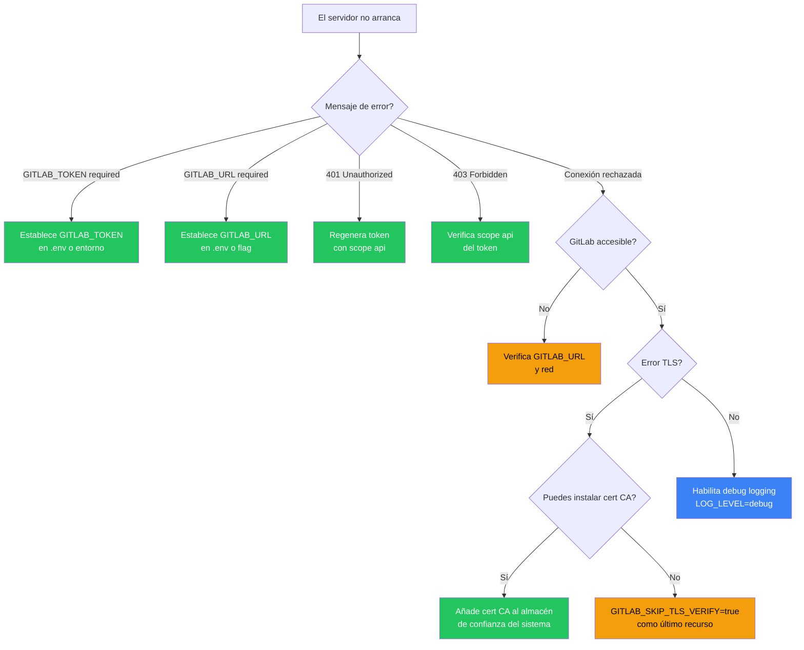

import { Tabs, TabItem, Steps } from "@astrojs/starlight/components";

:::note[Documentación para desarrolladores]
Para la referencia técnica completa, consulta [`docs/troubleshooting.md`](https://github.com/jmrplens/gitlab-mcp-server/blob/main/docs/troubleshooting.md) en el repositorio.
:::

## Conexión y autenticación



| Síntoma                                    | Causa                               | Solución                                                                                                                                                |
| ------------------------------------------ | ----------------------------------- | ------------------------------------------------------------------------------------------------------------------------------------------------------- |
| `GITLAB_TOKEN is required` al inicio       | Token no establecido                | Establece `GITLAB_TOKEN` en `.env` o en el entorno                                                                                                      |
| `GITLAB_URL is required` al inicio         | URL no establecida                  | Establece `GITLAB_URL` en `.env` o usa el flag `--gitlab-url`. En modo HTTP, `--gitlab-url` es opcional si los clientes envían la cabecera `GITLAB-URL` |
| `401 Unauthorized` de la API de GitLab     | PAT inválido o expirado             | Genera un nuevo token con scope `api` en GitLab → Preferences → Access Tokens                                                                           |
| `403 Forbidden` en operaciones específicas | El token carece del scope requerido | Asegúrate de que el token tiene scope `api` (no solo `read_api`)                                                                                        |
| Conexión rechazada o timeout               | Instancia de GitLab inaccesible     | Verifica que `GITLAB_URL` es accesible: `curl -s $GITLAB_URL/api/v4/version`                                                                            |

## TLS y certificados

| Síntoma                                         | Causa                    | Solución                                                                                                                                                                             |
| ----------------------------------------------- | ------------------------ | ------------------------------------------------------------------------------------------------------------------------------------------------------------------------------------ |
| `x509: certificate signed by unknown authority` | Certificado autofirmado  | Primero intenta añadir el certificado CA al almacén de confianza del sistema. Si no es posible, establece `GITLAB_SKIP_TLS_VERIFY=true` en `.env` o `--skip-tls-verify` en modo HTTP |
| `x509: certificate has expired`                 | Certificado TLS expirado | Renueva el certificado en el servidor de GitLab, o usa `GITLAB_SKIP_TLS_VERIFY=true` temporalmente                                                                                   |

:::caution
`GITLAB_SKIP_TLS_VERIFY=true` desactiva la verificación TLS completamente. Úsalo solo para instancias auto-alojadas con certificados autofirmados, y nunca en entornos de producción con instancias de GitLab públicas.
:::

## Red y proxy

### Resolución DNS

Si el servidor no puede resolver el hostname de tu GitLab:

```bash
# Verificar DNS desde la máquina que ejecuta el servidor MCP
nslookup gitlab.ejemplo.com
# o
dig gitlab.ejemplo.com +short
```

En contenedores Docker, asegúrate de que tu fichero compose o el comando `docker run` use `--dns` o una red personalizada con configuración DNS adecuada. Dentro de Kubernetes, revisa los logs de CoreDNS y `resolv.conf` en el pod.

### Proxies corporativos

El `net/http` de Go respeta las variables de entorno de proxy estándar. Establécelas antes de lanzar el servidor:

```bash
export HTTPS_PROXY=http://proxy.corp.ejemplo.com:8080
export HTTP_PROXY=http://proxy.corp.ejemplo.com:8080
export NO_PROXY=localhost,127.0.0.1,.internal.corp
```

| Síntoma                                              | Causa                                                 | Solución                                                                                            |
| ---------------------------------------------------- | ----------------------------------------------------- | --------------------------------------------------------------------------------------------------- |
| Timeout de conexión detrás de red corporativa        | Proxy no configurado                                  | Establece `HTTPS_PROXY` / `HTTP_PROXY`                                                              |
| El proxy funciona con `curl` pero no con el servidor | Vars de entorno no exportadas al proceso del servidor | Pásalas en `.env`, Docker `environment:`, o secretos de Fly.io                                      |
| `CONNECT` rechazado por proxy para `api.github.com`  | El proxy deniega salida a GitHub (auto-update)        | Establece `AUTO_UPDATE=false` o añade `github.com` y `objects.githubusercontent.com` a la whitelist |
| GitLab interno enrutado a través de proxy externo    | Falta `NO_PROXY`                                      | Añade tu hostname de GitLab a `NO_PROXY`                                                            |

### Proxy inverso (modo HTTP)

Cuando se ejecuta el servidor MCP detrás de nginx, Caddy, o un balanceador cloud:

| Síntoma                                                          | Causa                                                     | Solución                                                                                                         |
| ---------------------------------------------------------------- | --------------------------------------------------------- | ---------------------------------------------------------------------------------------------------------------- |
| El rate limiter cuenta todas las peticiones como un solo cliente | Lee la IP del balanceador en lugar de la del cliente real | Establece `--trusted-proxy-header` a la cabecera que tu proxy establece (ej. `X-Forwarded-For`, `Fly-Client-IP`) |
| WebSocket o SSE desconectado                                     | Timeout de lectura del proxy demasiado corto              | Aumenta el timeout de lectura del proxy a al menos 120s para streams MCP de larga duración                       |
| `502 Bad Gateway`                                                | El servidor aún no está escuchando                        | Añade un startup probe o reintento; el servidor necesita unos segundos para inicializarse en la primera petición |

## Descubrimiento de herramientas

| Síntoma                                                     | Causa                                        | Solución                                                                                                                                                                                |
| ----------------------------------------------------------- | -------------------------------------------- | --------------------------------------------------------------------------------------------------------------------------------------------------------------------------------------- |
| El cliente MCP muestra 1006 herramientas en lugar de 32     | Meta-herramientas desactivadas               | Establece `META_TOOLS=true` (por defecto) para consolidar en meta-herramientas de dominio                                                                                               |
| Herramienta no encontrada en `tools/list`                   | Desajuste del modo de meta-herramientas      | El modo individual usa `gitlab_create_issue`, el modo meta usa `gitlab_issue` con `action: create`                                                                                      |
| `unknown action` en llamada a meta-herramienta              | Parámetro de acción inválido                 | Verifica las acciones válidas en [Resumen de Herramientas](/gitlab-mcp-server/tools/overview/)                                                                                          |
| `json: unknown field "<nombre>"` desde una meta-herramienta | Parámetro mal escrito u obsoleto en `params` | Las meta-herramientas rechazan claves desconocidas. Usa los nombres exactos de la `action` elegida (p. ej. `merge_request_iid`, `issue_iid`, `epic_iid`, `work_item_iid`, `snippet_id`) |
| Herramientas enterprise faltantes                           | Modo enterprise desactivado                  | Establece `GITLAB_ENTERPRISE=true` para habilitar 15 meta-herramientas enterprise adicionales                                                                                           |

## Actualización automática

| Síntoma                                                   | Causa                                            | Solución                                                                                     |
| --------------------------------------------------------- | ------------------------------------------------ | -------------------------------------------------------------------------------------------- |
| Actualización detectada pero no aplicada                  | Modo es solo `check`                             | Establece `AUTO_UPDATE=true` para habilitar la aplicación automática                         |
| Sigue ejecutando la versión antigua tras la actualización | Proceso no reiniciado (Windows)                  | Reinicia el servidor o usa `gitlab-mcp-server --shutdown` para terminar todas las instancias |
| No se puede reemplazar el binario (archivo bloqueado)     | Las instancias en ejecución mantienen el archivo | Ejecuta `gitlab-mcp-server --shutdown` para terminar todas las instancias primero            |
| Error de red alcanzando GitHub                            | Firewall o proxy bloqueando                      | Verifica la conectividad a `github.com` desde el servidor                                    |

## Modo servidor HTTP

| Síntoma                               | Causa                            | Solución                                                                               |
| ------------------------------------- | -------------------------------- | -------------------------------------------------------------------------------------- |
| `400 Bad Request`                     | Cabecera de token faltante       | Envía la cabecera `PRIVATE-TOKEN` o `Authorization: Bearer <token>` con cada solicitud |
| Desalojo del pool demasiado frecuente | Demasiados tokens únicos         | Aumenta `--max-http-clients` (por defecto: 100)                                        |
| Sesiones expirando inesperadamente    | Timeout de inactividad muy corto | Aumenta `--session-timeout` (por defecto: 30m)                                         |

## Modo OAuth (`--auth-mode=oauth`)

| Síntoma                                                     | Causa                                             | Solución                                                                                                                                      |
| ----------------------------------------------------------- | ------------------------------------------------- | --------------------------------------------------------------------------------------------------------------------------------------------- |
| `401 Unauthorized` con token OAuth válido                   | Token expirado o rechazado por GitLab             | Re-autoriza a través del flujo OAuth; verifica que la aplicación OAuth de GitLab siga activa                                                  |
| Alta latencia en la primera solicitud tras expirar la caché | Re-validación del token contra la API de GitLab   | Comportamiento esperado — aumenta `--oauth-cache-ttl` (por defecto: 15m, máx: 2h) para reducir la frecuencia de validación                    |
| `404` en `/.well-known/oauth-protected-resource`            | Modo OAuth no habilitado                          | Inicia el servidor con `--auth-mode=oauth`                                                                                                    |
| El cliente no inicia el flujo OAuth                         | El cliente no soporta OAuth 2.1                   | Usa la cabecera `PRIVATE-TOKEN` en su lugar — funciona en modo OAuth mediante normalización automática                                        |
| La cabecera `PRIVATE-TOKEN` no funciona en modo OAuth       | Debería funcionar                                 | El middleware normaliza `PRIVATE-TOKEN` a Bearer — verifica la validez del token                                                              |
| Operaciones fallan con scope `mcp` insuficiente             | DCR fallback asignó scope `mcp` en lugar de `api` | Configura `clientId` explícitamente en la configuración del cliente MCP. Ver [Modo servidor HTTP](/gitlab-mcp-server/operations/http-server/) |

## Paginación

| Síntoma                             | Causa                               | Solución                                                       |
| ----------------------------------- | ----------------------------------- | -------------------------------------------------------------- |
| Resultados de listas truncados      | Límite predeterminado de `per_page` | Pasa los parámetros `per_page` (máx 100) y `page` para paginar |
| `nextPage` faltante en la respuesta | Última página alcanzada             | No hay más resultados — este es el comportamiento esperado     |

## Problemas específicos del IDE

<Tabs>
  <TabItem label="VS Code / GitHub Copilot">
    | Síntoma                                 | Solución                                                                                        |
    | --------------------------------------- | ----------------------------------------------------------------------------------------------- |
    | "Tool not found" en Copilot Chat        | Verifica el panel de Salida → **MCP Logs** para errores. Verifica la ruta de `.vscode/mcp.json` |
    | El servidor no aparece en el estado MCP | Ejecuta `Ctrl+Shift+P` → **MCP: List Servers** para verificar la configuración                  |
    | "Permission denied" al inicio           | Ejecuta `chmod +x /ruta/al/gitlab-mcp-server` (Linux/macOS)                                     |
    | El servidor se reinicia repetidamente   | Verifica MCP Logs por `GITLAB_URL` o `GITLAB_TOKEN` faltantes                                   |
  </TabItem>
  <TabItem label="Cursor">
    | Síntoma                       | Solución                                                                          |
    | ----------------------------- | --------------------------------------------------------------------------------- |
    | Las herramientas no se listan | Verifica que `.cursor/mcp.json` existe y usa la clave `mcpServers` (no `servers`) |
    | `${input:...}` no funciona    | No es soportado por Cursor — usa variables de entorno en su lugar                 |
  </TabItem>
</Tabs>

## Modo de depuración

Habilita el registro detallado para diagnosticar problemas:

<Steps>

1. **Establece el nivel de log** a `debug`:

   ```bash
   # Modo stdio
   LOG_LEVEL=debug ./gitlab-mcp-server 2>debug.log

   # Modo HTTP (logs mezclados con la salida del servidor)
   LOG_LEVEL=debug ./gitlab-mcp-server --http --gitlab-url=https://gitlab.ejemplo.com 2>debug.log
   ```

2. **Reproduce el problema** ejecutando la misma operación que falló.

3. **Examina los logs** — los logs de depuración incluyen:
   - Cada llamada a herramienta con parámetros de entrada
   - Detalles de solicitud/respuesta de la API de GitLab
   - Eventos de validación de token (solo los últimos 4 caracteres)
   - Operaciones del pool de sesiones (modo HTTP)

</Steps>

:::tip
Los logs van a **stderr**, los mensajes JSON-RPC van a **stdout**. Siempre redirige stderr al capturar logs de depuración para evitar mezclar con mensajes del protocolo MCP.
:::

## Obtener ayuda

Si no puedes resolver un problema:

<Steps>

1. **Habilita el registro de depuración** (`LOG_LEVEL=debug`) y captura la salida
2. **Revisa las [GitHub Issues](https://github.com/jmrplens/gitlab-mcp-server/issues)** para problemas conocidos
3. **Abre una nueva issue** con:
   - Versión del servidor (`gitlab-mcp-server --version` o revisa los logs de inicio)
   - Sistema operativo y arquitectura
   - Nombre y versión del cliente MCP
   - Logs de depuración redactados (elimina cualquier token o dato sensible)
   - Pasos para reproducir el problema

</Steps>
