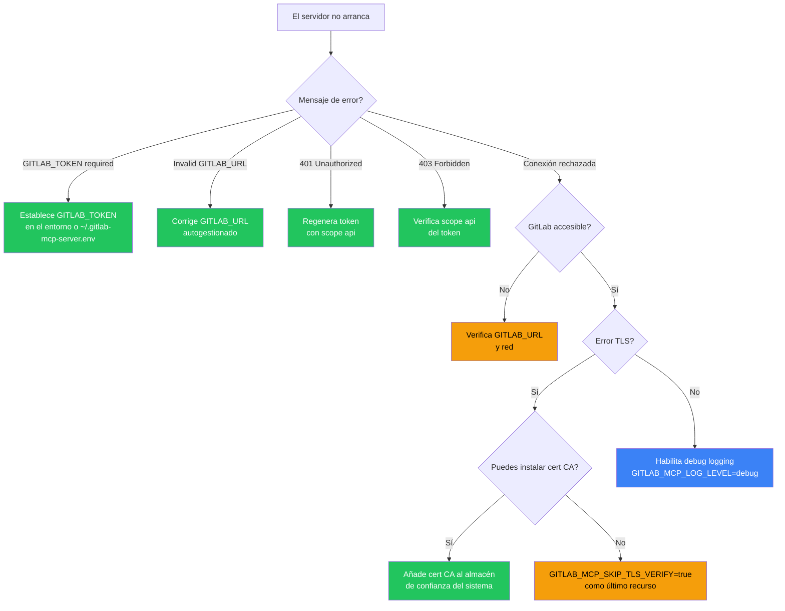

import { Tabs, TabItem, Steps } from "@astrojs/starlight/components";
import FAQ from "../../../../components/FAQ.astro";
import stats from "../../../../data/stats.json";

## Conexión y autenticación


```mermaid
flowchart TD
    A[El servidor no arranca] --> B{Mensaje de error?}
    B -->|GITLAB_TOKEN required| C[Establece GITLAB_TOKEN<br/>en el entorno o ~/.gitlab-mcp-server.env]
    B -->|Invalid GITLAB_URL| D[Corrige GITLAB_URL<br/>autogestionado]
    B -->|401 Unauthorized| E[Regenera token<br/>con scope api]
    B -->|403 Forbidden| F[Verifica scope api<br/>del token]
    B -->|Conexión rechazada| G{GitLab accesible?}
    G -->|No| H[Verifica GITLAB_URL<br/>y red]
    G -->|Sí| I{Error TLS?}
    I -->|Sí| J{Puedes instalar cert CA?}
    J -->|Sí| J1[Añade cert CA al almacén<br/>de confianza del sistema]
    J -->|No| J2[GITLAB_MCP_SKIP_TLS_VERIFY=true<br/>como último recurso]
    I -->|No| K[Habilita debug logging<br/>GITLAB_MCP_LOG_LEVEL=debug]

    style C fill:#22c55e,color:#fff
    style D fill:#22c55e,color:#fff
    style E fill:#22c55e,color:#fff
    style F fill:#22c55e,color:#fff
    style H fill:#f59e0b,color:#000
    style J1 fill:#22c55e,color:#fff
    style J2 fill:#f59e0b,color:#000
    style K fill:#3b82f6,color:#fff
```

| Síntoma                                    | Causa                               | Solución                                                                                                                                                                  |
| ------------------------------------------ | ----------------------------------- | ------------------------------------------------------------------------------------------------------------------------------------------------------------------------- |
| `GITLAB_TOKEN is required` al inicio       | Token no establecido                | Establece `GITLAB_TOKEN` en el entorno o en `~/.gitlab-mcp-server.env`; un `.env` en el directorio de trabajo no se lee, y si existe se nombra a nivel `WARN` al arrancar |
| `GITLAB_URL is not a valid URL` al inicio  | La URL tiene sintaxis inválida      | Corrige `GITLAB_URL` u omítela para usar `https://gitlab.com` en modo stdio                                                                                               |
| `401 Unauthorized` de la API de GitLab     | PAT inválido o expirado             | Genera un nuevo token con scope `api` en GitLab → Preferences → Access Tokens                                                                                             |
| `403 Forbidden` en operaciones específicas | El token carece del scope requerido | Asegúrate de que el token tiene scope `api` (no solo `read_api`)                                                                                                          |
| Conexión rechazada o timeout               | Instancia de GitLab inaccesible     | Verifica que `GITLAB_URL` es accesible: `curl -s $GITLAB_URL/api/v4/version`                                                                                              |

## TLS y certificados

| Síntoma                                         | Causa                    | Solución                                                                                                                                                                                                                                                                                                                                                               |
| ----------------------------------------------- | ------------------------ | ---------------------------------------------------------------------------------------------------------------------------------------------------------------------------------------------------------------------------------------------------------------------------------------------------------------------------------------------------------------------- |
| `x509: certificate signed by unknown authority` | Certificado autofirmado  | Primero intenta añadir el certificado CA al almacén de confianza del sistema. Si no es posible, establece `GITLAB_MCP_SKIP_TLS_VERIFY=true` en el entorno o en `~/.gitlab-mcp-server.env`, o `--skip-tls-verify` en modo HTTP; `--auth-mode=oauth` lo rechaza para una instancia que no sea loopback, así que ahí instala la CA (o apunta `SSL_CERT_FILE` a un bundle) |
| `x509: certificate has expired`                 | Certificado TLS expirado | Renueva el certificado en el servidor de GitLab, o usa `GITLAB_MCP_SKIP_TLS_VERIFY=true` temporalmente                                                                                                                                                                                                                                                                 |

:::caution
`GITLAB_MCP_SKIP_TLS_VERIFY=true` desactiva la verificación TLS completamente. Úsalo solo para instancias auto-alojadas con certificados autofirmados, y nunca en entornos de producción con instancias de GitLab públicas.
:::

## Red y proxy

### Resolución DNS

Si el servidor no puede resolver el hostname de tu GitLab:

```bash
# Verificar DNS desde la máquina que ejecuta el servidor MCP
nslookup gitlab.example.com
# o
dig gitlab.example.com +short
```

En contenedores Docker, asegúrate de que tu fichero compose o el comando `docker run` use `--dns` o una red personalizada con configuración DNS adecuada. Dentro de Kubernetes, revisa los logs de CoreDNS y `resolv.conf` en el pod.

### Proxies corporativos

El `net/http` de Go respeta las variables de entorno de proxy estándar. Establécelas antes de lanzar el servidor:

```bash
export HTTPS_PROXY=http://proxy.corp.example.com:8080
export HTTP_PROXY=http://proxy.corp.example.com:8080
export NO_PROXY=localhost,127.0.0.1,.internal.corp
```

| Síntoma                                              | Causa                                                 | Solución                                                                                                                               |
| ---------------------------------------------------- | ----------------------------------------------------- | -------------------------------------------------------------------------------------------------------------------------------------- |
| Timeout de conexión detrás de red corporativa        | Proxy no configurado                                  | Establece `HTTPS_PROXY` / `HTTP_PROXY`                                                                                                 |
| El proxy funciona con `curl` pero no con el servidor | Vars de entorno no exportadas al proceso del servidor | Pásalas en el bloque `env` del cliente, en `~/.gitlab-mcp-server.env`, en `environment:` de Docker, o en los secretos de tu plataforma |
| GitLab interno enrutado a través de proxy externo    | Falta `NO_PROXY`                                      | Añade tu hostname de GitLab a `NO_PROXY`                                                                                               |

### Proxy inverso (modo HTTP)

Cuando se ejecuta el servidor MCP detrás de nginx, Caddy, o un balanceador cloud:

| Síntoma                                                                | Causa                                                                                                         | Solución                                                                                                                                                                                                                                     |
| ---------------------------------------------------------------------- | ------------------------------------------------------------------------------------------------------------- | -------------------------------------------------------------------------------------------------------------------------------------------------------------------------------------------------------------------------------------------- |
| `429` tras unos pocos inicios de sesión fallidos de personas distintas | El límite de fallos de autenticación (10 por dirección y minuto) ve la dirección del proxy, no la del cliente | Establece `--trusted-proxy-header` a la cabecera que tu proxy establece (ej. `X-Forwarded-For`, `CF-Connecting-IP`) y `--trusted-proxies` a la dirección del proxy; el limitador de tasa por llamada se indexa por token y no se ve afectado |
| Stream SSE desconectado                                                | Timeout de lectura o de inactividad del proxy más corto que el silencio del stream                            | Sube el timeout de lectura del proxy; el keep-alive SSE de 25 segundos del servidor mantiene abierto un stream inactivo frente al valor por defecto de 60 segundos de nginx, así que lo corta un edge más estricto                           |
| `502 Bad Gateway`                                                      | El servidor aún no está escuchando                                                                            | Añade un startup probe o reintento; el servidor necesita unos segundos para inicializarse en la primera petición                                                                                                                             |

## Descubrimiento de herramientas

| Síntoma                                                                                   | Causa                                                     | Solución                                                                                                                                                                                                                                                                                                                                                                                                                                      |
| ----------------------------------------------------------------------------------------- | --------------------------------------------------------- | --------------------------------------------------------------------------------------------------------------------------------------------------------------------------------------------------------------------------------------------------------------------------------------------------------------------------------------------------------------------------------------------------------------------------------------------- |
| Solo aparecen dos herramientas: `gitlab_find_action` y `gitlab_execute_action`            | Es lo esperado: `dynamic` es la superficie predeterminada | No es un fallo. Pide lo que necesites en lenguaje natural: el asistente localiza la acción y su esquema y después la ejecuta. Si prefieres una lista de herramientas navegable, usa `GITLAB_MCP_TOOL_SURFACE=meta` o `GITLAB_MCP_TOOL_SURFACE=individual`                                                                                                                                                                                     |
| El cliente MCP muestra cientos de herramientas individuales en lugar de {stats.meta.base} | Superficie individual seleccionada                        | Establece `GITLAB_MCP_TOOL_SURFACE=meta` para consolidar en meta-herramientas de dominio                                                                                                                                                                                                                                                                                                                                                      |
| Herramienta no encontrada en `tools/list`                                                 | Desajuste de la superficie de herramientas                | El modo individual usa `gitlab_issue_create`, el modo meta usa `gitlab_issue` con `action: create`, y el modo dinámico expone `gitlab_find_action` y `gitlab_execute_action`                                                                                                                                                                                                                                                                  |
| `unknown action` en llamada a meta-herramienta                                            | Parámetro de acción inválido                              | Verifica las acciones válidas en [Resumen de Herramientas](/gitlab-mcp-server/es/tools/overview/)                                                                                                                                                                                                                                                                                                                                             |
| `json: unknown field "<nombre>"` desde una meta-herramienta                               | Parámetro mal escrito u obsoleto en `params`              | Las meta-herramientas rechazan claves desconocidas. Usa los nombres exactos de la `action` elegida (p. ej. `merge_request_iid`, `issue_iid`, `epic_iid`, `work_item_iid`, `snippet_id`)                                                                                                                                                                                                                                                       |
| Herramientas enterprise faltantes                                                         | Catálogo enterprise desactivado                           | En modo stdio, establece `GITLAB_MCP_TIER=premium` o `GITLAB_MCP_TIER=ultimate`. En modo HTTP, configura `--tier=premium`/`--tier=ultimate` para forzar el catálogo o deja que la detección de licencia lo habilite cuando la instancia informe de un plan Premium o Ultimate. La variable deprecada `GITLAB_ENTERPRISE=true` sigue funcionando cuando `GITLAB_MCP_TIER` no está definida; no existe ningún flag `--enterprise`, usa `--tier` |

## Instalaciones con npm / npx

| Síntoma                                                             | Causa                                                                                                                                                                                                                                                                                                                                | Solución                                                                                                                                                                                                                                                                 |
| ------------------------------------------------------------------- | ------------------------------------------------------------------------------------------------------------------------------------------------------------------------------------------------------------------------------------------------------------------------------------------------------------------------------------ | ------------------------------------------------------------------------------------------------------------------------------------------------------------------------------------------------------------------------------------------------------------------------ |
| `the @jmrp.io/gitlab-mcp-server-linux-x64 package is not installed` | En Alpine es intencionado: los paquetes de Linux declaran `libc: glibc` y los binarios publicados necesitan el cargador dinámico de glibc, así que npm los omite sobre musl. En una distribución con glibc significa que la instalación omitió las dependencias opcionales (`--no-optional`, o un lockfile resuelto en otro sistema) | Sobre musl, usa la imagen de contenedor `ghcr.io/jmrplens/gitlab-mcp-server` (compilada contra musl) o compila desde el código fuente: la publicación no está rota. Sobre glibc, reinstala sin `--no-optional`, o borra `node_modules` y el lockfile y vuelve a instalar |
| Las actualizaciones nunca llegan al ejecutar con `npx`              | El servidor no se actualiza a sí mismo, y el binario lo gestiona npm                                                                                                                                                                                                                                                                 | Es lo esperado. Actualiza con npm, o añade `@latest` a la spec de `npx` para que resuelva de nuevo en lugar de reutilizar su caché                                                                                                                                       |

## Actualizar

El servidor no se actualiza a sí mismo, así que actualizar es lo que haga tu canal de instalación más un reinicio.

| Síntoma                                               | Causa                                            | Solución                                                                                                |
| ----------------------------------------------------- | ------------------------------------------------ | ------------------------------------------------------------------------------------------------------- |
| Sigue ejecutando la versión antigua tras actualizar   | El proceso antiguo no se reinició                | Reinicia el servidor, o ejecuta `gitlab-mcp-server --shutdown` para terminar antes todas las instancias |
| No se puede reemplazar el binario (archivo bloqueado) | Las instancias en ejecución mantienen el archivo | Ejecuta `gitlab-mcp-server --shutdown` para terminar todas las instancias y después reemplázalo         |

## Modo servidor HTTP

| Síntoma                                                                      | Causa                                                                                              | Solución                                                                                                                                                                                                                                                                                                                                                                                                                                                                                               |
| ---------------------------------------------------------------------------- | -------------------------------------------------------------------------------------------------- | ------------------------------------------------------------------------------------------------------------------------------------------------------------------------------------------------------------------------------------------------------------------------------------------------------------------------------------------------------------------------------------------------------------------------------------------------------------------------------------------------------ |
| `401 Unauthorized` con `WWW-Authenticate: Bearer`                            | Cabecera de token faltante o vacía                                                                 | Envía la cabecera `PRIVATE-TOKEN` o `Authorization: Bearer <token>` con cada solicitud. El cuerpo JSON nombra las dos cabeceras aceptadas                                                                                                                                                                                                                                                                                                                                                              |
| `400 Bad Request` con `no server available` en texto plano                   | Una versión anterior a la 2.6.6 recibió una solicitud que no pudo enrutar                          | No es una caída ni lo emite este proyecto — viene del SDK de MCP cuando la selección de servidor no encuentra ninguno. Actualiza: esos casos ahora son `401`, `400`, `429` y `503` con cuerpo JSON-RPC                                                                                                                                                                                                                                                                                                 |
| `400 Bad Request` que menciona `GITLAB-URL`                                  | La cabecera `GITLAB-URL` de la solicitud no es una URL analizable                                  | Envía una URL absoluta como `https://gitlab.example.com`, u omite la cabecera si el servidor arranca con `--gitlab-url`                                                                                                                                                                                                                                                                                                                                                                                |
| `400`/`403` indicando que el despliegue no sirve esa instancia de GitLab     | `--gitlab-url` nombra más de una instancia, así que publica una lista de instancias permitidas     | Envía en `GITLAB-URL` una de las instancias que publica el servidor; omitir la cabecera también se rechaza (`400`), nunca se resuelve a la primera instancia. En modo OAuth el error las enumera —es la misma lista que su metadata RFC 9728 ya sirve sin autenticar— y responde `403` antes de usar el token en ningún sitio. El modo legacy responde `400` y **no** las nombra: no publica documento de metadata y llega a este rechazo antes de validar la credencial, así que pregunta al operador |
| `429 Too Many Requests` con `Retry-After`                                    | Más de 10 autenticaciones fallidas desde una misma IP en un minuto                                 | Espera a que pase la ventana y reintenta con un token válido. Tras un proxy inverso, configura `--trusted-proxy-header` y `--trusted-proxies` para que el límite cuente las IP reales                                                                                                                                                                                                                                                                                                                  |
| `503 Service Unavailable`                                                    | La instancia de GitLab no era alcanzable al construir la sesión de ese token                       | Revisa `GITLAB-URL` / `--gitlab-url` y la accesibilidad de la instancia; el servidor registra el error subyacente                                                                                                                                                                                                                                                                                                                                                                                      |
| Desalojo del pool demasiado frecuente                                        | Demasiados tokens únicos                                                                           | Aumenta `--max-http-clients` (por defecto: 100)                                                                                                                                                                                                                                                                                                                                                                                                                                                        |
| Sesiones expirando inesperadamente                                           | Timeout de inactividad MCP muy corto                                                               | Aumenta `--session-timeout` (por defecto: 30m); solo se aplica con `--stateless=false`, el transporte sin estado por defecto no tiene sesión que expirar                                                                                                                                                                                                                                                                                                                                               |
| Las sesiones MCP caen cada ~2 min / `keepalive ping failed; closing session` | Un `--http-idle-timeout` bajo (o un timeout del proxy) está cerrando streams SSE de larga duración | Por defecto `--http-idle-timeout=0` desactiva el cierre por inactividad de la capa HTTP; si has puesto un valor bajo, súbelo o usa `0`. Detrás de un proxy inverso, aumenta también su timeout de lectura/inactividad                                                                                                                                                                                                                                                                                  |

## Modo OAuth (`--auth-mode=oauth`)

| Síntoma                                                     | Causa                                                     | Solución                                                                                                                                                                                                                                          |
| ----------------------------------------------------------- | --------------------------------------------------------- | ------------------------------------------------------------------------------------------------------------------------------------------------------------------------------------------------------------------------------------------------- |
| `401 Unauthorized` con token OAuth válido                   | Token expirado o rechazado por GitLab                     | Re-autoriza a través del flujo OAuth; verifica que la aplicación OAuth de GitLab siga activa                                                                                                                                                      |
| Alta latencia en la primera solicitud tras expirar la caché | Re-validación del token contra la API de GitLab           | Comportamiento esperado — aumenta `--oauth-cache-ttl` (por defecto: 15m, máx: 2h) para reducir la frecuencia de validación                                                                                                                        |
| `404` en `/.well-known/oauth-protected-resource`            | Modo OAuth no habilitado, o `--public-url` lleva una ruta | Inicia el servidor con `--auth-mode=oauth`. Cuando `--public-url` tiene una ruta, el documento se mueve a la ruta derivada (ver [Modo servidor HTTP](/gitlab-mcp-server/es/operations/http-server/)) y la ruta escueta responde `404` a propósito |
| El cliente no inicia el flujo OAuth                         | El cliente no soporta OAuth 2.1                           | Envía un token de acceso personal como `Authorization: Bearer <glpat-...>` — se verifica igual que un token OAuth                                                                                                                                 |
| `401` al enviar `PRIVATE-TOKEN` en modo OAuth               | El modo OAuth es solo Bearer, por diseño                  | Mueve el token a `Authorization: Bearer <token>`; `PRIVATE-TOKEN` solo se acepta en `--auth-mode=legacy`                                                                                                                                          |
| Operaciones fallan con scope `mcp` insuficiente             | DCR fallback asignó scope `mcp` en lugar de `api`         | Configura `clientId` explícitamente en la configuración del cliente MCP. Ver [Modo servidor HTTP](/gitlab-mcp-server/es/operations/http-server/)                                                                                                  |

## Paginación

| Síntoma                             | Causa                               | Solución                                                       |
| ----------------------------------- | ----------------------------------- | -------------------------------------------------------------- |
| Resultados de listas truncados      | Límite predeterminado de `per_page` | Pasa los parámetros `per_page` (máx 100) y `page` para paginar |
| `nextPage` faltante en la respuesta | Última página alcanzada             | No hay más resultados — este es el comportamiento esperado     |

## Problemas específicos del IDE

<Tabs>
  <TabItem label="VS Code / GitHub Copilot">
| Síntoma                                                          | Solución                                                                                                                                                                                                                                                                                                                                                                                                                                                                                                                                                                                                                                                  |
| ---------------------------------------------------------------- | --------------------------------------------------------------------------------------------------------------------------------------------------------------------------------------------------------------------------------------------------------------------------------------------------------------------------------------------------------------------------------------------------------------------------------------------------------------------------------------------------------------------------------------------------------------------------------------------------------------------------------------------------------- |
| "Tool not found" en Copilot Chat                                 | Verifica el panel de Salida → **MCP Logs** para errores. Verifica la ruta de `.vscode/mcp.json`                                                                                                                                                                                                                                                                                                                                                                                                                                                                                                                                                           |
| El servidor no aparece en el estado MCP                          | Ejecuta `Ctrl+Shift+P` → **MCP: List Servers** para verificar la configuración                                                                                                                                                                                                                                                                                                                                                                                                                                                                                                                                                                            |
| "Permission denied" al inicio                                    | Ejecuta `chmod +x /ruta/al/gitlab-mcp-server` (Linux/macOS)                                                                                                                                                                                                                                                                                                                                                                                                                                                                                                                                                                                               |
| El servidor se reinicia repetidamente                            | Verifica MCP Logs por `GITLAB_URL` o `GITLAB_TOKEN` faltantes                                                                                                                                                                                                                                                                                                                                                                                                                                                                                                                                                                                             |
| Espera indefinidamente a `initialize` y Docker muestra modo HTTP | Añade `-i` a los argumentos de `docker run` para que el contenedor reciba una tubería por la que hablar y deduzca stdio (JSON-RPC por stdin/stdout, sin necesidad de puerto), y haz `docker pull` de la imagen si es anterior a la versión que hizo de `--transport auto` su comando. Como alternativa, ejecuta el contenedor en modo HTTP con `-p 8080:8080` y una instancia a la que servir (`-e GITLAB_URL=https://gitlab.com`, sin la cual termina con `--gitlab-url is required in HTTP mode`), y configura el cliente MCP como HTTP apuntando a `http://host:8080/mcp` — esto solo funciona si el servidor está en marcha y el puerto es accesible. |
  </TabItem>
  <TabItem label="Cursor">
| Síntoma                       | Solución                                                                          |
| ----------------------------- | --------------------------------------------------------------------------------- |
| Las herramientas no se listan | Verifica que `.cursor/mcp.json` existe y usa la clave `mcpServers` (no `servers`) |
| `${input:...}` no funciona    | No es soportado por Cursor — usa variables de entorno en su lugar                 |
  </TabItem>
</Tabs>

## Modo de depuración

Habilita el registro detallado para diagnosticar problemas:

<Steps>

1. **Establece el nivel de log** a `debug`:

   ```bash
   # Modo stdio
   GITLAB_MCP_LOG_LEVEL=debug ./gitlab-mcp-server 2>debug.log

   # Modo HTTP (logs mezclados con la salida del servidor)
   GITLAB_MCP_LOG_LEVEL=debug ./gitlab-mcp-server --http --gitlab-url=https://gitlab.com 2>debug.log
   ```

2. **Reproduce el problema** ejecutando la misma operación que falló.

3. **Examina los logs** — los logs de depuración incluyen:
   - Cada llamada a herramienta con parámetros de entrada
   - Detalles de solicitud/respuesta de la API de GitLab
   - Eventos de validación de token (solo los últimos 4 caracteres)
   - Operaciones del pool de sesiones (modo HTTP)

</Steps>

:::tip
Los logs van a **stderr**, los mensajes JSON-RPC van a **stdout**. Siempre redirige stderr al capturar logs de depuración para evitar mezclar con mensajes del protocolo MCP.
:::

## Obtener ayuda

Si no puedes resolver un problema:

<Steps>

1. **Habilita el registro de depuración** (`GITLAB_MCP_LOG_LEVEL=debug`) y captura la salida
2. **Revisa las [GitHub Issues](https://github.com/jmrplens/gitlab-mcp-server/issues)** para problemas conocidos
3. **Abre una nueva issue** con:
   - Versión del servidor (`gitlab-mcp-server --version` o revisa los logs de inicio)
   - Sistema operativo y arquitectura
   - Nombre y versión del cliente MCP
   - Logs de depuración redactados (elimina cualquier token o dato sensible)
   - Pasos para reproducir el problema

</Steps>

<FAQ />

## Referencia de la fuente

:::note[Documentación para desarrolladores]
Para la referencia técnica completa, consulta [`docs/guides/troubleshooting.md`](https://github.com/jmrplens/gitlab-mcp-server/blob/main/docs/guides/troubleshooting.md) en el repositorio.
:::
